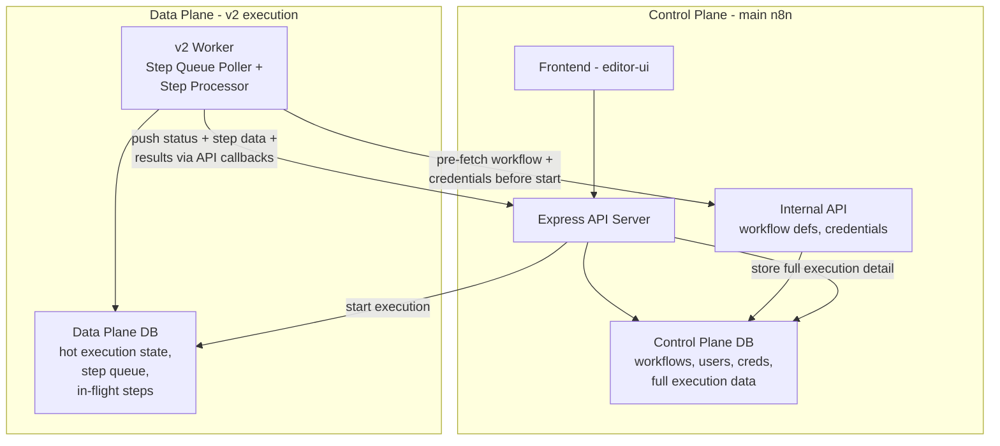
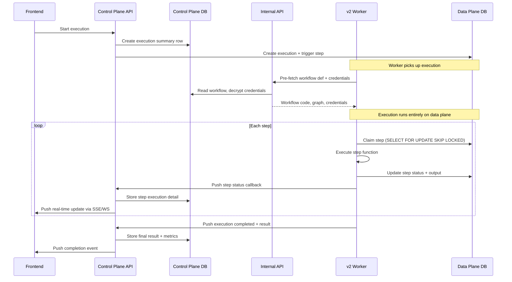

# Engine v2 Integration Plan

Research document for integrating `@n8n/engine` (v2) into the existing n8n application.

## Executive Summary

The v2 engine is a per-step, PostgreSQL-backed execution engine. Rather than
running it as a parallel system, we integrate it into the existing n8n app by:

1. **Extending the control plane** (main n8n API + DB) with v2 workflow
   support — same workflow list, same execution list, same auth
2. **Isolating the data plane** (v2 execution) in a separate logical database
   — intentionally decoupling execution orchestration from the API/control DB
3. **Bridging them** via API callbacks — the worker pushes all execution data
   (including step-level detail and outputs) back to the control plane

This separation is a deliberate architectural improvement. Today's n8n has a
known problem: the control plane (API, UI queries) and data plane (execution
workers) share one database, so load spikes in execution can degrade the API
and vice versa. v2 is an opportunity to fix this by design.

### Key Principles

- **The API only reads from the control plane DB.** It never queries the data
  plane DB directly.
- **The worker only writes to the data plane DB during execution.** It does
  not read from the control plane DB while executing — everything it needs is
  pre-fetched before execution starts.
- **The worker reads pre-execution data (workflow def, credentials) via an
  internal API**, not via direct DB access.
- **The worker pushes all results back to the control plane** via API
  callbacks, including step-level data and outputs. The control plane stores
  the full execution detail.
- **The data plane is the hot execution state only.** Once execution completes,
  all data lives in the control plane. The data plane can be pruned
  aggressively.
- **Data plane DB separation is config-driven.** Same schema or separate
  physical database, invisible to the app — just a connection string in config.

## Architecture



### Data Flow



### What lives where

| Control Plane DB | Data Plane DB (hot state only) |
|------------------|-------------------------------|
| `workflow_entity` (extended with v2 columns) | `v2_execution` (in-flight execution state + flags) |
| `execution_entity` (full v2 execution data, pushed by worker) | `v2_step_execution` (step queue + in-flight step records) |
| v2 step execution detail (pushed by worker) | |
| Users, projects, sharing, permissions | |
| Credentials (encrypted) | |
| Tags, folders, settings | |
| v1 execution data (existing) | |

The control plane DB is the **single source of truth for all persisted data**.
The data plane DB is a transient execution scratchpad — it holds in-flight
state that the worker needs for the `SELECT FOR UPDATE SKIP LOCKED` queue
pattern, but all results are pushed back to the control plane as they complete.

---

## Execution Model: Explicit Steps and Durable Primitives

v2 workflows are TypeScript orchestration functions. The user explicitly
defines step boundaries using `ctx.step()`, and durable primitives like
`ctx.sleep()` are called *between* steps:

```typescript
const data = await ctx.step({ name: 'Process' }, async () => {
    return await api.fetch();
});

await ctx.sleep(5000); // Becomes a timer step in the graph

const final = await ctx.step({ name: 'Post-wait processing' }, async () => {
    return transform(data);
});
```

### How it works

- **`ctx.step(opts, fn)`** defines an explicitly bounded unit of work. The
  engine persists the step's output on completion. On replay (resume after
  sleep/failure), completed steps return their cached result without
  re-executing.
- **`ctx.sleep(ms)`** is a durable primitive called between steps. It becomes
  a timer step in the execution graph — the engine suspends execution,
  persists a `waitUntil` timestamp, and the step queue picks it up when the
  timer fires. No code runs during the sleep; the orchestration function
  resumes from the next line.
- **Data flows through closures.** Variables from earlier steps (like `data`
  above) are naturally available to later steps via JavaScript closure scope.
  No transpiler analysis of data scope is needed.

### What this replaces

The current v2 PoC uses a throw-based mechanism for sleep: `ctx.sleep()`
throws a `SleepRequestedError`, which the step processor catches to create a
continuation child step with captured intermediate state. This is complex —
it requires parent step resolution, intermediate state serialization, and
continuation function references.

The explicit model eliminates all of that:
- No `SleepRequestedError` / `WaitUntilRequestedError` throw/catch
- No continuation child steps or parent step resolution
- No intermediate state capture (`__intermediate` / `__predecessors`)
- No `getContinuationStepId()` / `getContinuationFunctionRef()` machinery
- Sleep is just another step type in the graph, like any other

### Transpiler role

The transpiler still:
- Transpiles TypeScript to JavaScript
- Extracts the step DAG from `ctx.step()` calls
- Generates the graph structure for visualization
- Preserves credential references in compiled output

It no longer needs to:
- Detect sleep calls and split code around them
- Analyze or capture variable scope across sleep boundaries
- Generate continuation functions

---

## Control Plane: Extending the Existing System

### Workflow Entity Extension

Rather than a separate v2 workflow table, extend the existing `WorkflowEntity`:

```typescript
// New columns on existing workflow_entity
@Column({ type: 'varchar', default: 'v1' })
engineType: 'v1' | 'v2';

@Column({ type: 'text', nullable: true })
code: string | null;  // v2 TypeScript source

@Column({ type: 'text', nullable: true })
compiledCode: string | null;  // v2 transpiled JS

@Column({ type: 'jsonb', nullable: true })
graph: WorkflowGraphData | null;  // v2 step DAG

@Column({ type: 'text', nullable: true })
sourceMap: string | null;

@Column({ type: 'int', default: 1 })
codeVersion: number;  // v2 immutable versioning
```

v1 workflows: `nodes`/`connections` populated, `code`/`compiledCode` null.
v2 workflows: `code`/`compiledCode`/`graph` populated, `nodes`/`connections`
null (or could hold a visual-only representation for the list view).

**Why one table:** Unified workflow list for free. Same sharing/permissions
model. Same folder/tag organization. Same API shape (`GET /api/workflows`
returns both types). The frontend discriminates on `engineType` to decide
which editor to open.

**Trade-off:** The entity becomes a union type with nullable columns. This is
manageable because the two sets of columns don't interact — queries for v1
never touch `code`/`compiledCode`, queries for v2 never touch
`nodes`/`connections`.

### Workflow Versioning

v2 adopts v1's versioning model (`versionId` + `WorkflowHistory`) for
consistency. The v2 engine's current immutable-row-per-version approach will
be replaced to align with how v1 tracks workflow history.

### Execution Data in Control Plane

v2 executions get **full representation** in the control plane DB, not just
thin summaries. The worker pushes all data back via API callbacks as execution
progresses:

**Execution-level data** (stored in `execution_entity` or extension table):
- Status, timestamps, mode, metrics (durationMs, computeMs, waitMs)
- Final result / error
- Cancel/pause flags

**Step-level data** (new table in control plane, e.g., `v2_step_execution_detail`):
- Step ID, status, attempt number
- Input and output data
- Error details
- Timing (startedAt, completedAt, durationMs)
- Step type (regular, sleep/timer)

This means the UI can render full execution detail — step timelines,
input/output inspection, error traces — entirely from the control plane DB.

### API Routing

v2-specific endpoints mount on the existing Express server:

```
# Workflow CRUD — uses existing endpoints, just saves different columns
POST   /api/workflows              { engineType: 'v2', code: '...' }
PUT    /api/workflows/:id          { code: '...' }  (triggers transpile)
GET    /api/workflows/:id          (returns code + graph for v2 type)

# v2 execution management — new endpoints
POST   /api/v2/executions                    Start v2 execution
GET    /api/v2/executions/:id/steps          Get step-level detail (from CP DB)
GET    /api/v2/executions/:id/stream         SSE for real-time step events
POST   /api/v2/executions/:id/cancel         Cancel
POST   /api/v2/executions/:id/pause          Pause
POST   /api/v2/executions/:id/resume         Resume
POST   /api/v2/step-executions/:id/approve   Approve/decline step

# Execution listing — existing endpoint, returns both v1 and v2
GET    /api/executions             (unified list, both engine types)
GET    /api/executions/:id         (full detail for both types)

# Internal API — called by v2 worker, not exposed to frontend
POST   /internal/v2/pre-fetch      Worker fetches workflow def + credentials
POST   /internal/v2/status         Worker pushes execution/step status updates
```

The existing workflow CRUD endpoints handle both types. Only
execution-specific v2 operations (step-level queries, pause/resume, step
approval) need new endpoints. All execution detail reads come from the control
plane DB.

---

## Data Plane: Isolated Execution Database

### Separate Logical Database

The v2 data plane gets its own database. This is configurable — it can be a
separate schema on the same PG instance for simple deployments, or a
completely separate physical database for production workloads. The app
doesn't care; it's just a connection string in config.

| Table | Purpose |
|-------|---------|
| `v2_execution` | In-flight execution state (status flags, cancel/pause requests) |
| `v2_step_execution` | Step queue + in-flight step records (the hot path) |

The `v2_execution.id` matches the `execution_entity.id` in the control plane
DB. This is the join key between the two worlds.

**No workflow table in data plane.** The workflow definition (code, compiled
code, graph) lives in the control plane DB. The worker pre-fetches it via
internal API before execution starts.

**No webhook table in data plane.** Webhooks use the existing v1
webhook/trigger infrastructure. When a webhook fires for a v2 workflow, the
existing webhook handler dispatches to the v2 execution path.

### Why separate

1. **Load isolation:** v2's step queue poller runs every 50ms with
   `SELECT FOR UPDATE SKIP LOCKED`. Under load, this generates significant
   write contention. Isolating it prevents API query degradation.
2. **Scaling independence:** The data plane DB can be scaled (read replicas,
   connection pool tuning, PgBouncer) independently of the control plane.
3. **Different retention:** The data plane only holds in-flight state. Once
   execution completes and results are pushed to the control plane, data plane
   records can be cleaned up aggressively.
4. **Blast radius:** A runaway execution filling up the data plane DB doesn't
   take down the API.

### Data Plane Lifecycle

The data plane DB is transient by design:

1. **Execution starts:** API creates records in data plane (execution +
   trigger step)
2. **During execution:** Worker reads/writes only the data plane for step
   queue operations
3. **As steps complete:** Worker pushes results to control plane via API
   callbacks
4. **Execution ends:** All data has been pushed to control plane. Data plane
   records can be pruned.

A background cleanup job can delete completed execution records from the data
plane after a configurable retention period (e.g., 24 hours, giving time for
debugging if needed).

---

## Bridge: Worker to Control Plane Communication

### API Callbacks (Starting Simple)

The worker reports execution status back to the control plane via HTTP
callbacks to an internal API endpoint. This is the simplest approach — no new
infrastructure, uses existing Express server.

```typescript
// Worker pushes status updates to control plane
POST /internal/v2/status
{
  updates: V2StatusUpdate[]
}
```

Updates can be batched for efficiency (e.g., buffer step completions and flush
every 100ms or on execution-level events).

### Status Update Types

```typescript
type V2StatusUpdate =
  | { type: 'execution:started'; executionId: string; startedAt: Date }
  | { type: 'execution:completed'; executionId: string; result: unknown; metrics: ExecutionMetrics }
  | { type: 'execution:failed'; executionId: string; error: ErrorData }
  | { type: 'execution:cancelled'; executionId: string }
  | { type: 'execution:paused'; executionId: string }
  | { type: 'step:started'; executionId: string; stepId: string; attempt: number }
  | { type: 'step:completed'; executionId: string; stepId: string; output: unknown; durationMs: number }
  | { type: 'step:failed'; executionId: string; stepId: string; error: ErrorData }
  | { type: 'step:waiting_approval'; executionId: string; stepId: string }
  | { type: 'step:retrying'; executionId: string; stepId: string; attempt: number; retryAfter: Date }
```

### Control Plane Receives Updates

When the control plane API receives status callbacks, it:

1. **Persists** execution/step data to the control plane DB
2. **Forwards** events to connected frontends via the existing push service
   (SSE/WebSocket)

This means v2 real-time updates flow through the same push infrastructure
that v1 uses — no need for v2's custom BroadcasterService.

### Future Evolution

If API callbacks become a bottleneck (e.g., high step throughput overwhelming
the API), we can evolve to Redis pub/sub or another message broker. The
`V2StatusUpdate` type stays the same; only the transport changes.

---

## Pre-Execution Data Fetching

The worker must not read from the control plane DB during execution.
Everything it needs is fetched before execution begins via an internal API:

```typescript
// Worker calls this before starting execution
POST /internal/v2/pre-fetch
{
  workflowId: string;
  workflowVersion?: number;
  credentialIds: string[];  // extracted from workflow definition
  userId: string;
}

// Response contains everything the worker needs
{
  workflow: {
    code: string;
    compiledCode: string;
    graph: WorkflowGraphData;
    sourceMap: string | null;
  };
  credentials: Record<string, DecryptedCredentialData>;
}
```

The worker caches this data for the duration of the execution. If a workflow
uses credentials, they are decrypted by the control plane and passed to the
worker at execution start. This means:

- The worker never needs to know about credential encryption
- The control plane controls credential access (permission checks happen at
  pre-fetch time)
- The worker process doesn't need access to encryption keys

---

## Webhooks and Triggers

v2 workflows use the **existing v1 webhook/trigger/publication
infrastructure**. No separate webhook namespace or routing.

When a v2 workflow is activated, its webhook triggers register through the
same mechanism as v1. When a webhook fires, the existing webhook handler
checks the workflow's `engineType` and dispatches accordingly:

- `v1`: Existing execution path (Bull queue or in-process)
- `v2`: v2 execution path (write to data plane DB, worker picks up)

This means all existing trigger types (webhook, cron, polling, etc.) work for
v2 workflows from day one, as long as the dispatch layer is wired up.

---

## Frontend Integration

### Unified Workflow List

The workflow list already queries `workflow_entity`. v2 workflows appear
naturally with their `engineType: 'v2'` column. The list view can show a
badge or icon to distinguish v2 workflows.

When a user clicks a v2 workflow, the router navigates to the v2 editor view
instead of the v1 canvas.

### v2 Editor View

Port the v2 `WorkspaceView` components into `editor-ui` as a new route:

```typescript
// editor-ui router
{
  path: '/workflow-v2/:id',
  name: VIEWS.WORKFLOW_V2,
  component: async () => import('@/views/V2WorkflowEditor.vue'),
  meta: { layout: 'workflow', middleware: ['authenticated'] },
}
```

The v2 editor is a code editor + DAG graph viewer. It uses v2-specific Pinia
stores that call the v2 API endpoints.

**Reuse from v2 standalone UI:**
- `CodeEditor` component (CodeMirror 6 wrapper)
- `GraphCanvas` / `ExecutionGraph` components (SVG DAG rendering)
- `workflow.store` / `execution.store` (Pinia stores, retargeted to `/api/v2/`)

**Reuse from existing editor-ui:**
- App shell, sidebar, navigation
- Auth state, user context
- Credential picker (for v2 credential integration)
- Push service subscription (for real-time step events)
- Design system components (`N8nButton`, `N8nBadge`, etc.)

### Unified Execution List

The execution list queries `execution_entity`, which contains full execution
data for both v1 and v2. When a user clicks a v2 execution, the UI fetches
step-level details from the v2 API endpoints (which read from the control
plane DB) and renders the v2 execution inspector.

---

## Worker Deployment

### Separate v2 Worker Process

```
n8n worker-v2 [--concurrency 10] [--poll-interval 50]
```

The v2 worker:

1. Pre-fetches workflow definitions + credentials via the **internal API**
   before each execution
2. Runs execution entirely against the **data plane DB** (step queue polling,
   step state)
3. Pushes status + step data + results back to the **control plane via API
   callbacks**
4. Does NOT serve HTTP — it's a pure execution worker
5. Does NOT access the control plane DB directly

This maps to a Docker Compose service:

```yaml
services:
  n8n-main:
    # API + frontend + internal API
    environment:
      - DB_TYPE=postgresdb
      - DB_POSTGRESDB_HOST=postgres

  n8n-worker-v2:
    command: n8n worker-v2
    environment:
      - DATA_PLANE_DB_URL=postgres://...     # reads/writes execution state
      - CONTROL_PLANE_API_URL=http://n8n-main:5678  # pre-fetch + callbacks
    deploy:
      replicas: 2  # scale independently
```

Note: the worker only needs the data plane DB URL and the control plane API
URL. No direct DB connection to the control plane.

---

## Credentials Integration

v2 workflows reference credentials by type and ID. Credentials are resolved
at execution start time via the internal API pre-fetch, not during step
execution.

```typescript
// Pre-fetch response includes decrypted credentials
const prefetch = await internalApi.prefetch({
  workflowId,
  credentialIds: extractCredentialRefs(workflow),
  userId: execution.userId,
});

// During step execution, credentials are available from the pre-fetch cache
getCredential: (type: string, id: string) => {
  return prefetch.credentials[id];
};
```

This requires:
- v2 editor UI includes a credential picker component
- v2 workflow code references credentials by ID (stored in step config)
- The transpiler preserves credential references in compiled output
- The internal API pre-fetch endpoint decrypts and returns credentials (with
  permission checks)

---

## Node Compatibility

Deferred to a later phase. The initial v2 integration focuses on code-first
workflows where steps are plain TypeScript functions. Node compatibility
(wrapping v1 `INodeType` as v2 step functions) is a separate workstream.

---

## Phasing

### Phase 0: Prerequisites
- [ ] Replace `synchronize: true` with proper migrations in v2 engine
- [ ] Extract v2 service wiring into a reusable factory (currently duplicated 5x)
- [ ] Add `userId` / `projectId` to v2 execution entities
- [ ] Adopt v1's workflow versioning model in v2

### Phase 1: Control Plane Extension
- [ ] Add v2 columns to `workflow_entity` (`engineType`, `code`, `compiledCode`, `graph`, etc.)
- [ ] Add v2 workflow CRUD logic (transpile on save, store compiled output)
- [ ] Wrap v2 workflow save in existing auth/permissions
- [ ] Create v2 step execution detail table in control plane DB
- [ ] Add v2-specific API endpoints for step queries, SSE, pause/resume
- [ ] Wire v2 API endpoints through existing auth middleware
- [ ] Internal API: pre-fetch endpoint (workflow def + credentials)
- [ ] Internal API: status callback endpoint (receives worker updates)

### Phase 2: Data Plane Setup
- [ ] Configure data plane DB (config-driven: same instance or separate)
- [ ] Create v2 worker CLI command (`n8n worker-v2`)
- [ ] Worker pre-fetches via internal API, executes against data plane
- [ ] Worker pushes status/step/result callbacks to control plane API
- [ ] Control plane persists callbacks + forwards to push service
- [ ] Docker Compose config with v2 worker service
- [ ] Data plane cleanup job (prune completed executions)

### Phase 3: Frontend
- [ ] Add v2 editor route to editor-ui
- [ ] Port v2 CodeEditor, GraphCanvas, ExecutionGraph components
- [ ] Create v2 Pinia stores (workflow, execution)
- [ ] v2 execution inspector with step-level detail
- [ ] Credential picker integration in v2 editor
- [ ] Unified workflow list (v1 + v2, discriminated by `engineType`)
- [ ] Wire v2 webhook triggers through existing webhook infrastructure

### Phase 4: Polish and Migration
- [ ] v1 -> v2 workflow conversion tool (simple workflows first)
- [ ] Design system alignment (replace v2 custom CSS with `@n8n/design-system`)
- [ ] i18n support for v2 UI text
- [ ] Feature flag for v2 access (PostHog)
- [ ] Performance benchmarking under load

---

## Open Questions

1. **Callback reliability:** What happens if the control plane API is
   temporarily unavailable when the worker tries to push status? Options:
   retry with backoff, buffer in memory, write to a local WAL. Need to decide
   on the failure mode.

2. **Pre-fetch granularity:** Should the worker pre-fetch credentials for ALL
   steps at execution start, or lazily fetch per-step? Bulk pre-fetch is
   simpler but may fetch unused credentials (e.g., conditional branches).
   Lazy fetch breaks the "no CP reads during execution" principle.

3. **Control plane step storage:** What schema for v2 step execution detail in
   the control plane DB? Mirror v2's `step_execution` table exactly, or a
   simpler flattened format optimized for reads?

4. **Data plane cleanup timing:** How long to retain completed execution data
   in the data plane? Immediate cleanup after push? 24-hour buffer?
   Configurable?

5. **Cancel/pause path:** When the UI sends cancel/pause, should it write
   directly to the data plane DB (so the worker sees it on next poll), or go
   through the worker via API? Direct DB write is faster; worker API is more
   consistent with the "API never touches data plane" principle but adds
   latency.
