# n8n Execution Engine v2 — Implementation Plan

> **Note**: Names, method signatures, and API shapes in this document are subject to change. Some parts are intentionally simplified to prove the concept, not to define the final architecture.

## Table of Contents

- [Glossary](#glossary)
- [Why We Need a New Engine](#why-we-need-a-new-engine)
- [Design Principles](#design-principles)
  - [Project Structure](#project-structure)
- [The Per-Step Execution Model](#the-per-step-execution-model)
- [The Data Dependency Problem](#the-data-dependency-problem)
- [Step Isolation and Variable Resolution](#step-isolation-and-variable-resolution)
- [Database Schema](#database-schema)
  - [Workflow Definition Schema](#workflow-definition-schema)
  - [Status Enums](#status-enums)
  - [Execution Schema](#execution-schema)
- [The Workflow Graph](#the-workflow-graph)
- [Engine: How Per-Step Execution Works](#engine-how-per-step-execution-works)
  - [Starting an Execution](#starting-an-execution)
  - [Queue Polling](#queue-polling)
  - [Processing a Step](#processing-a-step)
  - [Planning Next Steps](#planning-next-steps)
  - [Determining Execution Completion](#determining-execution-completion)
- [Error Handling and Retriability](#error-handling-and-retriability)
- [Source Maps and Error Tracing](#source-maps-and-error-tracing)
- [Cancellation](#cancellation)
- [Pause and Resume](#pause-and-resume)
- [Sleep and Wait](#sleep-and-wait)
- [Approval Steps](#approval-steps)
- [Webhook System](#webhook-system)
- [Streaming](#streaming)
- [Multi-Item Processing (Fan-Out / Fan-In)](#multi-item-processing-fan-out--fan-in)
- [Event Delivery and Scaling](#event-delivery-and-scaling)
- [AI Chat Streaming Use Case](#ai-chat-streaming-use-case)
- [Workflow Script Format](#workflow-script-format)
- [Frontend](#frontend)
- [CLI](#cli)
- [API Contracts](#api-contracts)
- [Example Workflows](#example-workflows)
- [Testing Strategy](#testing-strategy)
- [Performance Testing](#performance-testing)
- [Docker Compose](#docker-compose)
- [Gap Analysis vs Current Engine](#gap-analysis-vs-current-engine)
- [Architecture Limitations and Scaling Considerations](#architecture-limitations-and-scaling-considerations)
- [Step Function Execution](#step-function-execution)
- [Phase 1 (PoC) Checklist](#phase-1-poc-checklist)
- [Phase 2 (Future)](#phase-2-future)
- [Open Questions](#open-questions)
- [Verification](#verification)

---

## Glossary

| Term | Definition |
|------|-----------|
| **Workflow** | A user-defined automation consisting of one or more triggers and one or more steps, written as a TypeScript script. |
| **Workflow Script** | The TypeScript source code that defines a workflow. Not the final format — just a way to define workflows as code for testing the engine. |
| **Step** | A single unit of work in a workflow. Each step is a function that receives input, does something, and returns output. Steps are the atoms of execution. |
| **Step ID** | A stable, content-based identifier for a step. Generated from a hash of the step's configuration. Same config = same ID across versions. |
| **Trigger** | The event that starts a workflow execution. Every workflow can be triggered manually (implicit — no declaration needed). Additional triggers (webhook, poll) are declared explicitly. A workflow can have multiple explicit triggers. Triggers can also define code, not just configuration. |
| **Workflow Execution** | A single run of a workflow. Created when a trigger fires. Contains metadata about the run and references all step executions. |
| **Step Execution** | A single run of a single step within a workflow execution. The core unit that the queue processes. Every step — including the trigger — gets a step execution record. |
| **Graph** | A DAG (directed acyclic graph) representation of a workflow, parsed from the script at save time. Nodes are steps, edges are data dependencies. |
| **Predecessor** | A step whose output is needed as input by another step. Step B's predecessors are the steps that must complete before B can run. |
| **Successor** | A step that depends on another step's output. Step B is a successor of Step A if B needs A's output. |
| **Queue** | The PostgreSQL-based job queue that picks up step executions ready to run. Uses `SELECT FOR UPDATE SKIP LOCKED` for atomic claiming. |
| **Broadcaster** | The event delivery system that pushes real-time execution events to connected clients. Simple in-process SSE for PoC; Redis pub/sub for scaling. |
| **Fan-out** | When a step produces multiple items and each item is processed independently as a child step execution. |
| **Fan-in** | When multiple child step executions complete and their results are merged back into the parent step. |
| **Terminal status** | A step execution status that means "done" — see `StepStatus` enum: `Completed`, `Failed`, `Cancelled`, `Skipped`, `Cached`. |
| **Non-terminal status** | A step execution status that means "still in progress" — see `StepStatus` enum: `Pending`, `Queued`, `Running`, `RetryPending`, `WaitingApproval`, `Waiting`. At the execution level, `Paused` is also non-terminal — see `ExecutionStatus` enum. |
| **Retriable error** | An error that indicates a transient failure (network timeout, rate limit, temporary unavailability). The step should be retried. |
| **Non-retriable error** | An error that indicates a permanent failure (invalid input, auth error, code bug). Retrying won't help. |
| **Source map** | A mapping file that translates transpiled code line numbers back to the original TypeScript source, enabling accurate error reporting. |
| **Continuation step** | A step created by the engine when a step calls `sleep()` or `waitUntil()`. Represents the "after wait" portion of the step. |

---

## Why We Need a New Engine

The current n8n execution engine (`packages/core/src/execution-engine/`) has fundamental architectural limitations that can't be fixed incrementally. Here's what we've verified through code analysis:

### Problem 1: All Data in Memory for Entire Execution

The current engine runs the entire workflow in a single process. `WorkflowExecute.processRunExecutionData()` maintains a `nodeExecutionStack` and processes nodes in a while loop. All node outputs (`IRunExecutionData.resultData.runData`) accumulate in memory until the execution finishes. For workflows processing large datasets (e.g., 10,000 rows through 15 nodes), this means all intermediate data lives in memory simultaneously.

**Engine v2 fix**: Each step is an independent job. When step A completes, its output is saved to PostgreSQL and memory is freed. Step B loads only its predecessors' outputs from DB — not the entire execution's data. Only the current step's data plus its direct predecessors' outputs are in memory at any time.

### Problem 2: Process Crash = Entire Execution Lost

If the worker process crashes mid-execution, the entire execution is lost. The current engine has `ExecutionRecoveryService` that attempts to reconstruct state from event logs, but this is best-effort — it recovers metadata and timestamps but can't reliably recover intermediate node outputs.

**Engine v2 fix**: Each step execution is persisted to DB before and after running. A crash only loses the currently-running step. The stale job recovery mechanism detects steps stuck in `running` status and re-queues them. All prior steps' outputs are safe in the database.

### Problem 3: Retry is In-Process and Limited

Verified in `workflow-execute.ts` (line 1609-1700): retry uses `setTimeout` wrapped in a Promise, blocking the event loop. Max tries is hardcoded to [2, 5] range, delay is capped at 5000ms. A TODO comment on line 1631 explicitly says: "Improve that in the future and check if other nodes can be executed in the meantime." If the process crashes during a retry wait, all retry state is lost.

**Engine v2 fix**: Retry is DB-driven. A failed step gets `status = 'retry_pending'` with a `retry_after` timestamp. The queue poller picks it up after the timestamp passes. Exponential backoff with configurable base delay, max delay, and jitter. Process crash during retry wait = step stays `retry_pending` in DB = recovered on restart.

### Problem 4: Cancellation is Cooperative-Only

Verified in `workflow-execute.ts`: cancellation uses `AbortController`. The `AbortSignal` is passed to `ExecuteContext` but is only checked **between** node executions (lines 1897, 2453). Within a node's `execute()` function, cancellation only works if the node implementation actively polls `context.abortSignal.aborted`. A long-running HTTP request or computation will run to completion regardless of cancellation.

**Engine v2 fix (Phase 1)**: Cancellation between steps — `cancel_requested` is checked before each step starts. Steps in `retry_pending` or `waiting` status are also cancelled. Phase 2 can add within-step cancellation via AbortSignal propagation.

### Problem 5: Scaling Requires Redis + Bull

The current engine's queue mode requires Redis and Bull for distributed execution. This adds operational complexity and another point of failure. Worker health, dead worker detection, and job requeuing are all managed through Bull.

**Engine v2 fix**: PostgreSQL is the only infrastructure dependency for the core engine. `SELECT FOR UPDATE SKIP LOCKED` provides atomic job claiming. Stale job recovery is a simple query. No Redis, no Bull for the execution queue itself. (Redis may be added later for event delivery at scale — see [Event Delivery and Scaling](#event-delivery-and-scaling).)

### What the Current Engine Does Well

To be fair, the current engine has capabilities we should preserve or learn from:

- **Real-time progress**: The engine pushes `nodeExecuteBefore` and `nodeExecuteAfter` events via WebSocket/SSE as each node executes. The UI shows step-by-step progress during execution. Engine v2 replicates this concept via a broadcaster (simple in-process SSE for the PoC, not the final solution).
- **Partial execution / test from middle**: The current engine supports `destinationNode` + `runNodeFilter` which allows executing a single node with cached/pinned data from predecessors. Engine v2's per-step architecture supports this naturally — any step can be executed independently with cached predecessor outputs.
- **Expression system**: The `={{ }}` expression syntax with data proxies is powerful. Engine v2 replaces this with native TypeScript — a deliberate design choice (see [Gap Analysis](#gap-analysis-vs-current-engine)).
- **Multiple triggers per workflow**: `workflow.getTriggerNodes()` returns all triggers; each is activated independently. Engine v2 supports this via the `triggers` array.
- **Lifecycle hooks**: Pluggable hooks for persistence, UI updates, metrics. Engine v2 uses direct DB persistence + broadcaster; hooks can be added later for extensibility.

---

## Design Principles

### Isolated Package

Everything lives in `packages/@n8n/engine/`. Zero imports from the rest of the n8n codebase. This allows:
- Fast iteration without breaking anything
- Independent testing with its own Docker Compose
- Proves the design stands alone before integration
- Small, focused codebase that's easy to reason about

### Script Format is Not Final

The TypeScript workflow script format (`defineWorkflow`, `ctx.step()`, etc.) is **not the definitive workflow format**. It's a convenient way to define workflows as code so we can test the execution engine. The actual workflow format may evolve — what matters is that the engine can execute step functions and manage their lifecycle. The script format can be revisited or replaced entirely.

### Follow n8n Patterns

Where applicable, we follow n8n's existing patterns for consistency:
- **TypeORM** for database entities and repositories (same as `packages/cli`)
- **Controller-Service-Repository** pattern with plain constructor injection (no DI framework)
- Services wired together in `main.ts` entry point — explicit, debuggable, zero magic
- Plain Express Router factories for API controllers (no decorator-based routing)
- This keeps the package truly standalone with zero n8n codebase imports

> **PoC shortcut:** Using `@n8n/di` and `@n8n/decorators` would provide consistency with the main codebase but adds dependencies that violate the isolation principle. Can be migrated when integrating.

### Project Structure

```
packages/@n8n/engine/
├── CLAUDE.md                           # AI-friendly project guide
├── package.json
├── tsconfig.json
├── vitest.config.ts
├── docker-compose.yml                  # PostgreSQL + API + Web
│
├── src/
│   ├── sdk/                            # Workflow definition types (no runtime deps)
│   │   ├── index.ts                    # Public API: defineWorkflow, webhook, etc.
│   │   ├── types.ts                    # ExecutionContext, StepConfig, TriggerConfig, etc.
│   │   └── errors.ts                   # SleepRequestedError, WaitUntilRequestedError, NonRetriableError
│   │
│   ├── engine/                         # Core execution engine
│   │   ├── engine.module.ts            # @BackendModule entry point
│   │   ├── engine.service.ts           # startExecution, resumeExecution
│   │   ├── step-processor.service.ts   # processStep, loadStepFunction, buildStepContext
│   │   ├── step-planner.service.ts     # planNextSteps, gatherStepInput
│   │   ├── step-queue.service.ts       # StepQueue poller (poll, claim, dispatch)
│   │   ├── completion.service.ts       # checkExecutionComplete, calculateMetrics
│   │   ├── event-bus.service.ts        # In-process event emitter (Phase 1)
│   │   ├── broadcaster.service.ts      # SSE event delivery to clients
│   │   └── errors/                     # Centralized error hierarchy
│   │       ├── engine-error.ts         # Base EngineError class
│   │       ├── step-timeout.error.ts
│   │       ├── http.error.ts
│   │       ├── infrastructure.error.ts
│   │       └── error-classifier.ts     # buildErrorData, classifyError
│   │
│   ├── graph/                          # Workflow graph parsing
│   │   ├── graph-parser.ts             # Script → WorkflowGraph (AST analysis)
│   │   ├── variable-resolver.ts        # Detect variable dependencies between steps
│   │   ├── graph.types.ts              # GraphNode, GraphEdge, WorkflowGraph
│   │   └── __tests__/
│   │
│   ├── transpiler/                     # Script → compiled code
│   │   ├── transpiler.service.ts       # TypeScript → isolated step functions (esbuild)
│   │   ├── source-map.service.ts       # Source map generation and remapping
│   │   └── __tests__/
│   │
│   ├── database/                       # TypeORM entities and repositories
│   │   ├── entities/
│   │   │   ├── workflow.entity.ts
│   │   │   ├── webhook.entity.ts
│   │   │   ├── workflow-execution.entity.ts
│   │   │   └── workflow-step-execution.entity.ts
│   │   ├── repositories/
│   │   │   ├── workflow.repository.ts
│   │   │   ├── webhook.repository.ts
│   │   │   ├── workflow-execution.repository.ts
│   │   │   └── workflow-step-execution.repository.ts
│   │   └── migrations/
│   │       └── 001-initial-schema.ts
│   │
│   ├── api/                            # REST API (NestJS-style controllers)
│   │   ├── api.module.ts
│   │   ├── workflow.controller.ts      # CRUD + activate/deactivate
│   │   ├── execution.controller.ts     # Start, cancel, pause, resume, SSE stream
│   │   ├── step-execution.controller.ts # Approve, get details
│   │   └── webhook.controller.ts       # Incoming webhook handler
│   │
│   ├── web/                            # Vue 3 frontend
│   │   ├── vite.config.ts
│   │   ├── src/
│   │   │   ├── main.ts
│   │   │   ├── App.vue
│   │   │   ├── router.ts
│   │   │   ├── stores/
│   │   │   │   ├── workflow.store.ts
│   │   │   │   ├── execution.store.ts
│   │   │   │   └── step-execution.store.ts
│   │   │   ├── composables/
│   │   │   │   ├── useExecution.ts     # SSE subscription + reactive state
│   │   │   │   └── useWorkflowGraph.ts # Graph parsing for canvas
│   │   │   ├── views/
│   │   │   │   ├── WorkflowListView.vue
│   │   │   │   ├── WorkflowEditorView.vue
│   │   │   │   └── ExecutionInspectorView.vue
│   │   │   └── components/
│   │   │       ├── CodeEditor.vue      # CodeMirror 6 wrapper
│   │   │       ├── GraphCanvas.vue     # @vue-flow/core + dagre
│   │   │       ├── StepTimeline.vue    # Execution step cards
│   │   │       ├── StepDetail.vue      # Output viewer, error display
│   │   │       └── ApprovalButtons.vue
│   │   └── index.html
│   │
│   └── cli/                            # CLI tool
│       ├── index.ts                    # Entry point
│       └── commands/
│           ├── execute.ts
│           ├── run.ts
│           ├── watch.ts
│           ├── list.ts
│           ├── inspect.ts
│           └── bench.ts
│
├── examples/                           # 12 example workflow scripts
│   ├── hello-world.ts
│   ├── webhook-echo.ts
│   ├── conditional-logic.ts
│   ├── retry-backoff.ts
│   ├── approval-flow.ts
│   ├── streaming-output.ts
│   ├── error-handling.ts
│   ├── data-pipeline.ts
│   ├── parallel-steps.ts
│   ├── ai-chat-streaming.ts
│   ├── sleep-and-resume.ts
│   ├── multi-wait-pipeline.ts
│   └── helper-functions.ts
│
├── perf/                               # k6 performance test scripts
│   ├── webhook-throughput.js
│   └── execution-latency.js
│
└── test/                               # Shared test utilities
    ├── helpers.ts                      # createTestDB, executeAndWait, etc.
    ├── fixtures.ts                     # Predefined workflow codes for tests
    └── setup.ts                        # Test database setup/teardown
```

**Key structural decisions:**
- **`src/sdk/`** has zero runtime dependencies — it's pure types and marker errors. It can be imported by workflow scripts without pulling in engine internals.
- **`src/engine/`** follows n8n's module pattern: `engine.module.ts` is the `@BackendModule` entry point that wires up services.
- **`src/database/`** mirrors n8n's entity/repository pattern from `packages/cli/src/modules/`. Entities use TypeORM decorators, repositories extend `Repository<T>`.
- **`src/api/`** follows controller-per-resource: `workflow.controller.ts`, `execution.controller.ts`, `step-execution.controller.ts`.
- **`src/web/`** is a standalone Vite app that imports `@n8n/design-system` and follows the same Vue 3 patterns as `packages/frontend/editor-ui/`.
- **`test/`** contains shared helpers used by tests across all modules. Individual module tests live in `__tests__/` directories alongside the code they test.

### Architecture Overview

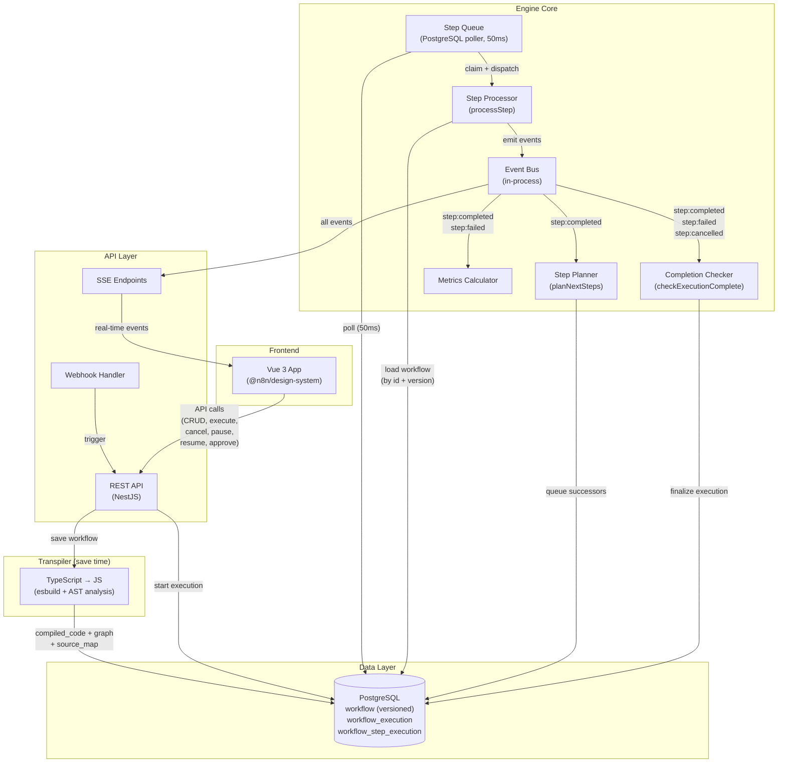

### Complete Engine Logic

This diagram shows every flow the engine handles — from trigger to completion, including all error, retry, sleep, pause, cancellation, and approval paths:

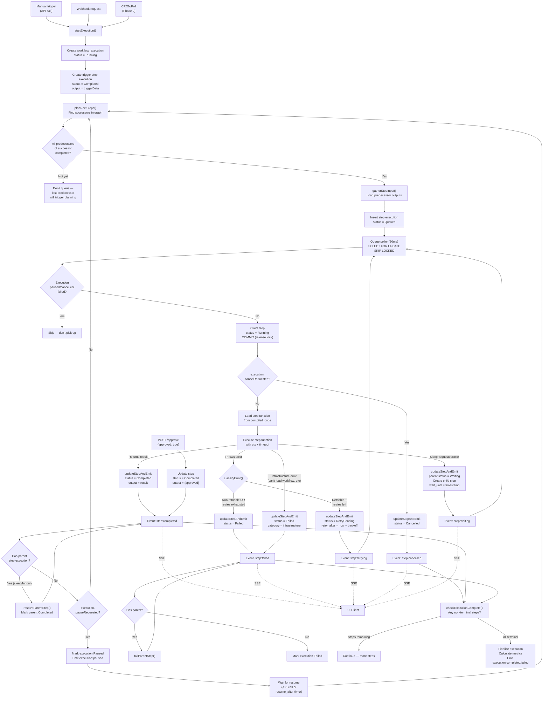

---

## The Per-Step Execution Model

This is the fundamental difference from the current engine. Instead of running all nodes in a single process loop, the engine **plans and queues individual steps**:

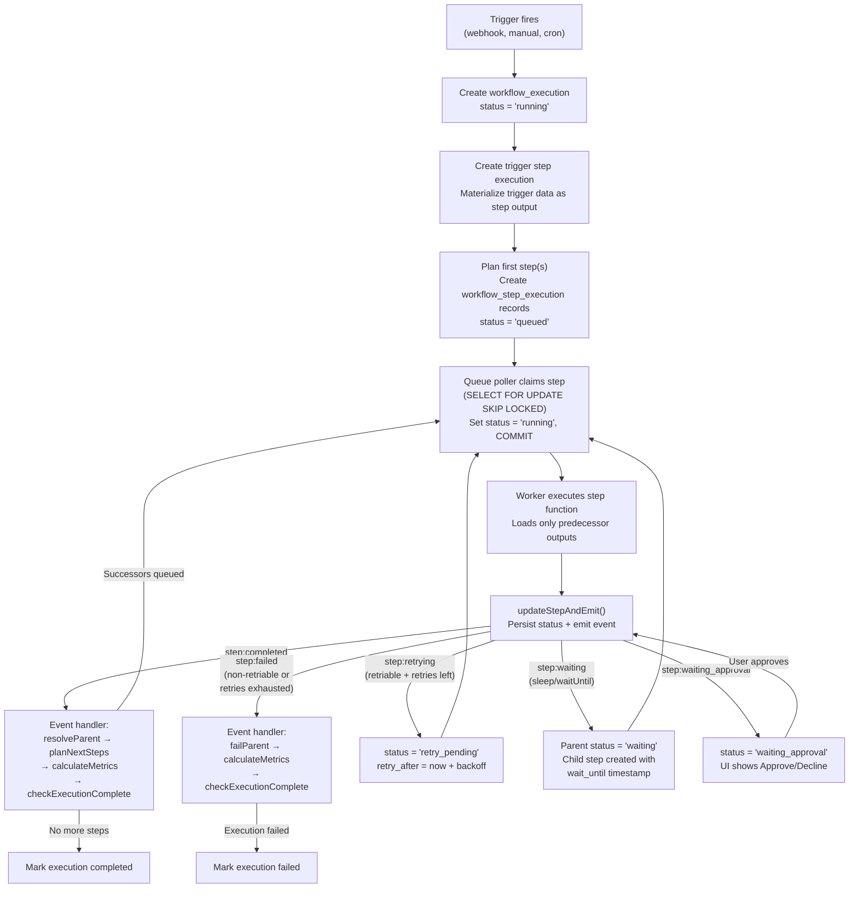

### Why Per-Step Instead of Per-Execution

| Aspect | Current Engine (per-execution) | Engine v2 (per-step) |
|--------|-------------------------------|---------------------|
| **Memory** | All node outputs accumulate in memory for entire run | Only current step's data + its direct predecessors' outputs in memory |
| **Crash recovery** | Process crash = entire execution lost; recovery is best-effort from event logs | Process crash = only current step re-queued; all prior steps' outputs safe in DB |
| **Cancellation** | Cooperative-only via AbortSignal; checked between nodes | Between steps: `cancel_requested` flag checked before each step |
| **Progress** | Real-time via lifecycle hooks + WebSocket push | Real-time via broadcaster events (same capability, simpler implementation for PoC) |
| **Retry** | In-process `setTimeout`, hardcoded [2-5] tries, max 5s delay, lost on crash | DB-driven `retry_after` timestamp, configurable backoff, survives crashes |
| **Independent execution** | Supported via `destinationNode` + `runNodeFilter` with cached data | Native — each step is a standalone job; can execute or replay any step |
| **Scaling** | Requires Redis + Bull for distributed execution | PostgreSQL only for execution queue; Redis only needed for event delivery at scale |

---

## The Data Dependency Problem

When execution is split into per-step queue jobs, step B can't just read step A's return value from a JS variable — they may run in separate processes, or with significant time between them. The engine must solve this at three stages:

### 1. At graph build time
The graph parser extracts the step dependency DAG from the workflow script. Each step knows its predecessors (the steps whose output it needs). Variable references in the script are analyzed to determine which steps depend on which (see [Step Isolation and Variable Resolution](#step-isolation-and-variable-resolution)).

### 2. At step queuing time
When the engine is about to queue step B, it calls `gatherStepInput()` which queries **only** step B's predecessors' outputs from `workflow_step_execution.output`. This is a targeted query — it does NOT load all step outputs, only the ones step B actually needs.

### 3. At step execution time
The step function receives its input from the `workflow_step_execution.input` column. This input was assembled from predecessor outputs at queue time. The step has no access to other steps' data.

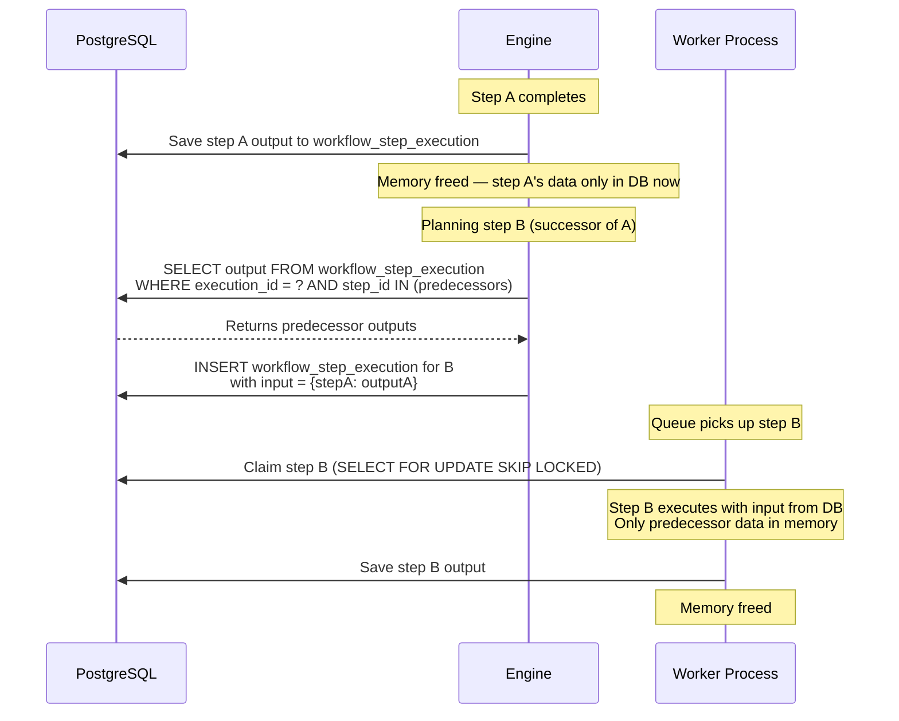

### Multiple predecessors (parallel merge)

When step C depends on both step A and step B:

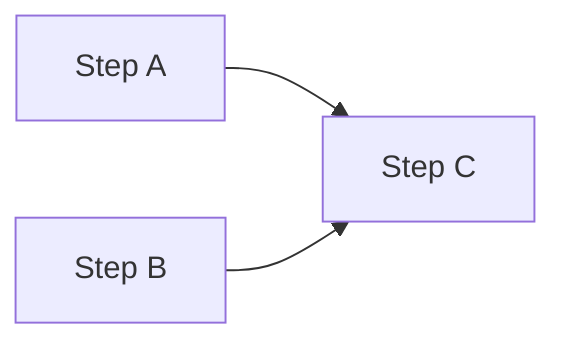

Step C is only queued when **all** its predecessors have completed. When step A finishes, the engine checks: "Are all of C's predecessors complete?" If B hasn't finished yet, C is not queued. When B finishes, the engine checks again — now both A and B are complete, so C is queued with `input = { stepA: outputA, stepB: outputB }`.

### Performance consideration

The `gatherStepInput()` query uses the `UNIQUE(execution_id, step_id)` index on `workflow_step_execution`, so looking up predecessor outputs is an index lookup — O(1) per predecessor.

---

## Step Isolation and Variable Resolution

In the workflow script, steps appear to share variables:

```typescript
async run(ctx) {
    const data = await ctx.step('fetch-data', async () => {
        return await fetch('https://api.example.com/data').then(r => r.json());
    });

    const processed = await ctx.step('process', async () => {
        return data.map(item => ({ ...item, done: true }));
        //     ^^^^ References 'data' from 'fetch-data' step
    });
}
```

But these steps run in separate processes. The `data` variable doesn't exist when `process` runs. The transpiler must:

1. **Analyze variable dependencies**: Detect that `process` references `data`, which is the return value of `fetch-data`
2. **Create graph edges**: Add an edge from `fetch-data` → `process` in the workflow graph
3. **Rewrite step functions**: Transform the `process` step to receive `data` as input:

```typescript
// Transpiled 'process' step function:
async function step_process(input: { 'fetch-data': unknown }) {
    const data = input['fetch-data']; // Injected from predecessor output
    return data.map(item => ({ ...item, done: true }));
}
```

### What about variables that change during execution?

The script format is transpiled into **isolated step functions** that don't share mutable state. Each step receives explicit input from its predecessors' outputs. If a variable is assigned in one step and used in another, the transpiler creates a data dependency edge and passes the value through the step execution's `input` field.

Global/workflow-level constants (e.g., configuration values) are inlined into each step function at transpile time.

### How this works at runtime

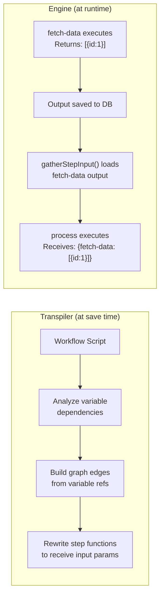

---

## Database Schema

The schema is split into two categories: **workflow definition** (what the workflow IS) and **execution** (what happened when it RAN).

### Workflow Definition Schema

These tables define the workflow and its configuration. Step-level configuration (retry, timeout, display) lives in the **workflow graph**, not in execution records.

#### Versioning strategy

Every save creates a **new row** with an incremented version. Previous versions are **never deleted** — they remain accessible so that running (and historical) executions can always fetch the exact workflow code and graph they were created with.

- **On save**: INSERT a new row with `version = previous + 1`. Never UPDATE the existing row.
- **API returns latest version** by default: `GET /api/workflows/:id` returns the highest version.
- **Execution pins a version**: `workflow_execution.workflow_version` references the exact version used. The execution inspector can load the workflow at that version to show the graph and code as they were when the execution ran.
- **Old versions are immutable**: once created, a version row is never modified.

This enables a key PoC demo: change the workflow code, see the graph update, then look at a previous execution — it shows the old graph and code.

```sql
-- Workflow definition (immutable versions — each save creates a new row)
-- active and deleted_at are per-workflow (not per-version), updated across all versions.
CREATE TABLE workflow (
    id              UUID NOT NULL DEFAULT gen_random_uuid(),
    version         INTEGER NOT NULL CHECK (version > 0),
    name            TEXT NOT NULL,
    code            TEXT NOT NULL,                -- TypeScript source (script format)
    compiled_code   TEXT NOT NULL,                -- Transpiled JS (NOT NULL — save fails if compilation fails)
    triggers        JSONB NOT NULL DEFAULT '[]',  -- Array of trigger configs extracted from source
    settings        JSONB NOT NULL DEFAULT '{}',
    graph           JSONB NOT NULL,               -- Parsed step graph (NOT NULL — always produced by transpiler)
    source_map      TEXT,                         -- Source map for error tracing (optional)
    active          BOOLEAN NOT NULL DEFAULT false,
    deleted_at      TIMESTAMPTZ,                  -- Soft-delete (NULL = active)
    created_at      TIMESTAMPTZ NOT NULL DEFAULT now(),
    PRIMARY KEY (id, version)
);
CREATE INDEX idx_workflow_latest ON workflow(id, version DESC);

-- Webhook registrations (active webhooks for trigger routing)
-- Simple table for testing webhook functionality.
-- On workflow activation: insert webhook records from trigger config.
-- On workflow deactivation: delete webhook records.
CREATE TABLE webhook (
    id              UUID PRIMARY KEY DEFAULT gen_random_uuid(),
    workflow_id     UUID NOT NULL,                -- Plain UUID, no FK for PoC simplicity
    method          TEXT NOT NULL,
    path            TEXT NOT NULL,
    created_at      TIMESTAMPTZ NOT NULL DEFAULT now(),
    UNIQUE(method, path)
);
```

### Status Enums

All statuses should be implemented as TypeScript enums for type safety and discoverability.

#### Execution Status

```typescript
enum ExecutionStatus {
    /** Execution is active — trigger materialized, steps being processed */
    Running = 'running',
    /** All steps completed successfully */
    Completed = 'completed',
    /** A step failed (retries exhausted or non-retriable) — fail fast */
    Failed = 'failed',
    /** User requested cancellation — current step finished, no further steps planned */
    Cancelled = 'cancelled',
    /** A step is waiting (approval or sleep) — execution resumes when the wait ends */
    Waiting = 'waiting',
    /** User paused the execution — current step finished, successors held until resume */
    Paused = 'paused',
}
```

#### Step Execution Status

```typescript
enum StepStatus {
    // --- Non-terminal (still in progress) ---
    /** Created but not yet queued (e.g., waiting for predecessor planning) */
    Pending = 'pending',
    /** Ready to be picked up by the queue poller */
    Queued = 'queued',
    /** Claimed by a worker, function is executing */
    Running = 'running',
    /** Failed with a retriable error, waiting for retry_after timestamp to pass */
    RetryPending = 'retry_pending',
    /** Approval step — waiting for external approve/decline via API */
    WaitingApproval = 'waiting_approval',
    /** Sleep/waitUntil — waiting for wait_until timestamp to pass (or child step to complete) */
    Waiting = 'waiting',

    // --- Terminal (done) ---
    /** Step executed successfully, output is available */
    Completed = 'completed',
    /** Step failed permanently (non-retriable error or retries exhausted) */
    Failed = 'failed',
    /** Step was cancelled (execution cancellation detected before/during step) */
    Cancelled = 'cancelled',
    /** Step was skipped (conditional branch not taken) */
    Skipped = 'skipped',
    /** Step output was reused from a previous execution (replay mode) */
    Cached = 'cached',
}
```

#### Execution Status State Machine

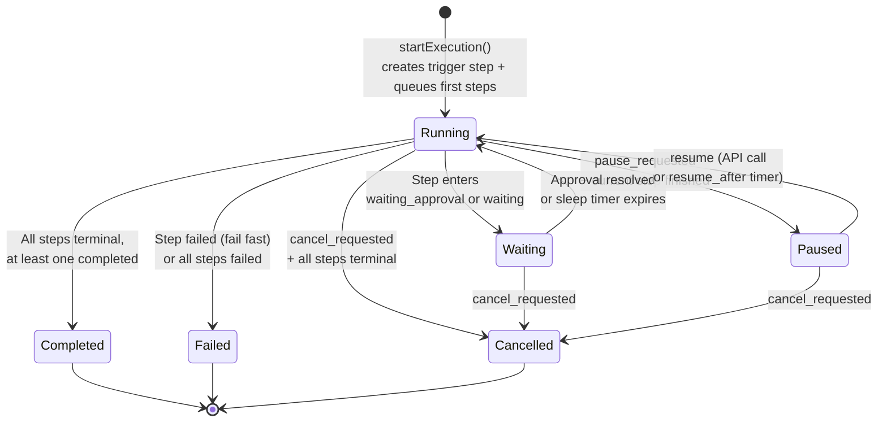

#### Step Execution Status State Machine

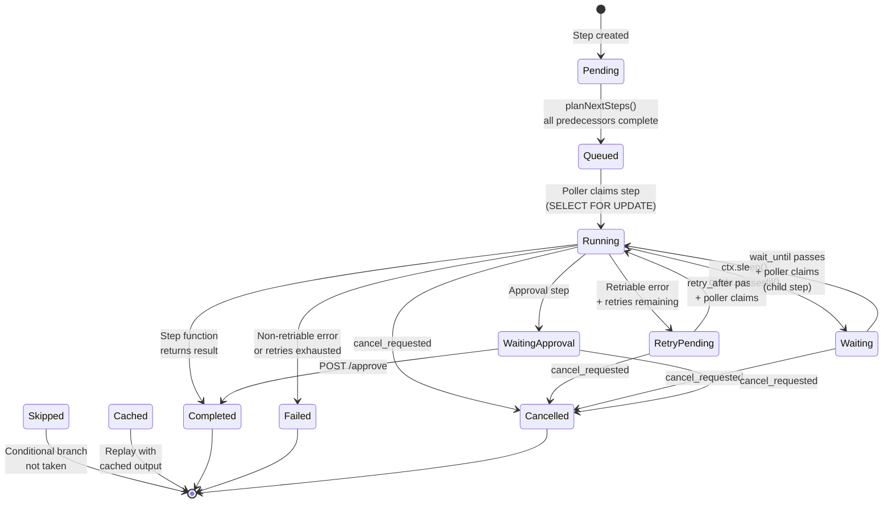

### Execution Schema

These tables track what happens when a workflow runs. Step execution records are lean — configuration comes from the workflow graph (fetched via `workflow_id + version`), not duplicated.

```sql
-- Workflow execution (one per workflow run)
CREATE TABLE workflow_execution (
    id              UUID PRIMARY KEY DEFAULT gen_random_uuid(),
    workflow_id     UUID NOT NULL,                -- Plain UUID reference to workflow.id
    workflow_version INTEGER NOT NULL,
    status          TEXT NOT NULL DEFAULT 'running'
                    CHECK (status IN ('running','completed','failed','cancelled','waiting','paused')),
    mode            TEXT NOT NULL DEFAULT 'production'
                    CHECK (mode IN ('production','manual','test')),
    -- No trigger_data — stored in trigger step execution's output
    result          JSONB,
    error           JSONB,
    cancel_requested BOOLEAN NOT NULL DEFAULT false,
    pause_requested  BOOLEAN NOT NULL DEFAULT false,
    resume_after     TIMESTAMPTZ,
    -- Performance tracking
    started_at      TIMESTAMPTZ NOT NULL DEFAULT now(),   -- NOT NULL — always set at creation
    completed_at    TIMESTAMPTZ,
    duration_ms     INTEGER CHECK (duration_ms >= 0),
    compute_ms      INTEGER CHECK (compute_ms >= 0),
    wait_ms         INTEGER CHECK (wait_ms >= 0),
    created_at      TIMESTAMPTZ NOT NULL DEFAULT now(),
    updated_at      TIMESTAMPTZ NOT NULL DEFAULT now()
);
CREATE INDEX idx_we_workflow ON workflow_execution(workflow_id, created_at DESC);
CREATE INDEX idx_we_status ON workflow_execution(status) WHERE status IN ('running', 'waiting');
CREATE INDEX idx_we_paused ON workflow_execution(status, resume_after)
    WHERE status = 'paused' AND resume_after IS NOT NULL;

-- Workflow step execution (THE core table — one per step per run)
-- Every step gets a record, INCLUDING the trigger step.
CREATE TABLE workflow_step_execution (
    id              UUID PRIMARY KEY DEFAULT gen_random_uuid(),
    execution_id    UUID NOT NULL REFERENCES workflow_execution(id) ON DELETE CASCADE,
    step_id         TEXT NOT NULL,                 -- Stable identifier (content-hash)
    step_type       TEXT NOT NULL DEFAULT 'step'
                    CHECK (step_type IN ('trigger','step','approval','condition')),
    status          TEXT NOT NULL DEFAULT 'pending'
                    CHECK (status IN ('pending','queued','running','retry_pending',
                                      'waiting_approval','waiting',
                                      'completed','failed','cancelled','skipped','cached')),
    input           JSONB,                         -- Data from predecessors
    output          JSONB,                         -- Data returned from step
    error           JSONB,                         -- { message, stack, code, retriable, timedOut }
    -- Retry tracking (max_attempts, retry config come from workflow graph)
    attempt         INTEGER NOT NULL DEFAULT 1 CHECK (attempt > 0),
    retry_after     TIMESTAMPTZ,                   -- When to retry
    -- Wait / Sleep
    wait_until      TIMESTAMPTZ,                   -- Resume after this time
    -- Approval
    approval_token  TEXT,
    -- Parent step (for fan-out child executions)
    parent_step_execution_id UUID REFERENCES workflow_step_execution(id),
    -- Timing
    started_at      TIMESTAMPTZ,
    completed_at    TIMESTAMPTZ,
    duration_ms     INTEGER,
    -- Metadata
    metadata        JSONB DEFAULT '{}',
    created_at      TIMESTAMPTZ NOT NULL DEFAULT now(),
    updated_at      TIMESTAMPTZ NOT NULL DEFAULT now(),
    UNIQUE(execution_id, step_id)
    -- Child step IDs are deterministic but unique per attempt/item:
    -- Sleep continuations: sha256(parentStepId + '__continuation__' + attempt)
    --   → attempt number ensures uniqueness on retry
    -- Fan-out children: sha256(parentStepId + '__fanout__' + itemIndex)
    --   → item index ensures uniqueness across fanned-out items
);
CREATE INDEX idx_wse_execution ON workflow_step_execution(execution_id);
CREATE INDEX idx_wse_queue ON workflow_step_execution(status, retry_after)
    WHERE status IN ('queued', 'retry_pending');
CREATE INDEX idx_wse_waiting ON workflow_step_execution(status, wait_until)
    WHERE status = 'waiting';
CREATE INDEX idx_wse_parent ON workflow_step_execution(parent_step_execution_id)
    WHERE parent_step_execution_id IS NOT NULL;
CREATE INDEX idx_wse_step_lookup ON workflow_step_execution(execution_id, step_id, status);
-- For stale recovery: find steps stuck in 'running' beyond timeout
CREATE INDEX idx_wse_stale ON workflow_step_execution(status, started_at)
    WHERE status = 'running';
-- For completion check: count non-terminal steps per execution
CREATE INDEX idx_wse_exec_status ON workflow_step_execution(execution_id, status);
```

#### Design decisions

**No separate identity table**: The `active` and `deleted_at` fields live directly on the `workflow` table. They apply per-workflow (not per-version) — when toggling active or soft-deleting, all rows with that `id` are updated. This is simpler than a separate identity table and avoids composite FK issues. The trade-off is redundant storage of these fields across versions, which is negligible.

**No `workflow_code` snapshot in execution**: The engine fetches the workflow by `workflow_id + workflow_version` (composite FK). Since workflow versions are immutable and never deleted, the code and graph are always retrievable. This avoids duplicating the entire workflow in every execution record.

**No `step_name` in step execution**: The step's display name is derivable from the workflow graph via `step_id`. No need to duplicate it.

**No webhook response fields in execution**: Webhook responses (`ctx.respondToWebhook()`) are transient HTTP state handled via the broadcaster and in-memory response tracking. They're not persisted on the execution record.

**Step config lives in the workflow graph**: The graph (stored in `workflow.graph`) contains each step's configuration: retry settings, max attempts, timeout, display info. The engine looks up config from the graph using `step_id`. This avoids duplicating config in every step execution row.

**Trigger step materialization**: The trigger is a step execution with `step_type = 'trigger'`, `status = 'completed'`, and `output = triggerData`. Downstream steps reference trigger data the same way they reference any predecessor's output — no special case needed. Because of this, there's no `trigger_data` or `trigger_id` column on `workflow_execution` — the trigger data lives in the trigger step execution's `output`, and which trigger fired is the trigger step's `step_id`.

---

## The Workflow Graph

The workflow script is parsed into a **static graph** at save time and **persisted** in the `workflow.graph` JSONB column. This graph drives both the UI visualization AND the engine's step planning. It is re-parsed and updated every time the workflow code is saved.

```typescript
// Data interfaces — these are what's stored in the JSONB column
interface WorkflowGraphData {
    nodes: GraphNodeData[];
    edges: GraphEdgeData[];
}

interface GraphNodeData {
    id: string;           // Stable content-hash (see below)
    name: string;         // Human-readable display name
    type: 'trigger' | 'step' | 'condition' | 'approval' | 'end';
    stepFunctionRef: string; // Reference to the step function in compiled code
    config: StepConfig;
}

interface StepConfig {
    retryConfig?: RetryConfig;    // { maxAttempts, baseDelay, maxDelay, jitter }
    timeout?: number;
    continuationRef?: string;     // Function ref for sleep continuation (set by transpiler)
    display?: { icon?: string; color?: string; description?: string };
    retriableErrors?: string[];   // Error codes that should trigger retry
    retryOnTimeout?: boolean;
}

interface GraphEdgeData {
    from: string;         // Node ID
    to: string;           // Node ID
    label?: string;       // 'true' | 'false' for conditionals
    condition?: string;   // JS expression evaluated with step output as context
}
```

### Graph utility class

The JSONB data is hydrated into a `WorkflowGraph` class that provides query methods. The raw data has no methods (it's deserialized JSON) — the class wraps it:

```typescript
class WorkflowGraph {
    constructor(private data: WorkflowGraphData) {}

    getTriggerNode(): GraphNodeData {
        return this.data.nodes.find(n => n.type === 'trigger')!;
    }

    getNode(stepId: string): GraphNodeData {
        return this.data.nodes.find(n => n.id === stepId)!;
    }

    getPredecessors(stepId: string): GraphNodeData[] {
        const predIds = this.data.edges.filter(e => e.to === stepId).map(e => e.from);
        return this.data.nodes.filter(n => predIds.includes(n.id));
    }

    getSuccessors(stepId: string, stepOutput: unknown): GraphNodeData[] {
        return this.data.edges
            .filter(e => e.from === stepId)
            .filter(e => this.evaluateCondition(e.condition, stepOutput))
            .map(e => this.getNode(e.to));
    }

    getLeafNodes(): GraphNodeData[] {
        const nodesWithSuccessors = new Set(this.data.edges.map(e => e.from));
        return this.data.nodes.filter(n => !nodesWithSuccessors.has(n.id));
    }

    getContinuationStepId(parentStepId: string, attempt: number): string {
        // Deterministic: includes attempt to avoid collision on retry
        return sha256(`${parentStepId}__continuation__${attempt}`);
    }

    /** Get the continuation function ref for a parent step's sleep point */
    getContinuationFunctionRef(parentStepId: string): string | undefined {
        const parentNode = this.getNode(parentStepId);
        // The transpiler generates continuation functions as step_<id>_cont_<N>
        // and records the mapping in the parent node's config
        return parentNode?.config?.continuationRef;
    }

    /** Check if a step ID is a continuation (child) step, not a graph node */
    isContinuationStep(stepId: string): boolean {
        return !this.data.nodes.some(n => n.id === stepId);
    }

    getFanOutChildStepId(parentStepId: string, itemIndex: number): string {
        // Deterministic: includes item index for uniqueness
        return sha256(`${parentStepId}__fanout__${itemIndex}`);
    }

    /** Evaluate a conditional edge expression against step output */
    private evaluateCondition(condition: string | undefined, stepOutput: unknown): boolean {
        if (!condition) return true; // No condition = always taken
        // Evaluate the condition string with step output as context.
        // The condition references 'output' (the step's return value).
        // Example: condition = "output.length > 0"
        // Uses a restricted evaluator (no access to globals, require, etc.)
        const fn = new Function('output', `return Boolean(${condition})`);
        return fn(stepOutput);
    }
}

// Hydration from JSONB:
const graph = new WorkflowGraph(workflow.graph as WorkflowGraphData);
```

**Conditional edge evaluation**: The `condition` string on a `GraphEdgeData` is a JavaScript expression evaluated with the step's **output** bound as the `output` variable. For example, the conditional `if (enriched.length > 0)` in the script becomes an edge with `condition: "output.length > 0"`. The transpiler generates these condition strings at save time. At runtime, `evaluateCondition()` uses `new Function('output', ...)` — same security posture as `Module._compile()` (trusted code, sandboxed in Phase 2).

### Step ID stability

Step IDs are generated as `sha256(stepFunctionBody + stepOptions)` where the hash input includes the step's function body and configuration options. This means:
- Same step configuration = same ID across workflow versions
- Renaming a step's display name does NOT change the ID
- Changing the step's function body or options DOES change the ID
- This enables cross-version comparison: "did this step change between v3 and v4?"

---

## Engine: How Per-Step Execution Works

> **Implementation note**: All database access uses TypeORM entities and repositories, following the same patterns as `packages/cli/src/modules/`. Code examples use TypeORM query builder syntax.

### Starting an Execution

```typescript
async function startExecution(
    workflowId: string,
    triggerData?: unknown,
    mode = 'production',
    version?: number,
): Promise<string> {
    // Fetch latest version (or specific version if pinned)
    const workflow = await workflowRepository
        .createQueryBuilder('w')
        .where('w.id = :id', { id: workflowId })
        .andWhere(version ? 'w.version = :version' : '1=1', { version })
        .orderBy('w.version', 'DESC')
        .limit(1)
        .getOneOrFail();

    const execution = await workflowExecutionRepository
        .createQueryBuilder()
        .insert()
        .values({
            workflowId,
            workflowVersion: workflow.version,
            status: 'running',
            mode,
            startedAt: new Date(),
        })
        .returning('id')
        .execute();

    const executionId = execution.raw[0].id;

    // Materialize the trigger as a completed step execution
    const graph = new WorkflowGraph(workflow.graph as WorkflowGraphData);
    const triggerNode = graph.getTriggerNode();

    await stepExecutionRepository
        .createQueryBuilder()
        .insert()
        .values({
            executionId,
            stepId: triggerNode.id,
            stepType: 'trigger',
            status: 'completed',
            output: triggerData,
            startedAt: new Date(),
            completedAt: new Date(),
            durationMs: 0,
        })
        .execute();

    await planNextSteps(executionId, triggerNode.id, triggerData, graph);

    broadcaster.send(executionId, { type: 'execution:started', executionId });

    return executionId;
}
```

### Queue Polling

The poller uses **aggressive polling** (every 50ms) to minimize latency between a step being queued and being picked up.

**Why polling, not LISTEN/NOTIFY or push-based:**

PostgreSQL's `LISTEN/NOTIFY` has known issues at scale: thundering herd with many consumers (all workers wake on every notification), notifications are lost if no listeners are connected, and it adds complexity. Pure polling with `SELECT FOR UPDATE SKIP LOCKED` is the proven approach for PostgreSQL-based job queues.

The key to polling performance is the **partial index**: `idx_wse_queue` only indexes rows with `status IN ('queued', 'retry_pending')`. This means the poll query scans a tiny index (only active jobs), not the entire table. Even with millions of historical step executions, the poll is an index-only scan on a few rows. At 50ms intervals, this is ~20 queries/second per worker — negligible load for PostgreSQL.

The poller tracks **in-flight step count** against a `maxConcurrency` limit. It only claims `maxConcurrency - inFlight` new steps per poll cycle. This prevents unbounded job accumulation.

### Transaction boundary: claim → release → execute → emit

The claiming and execution are **separate transactions**. This is critical for understanding the locking model:

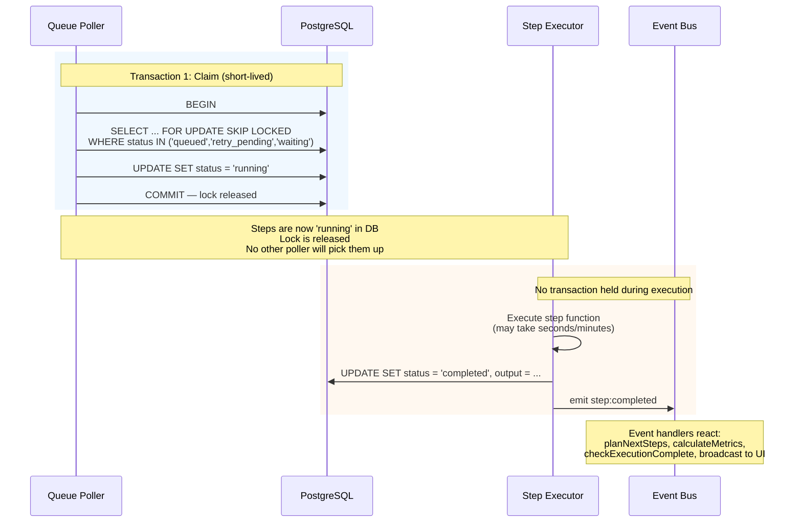

Once a step is set to `running` and the transaction commits, the lock is released. The step is safe from double-pickup because the poller only queries for `queued`, `retry_pending`, and `waiting` — not `running`. The step execution happens **outside any transaction**, so a crash during execution leaves the step in `running` status. The stale recovery mechanism detects steps stuck in `running` for too long and re-queues them.

**Stale recovery threshold**: per-step `timeout + 30s buffer`. Steps without a configured timeout use the global default (5 minutes) + 30s. This ensures the step timeout kills the function before stale recovery fires, preventing duplicate execution.

```typescript
class StepQueue {
    private inFlight = 0;

    async poll(): Promise<void> {
        const available = this.maxConcurrency - this.inFlight;
        if (available <= 0) return; // At capacity

        // Transaction 1: Claim steps atomically (short-lived)
        const claimed = await this.dataSource.transaction(async (manager) => {
            const steps = await manager
                .createQueryBuilder(WorkflowStepExecution, 'wse')
                // Join execution to check pause_requested
                .innerJoin('workflow_execution', 'we', 'we.id = wse.executionId')
                .setLock('pessimistic_write', undefined, ['wse'])
                .where(new Brackets(qb => {
                    qb.where('wse.status = :queued', { queued: 'queued' })
                      .orWhere('wse.status = :retryPending AND wse.retryAfter <= NOW()',
                          { retryPending: 'retry_pending' })
                      // Note: parent steps in 'waiting' have waitUntil=NULL.
                      // NULL <= NOW() evaluates to NULL (falsy), so parents are
                      // correctly excluded. Only child steps with a concrete
                      // waitUntil timestamp are picked up.
                      .orWhere('wse.status = :waiting AND wse.waitUntil <= NOW()',
                          { waiting: 'waiting' });
                }))
                // Don't pick up steps from paused, cancelled, or failed executions
                .andWhere('we.pause_requested = false')
                .andWhere('we.cancel_requested = false')
                .andWhere('we.status NOT IN (:...blocked)', {
                    blocked: ['failed', 'cancelled', 'paused', 'completed'],
                })
                .orderBy('wse.createdAt', 'ASC')
                .limit(available)
                .getMany();

            if (steps.length === 0) return [];

            // Set to 'running' and commit — releases the lock
            await manager
                .createQueryBuilder()
                .update(WorkflowStepExecution)
                .set({ status: 'running', startedAt: () => 'NOW()' })
                .whereInIds(steps.map(s => s.id))
                .execute();

            return steps;
        });
        // Transaction committed — lock released — steps are safe

        if (claimed.length === 0) return;

        // Dispatch concurrently, outside any transaction
        this.inFlight += claimed.length;

        await Promise.allSettled(
            claimed.map(async (step) => {
                try {
                    await processStep(step);
                } finally {
                    this.inFlight--;
                }
            }),
        );
    }
}
```

### Processing a Step

Each step process **emits lifecycle events** automatically. These events serve two purposes: (1) real-time delivery to UI clients via the broadcaster, and (2) triggering engine reactions like planning next steps, calculating metrics, and marking execution completion.

```typescript
async function processStep(stepJob: WorkflowStepExecution): Promise<void> {
    // Outer try/catch: if ANYTHING fails (loading workflow, parsing graph, etc.),
    // mark the step as failed so it doesn't get stuck in 'running' forever.
    try {
        const execution = await workflowExecutionRepository
            .createQueryBuilder('we')
            .where('we.id = :id', { id: stepJob.executionId })
            .getOneOrFail();

        if (execution.cancelRequested) {
            await updateStepAndEmit(stepJob, execution, {
                status: 'cancelled', completedAt: new Date(),
            });
            return;
        }

        // Fetch workflow at pinned version for step config + compiled code
        const workflow = await workflowRepository
            .createQueryBuilder('w')
            .where('w.id = :id AND w.version = :version', {
                id: execution.workflowId,
                version: execution.workflowVersion,
            })
            .getOneOrFail();

        const graph = new WorkflowGraph(workflow.graph as WorkflowGraphData);
        const stepConfig = graph.getNode(stepJob.stepId).config;
        const stepFn = loadStepFunction(
        execution.workflowId, execution.workflowVersion,
        workflow.compiledCode, graph, stepJob.stepId, stepJob.metadata,
    );
        const ctx = buildStepContext(stepJob, execution);

        // Emit step:started
        emitStepEvent('step:started', {
            executionId: execution.id,
            stepId: stepJob.stepId, attempt: stepJob.attempt,
        });

        const startTime = Date.now();

        try {
            const timeout = stepConfig.timeout ?? 300_000;
            const result = await Promise.race([
                stepFn(ctx),
                new Promise((_, reject) =>
                    setTimeout(() => reject(new StepTimeoutError(stepJob.stepId, timeout)), timeout),
                ),
            ]);

            const durationMs = Date.now() - startTime;

            // Emit step:completed — event handlers do the rest
            // (planNextSteps, calculateStepMetrics, checkExecutionComplete)
            await updateStepAndEmit(stepJob, execution, {
                status: 'completed', output: result, completedAt: new Date(), durationMs,
            });

        } catch (error) {
            // Handle sleep/wait FIRST — these are not errors, they're control flow
            if (error instanceof SleepRequestedError || error instanceof WaitUntilRequestedError) {
                const waitUntil = error instanceof SleepRequestedError
                    ? new Date(Date.now() + error.sleepMs)
                    : error.date;

                // Save intermediate state as parent step output
                await updateStepAndEmit(stepJob, execution, {
                    status: 'waiting',
                    output: error.intermediateState ?? null,
                });

                // Create child step with intermediate state and the continuation function ref
                const continuationStepId = graph.getContinuationStepId(
                    stepJob.stepId, stepJob.attempt,
                );
                const continuationRef = stepConfig.continuationRef;
                await stepExecutionRepository.createQueryBuilder().insert().values({
                    executionId: execution.id,
                    stepId: continuationStepId,
                    stepType: 'step',
                    status: 'waiting',
                    waitUntil,
                    parentStepExecutionId: stepJob.id,
                    input: { __intermediate: error.intermediateState, __predecessors: stepJob.input },
                    // Store the function ref in metadata so loadStepFunction can find it
                    // without needing a graph node for this child step
                    metadata: { functionRef: continuationRef },
                }).execute();
                return;
            }

            const durationMs = Date.now() - startTime;
            const errorData = buildErrorData(error, workflow.sourceMap);
            logger.error(`Step ${stepJob.stepId} failed (attempt ${stepJob.attempt}):`, errorData);

            const maxAttempts = stepConfig.retryConfig?.maxAttempts ?? 1;
            const isRetriable = classifyError(error, stepConfig);
            const hasRetriesLeft = stepJob.attempt < maxAttempts;

            if (isRetriable && hasRetriesLeft) {
                const retryConfig = stepConfig.retryConfig ?? { baseDelay: 1000, maxDelay: 60_000, jitter: true };
                const delay = calculateBackoff(stepJob.attempt, retryConfig);

                await updateStepAndEmit(stepJob, execution, {
                    status: 'retry_pending',
                    attempt: stepJob.attempt + 1,
                    retryAfter: new Date(Date.now() + delay),
                    error: errorData,
                });
            } else {
                await updateStepAndEmit(stepJob, execution, {
                    status: 'failed',
                    error: { ...errorData, timedOut: error instanceof StepTimeoutError },
                    completedAt: new Date(),
                    durationMs,
                });
            }
        }

    } catch (infrastructureError) {
        // Infrastructure failure: can't load workflow, can't parse graph, DB error, etc.
        // MUST emit event so checkExecutionComplete and metrics are triggered.
        const errorData = buildErrorData(infrastructureError);
        logger.error(`Infrastructure error processing step ${stepJob.id}:`, errorData);

        try {
            // Use updateStepAndEmit to ensure event is emitted
            // We may not have a full `execution` object, so build a minimal one
            await stepExecutionRepository
                .createQueryBuilder()
                .update()
                .set({ status: 'failed', error: errorData, completedAt: new Date() })
                .where('id = :id', { id: stepJob.id })
                .execute();

            // Emit the event manually since we may not have `execution` in scope
            emitStepEvent('step:failed', {
                executionId: stepJob.executionId,
                stepId: stepJob.stepId,
                parentStepExecutionId: stepJob.parentStepExecutionId,
                error: errorData,
            });
        } catch (doubleFailure) {
            // DB is completely unreachable. Step stays 'running'.
            // Stale recovery will pick it up after timeout + buffer.
            logger.error(`Cannot persist infrastructure error for step ${stepJob.id}:`, doubleFailure);
        }
    }
}
```

### Step Lifecycle Events

`updateStepAndEmit()` is the single place where step status changes happen. It persists the change AND emits the corresponding event. Event handlers react to these events:

```typescript
async function updateStepAndEmit(
    stepJob: WorkflowStepExecution,
    execution: WorkflowExecution,
    update: Partial<WorkflowStepExecution>,
): Promise<void> {
    // 1. Persist the status change
    await stepExecutionRepository
        .createQueryBuilder()
        .update()
        .set(update)
        .where('id = :id', { id: stepJob.id })
        .execute();

    // 2. Emit the event — handlers react to it
    // IMPORTANT: include executionId and parentStepExecutionId in the payload
    // so handlers can route correctly and resolve child steps
    const eventType = mapStatusToEvent(update.status);
    emitStepEvent(eventType, {
        executionId: execution.id,
        stepId: stepJob.stepId,
        parentStepExecutionId: stepJob.parentStepExecutionId,
        ...update,
    });
}

function mapStatusToEvent(status: string): string {
    switch (status) {
        case 'completed': return 'step:completed';
        case 'failed': return 'step:failed';
        case 'cancelled': return 'step:cancelled';
        case 'retry_pending': return 'step:retrying';
        case 'waiting_approval': return 'step:waiting_approval';
        case 'waiting': return 'step:waiting';
        default: return `step:${status}`;
    }
}
```

### Event Handlers

The engine registers handlers that react to step lifecycle events. This decouples step processing from planning/metrics/completion logic:

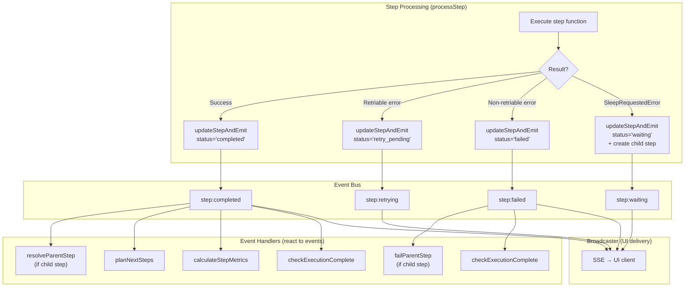

```typescript
// When a step completes → resolve parent (if child), check pause, plan next steps
engine.on('step:completed', async ({ executionId, stepId, output, parentStepExecutionId }) => {
    // If this is a child step (sleep continuation or fan-out child),
    // mark the parent step as completed with the child's output
    if (parentStepExecutionId) {
        await resolveParentStep(parentStepExecutionId, output);
        // resolveParentStep marks parent as 'completed' and emits step:completed for it
        // which re-triggers this handler for the parent — planning continues from there
        return;
    }

    const execution = await loadExecution(executionId);

    // Check for pause BEFORE planning next steps
    if (execution.pauseRequested) {
        // But first: check if this was the LAST step (no successors to plan).
        // If so, the execution is done — don't pause a completed execution.
        const workflow = await loadWorkflowForExecution(executionId);
        const graph = new WorkflowGraph(workflow.graph as WorkflowGraphData);
        const successors = graph.getSuccessors(stepId, output);
        if (successors.length === 0) {
            // No more steps — check if execution is complete
            await checkExecutionComplete(executionId, graph);
            return;
        }
        await markExecutionPaused(executionId);
        emitExecutionEvent('execution:paused', { executionId, lastCompletedStepId: stepId });
        return;
    }

    // Normal step completion — plan successors
    const workflow = await loadWorkflowForExecution(executionId);
    const graph = new WorkflowGraph(workflow.graph as WorkflowGraphData);
    await planNextSteps(executionId, stepId, output, graph);
    await calculateStepMetrics(executionId, stepId);
    await checkExecutionComplete(executionId, graph);
});

// When a step fails → FAIL FAST: mark execution as failed, stop other branches
engine.on('step:failed', async ({ executionId, stepId, parentStepExecutionId, error }) => {
    if (parentStepExecutionId) {
        await failParentStep(parentStepExecutionId);
        return;
    }

    // Fail fast: immediately mark execution as failed and set cancel_requested
    // to prevent other branches' queued/waiting steps from being picked up.
    // This matches the current n8n engine's behavior.
    await workflowExecutionRepository
        .createQueryBuilder()
        .update()
        .set({
            status: 'failed',
            cancelRequested: true, // Stops other branches at next step boundary
            error: { ...error, stepId },
            completedAt: new Date(),
        })
        .where('id = :id AND status NOT IN (:...terminal)', {
            id: executionId,
            terminal: ['completed', 'failed', 'cancelled'],
        })
        .execute();

    await calculateStepMetrics(executionId, stepId);
    emitStepEvent('execution:failed', { executionId, error: { ...error, stepId } });
});

// When a step is cancelled → check execution done
engine.on('step:cancelled', async ({ executionId }) => {
    const workflow = await loadWorkflowForExecution(executionId);
    const graph = new WorkflowGraph(workflow.graph as WorkflowGraphData);
    await checkExecutionComplete(executionId, graph);
});

// When execution completes or fails → calculate execution-level metrics
engine.on('execution:completed', ({ executionId }) => calculateExecutionMetrics(executionId));
engine.on('execution:failed', ({ executionId }) => calculateExecutionMetrics(executionId));

// When execution is paused with resume_after → schedule auto-resume check
engine.on('execution:paused', async ({ executionId }) => {
    // The execution poller handles timed resume — nothing to do here
    // but we could log or notify
});

// When execution is resumed — planning already handled by resumeExecution().
// This handler is for logging/notification only.
engine.on('execution:resumed', async ({ executionId }) => {
    // Planning was done in resumeExecution() for all completed steps.
    // Steps will be picked up by the poller now that pause_requested is false.
});

// All events forwarded to broadcaster for UI delivery
engine.on('step:*', (event) => broadcaster.send(event.executionId, event));
engine.on('execution:*', (event) => broadcaster.send(event.executionId, event));
```

This event-driven approach means:
- `step:completed` is the single handler that drives the engine forward — it resolves parents, plans next steps, calculates metrics, and checks for execution completion
- **Child steps (sleep continuations, fan-out)** are handled uniformly: child completes → parent resolves → parent's successors are planned
- The approval endpoint just calls `updateStepAndEmit()` — the same handler does everything
- Adding new reactions (e.g., sending a Slack notification on step failure) is just adding a handler
- The broadcaster doesn't know about planning — it just forwards events to UI clients

### Planning Next Steps

A successor step is only queued when **all** its predecessors have completed.

```typescript
async function planNextSteps(
    executionId: string,
    completedStepId: string,
    stepOutput: unknown,
    graph: WorkflowGraph,
): Promise<void> {
    const successors = graph.getSuccessors(completedStepId, stepOutput);

    if (successors.length === 0) {
        // No successors to plan — the step:completed event handler
        // will call checkExecutionComplete separately. Don't call it here
        // to avoid double-finalization race conditions.
        return;
    }

    for (const step of successors) {
        const predecessors = graph.getPredecessors(step.id);

        const completedPredCount = await stepExecutionRepository
            .createQueryBuilder('wse')
            .where('wse.executionId = :executionId', { executionId })
            .andWhere('wse.stepId IN (:...stepIds)', { stepIds: predecessors.map(p => p.id) })
            .andWhere('wse.status = :status', { status: 'completed' })
            .getCount();

        if (completedPredCount < predecessors.length) {
            continue; // Last completing predecessor will trigger this
        }

        const input = await gatherStepInput(executionId, step, graph);

        await stepExecutionRepository
            .createQueryBuilder()
            .insert()
            .values({ executionId, stepId: step.id, stepType: step.type, status: 'queued', input })
            .orIgnore()
            .execute();
    }
}
```

### Determining Execution Completion

An execution is complete when **there are no more steps to run** — all planned step executions are in a terminal status, and no successors are pending planning.

```typescript
async function checkExecutionComplete(executionId: string, graph: WorkflowGraph): Promise<void> {
    const nonTerminalCount = await stepExecutionRepository
        .createQueryBuilder('wse')
        .where('wse.executionId = :executionId', { executionId })
        .andWhere('wse.status NOT IN (:...statuses)', {
            statuses: ['completed', 'failed', 'cancelled', 'skipped', 'cached'],
        })
        .getCount();

    if (nonTerminalCount > 0) return;

    // All planned steps are terminal. Calculate metrics and finalize.
    const hasCompletedSteps = await stepExecutionRepository
        .createQueryBuilder('wse')
        .where('wse.executionId = :executionId AND wse.status = :s AND wse.stepType != :t',
            { executionId, s: 'completed', t: 'trigger' })
        .getCount();

    // Find the graph's leaf steps (no successors) to determine the execution result.
    // In a linear workflow, this is the last step. In a parallel workflow, there may be
    // multiple leaves — we use the one that completed last.
    // This is more correct than ORDER BY completedAt DESC which would pick an
    // arbitrary branch in a parallel workflow.
    const leafStepIds = graph.getLeafNodes().map(n => n.id);
    const lastLeaf = await stepExecutionRepository
        .createQueryBuilder('wse')
        .where('wse.executionId = :executionId AND wse.status = :s', { executionId, s: 'completed' })
        .andWhere('wse.stepId IN (:...leafIds)', { leafIds: leafStepIds })
        .orderBy('wse.completedAt', 'DESC')
        .getOne();

    const execution = await workflowExecutionRepository.findOneByOrFail({ id: executionId });

    const steps = await stepExecutionRepository
        .createQueryBuilder('wse')
        .select(['wse.stepType', 'wse.durationMs'])
        .where('wse.executionId = :executionId AND wse.status IN (:...s)',
            { executionId, s: ['completed', 'cached'] })
        .getMany();

    const computeMs = steps
        .filter(s => s.stepType !== 'approval')
        .reduce((sum, s) => sum + (s.durationMs ?? 0), 0);
    const wallMs = Date.now() - execution.startedAt.getTime();
    // Determine final status:
    // - If cancel was requested → 'cancelled'
    // - If at least one non-trigger step completed → 'completed'
    // - Otherwise → 'failed'
    let finalStatus: string;
    if (execution.cancelRequested) {
        finalStatus = 'cancelled';
    } else if (hasCompletedSteps > 0) {
        finalStatus = 'completed';
    } else {
        finalStatus = 'failed';
    }

    // CAS guard: only finalize if execution is still in a non-terminal status.
    // Prevents double-finalization when two steps complete simultaneously
    // and both call checkExecutionComplete.
    const updateResult = await workflowExecutionRepository
        .createQueryBuilder()
        .update()
        .set({
            status: finalStatus, result: lastLeaf?.output, completedAt: new Date(),
            durationMs: wallMs, computeMs, waitMs: wallMs - computeMs,
        })
        .where('id = :id AND status NOT IN (:...terminal)', {
            id: executionId,
            terminal: ['completed', 'failed', 'cancelled'],
        })
        .execute();

    // If no rows affected, another call already finalized — skip event emission
    if (updateResult.affected === 0) return;

    broadcaster.send(executionId, { type: `execution:${finalStatus}`, result: lastLeaf?.output });
}
```

---

## Error Handling and Retriability

All errors in the engine flow through a **centralized error model**. This makes it easy to add new error types, classify them consistently, and produce structured error data for the step execution record.

### Error hierarchy

```typescript
// Base class — all engine errors extend this
abstract class EngineError extends Error {
    abstract readonly code: string;       // Machine-readable error code
    abstract readonly retriable: boolean; // Should the engine retry?
    abstract readonly category: ErrorCategory;
}

type ErrorCategory = 'step' | 'infrastructure' | 'timeout' | 'validation';

// Step errors — thrown by user code or external APIs
class StepTimeoutError extends EngineError {
    code = 'STEP_TIMEOUT';
    retriable: boolean; // Configurable via stepConfig.retryOnTimeout
    category = 'timeout' as const;
}

class HttpError extends EngineError {
    code: string;       // 'HTTP_429', 'HTTP_503', etc.
    retriable: boolean; // Based on status code
    category = 'step' as const;
}

// Infrastructure errors — thrown by the engine itself
class WorkflowNotFoundError extends EngineError {
    code = 'WORKFLOW_NOT_FOUND';
    retriable = false;
    category = 'infrastructure' as const;
}

class StepFunctionNotFoundError extends EngineError {
    code = 'STEP_FUNCTION_NOT_FOUND';
    retriable = false;
    category = 'infrastructure' as const;
}

// Non-retriable by nature
class NonRetriableError extends EngineError {
    code = 'NON_RETRIABLE';
    retriable = false;
    category = 'step' as const;
}
```

### Centralized error classification

A single function normalizes any thrown value into a structured `ErrorData`:

```typescript
function buildErrorData(error: unknown, sourceMap?: string): ErrorData {
    // 1. If it's already an EngineError, use its properties directly
    if (error instanceof EngineError) {
        return {
            message: error.message,
            stack: remapStack(error.stack, sourceMap),
            code: error.code,
            category: error.category,
            retriable: error.retriable,
        };
    }

    // 2. Classify native JS errors — never retriable (code bugs)
    if (error instanceof TypeError || error instanceof ReferenceError ||
        error instanceof SyntaxError) {
        return {
            message: error.message,
            stack: remapStack(error.stack, sourceMap),
            code: error.constructor.name.toUpperCase(),
            category: 'step',
            retriable: false,
        };
    }

    // 3. Classify Node.js system errors by errno code
    if (error instanceof Error && 'code' in error) {
        const errno = (error as NodeJS.ErrnoException).code;
        const retriableCodes = ['ETIMEDOUT', 'ECONNRESET', 'ECONNREFUSED', 'EPIPE'];
        return {
            message: error.message,
            stack: remapStack(error.stack, sourceMap),
            code: errno ?? 'UNKNOWN',
            category: 'step',
            retriable: retriableCodes.includes(errno ?? ''),
        };
    }

    // 4. Unknown error shape
    return {
        message: error instanceof Error ? error.message : String(error),
        stack: error instanceof Error ? remapStack(error.stack, sourceMap) : undefined,
        code: 'UNKNOWN',
        category: 'step',
        retriable: true, // Default: assume transient
    };
}

interface ErrorData {
    message: string;
    stack?: string;
    code: string;
    category: 'step' | 'infrastructure' | 'timeout' | 'validation';
    retriable: boolean;
}

/**
 * Determines if an error should trigger a retry.
 * Uses buildErrorData for base classification, then applies step-level overrides.
 * This is the function called in processStep's catch block.
 */
function classifyError(error: unknown, stepConfig: StepConfig): boolean {
    const errorData = buildErrorData(error);

    // Step-level overrides:
    // 1. StepTimeoutError: only retriable if step config says so
    if (error instanceof StepTimeoutError) {
        return stepConfig.retryOnTimeout ?? false;
    }

    // 2. Custom retriable error codes from step config
    if (stepConfig.retriableErrors?.includes(errorData.code)) {
        return true;
    }

    // 3. Fall back to the base classification from buildErrorData
    return errorData.retriable;
}
```

### How it integrates with processStep

The outer try/catch in `processStep` uses the same `buildErrorData`:

```typescript
} catch (infrastructureError) {
    // Infrastructure failures go through the same error model
    const errorData = buildErrorData(
        infrastructureError instanceof EngineError
            ? infrastructureError
            : new InfrastructureError(infrastructureError),
    );
    // errorData.category = 'infrastructure', errorData.retriable = false
    await stepExecutionRepository.createQueryBuilder().update()
        .set({ status: 'failed', error: errorData, completedAt: new Date() })
        .where('id = :id', { id: stepJob.id }).execute();
}
```

This means:
- All errors — from user code, HTTP calls, infrastructure, timeouts — produce the same `ErrorData` shape
- Adding a new error type = extend `EngineError` with `code`, `retriable`, `category`
- The `error` JSONB in `workflow_step_execution` always has `{ message, stack, code, category, retriable }`
- The UI can use `category` to show different icons/colors, and `code` for filtering

---

## Source Maps and Error Tracing

### Compilation errors (save time)

When a workflow is saved, the transpiler compiles the TypeScript script. If the script has syntax errors, type errors, structural issues (e.g., step name conflicts), or **missing dependencies** (unresolved imports), the compilation fails and the errors are **returned to the API caller** — the workflow is not saved.

The compiler checks for:
- **Syntax errors**: invalid TypeScript syntax
- **Type errors**: type mismatches (when type checking is enabled)
- **Structural errors**: duplicate step names, missing `defineWorkflow`, invalid step options
- **Missing dependencies**: `import` statements that reference packages not installed in the engine's `node_modules`. The compiler resolves imports at transpile time and reports unresolved modules with the import path and line number.
- **Variable resolution errors**: references to variables that don't map to any step output or constant

```typescript
// In the workflow save endpoint:
const compilationResult = transpiler.compile(workflow.code);

if (compilationResult.errors.length > 0) {
    // Return errors to UI — workflow is NOT saved
    return {
        statusCode: 422,
        errors: compilationResult.errors.map(err => ({
            message: err.message,
            line: err.line,       // Line in the original TypeScript source
            column: err.column,
            severity: err.severity, // 'error' | 'warning'
        })),
    };
}

// Compilation succeeded — save the workflow
await workflowRepository.save({
    ...workflow,
    compiledCode: compilationResult.code,
    graph: compilationResult.graph,
    sourceMap: compilationResult.sourceMap,
});
```

The UI displays compilation errors inline in the CodeMirror editor (red underlines, gutter markers) — same as any IDE. Warnings are shown but don't block saving.

### Runtime errors (execution time)

When the workflow script is transpiled into individual step functions, runtime errors reference the transpiled code's line numbers. The engine uses source maps to map errors back to the original script.

1. **At save time**: Generate inline source maps using esbuild with `sourcemap: 'inline'` and `keepNames: true`
2. **Store** the source map in `workflow.source_map`
3. **At runtime**: Use `source-map-support` to translate stack traces automatically

This means error messages in the UI show the exact line in the user's workflow script, not the transpiled code.

---

## Cancellation

Phase 1 supports **between-step cancellation**:

Before each step starts, the engine checks `workflow_execution.cancel_requested`. If true, the step is marked `cancelled`. Steps in `retry_pending` or `waiting` status are also cancelled when the engine detects `cancel_requested`.

> **Phase 2**: Within-step cancellation via AbortSignal propagation. The step context would include an `AbortSignal` passable to `fetch()` and other abort-aware APIs.

---

## Pause and Resume

Pausing allows a user to temporarily hold a running execution. The current in-flight step completes normally, but no further steps are planned until the execution is resumed.

### How it differs from other mechanisms

| | Pause | Cancel | `ctx.sleep()` |
|---|-------|--------|---------------|
| **Triggered by** | External (API / UI) | External (API / UI) | Step code |
| **Scope** | Execution-level | Execution-level | Step-level |
| **Current step** | Finishes normally | Finishes (checked at next boundary) | Splits into parent + child |
| **Reversible** | Yes (resume) | No | N/A (automatic) |
| **Next steps** | Held — not planned until resume | Cancelled — never planned | Planned after wait expires |
| **Execution status** | `paused` | `cancelled` | `running` (parent is `waiting`) |

### Pause flow

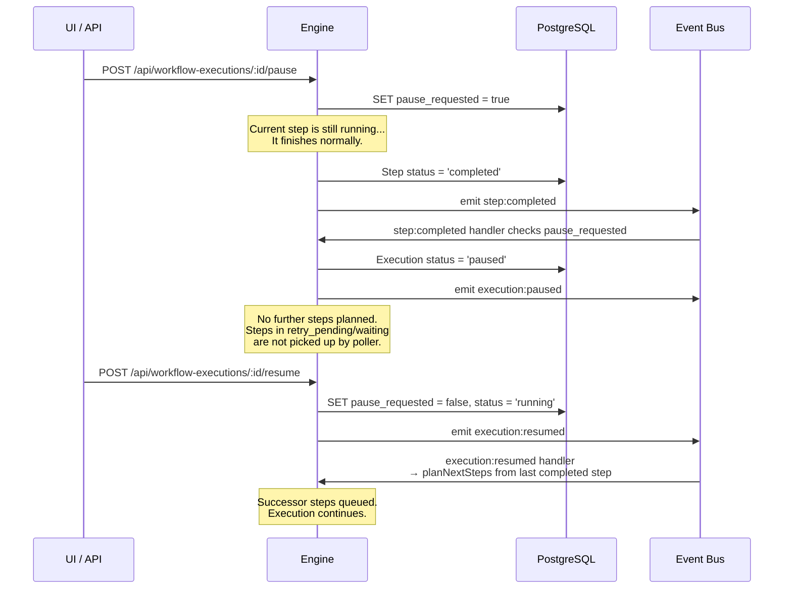

### Timed pause (auto-resume)

If `resume_after` is set, the execution auto-resumes after the timestamp passes:

```typescript
// POST /api/workflow-executions/:id/pause
// Body: { resumeAfter?: string (ISO date) }
async pauseExecution(executionId: string, resumeAfter?: Date): Promise<void> {
    await workflowExecutionRepository
        .createQueryBuilder()
        .update()
        .set({ pauseRequested: true, resumeAfter: resumeAfter ?? null })
        .where('id = :id AND status = :status', { id: executionId, status: 'running' })
        .execute();

    emitExecutionEvent('execution:pause_requested', { executionId, resumeAfter });
}
```

A periodic check (alongside the step poller) scans for paused executions whose `resume_after` has passed:

```typescript
async function checkPausedExecutions(): Promise<void> {
    const toResume = await workflowExecutionRepository
        .createQueryBuilder('we')
        .where('we.status = :status', { status: 'paused' })
        .andWhere('we.resumeAfter IS NOT NULL AND we.resumeAfter <= NOW()')
        .getMany();

    for (const exec of toResume) {
        await resumeExecution(exec.id);
    }
}
```

### Resume

```typescript
// POST /api/workflow-executions/:id/resume
async resumeExecution(executionId: string): Promise<void> {
    // Find ALL completed steps whose successors were never planned.
    // In a parallel workflow, multiple branches may have completed before
    // the pause took effect — we need to resume planning from ALL of them.
    const completedSteps = await stepExecutionRepository
        .createQueryBuilder('wse')
        .where('wse.executionId = :executionId AND wse.status = :s', {
            executionId, s: 'completed',
        })
        .andWhere('wse.parentStepExecutionId IS NULL')
        .getMany();

    await workflowExecutionRepository
        .createQueryBuilder()
        .update()
        .set({ pauseRequested: false, resumeAfter: null, status: 'running' })
        .where('id = :id AND status = :status', { id: executionId, status: 'paused' })
        .execute();

    // Resume planning from every completed step — planNextSteps is idempotent
    // (ON CONFLICT DO NOTHING), so calling it multiple times is safe.
    const workflow = await loadWorkflowForExecution(executionId);
    const graph = new WorkflowGraph(workflow.graph as WorkflowGraphData);
    for (const step of completedSteps) {
        await planNextSteps(executionId, step.stepId, step.output, graph);
    }

    emitExecutionEvent('execution:resumed', { executionId });
}
```

### Queue poller integration

The queue poller already filters out steps from paused executions (see [Queue Polling](#queue-polling)):

```sql
-- Added to the poll query WHERE clause:
AND we.pause_requested = false
AND we.cancel_requested = false
```

This means steps in `retry_pending`, `waiting`, or `queued` status are simply not picked up while the execution is paused. They remain in their current status and are picked up once the execution is resumed and `pause_requested` is reset to `false`.

### API endpoints

| Endpoint | Method | Description |
|----------|--------|-------------|
| `/api/workflow-executions/:id/pause` | POST | Pause a running execution. Optional `{ resumeAfter: ISO date }` for timed pause. |
| `/api/workflow-executions/:id/resume` | POST | Resume a paused execution. Plans successors from last completed step. |

### UI integration

The execution inspector shows:
- **Running executions**: "Pause" button
- **Paused executions**: "Resume" button + optional countdown if `resume_after` is set
- **Paused with resume_after**: "Paused — resumes in 3m 42s" with option to resume immediately

---

## Sleep and Wait

Steps can pause execution using two APIs:

| API | Use Case | Example |
|-----|----------|---------|
| `ctx.sleep(ms)` | Wait a relative duration | `await ctx.sleep(5 * 60 * 1000)` — wait 5 minutes |
| `ctx.waitUntil(date)` | Wait until a specific date/time | `await ctx.waitUntil(new Date('2024-12-25'))` |

### How it works: child steps (not graph splitting)

When a step calls `sleep()` or `waitUntil()`, the engine does NOT keep the process alive and does NOT modify the workflow graph. Instead, it uses the same **child step execution** mechanism as fan-out:

1. The transpiler splits the step function at the `sleep()` call into two functions: **before-sleep** (returns intermediate state) and **after-sleep** (receives intermediate state as input)
2. At runtime, the **before-sleep** function executes and returns intermediate results
3. `ctx.sleep()` throws `SleepRequestedError` with the intermediate results attached
4. The engine catches it, saves the intermediate results as the parent step's output, marks parent as `waiting`
5. A **child step execution** is created with `parent_step_execution_id` set, `status = 'waiting'`, `wait_until` timestamp, and `input = intermediateResults`
6. Process freed — no memory held
7. When `wait_until` passes, the queue poller picks up the child step
8. The **after-sleep** function executes with the intermediate results as input
9. Child completes → event handler detects `parent_step_execution_id` → marks parent as `completed` with child's output
10. Parent completion triggers `planNextSteps` for the parent's successors in the graph

### How intermediate state is preserved across sleep

The transpiler splits the step at the `sleep()` call point. Work done before the sleep is NOT lost — it's captured and passed to the continuation:

```typescript
// Original step code:
const x = await fetch('https://api.example.com').then(r => r.json());
await ctx.sleep(5000);
return { data: x, processedAt: Date.now() };

// Transpiled into TWO functions:
// Before-sleep function (returns intermediate state)
exports.step_abc123 = async function(ctx) {
    const x = await fetch('https://api.example.com').then(r => r.json());
    // Return intermediate state — this becomes the parent step's output
    // and the child step's input
    return { __intermediate: { x } };
};

// After-sleep continuation function
exports.step_abc123_cont_1 = async function(ctx) {
    // Intermediate state restored from input
    const { x } = ctx.input.__intermediate;
    return { data: x, processedAt: Date.now() };
};
```

The `SleepRequestedError` mechanism is the runtime fallback — the transpiler does the actual splitting at save time. The intermediate state flows: before-sleep output → parent step output → child step input → after-sleep function receives it.

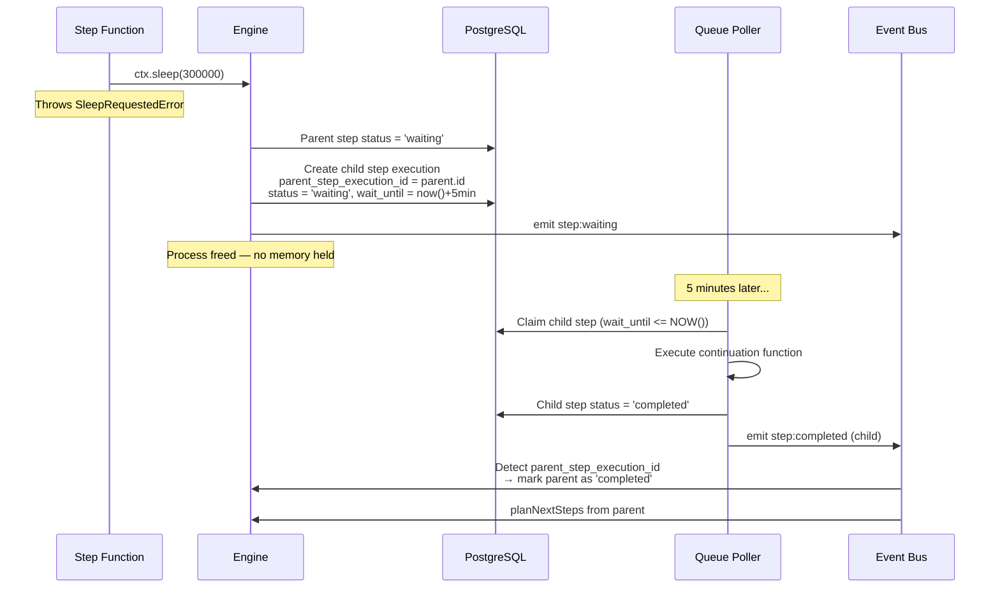

### Why child steps instead of graph splitting

The alternative (splitting the step function into sibling nodes in the graph) is more complex:
- The graph would need to be modified at runtime (new nodes for continuations)
- Execution completion logic would need to know about synthetic graph nodes
- The parent step's identity is lost — it becomes two separate steps
- Metrics are harder: the "step duration" is split across multiple graph nodes

With child steps:
- The **graph stays unchanged** — the parent step is still one node
- The parent step's **identity is preserved** — the UI shows "Step X (waiting)" with a child underneath
- **Metrics work naturally**: parent step duration = started_at to completed_at (includes wait time), child step duration = just the continuation execution time
- **Retry is clear**: you can retry the child step independently (e.g., if the continuation fails after the wait)
- **Consistent with fan-out**: same `parent_step_execution_id` pattern, same event handling
- **Execution status is correct**: parent step is non-terminal (`waiting`), so the execution stays `running`

### What the UI shows

```
Execution Timeline:
├── ✅ Trigger (0ms)
├── ✅ fetch-data (230ms)
├── ⏳ process-and-wait (waiting — resumes in 4m32s)
│   └── ⏳ sleep continuation (waiting — 4m32s remaining)
├── ⬚ send-results (pending — waiting for process-and-wait)
```

After the sleep completes:

```
├── ✅ process-and-wait (5m + 45ms compute)
│   └── ✅ sleep continuation (45ms)
├── ✅ send-results (120ms)
```

---

## Approval Steps

Approval is a **special step type** tied to the step execution record.

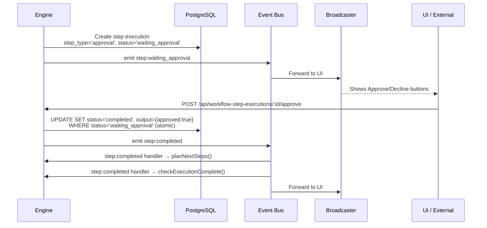

The approval endpoint just updates the step to `completed` and emits the `step:completed` event. The event handlers take care of planning next steps and checking execution completion — same as any other step completion. No special logic needed.

The `WHERE status = 'waiting_approval'` clause ensures idempotency — a second approval attempt gets 409 Conflict.

---

## Webhook System

Webhook support is intentionally simple — just enough to test the engine.

### Registration
- **Activate workflow**: Insert `webhook` records from trigger config
- **Deactivate workflow**: Delete `webhook` records

### Response Modes

All four modes are supported and tested:

| Mode | Behavior |
|------|----------|
| `lastNode` | Wait for completion, return last step's output (default) |
| `respondImmediately` | Return 202 Accepted, continue in background |
| `respondWithNode` | Wait for `ctx.respondToWebhook()` call |
| `allData` | Wait for completion, return all step outputs |

---

## Streaming

Steps can stream data via `ctx.sendChunk(data)`. Chunks are delivered in real-time via the broadcaster. NOT persisted to DB — the step's final `output` is what matters.

---

## Multi-Item Processing (Fan-Out / Fan-In)

When a step needs to process multiple items independently, child step executions are created with `parent_step_execution_id`. Each child is an independent queue job. When all children complete, outputs are merged.

> **Phase 1 stretch goal**: Tests should cover: fan-out creation, concurrent child execution, fan-in merging, partial child failures, and child retry.

---

## Event Delivery and Scaling

### Phase 1: Simple In-Process Broadcasting

For the PoC, the broadcaster is a simple in-process event emitter. SSE endpoints subscribe and forward events. This works when API and workers are the same process.

### Why this doesn't scale

In multi-process/multi-node deployments, events from worker processes don't reach SSE clients connected to different API processes.

### How the current engine solves this

Three-tier relay: Worker → Bull job progress → Main process → WebSocket/SSE. Multi-main uses Redis pub/sub with `pushRef` scoping.

### Phase 2: Redis pub/sub

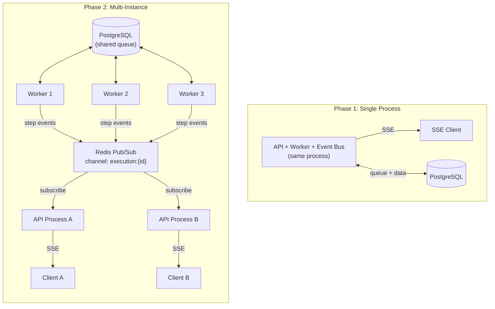

PostgreSQL handles durable state (queue, step outputs). Redis handles ephemeral event delivery (real-time push to UI). Each API process only forwards events for executions whose SSE clients it serves.

---

## AI Chat Streaming Use Case

A key test case: chat message → workflow → AI agent → streaming response to session.

```typescript
export default defineWorkflow({
    name: 'AI Chat',
    triggers: [webhook('/chat', { method: 'POST', responseMode: 'respondWithNode' })],
    async run(ctx) {
        const message = ctx.triggerData.body.message;

        const response = await ctx.step('ai-agent', async () => {
            const stream = await callAIAgent(message);
            let fullText = '';
            for await (const chunk of stream) {
                fullText += chunk.text;
                await ctx.sendChunk({ text: chunk.text });
            }
            return { fullText };
        });

        await ctx.respondToWebhook({ statusCode: 200, body: { response: response.fullText } });
    },
});
```

---

## Workflow Script Format

> **Reminder**: This format is not final. It exists to test the engine.

```typescript
import { defineWorkflow, webhook } from '@n8n/engine/sdk';

export default defineWorkflow({
    name: 'My Workflow',
    triggers: [webhook('/endpoint', { method: 'POST' })],
    async run(ctx) {
        // 'data' = return value of fetch-data step
        // The transpiler detects 'process' uses 'data' and creates edge: fetch-data → process
        const data = await ctx.step('fetch-data', async () => {
            return await fetch('https://api.example.com/data').then(r => r.json());
        });

        const processed = await ctx.step('process', async () => {
            return data.map(item => ({ ...item, processed: true }));
        }, { retry: { maxAttempts: 3, baseDelay: 1000 }, timeout: 60000 });

        if (processed.length > 100) {
            await ctx.step('alert', async () => {
                await fetch('https://slack.com/webhook', {
                    method: 'POST',
                    body: JSON.stringify({ text: `${processed.length} items` }),
                });
            });
        }
        return processed;
    },
});
```

---

## Frontend

The frontend follows n8n's existing patterns and libraries so components can be ported when integrating with the main app.

### Stack (matching n8n editor-ui)

| Concern | Library | Notes |
|---------|---------|-------|
| **Framework** | Vue 3.5 + TypeScript | `<script lang="ts" setup>` Composition API |
| **State** | Pinia | Composition API stores (`defineStore('name', () => { ... })`) |
| **Router** | Vue Router 4 | Lazy-loaded views, navigation guards |
| **Build** | Vite | Same config patterns as `packages/frontend/editor-ui/vite.config.mts` |
| **Code editor** | CodeMirror 6 | Same packages: `@codemirror/lang-javascript`, `@codemirror/lang-json`, etc. |
| **Canvas** | @vue-flow/core + @dagrejs/dagre | Same as n8n's workflow canvas |
| **Design system** | `@n8n/design-system` | Import directly — N8nButton, N8nAlert, N8nIcon, etc. |
| **CSS** | SCSS with CSS variables + CSS modules | `lang="scss" module`, `var(--color--primary)`, `useCssModule()` |
| **i18n** | vue-i18n via `@n8n/i18n` | All UI text through i18n translations |
| **Testing** | Vitest + @testing-library/vue + @pinia/testing | Same test patterns as editor-ui |
| **Utilities** | @vueuse/core, lodash, luxon, nanoid | Same utility libraries |
| **JSON display** | vue-json-pretty | For step output inspection |

### Component patterns

Follow the same conventions as `packages/frontend/editor-ui/src/`:

```vue
<script lang="ts" setup>
import { computed, ref, useCssModule } from 'vue';
import { useI18n } from 'vue-i18n';
import { N8nButton, N8nAlert } from '@n8n/design-system';
import { useExecutionStore } from '@/stores/execution.store';

const props = withDefaults(defineProps<{
    executionId: string;
    compact?: boolean;
}>(), {
    compact: false,
});

const { t } = useI18n();
const $style = useCssModule();
const executionStore = useExecutionStore();

const steps = computed(() => executionStore.getSteps(props.executionId));
</script>

<template>
    <div :class="$style.container">
        <N8nAlert v-if="error" :title="t('execution.error')" type="error" />
        <!-- ... -->
    </div>
</template>

<style lang="scss" module>
.container {
    padding: var(--spacing--sm);
    border: var(--border);
    border-radius: var(--radius--lg);
}
</style>
```

### CSS rules

- Use CSS variables from the design system (see `packages/frontend/AGENTS.md` for full reference)
- Never hardcode pixel values for spacing — use `var(--spacing--sm)`, `var(--spacing--md)`, etc.
- Use `lang="scss" module` for component styles (CSS modules, not scoped)
- Use `useCssModule()` in script setup for dynamic class binding
- Colors: `var(--color--primary)`, `var(--color--success)`, `var(--color--danger)`, etc.

### Three views

1. **Workflow List** — table using design system components, name/triggers/active/last execution
2. **Workflow Editor** — split pane:
   - Left: CodeMirror 6 with TypeScript highlighting (same packages as n8n's code node editor)
   - Right: @vue-flow/core canvas with dagre layout (same as n8n's workflow canvas)
   - Code changes → re-parse → graph updates in real-time
   - Version indicator showing current version number
3. **Execution Inspector** — step timeline:
   - Step cards: status (color-coded via CSS variables), duration, attempt count
   - Click to expand: vue-json-pretty for output, error with source-mapped line
   - "Approve" / "Decline" buttons (N8nButton) for `waiting_approval` steps
   - "Re-run from here" and "Execute only this step" buttons
   - Streaming chunk display for AI chat steps
   - Version badge: shows which workflow version was used, with link to view that version's code/graph
   - Timing display: "Total: 45s (compute: 3s, waiting: 42s)"

---

## CLI

```bash
engine execute <workflow-id> [--input '{}'] [--watch] [--version <n>]
engine run <file.ts> [--input '{}']
engine watch <execution-id>
engine list [--workflow <id>] [--status <status>]
engine inspect <execution-id>
engine bench <file.ts> --iterations 100
```

---

## API Contracts

Key request/response shapes for the REST API.

### Workflows

```
POST   /api/workflows                    → Create workflow
PUT    /api/workflows/:id                → Save (creates new version)
GET    /api/workflows/:id                → Get latest version
GET    /api/workflows/:id?version=N      → Get specific version
GET    /api/workflows/:id/versions       → List all versions (id, version, createdAt)
DELETE /api/workflows/:id                → Soft-delete (sets deleted_at)
POST   /api/workflows/:id/activate       → Register webhooks, mark active
POST   /api/workflows/:id/deactivate     → Remove webhooks, mark inactive
```

**Save workflow** (`PUT /api/workflows/:id`):
```typescript
// Request
{ name: string, code: string, triggers: TriggerConfig[], settings: WorkflowSettings }

// Response 200 (success)
{ id: string, version: number, graph: WorkflowGraph, active: boolean }

// Response 422 (compilation errors)
{ errors: Array<{ message: string, line: number, column: number, severity: 'error' | 'warning' }> }
```

### Executions

```
POST   /api/workflow-executions                      → Start execution
GET    /api/workflow-executions                      → List executions (filter by workflowId, status)
GET    /api/workflow-executions/:id                   → Get execution status + result
GET    /api/workflow-executions/:id/steps             → Get all step executions
GET    /api/workflow-executions/:id/stream             → SSE event stream
POST   /api/workflow-executions/:id/cancel            → Cancel execution
POST   /api/workflow-executions/:id/pause             → Pause execution
POST   /api/workflow-executions/:id/resume            → Resume execution
DELETE /api/workflow-executions/:id                   → Delete execution (cascade to steps)
POST   /api/workflow-executions/:id/rerun-from/:stepId → Re-run from a specific step
POST   /api/workflow-executions/:id/run-step/:stepId   → Execute only a single step
```

**Start execution** (`POST /api/workflow-executions`):
```typescript
// Request
{ workflowId: string, triggerData?: unknown, mode?: 'production' | 'manual' | 'test', version?: number }

// Response 201
{ executionId: string, status: 'running' }
```

**Get execution** (`GET /api/workflow-executions/:id`):
```typescript
// Response 200
{
    id: string,
    workflowId: string,
    workflowVersion: number,
    status: 'running' | 'completed' | 'failed' | 'cancelled' | 'waiting' | 'paused',
    result: unknown | null,
    error: ErrorData | null,
    cancelRequested: boolean,
    pauseRequested: boolean,
    resumeAfter: string | null,  // ISO date
    startedAt: string,
    completedAt: string | null,
    durationMs: number | null,
    computeMs: number | null,
    waitMs: number | null,
}
```

**Pause execution** (`POST /api/workflow-executions/:id/pause`):
```typescript
// Request (optional timed pause)
{ resumeAfter?: string }  // ISO date

// Response 200
{ status: 'paused', resumeAfter: string | null }

// Response 409 (not running)
{ error: 'Execution is not running' }
```

### Step Executions

```
GET    /api/workflow-step-executions/:id              → Get step details
POST   /api/workflow-step-executions/:id/approve      → Approve/decline
```

**Get step execution** (`GET /api/workflow-step-executions/:id`):
```typescript
// Response 200
{
    id: string,
    executionId: string,
    stepId: string,
    stepType: 'trigger' | 'step' | 'approval' | 'condition',
    status: string,      // See terminal/non-terminal statuses
    input: unknown | null,
    output: unknown | null,
    error: ErrorData | null,
    attempt: number,
    parentStepExecutionId: string | null,
    startedAt: string | null,
    completedAt: string | null,
    durationMs: number | null,
}
```

**Approve step** (`POST /api/workflow-step-executions/:id/approve`):
```typescript
// Request
{ approved: boolean }

// Response 200
{ status: 'completed', output: { approved: boolean } }

// Response 409 (already processed)
{ error: 'Approval already processed or step not waiting' }
```

### SSE Events

`GET /api/workflow-executions/:id/stream` returns an SSE stream with these event types:

```typescript
type SSEEvent =
    | { type: 'step:started', stepId: string, attempt: number }
    | { type: 'step:completed', stepId: string, output: unknown, durationMs: number }
    | { type: 'step:failed', stepId: string, error: ErrorData }
    | { type: 'step:retrying', stepId: string, attempt: number, retryAfter: string, error: ErrorData }
    // retryAfter is ISO date string (the DB stores TIMESTAMPTZ, emitted as ISO string)
    | { type: 'step:waiting', stepId: string }
    | { type: 'step:waiting_approval', stepId: string }
    | { type: 'step:cancelled', stepId: string }
    | { type: 'step:chunk', stepId: string, data: unknown, timestamp: number }
    | { type: 'execution:started', executionId: string }
    | { type: 'execution:completed', result: unknown }
    | { type: 'execution:failed', error: ErrorData }
    | { type: 'execution:cancelled' }
    | { type: 'execution:paused', lastCompletedStepId: string }
    | { type: 'execution:resumed', lastCompletedStepId: string }
    | { type: 'execution:cancel_requested' }
    | { type: 'execution:pause_requested', resumeAfter?: string }
    | { type: 'webhook:respond', statusCode: number, body: unknown, headers?: Record<string, string> };
```

---

## Example Workflows

13 examples in `examples/`. Each tests a specific engine capability.

> **Naming convention**: Examples are numbered by complexity (`01-` through `17-`). Step names are descriptive (3-5 words) since they appear on the canvas. Examples include realistic timing delays to simulate real work (except the webhook echo which has no delays for performance testing). New examples added during implementation: `14-reference-error.ts`, `15-retriable-error.ts`, `16-pausable-workflow.ts`, `17-streaming-webhook.ts`.

#### 1. `hello-world.ts` — Basic manual trigger, 2 steps

```typescript
import { defineWorkflow } from '@n8n/engine/sdk';

export default defineWorkflow({
    name: 'Hello World',
    triggers: [],  // Manual trigger is implicit — every workflow can be triggered manually
    async run(ctx) {
        const greeting = await ctx.step('greet', async () => {
            return { message: 'Hello from Engine v2!', timestamp: Date.now() };
        });

        const result = await ctx.step('format', async () => {
            return { formatted: `${greeting.message} (at ${new Date(greeting.timestamp).toISOString()})` };
        });

        return result;
    },
});
```

#### 2. `webhook-echo.ts` — Webhook trigger with input data

```typescript
import { defineWorkflow, webhook } from '@n8n/engine/sdk';

// Test each response mode by changing the second argument:
// 'lastNode' | 'respondImmediately' | 'respondWithNode' | 'allData'
export default defineWorkflow({
    name: 'Webhook Echo',
    triggers: [webhook('/echo', { method: 'POST', responseMode: 'respondWithNode' })],
    async run(ctx) {
        // ctx.triggerData contains the full HTTP request:
        // { body, headers, query, method, path }
        const { body, headers, query } = ctx.triggerData;

        const validated = await ctx.step('validate-input', async () => {
            if (!body.message) {
                throw new Error('Missing required field: message');
            }
            return {
                message: body.message,
                sender: headers['x-sender'] ?? 'anonymous',
                urgent: query.urgent === 'true',
            };
        });

        const processed = await ctx.step('process', async () => {
            return {
                echo: validated.message.toUpperCase(),
                sender: validated.sender,
                urgent: validated.urgent,
                processedAt: Date.now(),
            };
        });

        // Respond to the webhook caller with the processed data
        await ctx.respondToWebhook({
            statusCode: 200,
            headers: { 'X-Processed-By': 'n8n-engine' },
            body: processed,
        });
    },
});
// Usage: curl -X POST http://localhost:3000/webhook/echo \
//   -H 'Content-Type: application/json' \
//   -H 'X-Sender: alice' \
//   -d '{"message": "hello"}' \
//   '?urgent=true'
```

#### 3. `conditional-logic.ts` — If/else branching

```typescript
import { defineWorkflow } from '@n8n/engine/sdk';

export default defineWorkflow({
    name: 'Conditional Logic',
    triggers: [],  // Manual trigger is implicit — every workflow can be triggered manually
    async run(ctx) {
        const data = await ctx.step('fetch', async () => {
            return { amount: Math.random() * 200, currency: 'USD' };
        });

        if (data.amount > 100) {
            await ctx.step('high-value-alert', async () => {
                return { alert: true, message: `High value: ${data.amount} ${data.currency}` };
            });
        } else {
            await ctx.step('log-normal', async () => {
                return { alert: false, message: `Normal: ${data.amount} ${data.currency}` };
            });
        }

        return data;
    },
});
```

#### 4. `retry-backoff.ts` — Retry with exponential backoff

```typescript
import { defineWorkflow } from '@n8n/engine/sdk';

export default defineWorkflow({
    name: 'Retry with Backoff',
    triggers: [],  // Manual trigger is implicit — every workflow can be triggered manually
    async run(ctx) {
        const result = await ctx.step('flaky-api-call', async () => {
            // Simulate a flaky API that fails 70% of the time
            if (Math.random() < 0.7) {
                throw new Error('Service temporarily unavailable');
            }
            return { success: true, data: 'API response' };
        }, {
            retry: { maxAttempts: 5, baseDelay: 1000, maxDelay: 30000, jitter: true },
            timeout: 10000,
        });

        return result;
    },
});
```

#### 5. `approval-flow.ts` — Human-in-the-loop approval

```typescript
import { defineWorkflow } from '@n8n/engine/sdk';

export default defineWorkflow({
    name: 'Approval Flow',
    triggers: [],  // Manual trigger is implicit — every workflow can be triggered manually
    async run(ctx) {
        const request = await ctx.step('prepare-request', async () => {
            return { type: 'expense', amount: 5000, description: 'Conference tickets' };
        });

        const approval = await ctx.step('manager-approval', async () => {
            // Engine detects this as an approval step and pauses
            return { requiresApproval: true, message: `Approve expense: $${request.amount}?` };
        }, { stepType: 'approval' });

        if (approval.approved) {
            await ctx.step('process-payment', async () => {
                return { paid: true, reference: `PAY-${Date.now()}` };
            });
        } else {
            await ctx.step('notify-rejection', async () => {
                return { rejected: true, reason: 'Manager declined' };
            });
        }
    },
});
```

#### 6. `streaming-output.ts` — Simulated streaming with `ctx.sendChunk()`

```typescript
import { defineWorkflow } from '@n8n/engine/sdk';

export default defineWorkflow({
    name: 'Streaming Output',
    triggers: [],  // Manual trigger is implicit — every workflow can be triggered manually
    async run(ctx) {
        const result = await ctx.step('generate-stream', async () => {
            const words = ['Hello', ' ', 'world', ',', ' ', 'this', ' ', 'is', ' ', 'streaming', '!'];
            let fullText = '';

            for (const word of words) {
                fullText += word;
                await ctx.sendChunk({ text: word, index: words.indexOf(word) });
                // Simulate delay between chunks
                await new Promise(resolve => setTimeout(resolve, 100));
            }

            return { fullText, totalChunks: words.length };
        });

        return result;
    },
});
```

#### 7. `error-handling.ts` — Retriable vs non-retriable errors

```typescript
import { defineWorkflow } from '@n8n/engine/sdk';

export default defineWorkflow({
    name: 'Error Handling',
    triggers: [],  // Manual trigger is implicit — every workflow can be triggered manually
    async run(ctx) {
        // This step throws a retriable error (network timeout) — engine retries
        const apiResult = await ctx.step('api-with-retry', async () => {
            const res = await fetch('https://httpstat.us/503');
            if (!res.ok) throw new Error(`HTTP ${res.status}`);
            return res.json();
        }, {
            retry: { maxAttempts: 3, baseDelay: 500 },
        });

        // This step throws a non-retriable error (code bug) — engine fails immediately
        const transformed = await ctx.step('transform', async () => {
            // TypeError: cannot read property of undefined — non-retriable
            const value = (undefined as any).property;
            return value;
        });

        return transformed;
    },
});
```

#### 8. `data-pipeline.ts` — 10+ steps for benchmarking

```typescript
import { defineWorkflow } from '@n8n/engine/sdk';

export default defineWorkflow({
    name: 'Data Pipeline (10 steps)',
    triggers: [],  // Manual trigger is implicit — every workflow can be triggered manually
    async run(ctx) {
        const raw = await ctx.step('generate', async () => {
            return Array.from({ length: 100 }, (_, i) => ({ id: i, value: Math.random() }));
        });

        const filtered = await ctx.step('filter', async () => {
            return raw.filter(item => item.value > 0.5);
        });

        const mapped = await ctx.step('map', async () => {
            return filtered.map(item => ({ ...item, doubled: item.value * 2 }));
        });

        const sorted = await ctx.step('sort', async () => {
            return [...mapped].sort((a, b) => b.doubled - a.doubled);
        });

        const top10 = await ctx.step('slice', async () => {
            return sorted.slice(0, 10);
        });

        const enriched = await ctx.step('enrich', async () => {
            return top10.map(item => ({ ...item, rank: top10.indexOf(item) + 1 }));
        });

        const formatted = await ctx.step('format', async () => {
            return enriched.map(item => `#${item.rank}: id=${item.id} value=${item.doubled.toFixed(3)}`);
        });

        const joined = await ctx.step('join', async () => {
            return { report: formatted.join('\n'), count: formatted.length };
        });

        const validated = await ctx.step('validate', async () => {
            if (joined.count === 0) throw new Error('Empty report');
            return { valid: true, ...joined };
        });

        const final = await ctx.step('finalize', async () => {
            return { ...validated, completedAt: Date.now() };
        });

        return final;
    },
});
```

#### 9. `parallel-steps.ts` — Parallel branches that merge

```typescript
import { defineWorkflow } from '@n8n/engine/sdk';

export default defineWorkflow({
    name: 'Parallel Steps',
    triggers: [],  // Manual trigger is implicit — every workflow can be triggered manually
    async run(ctx) {
        const input = await ctx.step('prepare', async () => {
            return { query: 'n8n automation', timestamp: Date.now() };
        });

        // These two steps have no dependency on each other — engine runs them in parallel
        const [apiResult, dbResult] = await Promise.all([
            ctx.step('call-api', async () => {
                return { source: 'api', results: ['result-1', 'result-2'] };
            }),
            ctx.step('query-db', async () => {
                return { source: 'db', results: ['record-a', 'record-b', 'record-c'] };
            }),
        ]);

        // This step depends on both parallel steps — runs after both complete
        const merged = await ctx.step('merge-results', async () => {
            return {
                query: input.query,
                totalResults: apiResult.results.length + dbResult.results.length,
                combined: [...apiResult.results, ...dbResult.results],
            };
        });

        return merged;
    },
});
```

#### 10. `ai-chat-streaming.ts` — AI agent with streaming response

```typescript
import { defineWorkflow, webhook } from '@n8n/engine/sdk';

export default defineWorkflow({
    name: 'AI Chat',
    triggers: [webhook('/chat', { method: 'POST', responseMode: 'respondWithNode' })],
    async run(ctx) {
        const message = ctx.triggerData.body.message;

        const response = await ctx.step('ai-agent', async () => {
            // Simulate AI streaming response
            const words = `I'll help you with: ${message}`.split(' ');
            let fullText = '';

            for (const word of words) {
                fullText += (fullText ? ' ' : '') + word;
                await ctx.sendChunk({ text: word + ' ' });
                await new Promise(resolve => setTimeout(resolve, 50));
            }

            return { fullText };
        });

        await ctx.respondToWebhook({
            statusCode: 200,
            body: { response: response.fullText },
        });
    },
});
```

#### 11. `sleep-and-resume.ts` — Sleep between steps

```typescript
import { defineWorkflow } from '@n8n/engine/sdk';

export default defineWorkflow({
    name: 'Sleep and Resume',
    triggers: [],  // Manual trigger is implicit — every workflow can be triggered manually
    async run(ctx) {
        const before = await ctx.step('before-sleep', async () => {
            return { timestamp: Date.now(), message: 'about to sleep' };
        });

        // Sleep for 5 seconds — process is freed, child step created
        await ctx.sleep(5000);

        const after = await ctx.step('after-sleep', async () => {
            return {
                resumedAt: Date.now(),
                sleptFor: Date.now() - before.timestamp,
                originalMessage: before.message,
            };
        });

        return after;
    },
});
```

**What to verify:**
- When `ctx.sleep(5000)` is hit, the parent step is marked `waiting`
- A child step execution is created with `wait_until = now + 5s`
- No process is held during the wait
- After 5s, child completes → parent completes → `after-sleep` runs
- `sleptFor` >= 5000ms

#### 12. `multi-wait-pipeline.ts` — Multiple sleeps with data passing

```typescript
import { defineWorkflow } from '@n8n/engine/sdk';

export default defineWorkflow({
    name: 'Multi-Wait Pipeline',
    triggers: [],  // Manual trigger is implicit — every workflow can be triggered manually
    async run(ctx) {
        const batch = await ctx.step('fetch-batch', async () => {
            return { items: [1, 2, 3], fetchedAt: Date.now() };
        });

        const processed = await ctx.step('process-batch', async () => {
            return { result: batch.items.map(i => i * 10), processedAt: Date.now() };
        });

        // Wait 3 seconds (rate limit cooldown)
        await ctx.sleep(3000);

        const sent = await ctx.step('send-results', async () => {
            return { sent: true, sentAt: Date.now(), data: processed.result };
        });

        // Wait until a specific time
        await ctx.waitUntil(new Date(Date.now() + 5000));

        const verified = await ctx.step('verify-delivery', async () => {
            return {
                verified: true,
                verifiedAt: Date.now(),
                totalDuration: Date.now() - batch.fetchedAt,
                sentData: sent.data,
            };
        });

        return verified;
    },
});
```

**What to verify:**
- Two wait points both create child steps
- Data flows across both waits
- `totalDuration` >= 8000ms (3s + 5s)
- Both `ctx.sleep(ms)` and `ctx.waitUntil(date)` work

#### 13. `helper-functions.ts` — Steps using local helper functions

```typescript
import { defineWorkflow } from '@n8n/engine/sdk';

// Helper functions — defined outside run(), available to all steps
function slugify(text: string): string {
    return text.toLowerCase().replace(/\s+/g, '-').replace(/[^a-z0-9-]/g, '');
}

function buildUrl(base: string, path: string, params: Record<string, string>): string {
    const query = new URLSearchParams(params).toString();
    return `${base}/${path}${query ? '?' + query : ''}`;
}

interface Product {
    name: string;
    price: number;
    category: string;
}

function categorize(products: Product[]): Record<string, Product[]> {
    return products.reduce((acc, p) => {
        const key = slugify(p.category); // Helper calling another helper
        acc[key] = acc[key] || [];
        acc[key].push(p);
        return acc;
    }, {} as Record<string, Product[]>);
}

export default defineWorkflow({
    name: 'Helper Functions Demo',
    triggers: [],
    async run(ctx) {
        const products = await ctx.step('fetch-products', async () => {
            const url = buildUrl('https://api.example.com', 'products', { limit: '100' });
            const res = await fetch(url);
            return res.json() as Promise<Product[]>;
        });

        const organized = await ctx.step('organize', async () => {
            return categorize(products);
        });

        const report = await ctx.step('build-report', async () => {
            return Object.entries(organized).map(([category, items]) => ({
                category,
                slug: slugify(category),
                count: items.length,
                totalValue: items.reduce((sum, p) => sum + p.price, 0),
            }));
        });

        return report;
    },
});
```

**What to verify:**
- `buildUrl` helper is available in `fetch-products` step
- `categorize` helper (which calls `slugify`) is available in `organize` step
- `slugify` is available in `build-report` step
- Transitive dependency: `categorize → slugify` both included even if step only references `categorize`
- Helper functions are compiled at module level, not duplicated per step
- Type interface `Product` is available in compiled code

### Sleep/wait test scenarios (engine tests)

These are the vitest test cases for the engine's sleep/wait behavior:

```
Sleep — Basic mechanics:
✓ ctx.sleep() throws SleepRequestedError caught by processStep
✓ parent step status changes to 'waiting' (not 'completed' or 'failed')
✓ child step execution is created with correct wait_until timestamp
✓ child step has parent_step_execution_id pointing to parent
✓ child step status is 'waiting'
✓ no process/memory held during the wait period
✓ queue poller picks up child step after wait_until passes
✓ queue poller does NOT pick up child step before wait_until

Sleep — Child step completion:
✓ child step completion marks parent step as 'completed'
✓ parent step output = child step output
✓ parent step completed event triggers planNextSteps for parent's successors
✓ successor steps receive the parent's output (not the child's directly)

Sleep — Data flow:
✓ child step input includes the parent step's input (predecessor outputs)
✓ steps after the sleep can access data from steps before the sleep
✓ multiple sleeps in sequence: data flows through all of them

waitUntil — Specific date:
✓ ctx.waitUntil(date) creates child step with wait_until = the exact date
✓ works with dates in the future (minutes, hours, days)
✓ if date is in the past, child step is immediately picked up

Sleep — Error handling:
✓ if child step execution fails, parent step is also marked as failed
✓ failed parent step triggers checkExecutionComplete
✓ child step failure is retriable (based on error classification)
✓ child step retry creates new attempt with fresh wait_until

Sleep — Cancellation:
✓ cancelling execution while parent step is 'waiting' cancels the child step
✓ cancelled child step causes parent step to be cancelled
✓ no successor steps are planned after cancellation

Sleep — Crash recovery:
✓ if process crashes while child step is 'waiting', child stays in DB
✓ on restart, queue poller picks up child step after wait_until
✓ parent step is still 'waiting' after restart — no stuck state

Sleep — Execution status:
✓ execution stays 'running' while any step is 'waiting'
✓ execution only completes when all steps (including parents of sleeping children) are terminal
✓ execution metrics: wait time is calculated from waiting steps
```

### Cancellation test scenarios

```
Cancellation — Between steps:
✓ cancel_requested checked before step starts executing
✓ step in 'queued' status is not picked up when execution is cancelled
✓ step in 'retry_pending' status is not picked up when execution is cancelled
✓ step in 'waiting' (sleep) status is not picked up when execution is cancelled
✓ currently running step completes normally, next step is not planned
✓ execution status changes to 'cancelled' after all steps are terminal
✓ execution:cancelled event is emitted

Cancellation — During approval:
✓ step in 'waiting_approval' is not picked up after cancel
✓ attempting to approve a step on a cancelled execution returns 409

Cancellation — With parallel branches:
✓ cancel during parallel execution: all branches stop at next step boundary
✓ already-completed branch steps retain their output
```

### Pause/resume test scenarios

```
Pause — Basic:
✓ pause_requested checked in step:completed handler before planNextSteps
✓ current in-flight step completes normally
✓ no successor steps are planned while paused
✓ execution status changes to 'paused'
✓ execution:paused event is emitted
✓ steps in 'queued' are not picked up by poller (poller filters pause_requested)
✓ steps in 'retry_pending' are not picked up while paused
✓ steps in 'waiting' (sleep) are not picked up while paused

Resume:
✓ resume sets pause_requested=false, status='running'
✓ execution:resumed event is emitted
✓ execution:resumed handler calls planNextSteps from last completed step
✓ successor steps are queued and picked up normally
✓ previously paused retry_pending/waiting steps resume when poller runs

Timed pause:
✓ pause with resumeAfter creates execution with resume_after timestamp
✓ checkPausedExecutions picks up executions with resume_after <= NOW()
✓ auto-resumed execution continues from last completed step
✓ user can resume manually before resume_after (clears resume_after)

Pause edge cases:
✓ pausing an already-paused execution is idempotent
✓ resuming a non-paused execution returns error
✓ pausing a completed/failed execution returns error
```

### Retry test scenarios

```
Retry — Basic mechanics:
✓ retriable error + retries remaining → status = 'retry_pending'
✓ retry_after timestamp calculated with exponential backoff
✓ attempt counter incremented on each retry
✓ poller picks up retry_pending step after retry_after passes
✓ poller does NOT pick up retry_pending step before retry_after
✓ successful retry sets status = 'completed' with output
✓ step:retrying event emitted with delay and error info

Retry — Exhaustion:
✓ retries exhausted → status = 'failed'
✓ execution marked as 'failed' when step retries are exhausted
✓ step:failed event emitted
✓ all retry attempts recorded (attempt counter reflects total tries)

Retry — Error classification:
✓ TypeError → non-retriable → immediate failure (no retry)
✓ ReferenceError → non-retriable → immediate failure
✓ SyntaxError → non-retriable → immediate failure
✓ HTTP 429 → retriable
✓ HTTP 503 → retriable
✓ HTTP 401 → non-retriable
✓ HTTP 400 → non-retriable
✓ ETIMEDOUT → retriable
✓ ECONNRESET → retriable
✓ StepTimeoutError → retriable only if retryOnTimeout=true
✓ unknown error → retriable (default)

Retry — Backoff:
✓ exponential backoff: attempt 1 → baseDelay, attempt 2 → baseDelay*2, etc.
✓ backoff capped at maxDelay
✓ jitter adds randomness when jitter=true
✓ no jitter when jitter=false

Retry — Crash recovery:
✓ process crash during retry wait → step stays retry_pending in DB
✓ on restart, poller picks up retry_pending step after retry_after
```

### Approval test scenarios

```
Approval — Basic flow:
✓ approval step created with step_type='approval', status='waiting_approval'
✓ step:waiting_approval event emitted
✓ POST /approve with {approved: true} → status='completed', output={approved:true}
✓ POST /approve with {approved: false} → status='completed', output={approved:false}
✓ step:completed event emitted after approval
✓ successor steps planned based on approval output

Approval — Idempotency:
✓ second approval attempt on already-resolved step → 409 Conflict
✓ approval on non-waiting_approval step → 409 Conflict

Approval — Cancellation interaction:
✓ cancelling execution while step is waiting_approval → step not approvable
✓ pausing execution while step is waiting_approval → approval still works (pause only affects planning)

Approval — Crash recovery:
✓ process crash while step is waiting_approval → step stays in DB
✓ approval after restart works normally
```

### Parallel merge test scenarios

```
Parallel — Basic:
✓ two steps with no dependency on each other are both queued
✓ both steps can execute concurrently (claimed by poller in same cycle)
✓ merge step (depends on both) is NOT queued until both complete
✓ when first branch completes, merge step is not queued (other branch pending)
✓ when second branch completes, merge step IS queued with both outputs as input
✓ merge step receives input = { branchA: outputA, branchB: outputB }

Parallel — Failure (fail fast):
✓ if branch A fails, execution is marked 'failed'
✓ branch B's queued steps are not picked up (execution is failed)
✓ merge step is never queued

Parallel — Three-way merge:
✓ step depending on 3 predecessors: only queued when all 3 complete
✓ input contains all 3 predecessors' outputs
```

### Webhook test scenarios

```
Webhook — Response modes:
✓ lastNode: webhook waits for execution to complete, returns last step output
✓ respondImmediately: webhook returns 202 immediately, execution continues
✓ respondWithNode: webhook waits for ctx.respondToWebhook(), returns that response
✓ allData: webhook waits for completion, returns all step outputs
✓ unregistered path → 404
✓ wrong HTTP method → 404

Webhook — Input data:
✓ trigger step output contains { body, headers, query, method, path }
✓ first step receives trigger data as predecessor input
✓ custom headers accessible via ctx.input[triggerId].headers

Webhook — Registration:
✓ activate workflow → webhook record created
✓ deactivate workflow → webhook record deleted
✓ duplicate (method, path) → 409 Conflict
```

### Streaming test scenarios

```
Streaming:
✓ ctx.sendChunk() emits step:chunk event via broadcaster
✓ multiple chunks delivered in order
✓ chunks are NOT persisted to DB
✓ step output (final result) IS persisted to DB
✓ SSE client receives chunks in real-time
✓ step completion event includes final output, not chunks
```

### Compilation error test scenarios

```
Compilation — Valid scripts:
✓ valid script → compiled_code + graph + source_map stored
✓ script with warnings → workflow saved, warnings returned in response

Compilation — Syntax and type errors:
✓ syntax error → 422 with error line/column, workflow NOT saved
✓ type error → 422 with error details

Compilation — Structural errors:
✓ duplicate step name → 422 with error
✓ empty script → 422
✓ script without defineWorkflow → 422
✓ invalid step options (unknown config key) → 422

Compilation — Dependency errors:
✓ import of uninstalled package → 422 with module name and line number
✓ import of Node.js built-in (fs, path) → compiles successfully
✓ relative import within workflow → 422 (not supported in PoC)

Compilation — Variable resolution:
✓ reference to undefined variable → 422 with variable name and line
✓ reference to step output from a step that doesn't exist → 422

Compilation — Helper functions:
✓ helper function referenced by a step → included in compiled output
✓ helper not referenced by any step → excluded (tree-shaking)
✓ transitive dependency (helper A calls helper B) → both included
✓ helper function with type interface → types stripped, function preserved
✓ helper referencing ctx or step outputs → warning (helpers should be pure)
```

### Infrastructure error test scenarios

```
Infrastructure errors:
✓ workflow not found for execution → step failed with category='infrastructure'
✓ step function not found in compiled code → step failed with StepFunctionNotFoundError
✓ graph parsing failure → step failed with infrastructure error
✓ DB unavailable during updateStepAndEmit → step stays 'running', stale recovery picks up
✓ infrastructure error emits step:failed event (not silently swallowed)
```

### Stale recovery test scenarios

```
Stale recovery:
✓ step in 'running' beyond timeout + 30s buffer → re-queued to 'queued'
✓ step in 'running' within timeout → NOT re-queued (still legitimate)
✓ re-queued step is picked up by poller and re-executed
✓ stale recovery does not touch steps in other statuses
```

### Concurrent access test scenarios

```
Concurrency:
✓ two pollers racing to claim same step → only one succeeds (SKIP LOCKED)
✓ two parallel steps completing simultaneously → successor queued exactly once (ON CONFLICT DO NOTHING)
✓ checkExecutionComplete called twice concurrently → execution finalized exactly once (CAS guard)
✓ step:started event emitted before step function begins executing
```

### Versioning test scenarios

```
Versioning:
✓ first save creates version 1
✓ subsequent save creates version 2 (new row, version 1 unchanged)
✓ GET /workflows/:id returns latest version
✓ GET /workflows/:id?version=1 returns version 1
✓ execution pins workflow_version at creation time
✓ viewing execution loads workflow at pinned version (graph + code)
✓ modifying workflow after execution start doesn't affect running execution
✓ old versions are never deleted
```

---

## Testing Strategy

| Area | Tool | DB? |
|------|------|-----|
| SDK types | vitest | No |
| Graph parser + variable analysis | vitest | No |
| Source maps | vitest | No |
| Error classification | vitest | No |
| Engine core | vitest + PostgreSQL | Yes |
| Queue | vitest + PostgreSQL | Yes |
| Fan-out / fan-in | vitest + PostgreSQL | Yes |
| Sleep/wait (child steps, timing, data flow, crash recovery) | vitest + PostgreSQL | Yes |
| Pause/resume (pause mid-execution, timed resume, poller filtering) | vitest + PostgreSQL | Yes |
| API lifecycle | vitest + supertest + PostgreSQL | Yes |
| Webhooks (4 modes) | vitest + supertest + PostgreSQL | Yes |
| AI chat streaming | vitest + supertest + PostgreSQL | Yes |
| Broadcaster | vitest | No |

---

## Gap Analysis vs Current Engine

### Included in Phase 1

| Capability | Current Engine | Engine v2 |
|-----------|---------------|-----------|
| Step-by-step progress | Lifecycle hooks + WebSocket | Event bus + broadcaster (in-process SSE) |
| Webhook triggers (4 response modes) | Full system with static/dynamic paths | Simple registration for testing |
| Manual triggers | Built-in | Implicit — every workflow can be triggered manually |
| Multiple triggers per workflow | `getTriggerNodes()` returns all | `triggers: [...]` array |
| Retry with backoff | In-process setTimeout, limited | DB-driven, configurable, crash-safe |
| Cancellation | Cooperative AbortSignal | Between-step cancellation |
| Pause / Resume | Not supported | Execution-level pause with optional timed auto-resume |
| Sleep / Wait | `putExecutionToWait(date)` + WaitTracker | `ctx.sleep(ms)` + `ctx.waitUntil(date)` via child steps |
| Execution recovery | Best-effort from event logs | Implicit from per-step persistence + stale recovery |
| Partial execution | `destinationNode` + `runNodeFilter` | Re-run from here + Execute only this step |
| AI chat streaming | ChatStreamService + sendChunk hook | `ctx.sendChunk()` → event bus → broadcaster |
| Error tracing | Stack traces in execution data | Source maps mapping to original script |
| Error classification | All errors treated same for retry | Retriable vs non-retriable error types |
| Compilation errors | N/A (JSON workflows) | Transpiler errors returned on save, shown in editor |
| Workflow versioning | Single mutable version | Immutable versions, execution pins version |

### Deferred to Phase 2+

| Capability | Notes |
|-----------|-------|
| Expression system | Not needed — native TypeScript. Transpiler converts `={{ }}` to TS. |
| Binary data | Step I/O is JSON-only. Object storage with DB reference later. |
| Credentials | `ctx.getSecret(name)` from env vars as bridge. Full system later. |
| Sub-workflows | May be achievable via fan-out. Reserved `ctx.executeWorkflow()` throws. |
| Paired items / data lineage | Can be added to step execution metadata. Low priority. |
| Error workflows | Step errors are persisted. Triggering separate workflow on failure later. |
| Workflow static data | Needed for polling triggers. Add when polling is added. |
| CRON/schedule triggers | Manual + webhook sufficient for PoC. |
| Multi-instance deployment | Redis pub/sub for event delivery across workers. |
| Within-step cancellation | AbortSignal propagation. |

### Not needed

| Capability | Why |
|-----------|-----|
| Node helpers (httpRequest, etc.) | Code-first: users import standard libraries. |
| Merge node | Native TypeScript + multi-predecessor sync handles this. |
| Execution order (v0/v1) | Graph-based planning is a clean design. |
| Node type interfaces | Single `ExecutionContext` for all steps. |

---

## Architecture Limitations and Scaling Considerations

These are **PoC limitations** — design choices made for simplicity that have known scaling paths.

| PoC Limitation | Why It's Acceptable for PoC | Scaling Path (Phase 2) |
|----------------|---------------------------|----------------------|
| **Polling latency** (50ms interval) | Aggressive polling keeps latency low. Partial index makes poll query near-instant (~20 queries/s per worker is negligible for PostgreSQL). | Adaptive polling (fast when busy, slow when idle) if needed |
| **In-process event delivery** | Single-process deployment for PoC | Redis pub/sub for multi-process; subscribe by `executionId` channel for ordering guarantees |
| **JSONB step outputs** | Works for typical payloads | Binary data stored in object storage (S3/filesystem) with JSONB reference — no JSONB overflow |
| **Hot table** (`workflow_step_execution`) | Partial index `idx_wse_queue` limits scan to active jobs | Separate queue table if write contention becomes an issue |
| **PostgreSQL-only** | No Redis dependency simplifies testing | Redis added only for event delivery, not for queue |
| **No SQLite support** | PostgreSQL required for `SELECT FOR UPDATE SKIP LOCKED` | SQLite doesn't support row-level locking; would need a different queue strategy (e.g., advisory locks or a separate queue mechanism). This is an open question. |

### Deployment mode support

| Mode | Phase 1 (PoC) | Phase 2 |
|------|--------------|---------|
| **Single process** | Fully supported | Fully supported |
| **Queue mode** (separate workers) | Not supported — event delivery is in-process | PostgreSQL queue already works with multiple pollers (SKIP LOCKED). Add Redis pub/sub for event delivery to ensure events reach the correct API process and are consumed in order. |
| **Multi-main** (HA) | Not supported | Redis pub/sub for event relay between API processes. Same pattern as current engine: publish to channel, only the process with the client connection delivers. |

**Phase 2 scales to all modes** because:
- The PostgreSQL queue is inherently multi-worker (SKIP LOCKED)
- Redis pub/sub provides ordered, scoped event delivery
- The event-driven architecture means handlers work the same regardless of where events originate

---

## Step Function Execution

How does the engine actually execute a step's function code? This section covers the full lifecycle: from workflow script → transpiled code → step function loading → variable injection → execution.

### Transpilation: Script → Isolated Step Functions

At workflow save time, the transpiler converts the workflow script into a module that exports each step as an isolated function.

#### Transpiler pipeline

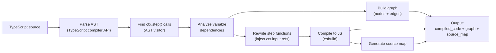

#### AST analysis: what the transpiler does

The transpiler uses TypeScript's compiler API to walk the AST. Here's the detailed process:

**Step 1: Find all `ctx.step()` calls**

The visitor looks for `CallExpression` nodes where the callee is `ctx.step`. Each call has:
- Argument 0: step name (string literal)
- Argument 1: step function (arrow function or function expression)
- Argument 2 (optional): step options object

```typescript
// AST visitor pseudo-code
function findStepCalls(sourceFile: ts.SourceFile): StepDefinition[] {
    const steps: StepDefinition[] = [];
    ts.forEachChild(sourceFile, function visit(node) {
        if (ts.isCallExpression(node) &&
            ts.isPropertyAccessExpression(node.expression) &&
            node.expression.name.text === 'step') {
            steps.push({
                name: (node.arguments[0] as ts.StringLiteral).text,
                functionBody: node.arguments[1],
                options: node.arguments[2],
                position: node.getStart(),
            });
        }
        ts.forEachChild(node, visit);
    });
    return steps;
}
```

**Step 2: Analyze variable dependencies**

For each step function, the transpiler scans its body for references to variables declared outside the function. If a variable is assigned from a `ctx.step()` call, that creates a data dependency edge.

```typescript
// For each step function body:
function findExternalReferences(stepFn: ts.Node, scope: VariableScope): Dependency[] {
    const deps: Dependency[] = [];
    ts.forEachChild(stepFn, function visit(node) {
        if (ts.isIdentifier(node)) {
            const varName = node.text;
            // Is this variable declared outside this step function?
            if (!isLocalVariable(stepFn, varName) && scope.isStepOutput(varName)) {
                deps.push({
                    variableName: varName,
                    sourceStepName: scope.getStepForVariable(varName),
                });
            }
        }
        ts.forEachChild(node, visit);
    });
    return deps;
}
```

**Step 3: Handle edge cases**

| Pattern | How it's handled |
|---------|-----------------|
| `const { a, b } = await ctx.step('x', ...)` | Destructuring: both `a` and `b` are tracked as outputs of step `x` |
| `const arr = await ctx.step('x', ...); const first = arr[0]` | `first` is a derived variable — the transpiler tracks `arr` as the dependency, not `first` |
| `let x = await ctx.step('a', ...); x = await ctx.step('b', ...)` | Reassignment: `x` after the reassignment refers to step `b`'s output, not `a`'s |
| Closure: `ctx.step('b', () => { return x; })` where `x` is from step `a` | The closure captures `x` — transpiler detects the reference and adds edge `a → b` |
| `if (cond) { await ctx.step('a', ...) } else { await ctx.step('b', ...) }` | Conditional: both `a` and `b` are graph nodes with conditional edges from the parent |
| `for (const item of items) { await ctx.step('x', ...) }` | Loop: step `x` is called multiple times — transpiler wraps as fan-out if items is from a predecessor |
| Constants: `const API_URL = 'https://...'` | Non-step constants are inlined into each step function at transpile time |
| Helper functions: `function transform(data) { ... }` | Local functions referenced by steps are included in the compiled output (see below) |

**Step 3b: Handle local helper functions**

Scripts can define helper functions in the same file that are called from within steps. The transpiler must include these functions in the compiled output so they're available when a step executes:

```typescript
// Original script with helper functions
import { defineWorkflow } from '@n8n/engine/sdk';

// Helper function — defined outside any step
function formatCurrency(amount: number, currency: string): string {
    return `${currency} ${amount.toFixed(2)}`;
}

// Another helper that calls the first
function buildInvoiceLine(item: { name: string; price: number }): string {
    return `${item.name}: ${formatCurrency(item.price, 'USD')}`;
}

export default defineWorkflow({
    name: 'Invoice Generator',
    triggers: [],
    async run(ctx) {
        const items = await ctx.step('fetch-items', async () => {
            return [
                { name: 'Widget', price: 29.99 },
                { name: 'Gadget', price: 49.50 },
            ];
        });

        const invoice = await ctx.step('generate-invoice', async () => {
            // Calls helper functions defined in the same file
            const lines = items.map(item => buildInvoiceLine(item));
            const total = formatCurrency(
                items.reduce((sum, item) => sum + item.price, 0),
                'USD',
            );
            return { lines, total };
        });

        return invoice;
    },
});
```

The transpiler handles this by:

1. **Identifying non-step top-level declarations**: Functions, classes, and constants declared outside `run()` that are NOT step outputs.
2. **Tracing which steps reference them**: The `generate-invoice` step references `buildInvoiceLine` and `formatCurrency`.
3. **Including them in the compiled output**: Referenced helper functions are emitted at the module level, available to all step functions that use them.
4. **Transitive dependencies**: `buildInvoiceLine` calls `formatCurrency`, so both are included even if a step only directly references `buildInvoiceLine`.

```javascript
// Transpiled output — helper functions included at module level

// --- Helper functions (available to all steps that reference them) ---
function formatCurrency(amount, currency) {
    return `${currency} ${amount.toFixed(2)}`;
}

function buildInvoiceLine(item) {
    return `${item.name}: ${formatCurrency(item.price, 'USD')}`;
}

// --- Step functions ---
exports.step_abc123 = async function step_fetchItems(ctx) {
    return [
        { name: 'Widget', price: 29.99 },
        { name: 'Gadget', price: 49.50 },
    ];
};

exports.step_def456 = async function step_generateInvoice(ctx) {
    const items = ctx.input['abc123'];
    // buildInvoiceLine and formatCurrency are available — they're at module level
    const lines = items.map(item => buildInvoiceLine(item));
    const total = formatCurrency(
        items.reduce((sum, item) => sum + item.price, 0),
        'USD',
    );
    return { lines, total };
};

//# sourceMappingURL=data:application/json;base64,...
```

**Key rules for helper functions:**
- Helpers are **not steps** — they don't go through the queue, they execute synchronously within the step that calls them
- Helpers are **pure functions** — they should not reference `ctx`, step outputs, or mutable state (the transpiler can warn about this)
- Helpers can call other helpers — transitive dependencies are resolved
- Helpers are included at the **module level** of the compiled output, so all steps in the workflow can use them
- If a helper is not referenced by any step, it's excluded from the compiled output (tree-shaking)

**Step 4: Generate step functions**

Each step function is rewritten as a standalone export:
- External variable references → `ctx.input[stepId]` lookups
- Constants → inlined
- Imports → hoisted to module level as `require()`

**Step 5: Build the graph**

The graph is built from the step definitions and dependency edges:
- Each step → a `GraphNode` with `id = sha256(functionBody + options)`
- Each variable dependency → a `GraphEdge` from source step to dependent step
- Conditionals → edges with `condition` expressions
- `ctx.sleep()`/`ctx.waitUntil()` → marks the step as having a continuation (the transpiler generates a continuation function with its own deterministic ID)

Here's the full picture:

**Original script:**
```typescript
import { defineWorkflow } from '@n8n/engine/sdk';

export default defineWorkflow({
    name: 'Example',
    triggers: [],  // Manual trigger is implicit — every workflow can be triggered manually
    async run(ctx) {
        const users = await ctx.step('fetch-users', async () => {
            const res = await fetch('https://api.example.com/users');
            return res.json();
        });

        const enriched = await ctx.step('enrich', async () => {
            return users.map(u => ({ ...u, enrichedAt: Date.now() }));
        }, { retry: { maxAttempts: 3, baseDelay: 1000 } });

        if (enriched.length > 0) {
            await ctx.step('notify', async () => {
                await fetch('https://slack.com/webhook', {
                    method: 'POST',
                    body: JSON.stringify({ text: `${enriched.length} users enriched` }),
                });
            });
        }

        return enriched;
    },
});
```

**Transpiled output** (stored as `workflow.compiled_code`):

```javascript
// Each step is an isolated, exported function.
// Variable dependencies are resolved to input parameters.

exports.step_abc123 = async function step_fetchUsers(ctx) {
    // 'fetch-users' — no predecessors, receives trigger data via ctx.input
    const res = await fetch('https://api.example.com/users');
    return res.json();
};

exports.step_def456 = async function step_enrich(ctx) {
    // 'enrich' — depends on 'fetch-users'
    // The variable 'users' is resolved from predecessor output
    const users = ctx.input['abc123']; // Injected from fetch-users output
    return users.map(u => ({ ...u, enrichedAt: Date.now() }));
};

exports.step_ghi789 = async function step_notify(ctx) {
    // 'notify' — depends on 'enrich'
    // The variable 'enriched' is resolved from predecessor output
    const enriched = ctx.input['def456']; // Injected from enrich output
    await fetch('https://slack.com/webhook', {
        method: 'POST',
        body: JSON.stringify({ text: `${enriched.length} users enriched` }),
    });
};

//# sourceMappingURL=data:application/json;base64,...
```

The **graph is NOT embedded in compiled code** — it's stored separately in the `workflow.graph` JSONB column. The transpiler produces the graph as a side output at save time, and the engine reads it from the workflow row. This avoids duplication and keeps the compiled code purely executable.

The graph for the above example (stored in `workflow.graph`):
```json
{
    "nodes": [
        { "id": "abc123", "name": "fetch-users", "type": "step", "stepFunctionRef": "step_abc123", "config": {} },
        { "id": "def456", "name": "enrich", "type": "step", "stepFunctionRef": "step_def456",
          "config": { "retryConfig": { "maxAttempts": 3, "baseDelay": 1000 } } },
        { "id": "ghi789", "name": "notify", "type": "step", "stepFunctionRef": "step_ghi789", "config": {} }
    ],
    "edges": [
        { "from": "trigger", "to": "abc123" },
        { "from": "abc123", "to": "def456" },
        { "from": "def456", "to": "ghi789", "condition": "output.length > 0" }
    ]
}
```

Key things to notice:
- **Each step is a standalone export** — no shared closures, no shared variables
- **Variable references become `ctx.input[stepId]`** — the transpiler detected that `enrich` uses `users` (from `fetch-users`) and rewrote it
- **The graph is stored separately** in `workflow.graph`, not in the compiled code — single source of truth
- **The conditional** (`if (enriched.length > 0)`) becomes a conditional edge in the graph with a `condition` expression
- **Inline source map** at the bottom maps transpiled lines back to the original `.ts` source

### How imports work

Steps can use any Node.js built-in or installed package. The transpiler preserves import statements at the top of each step function:

```typescript
// Original script
import Anthropic from '@anthropic-ai/sdk';

const response = await ctx.step('ai-call', async () => {
    const client = new Anthropic({ apiKey: ctx.getSecret('ANTHROPIC_API_KEY') });
    return client.messages.create({ model: 'claude-sonnet-4-20250514', messages: [...] });
});
```

```javascript
// Transpiled — import hoisted into step function scope
const Anthropic = require('@anthropic-ai/sdk');

exports.step_xyz = async function step_aiCall(ctx) {
    const client = new Anthropic({ apiKey: ctx.getSecret('ANTHROPIC_API_KEY') });
    return client.messages.create({ model: 'claude-sonnet-4-20250514', messages: [...] });
};
```

For the PoC, packages must be installed in the engine's `node_modules`. Phase 2 can add per-workflow dependency management.

### Loading and executing a step function

The engine loads the step function from the compiled code using the `stepFunctionRef` from the graph. **Compiled modules are cached in memory** by `(workflowId, version)` to avoid recompiling the same JavaScript on every step execution:

```typescript
// In-memory cache: key = 'workflowId:version', value = compiled module exports
const moduleCache = new Map<string, Record<string, Function>>();

function loadStepFunction(
    workflowId: string,
    workflowVersion: number,
    compiledCode: string,
    graph: WorkflowGraph,
    stepId: string,
    stepMetadata?: Record<string, unknown>, // For continuation steps: contains functionRef
): (ctx: ExecutionContext) => Promise<unknown> {
    const cacheKey = `${workflowId}:${workflowVersion}`;

    // Check cache first — compiled code is immutable per version
    let exports = moduleCache.get(cacheKey);
    if (!exports) {
        const module = new Module();
        module._compile(compiledCode, `workflow-${cacheKey}.js`);
        exports = module.exports;
        moduleCache.set(cacheKey, exports);
    }

    // For regular steps: look up function ref from graph node
    // For continuation steps (sleep/fan-out children): look up from step metadata
    const node = graph.isContinuationStep(stepId) ? undefined : graph.getNode(stepId);
    const functionRef = node?.stepFunctionRef ?? (stepMetadata?.functionRef as string);

    if (!functionRef) {
        throw new StepFunctionNotFoundError(stepId);
    }

    const stepFn = exports[functionRef];
    if (!stepFn) {
        throw new StepFunctionNotFoundError(functionRef, stepId);
    }

    return stepFn;
}
```

The cache is safe because workflow versions are immutable — the compiled code for `(workflowId, version)` never changes. Memory usage is bounded by the number of distinct workflow versions actively executing. Entries can be evicted with an LRU policy if memory is a concern.

### Building the execution context

The `ExecutionContext` is constructed for each step execution. It provides the step's input (predecessor outputs) and SDK methods:

```typescript
function buildStepContext(
    stepJob: WorkflowStepExecution,
    execution: WorkflowExecution,
): ExecutionContext {
    // Find trigger data from input (it's just another predecessor output)
    const triggerStepId = Object.keys(stepJob.input ?? {})
        .find(id => /* check if this step is the trigger */);

    return {
        // Data — injected from predecessor outputs at queue time.
        input: stepJob.input ?? {},

        // Convenience getter — trigger data is in input[triggerStepId]
        // but step authors shouldn't need to know the trigger step's ID.
        get triggerData() {
            return triggerStepId ? (stepJob.input ?? {})[triggerStepId] : undefined;
        },

        // Metadata
        executionId: execution.id,
        stepId: stepJob.stepId,
        attempt: stepJob.attempt,

        // Streaming — sends chunk event via broadcaster
        sendChunk: async (data: unknown) => {
            emitStepEvent('step:chunk', {
                executionId: execution.id,
                stepId: stepJob.stepId,
                data,
                timestamp: Date.now(),
            });
        },

        // Webhook response — stores response for the webhook handler to pick up
        respondToWebhook: async (response: WebhookResponse) => {
            emitStepEvent('webhook:respond', {
                executionId: execution.id,
                statusCode: response.statusCode ?? 200,
                body: response.body,
                headers: response.headers,
            });
        },

        // Sleep — throws a special error carrying intermediate state.
        // The transpiler rewrites ctx.sleep() calls so the before-sleep code
        // returns its intermediate results, which are passed to this function.
        sleep: async (ms: number, intermediateState?: unknown) => {
            throw new SleepRequestedError(ms, intermediateState);
        },

        // Wait until — same pattern with intermediate state
        waitUntil: async (date: Date, intermediateState?: unknown) => {
            throw new WaitUntilRequestedError(date, intermediateState);
        },

        // Secrets — reads from environment variables (PoC)
        getSecret: (name: string) => process.env[name],
    };
}
```

### How sleep/waitUntil works mechanically

When a step calls `ctx.sleep(ms, intermediateState)`, it throws a `SleepRequestedError` carrying the intermediate state. The `processStep` inner catch block (see [Processing a Step](#processing-a-step)) handles this before error classification:

1. Saves intermediate state as the parent step's output
2. Creates a child step with `input = { __intermediate, __predecessors }` so the continuation has access to both the intermediate results and the original predecessor data
3. Returns — the sleep is NOT treated as an error

When the child step completes, the event handler detects `parentStepExecutionId` and marks the parent as `completed` with the child's output. The parent's successors in the graph are then planned normally.

### How `ctx.input` maps to predecessor outputs

When the engine queues a step, `gatherStepInput()` builds the input object from predecessor outputs:

```
Graph edges: fetch-users → enrich → notify

Step 'enrich' has predecessor 'fetch-users' (id: abc123)
gatherStepInput() queries: SELECT output FROM workflow_step_execution
                           WHERE execution_id = ? AND step_id = 'abc123' AND status = 'completed'
Returns: { abc123: [{id: 1, name: 'Alice'}, {id: 2, name: 'Bob'}] }

The transpiled step function accesses it as:
  const users = ctx.input['abc123'];  // [{id: 1, name: 'Alice'}, ...]
```

For steps with multiple predecessors (after a parallel split):
```
Predecessors: stepA (id: aaa), stepB (id: bbb)
Input: { aaa: outputOfA, bbb: outputOfB }
```

### Security considerations

For the PoC, step functions run in the same Node.js process (no sandboxing). `Module._compile()` is equivalent to `eval` — acceptable for a PoC where the workflow author is trusted. Phase 2 adds sandboxing (NsJail or worker threads with restricted permissions).

### Source map integration

The compiled code includes an inline source map (`//# sourceMappingURL=data:...`). When `Module._compile()` runs the code and an error is thrown, `source-map-support` (installed at engine startup) intercepts V8's stack trace formatting and remaps line numbers to the original TypeScript source. The user sees the exact line in their workflow script that failed.

---

## Implementation Learnings

Lessons learned during the Phase 1 implementation that affect the design:

### Architectural Decisions

1. **No DI framework** — Plain constructor injection with manual wiring in `main.ts`. Simpler, more debuggable, and keeps the package standalone.

2. **No `workflow_identity` table** — Merged `active` and `deleted_at` into the `workflow` table. The separate table added FK complexity without benefit.

3. **Single workspace UI** — One view with route params instead of three separate pages. Everything visible at once: code editor (left), graph canvas + executions (right).

4. **Manual trigger not rendered on canvas** — The trigger node exists in graph data for the engine but is hidden from the UI. Webhook triggers render as special orange nodes.

5. **Step IDs use `sha256(stepName)`** — Not `sha256(body + options)` as originally planned. Simpler and more predictable for debugging.

6. **Cancellation actively cancels pending steps** — `cancelExecution()` must bulk-update all non-terminal steps to `cancelled` and finalize the execution. Without this, executions hang if no steps are being actively processed by the queue.

7. **Fail-fast handler calculates metrics** — The `step:failed` handler must compute `durationMs/computeMs/waitMs` before marking the execution as failed, since it bypasses `checkExecutionComplete()`.

8. **Example workflows auto-seeded on startup** — Numbered by complexity (`01-hello-world.ts` through `17-streaming-webhook.ts`), with descriptive step names. Idempotent — skips if workflows already exist.

9. **Three isolated Docker Compose files** — Development (`engine-dev` network, ports 5433/3100/3200), testing (`engine-test`, port 5434), performance (`engine-perf`, ports 5435/3101). Each has its own named network.

10. **Tests always run with database** — `pnpm test` sets `DATABASE_URL` by default. `pnpm test:unit` for quick no-DB unit tests.

### PoC Shortcuts (need proper solutions later)

1. **`respondToWebhook()` must be inside a `ctx.step()` call** — Code at the `run()` level outside `ctx.step()` is discarded by the transpiler. Forces webhook responses inside steps. A proper solution would have the transpiler handle top-level `run()` code as a final implicit step.

2. **Trigger data variables injected via regex** — The transpiler detects `const { body } = ctx.triggerData;` patterns and injects them into step functions. Fragile — only handles destructuring, not inline `ctx.triggerData.body` access.

3. **Conditional expressions rewritten via regex** — `data.amount > 100` becomes `output.amount > 100` via string replacement. Works for simple cases but breaks on complex expressions or variable shadowing.

4. **Webhook triggers extracted via regex, not AST** — `extractTriggers()` uses a regex to find `webhook('/path', {...})` calls. Fragile for complex trigger declarations.

5. **No code formatter** — The "Format" button uses CodeMirror's `indentSelection` (re-indent only). A proper formatter (prettier/biome) would be better.

6. **No `@n8n/design-system`** — Uses locally-defined CSS variables with `prefers-color-scheme` media query. Not connected to the real design system.

7. **SVG-based graph canvas** — Simple BFS layout with SVG. No zoom, pan, or drag. Good enough for PoC, not production-ready.

8. **Sleep/Wait uses runtime error, not transpiler splitting** — The transpiler doesn't split step functions at `ctx.sleep()` calls. The `SleepRequestedError` mechanism works but continuations can't access variables computed before the sleep.

9. **Express 5 wildcard params return arrays** — `req.params.path` in Express 5 with `/*path` routes returns an array, not a string. Required `Array.isArray()` check.

---

## Phase 1 (PoC) Checklist

- [x] CLAUDE.md files
- [x] SDK types (`defineWorkflow`, `ExecutionContext`, `webhook`, `sleep`, `waitUntil`)
- [x] Database schema + TypeORM entities/repositories (simplified: no `workflow_identity`)
- [x] Graph parser (script → nodes + edges + variable dependency analysis)
- [x] Transpiler (ts-morph AST + esbuild, trigger data injection, conditional rewriting)
- [x] Source map generation (esbuild with inline source maps)
- [x] Engine (per-step queue, planning, predecessor sync, retry, cancellation, sleep/wait)
- [x] Error classification (retriable vs non-retriable, backoff calculator)
- [x] PostgreSQL queue polling (SELECT FOR UPDATE SKIP LOCKED, stale recovery)
- [x] Broadcaster (in-process SSE)
- [x] API (workflow CRUD with versioning, execution, webhooks, approvals, SSE stream)
- [x] Streaming (`ctx.sendChunk()`)
- [x] Webhook handling (all 4 response modes)
- [x] Sleep/Wait (continuation steps via SleepRequestedError)
- [x] Pause/Resume (execution-level, timed auto-resume, API endpoints)
- [x] Vue 3 frontend (single workspace view, CodeMirror 6 with themes, SVG graph canvas)
- [x] CLI (execute, run, watch, list, inspect, bench)
- [x] Docker Compose (dev, test, perf — isolated networks)
- [x] 17 example workflows (numbered by complexity, auto-seeded)
- [x] Tests (197 unit + 150 integration = 347 total)
- [x] Performance tests (k6 webhook throughput + execution latency)

## Phase 2 (Future)

### Multi-instance deployment (scaling proof)
Deploy the engine with multiple containers to prove the architecture scales:
- **Multiple worker containers** polling the same PostgreSQL queue (SKIP LOCKED handles contention)
- **Redis pub/sub** for event delivery between workers and API processes
- **SSE routing**: when a worker emits a `step:completed` event, Redis pub/sub delivers it to the API process that has the SSE client connected. The API process checks if it has the subscriber for that `executionId` before forwarding. Events for executions with no connected subscriber are dropped (the client will fetch state from DB on reconnect).
- **Docker Compose profile**: `docker compose --profile scaled up` adds 3 worker containers + Redis

### Other Phase 2 items
- **Approval step schemas**: Allow approval steps to define a JSON schema for the approval form, so they can collect structured data (e.g., "reason for rejection", "approved amount") instead of just approve/decline. The approval endpoint would validate the response against the schema before accepting it.
- **`continueOnFail` equivalent**: The current engine supports `continueOnFail` (pass input through on error) and `onError: 'continueErrorOutput'` (route to error output). Need to assess how this maps to the new engine. Options: (a) step config flag that prevents the execution from failing when this step fails, (b) try/catch in the script handles it natively, (c) a step-level `onError` config that creates an error-handling edge in the graph. This is important for parity with the current engine — many production workflows rely on `continueOnFail`.
- Within-step cancellation (AbortSignal)
- Fan-out / fan-in
- Credentials system
- Binary data handling (object storage with DB reference)
- Sub-workflow execution
- CRON/schedule triggers
- Concurrency control (per-workflow limits)
- Lifecycle hooks (pluggable extensibility)
- Workflow transpiler (n8n JSON → TypeScript)
- Observability (OpenTelemetry)
- Sandboxing (NsJail or worker threads)
- SQLite support (alternative queue strategy)

---

## Open Questions

Things we haven't decided yet or need more investigation:

### 1. Should `respondToWebhook()` be a step?
Currently `ctx.respondToWebhook()` is a method call within a step. An alternative: make it a separate step with `step_type = 'webhook_response'` that stores the status code and response body as its output. This would make the response visible in the execution timeline and inspectable. **Trade-off**: adds complexity for a simple operation.

### 2. SQLite support
The queue relies on `SELECT FOR UPDATE SKIP LOCKED` which is PostgreSQL-specific. SQLite doesn't support row-level locking. Options:
- Use advisory locks (SQLite has `BEGIN EXCLUSIVE`)
- Use a separate queue table with `DELETE` instead of `UPDATE` (claim = delete from queue, insert into processing)
- Accept that SQLite is single-process only (no concurrent pollers)
- Defer SQLite support entirely

### 3. Transpiler complexity for variable resolution
The variable dependency analysis (detecting that `process` uses `data` from `fetch-data`) requires AST analysis of the workflow script. How deep should this go?
- Simple case: `const x = await ctx.step('name', ...)` → variable `x` is the step output
- Complex case: destructuring, spread, reassignment, closures referencing outer step results
- Should we require explicit input declarations instead of inferring them?

### 4. Sleep/wait continuation — where does code "resume"?
The transpiler splits the function at `sleep()` calls. But what if `sleep()` is inside a loop, conditional, or try/catch? How far do we need to go with splitting?
- Option A: Only allow `sleep()` at the top level of the step's `run()` function (simplest)
- Option B: Support `sleep()` inside simple conditionals (moderate complexity)
- Option C: Full coroutine-style suspension at any point (very complex, like Temporal)

### 5. Multiple triggers with code
Triggers can define code (not just configuration). How does a trigger with code interact with the step execution model? Is the trigger code executed as part of the trigger step, or is it a separate step?

### 6. Webhook response handling without execution-level storage
We removed webhook response fields from the execution table. The webhook handler subscribes to broadcaster events and waits for `ctx.respondToWebhook()` or execution completion. But what if the API process restarts while waiting? The HTTP connection is lost anyway, so maybe this is acceptable. Need to confirm.

### 7. Idempotency of step execution
If a step is re-executed after crash recovery, it may produce side effects twice (e.g., sending an email, charging a credit card). Should the engine provide idempotency keys? Should steps declare whether they're idempotent? This is a hard problem — Temporal solves it with event replay, Inngest with step memoization.

### 8. Step output size limits
What if a step returns 100MB of JSON? We have no validation or limits on `output` JSONB size. Options:
- Reject outputs above a threshold (e.g., 10MB)
- Compress large outputs
- Overflow to object storage with a DB reference
- No limit for PoC, add guardrails later

### 9. Execution-level timeout and multi-day executions
We have per-step timeout but no per-execution timeout. A workflow with many steps could run for hours. Should there be a `max_execution_duration` on the workflow settings?

More importantly: some workflows are inherently long-running. Example: an AI agent that works autonomously over several days, sleeping between actions, waiting for approvals, calling external APIs. In this case:
- Per-step timeouts still apply (each step has a bounded duration)
- But the execution itself may span days (with most time in `waiting` or `waiting_approval` status)
- Should `max_execution_duration` exclude wait time? Or should there be separate limits for compute time vs wall time?
- Should long-running workflows be a different mode (e.g., `settings: { longRunning: true }`) that disables or extends the execution timeout?

### 10. Workflow deletion and running executions
**Decision**: Executions should be kept forever (for Phase 2 workflow history/insights). Options for deletion:
- Soft-delete workflows (`deleted_at` timestamp) — executions remain accessible
- Prevent hard delete while executions exist
- Cascade only for truly destructive admin operations

Execution pruning/cleanup is a Phase 2 concern.

### 11. Event handler failure
If a `step:completed` event handler fails (e.g., `planNextSteps` throws a DB error), the step is correctly marked as `completed` (it DID complete), but successors are never planned. The execution is stuck.

**Proposed approach**: Mark the step as completed (it is), but mark the execution as `failed` with an infrastructure error referencing the handler failure. This surfaces the issue clearly — the step succeeded but the engine couldn't continue. A reconciliation mechanism (periodic scan for completed steps without planned successors) could catch and retry these cases.

### 12. Compiled code compatibility across engine versions
The workflow's `compiled_code` is JavaScript generated by the transpiler at save time. The engine loads and executes it via `Module._compile()`. This creates a coupling between:
- **The transpiler output format** (how step functions are exported, how `ctx` is used)
- **The engine's expectations** (what export names to look for, what `ExecutionContext` methods exist)

If we update the engine (e.g., rename `ctx.sleep()` to `ctx.pause()`, change the export naming convention, or add new context methods), all previously-compiled workflows break. The compiled code in the DB assumes the old engine API.

This needs to be assessed:
- Should `compiled_code` include a format version (e.g., `exports.__format = 2`) so the engine can handle multiple formats?
- Should engine updates trigger a re-transpilation of all workflows? (Expensive, but ensures consistency)
- Should the engine maintain backward compatibility with all prior compiled formats indefinitely?
- Is there a migration path — e.g., lazy re-transpilation on next workflow save or execution?
- Does the `workflow.version` help here? Each version has its own compiled code, but they all assume the same engine runtime.

For the PoC this isn't a problem (single engine version), but it becomes critical as the engine evolves.

### 13. Rate limiting on aggressive polling
With aggressive polling (50ms) and multiple workers, is there a risk of overwhelming PostgreSQL with poll queries? The partial index keeps each query fast, but the cumulative load (N workers × 20 polls/second) could add up. Should there be:
- Adaptive polling (fast when jobs are available, slower when idle)?
- A maximum number of pollers per PostgreSQL instance?
- Connection pooling limits?

### 14. Queue-dispatched vs in-process step execution
Both modes persist step executions to DB identically (input, output, status, timing). The difference is **how the next step is triggered**:

- **Queue-dispatched (default)**: step completes → successor inserted as `queued` → poller claims it (up to 50ms later) → any worker can execute it. Steps can be distributed across workers.
- **In-process**: step completes → successor inserted AND executed immediately in the same process. No poll interval gap. Steps run sequentially on the same worker.

Since DB persistence is the same in both modes, there's no loss of observability, history, retry, or crash recovery. The only trade-off is: in-process steps can't be distributed across workers, but they eliminate the queue round-trip latency (~50ms per step).

This is a workflow-level setting — either the entire execution is queue-dispatched or entirely in-process. Mixing modes within a single execution adds dispatch-switching complexity for no clear benefit. The use case for in-process is "this whole workflow is fast and lightweight, skip the queue overhead."

- **`settings: { executionMode: 'queued' }`** (default) — steps go through the queue, distributable across workers.
- **`settings: { executionMode: 'in-process' }`** — all steps chain sequentially in the same process, no queue round-trips.

To be decided: Phase 1 with always-queued, or implement both modes from the start?

### 15. Immutable versioning and storage growth
With immutable versioning (~100KB per version: compiled code, source map, graph), a workflow saved 20 times/day grows ~2MB/day. With 1,000 active workflows, this is ~730GB/year. Options to assess:
- **Artifact separation**: Move `compiled_code` and `source_map` to a side table, load lazily only during execution.
- **Version pruning**: Versions not referenced by any execution AND not the latest can be archived (drop large fields, keep metadata).
- **TOAST compression**: PostgreSQL automatically compresses large TEXT/JSONB via TOAST, reducing disk I/O. Helps but doesn't solve unbounded growth.
- For the PoC this is not a concern. Assess during Phase 2 when production data volumes are clearer.

### 16. Transpiler edge cases not yet handled
The following patterns are not currently addressed by the transpiler spec. They should be handled or explicitly rejected with a compilation error:
- **Classes defined in the script**: Should work like helper functions (included at module level) but need testing.
- **Async generators / `for await...of`**: Work inside a single step. Async generator HELPERS need to be included in compiled output.
- **Dynamic imports (`import()`)**: Cannot be resolved at transpile time. Should produce a compilation warning.
- **Top-level `await`** (outside `run()`): Should be a compilation error — all async work must be inside steps.
- **Type-only imports (`import type { X }`)**: Must be stripped during transpilation (esbuild handles this by default).
- **Re-exports and namespace imports (`import * as`)**: Must be converted to `require()` correctly.

### 17. Workflow with zero steps
If a workflow defines only triggers and no `ctx.step()` calls, `checkExecutionComplete` counts completed non-trigger steps = 0, and sets `finalStatus = 'failed'`. But nothing actually failed — the workflow just has nothing to do. Should this be `'completed'` instead? Or should the transpiler reject workflows with no steps?

### 18. Declined approval and conditional edges
When an approval step returns `{ approved: false }`, `planNextSteps` evaluates successor edges using the output. If the conditional edges reference `output.approved`, the correct branch is taken. But if there are no conditional edges (just a direct successor), both the approved and declined paths reach the same step. Need to verify that approval output flows correctly through edge conditions.

---

## Verification

All verification scenarios below should be covered by automated tests (unit + integration). The list also serves as a manual smoke test checklist for demo purposes.

1. `docker compose up` → PostgreSQL + API + Web running
2. Create workflow → code editor + graph canvas
3. Execute → steps complete in real-time via SSE
4. Approval workflow → pause → Approve → resumes
5. Webhook (test all 4 response modes)
6. `ctx.sleep()` → child step created, resumes after timer
7. Cancel execution → steps cancelled
8. Error → source map maps to original script line
9. Retriable error → retry with backoff
10. Non-retriable error → immediate failure
11. AI chat → streaming chunks via SSE
12. Kill process mid-execution → restart → resumes from last completed step
13. Versioning: execute v1 → save v2 → view v1 execution → shows v1's graph/code
14. Pause mid-execution → resume → continues from where it stopped
15. Timed pause with `resumeAfter` → auto-resumes
16. All three Docker Compose stacks start independently (dev, test, perf)
17. Performance tests run via `pnpm perf` with clean database
18. System theme (dark/light) respected across code editor, canvas, and UI
19. Click graph node → code editor scrolls to step definition
20. Step execution errors show clickable line numbers
