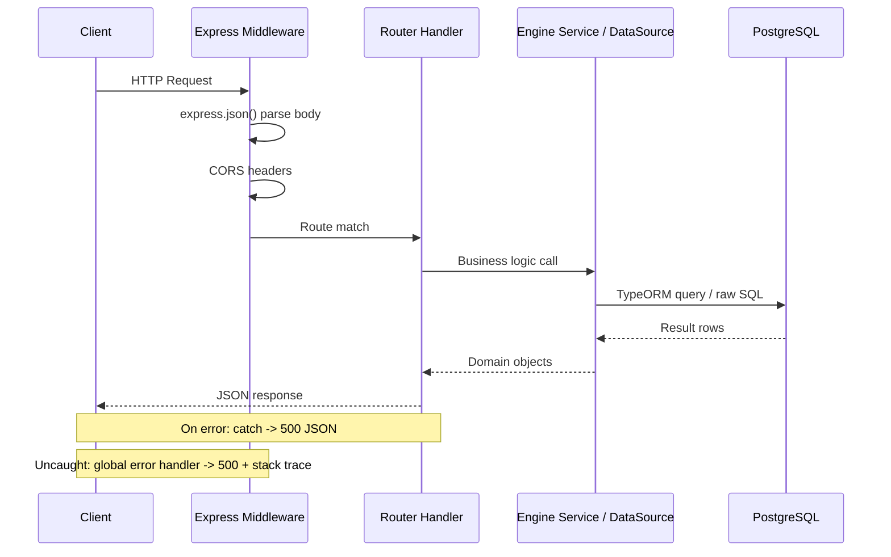
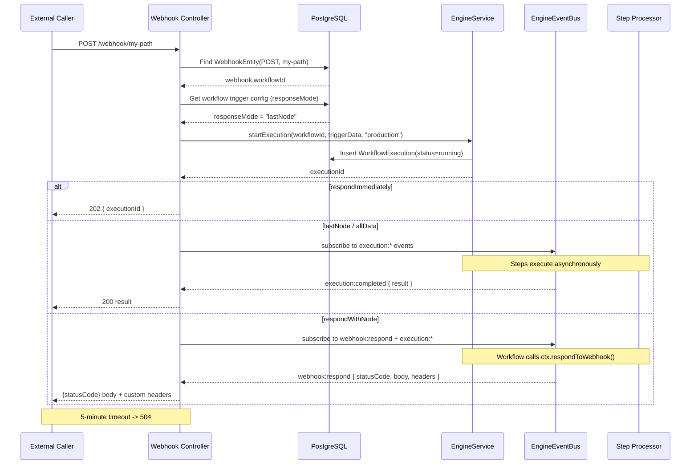
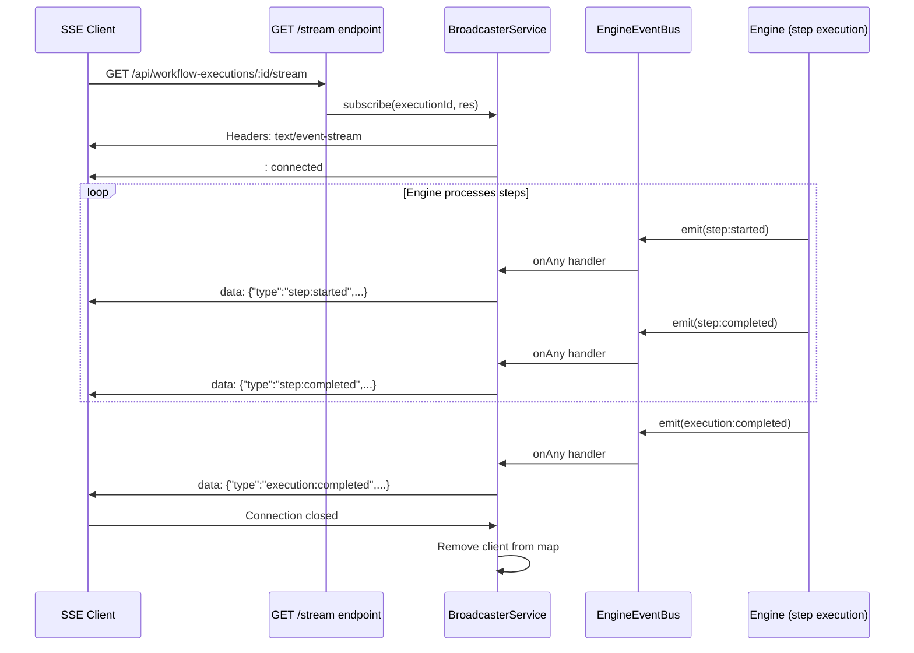

# API Layer Documentation

## Overview

REST API layer for the `@n8n/engine` package. Provides HTTP endpoints for
workflow CRUD with versioning, execution lifecycle management (start, cancel,
pause, resume), step-level operations (inspect, approve), webhook ingestion
with four response modes, and real-time Server-Sent Events (SSE) streaming.

The API is implemented as a set of Express routers composed into a single
application via `createApp()` in `server.ts`.

---

## Architecture

### Express Server Setup

`server.ts` (lines 23-54) exports a `createApp(deps)` factory function that:

1. Creates a bare Express application.
2. Registers `express.json({ limit: '10mb' })` for body parsing.
3. Applies a hand-rolled CORS middleware (lines 28-37).
4. Mounts four routers under their respective base paths.
5. Registers a global error handler as the final middleware.

### Controller Pattern

Each controller is a factory function that receives `AppDependencies` and
returns an Express `Router`. There is no class-based controller, no decorator
routing, and no dependency injection container -- routers are plain functions.

| Controller | File | Base Path |
|---|---|---|
| Workflow | `workflow.controller.ts` | `/api/workflows` |
| Execution | `execution.controller.ts` | `/api/workflow-executions` |
| Step Execution | `step-execution.controller.ts` | `/api/workflow-step-executions` |
| Webhook | `webhook.controller.ts` | `/webhook` |

### Middleware Chain

```
Request
  -> express.json (10 MB limit)
  -> CORS (Access-Control-Allow-Origin: *)
  -> Router handler
  -> Global error handler (catch-all 500)
```

There is **no** authentication middleware, **no** rate limiting, **no** request
logging, and **no** request ID generation.

### Error Handling

Two layers:

1. **Per-route try/catch** -- every route handler wraps its body in
   `try { ... } catch (error) { res.status(500).json({ error: ... }) }`.
2. **Global error handler** (`server.ts` lines 46-51) -- catches anything that
   slips through. Returns `{ error, stack }` which **leaks stack traces** to
   the client.

---

## Endpoints

### Workflow Controller (`workflow.controller.ts`)

#### `GET /api/workflows` (line 33)

List the latest version of every non-deleted workflow.

- **Request**: No body. No query parameters.
- **Response 200**:
  ```json
  [
    { "id": "uuid", "version": 1, "name": "...", "active": false, "createdAt": "..." }
  ]
  ```
- **Implementation note**: Uses raw SQL with `DISTINCT ON` (PostgreSQL-specific
  syntax, line 36-44). Will not work on SQLite or MySQL.

#### `POST /api/workflows` (line 53)

Create a new workflow. Transpiles the source code and stores version 1.

- **Request body**:
  ```json
  { "name": "string (required)", "code": "string (required)", "triggers": [], "settings": {} }
  ```
- **Validation**: Returns 400 if `name` or `code` is missing (line 62-64).
  Returns 422 with `{ errors }` if transpilation fails (line 70-73).
- **Response 201**:
  ```json
  { "id": "uuid", "version": 1, "name": "...", "graph": {...}, "active": false, "createdAt": "..." }
  ```
- **Side effect**: If no `triggers` are provided, `extractTriggers()` (lines
  10-26) regex-parses the raw source code to find `webhook(...)` calls.

#### `PUT /api/workflows/:id` (line 107)

Save a new version of an existing workflow. Increments `version` from the
latest row, transpiles the code, and inserts a new row.

- **Request body**:
  ```json
  { "name": "string", "code": "string (required)", "triggers": [], "settings": {} }
  ```
- **Validation**: Returns 400 if `code` is missing (line 117-119). Returns 404
  if the workflow does not exist or is soft-deleted (line 131-134). Returns 422
  on compilation errors (line 139-141).
- **Response 200**:
  ```json
  { "id": "uuid", "version": 2, "graph": {...}, "active": true }
  ```

#### `GET /api/workflows/:id` (line 214)

Get a single workflow, latest version by default.

- **Query params**: `?version=N` to pin a specific version.
- **Response 200**:
  ```json
  { "id": "...", "version": 1, "name": "...", "code": "...", "triggers": [], "settings": {}, "graph": {...}, "active": false, "createdAt": "..." }
  ```
- **404** if not found or soft-deleted.

#### `GET /api/workflows/:id/versions` (line 174)

List all versions of a workflow (id, version, name, createdAt), ordered
descending by version.

- **Response 200**: Array of `{ id, version, name, createdAt }`.
- **404** if workflow does not exist or is soft-deleted.

#### `DELETE /api/workflows/:id` (line 256)

Soft-delete a workflow by setting `deletedAt` on **all** versions.

- **Response 200**: `{ "id": "...", "deleted": true }`.
- **404** if not found or already deleted.

#### `POST /api/workflows/:id/activate` (line 290)

Register webhook records from the workflow's trigger config and mark all
versions as `active = true`.

- **No request body required.**
- **Response 200**: `{ "id": "...", "active": true }`.
- **Side effect**: Inserts rows into `webhook` table using `orIgnore()` to
  avoid duplicates (lines 318-330). Strips leading slash from paths (line 316).
- **404** if not found or soft-deleted.

#### `POST /api/workflows/:id/deactivate` (line 349)

Remove all webhook records for the workflow and mark all versions as
`active = false`.

- **No request body required.**
- **Response 200**: `{ "id": "...", "active": false }`.
- **404** if not found or soft-deleted.

---

### Execution Controller (`execution.controller.ts`)

#### `POST /api/workflow-executions` (line 14)

Start a new execution of a workflow.

- **Request body**:
  ```json
  { "workflowId": "uuid (required)", "triggerData": {}, "mode": "production|manual|test", "version": 1 }
  ```
- **Validation**: Returns 400 if `workflowId` is missing (line 23-25).
  `mode` defaults to `"production"` (line 31).
- **Response 201**: `{ "executionId": "uuid", "status": "running" }`.

#### `GET /api/workflow-executions` (line 45)

List executions with optional filters.

- **Query params**: `?workflowId=uuid`, `?status=running`.
- **Response 200**: Array of execution summaries (id, workflowId,
  workflowVersion, status, mode, cancelRequested, pauseRequested, startedAt,
  completedAt, durationMs, computeMs, waitMs, createdAt). Ordered by
  `createdAt DESC`.
- **Note**: No pagination -- returns all matching rows (line 64).

#### `GET /api/workflow-executions/:id` (line 211)

Get a single execution with its full status and result.

- **Response 200**:
  ```json
  {
    "id": "uuid",
    "workflowId": "uuid",
    "workflowVersion": 1,
    "status": "running|completed|failed|cancelled|waiting|paused",
    "result": null,
    "error": null,
    "cancelRequested": false,
    "pauseRequested": false,
    "resumeAfter": null,
    "startedAt": "...",
    "completedAt": null,
    "durationMs": null,
    "computeMs": null,
    "waitMs": null
  }
  ```
- **404** if not found.

#### `GET /api/workflow-executions/:id/steps` (line 90)

Get all step executions for an execution, ordered by `createdAt ASC`.

- **Response 200**: Array of step execution objects (id, executionId, stepId,
  stepType, status, input, output, error, attempt, parentStepExecutionId,
  startedAt, completedAt, durationMs).
- **Note**: Registered before `/:id` to avoid the route parameter capturing
  `"steps"` as an ID (comment on line 89).

#### `GET /api/workflow-executions/:id/stream` (line 124)

SSE event stream for real-time execution updates.

- **Response**: `text/event-stream` with `Cache-Control: no-cache` and
  `Connection: keep-alive`. Delegates entirely to `broadcaster.subscribe(id, res)`.
- **No error handling** -- the route handler is synchronous and has no
  try/catch (line 124-127).
- See [SSE Streaming](#sse-streaming-setup) section below for details.

#### `POST /api/workflow-executions/:id/cancel` (line 130)

Cancel a running execution.

- **No request body.**
- **Response 200**: `{ "id": "...", "status": "...", "cancelRequested": true }`.
- **404** if not found.
- **Note**: Does not check if the execution is already in a terminal state
  before calling `engineService.cancelExecution()` (line 141).

#### `POST /api/workflow-executions/:id/pause` (line 157)

Pause a running execution.

- **Request body** (optional): `{ "resumeAfter": "2026-03-10T12:00:00Z" }`.
- **Validation**: Returns 409 if execution status is not `Running` (line 169-171).
- **Response 200**:
  `{ "status": "paused", "resumeAfter": "2026-03-10T12:00:00Z" | null }`.
- **404** if not found.

#### `POST /api/workflow-executions/:id/resume` (line 188)

Resume a paused execution.

- **No request body.**
- **Response 200**: `{ "id": "...", "status": "running" }`.
- **404** if not found.
- **Note**: Does not check if the execution is actually paused before calling
  `engineService.resumeExecution()` (line 199).

#### `DELETE /api/workflow-executions/:id` (line 244)

Hard-delete an execution and all its step executions.

- **Response 200**: `{ "id": "...", "deleted": true }`.
- **404** if not found.
- **Note**: Explicitly deletes step executions first (lines 257-263), then the
  execution itself (lines 265-271), rather than relying on DB cascades.

---

### Step Execution Controller (`step-execution.controller.ts`)

#### `GET /api/workflow-step-executions/:id` (line 13)

Get detailed information about a single step execution.

- **Response 200**:
  ```json
  {
    "id": "uuid",
    "executionId": "uuid",
    "stepId": "step-name",
    "stepType": "trigger|step|approval|condition",
    "status": "...",
    "input": null,
    "output": null,
    "error": null,
    "attempt": 1,
    "parentStepExecutionId": null,
    "startedAt": null,
    "completedAt": null,
    "durationMs": null
  }
  ```
- **404** if not found.

#### `POST /api/workflow-step-executions/:id/approve` (line 45)

Approve or decline a step that is in `waiting_approval` status.

- **Request body**: `{ "approved": true | false }`.
- **Validation**: Returns 400 if `approved` is not a boolean (line 50-52).
  Returns 409 if the step is not in `waiting_approval` status (atomic check via
  `WHERE status = 'waiting_approval'`, line 65-68).
- **Response 200**: `{ "status": "completed", "output": { "approved": true } }`.
- **Side effect**: After updating the step, emits a `step:completed` event on
  the event bus (lines 82-89), which drives the engine to plan and execute
  subsequent steps.

---

### Webhook Controller (`webhook.controller.ts`)

#### `ALL /webhook/*path`

Catch-all route for incoming webhook requests (any HTTP method).

- **Routing**: Extracts the webhook path from the wildcard parameter, strips
  the leading slash, and looks up a `WebhookEntity` by `(method, path)`.
- **404** if no matching webhook registration is found.
- **Schema validation**: If the webhook trigger has a JSON Schema (transpiled
  from Zod schemas at save time), the request body/query/headers are validated
  using Ajv via `validateWebhookRequest()` (`validate-webhook-schema.ts`).
  Returns 400 with validation errors if the request does not match the schema.
- **Trigger data**: Builds `{ body, headers, query, method, path }` from the
  request.
- **Execution**: Starts a new execution via `engineService.startExecution()`
  with mode `"production"`.

##### Response Modes

The response mode is determined by reading the workflow's trigger config for
the matching webhook path (`getResponseMode()`, lines 88-109).

| Mode | HTTP Behavior | Implementation |
|---|---|---|
| `respondImmediately` | Returns `202 { executionId, status: "running" }` immediately | Line 54-55 |
| `lastNode` (default) | Blocks until `execution:completed` or `execution:failed`, returns last step output as 200 | `waitForCompletion()` lines 114-164 |
| `allData` | Blocks until completion, wraps result in `{ result: ... }` | `waitForCompletion()` with mode `'allData'` |
| `respondWithNode` | Blocks until a `webhook:respond` event is emitted by the workflow via `ctx.respondToWebhook()` | `waitForWebhookResponse()` lines 169-226 |

##### Timeout

Both `waitForCompletion()` and `waitForWebhookResponse()` use a 5-minute
timeout (300,000 ms). On timeout, they return `504 { error: "Execution timed out" }`
or `504 { error: "Webhook response timed out" }`.

##### Event Subscription

The webhook controller subscribes to the event bus to wait for completion:

- `waitForCompletion()` subscribes via `eventBus.onExecutionEvent()` (line 162)
  and listens for `execution:completed`, `execution:failed`, or
  `execution:cancelled`.
- `waitForWebhookResponse()` subscribes to both `webhook:respond` (line 223)
  and execution failure events (line 224) to handle the case where the
  execution fails before responding to the webhook.

##### Webhook Registration/Deregistration Lifecycle

1. **Registration** (via `POST /api/workflows/:id/activate`): Reads the
   workflow's `triggers` array, filters for `type: 'webhook'`, and inserts
   `WebhookEntity` records (method + path). Uses `orIgnore()` to be
   idempotent.
2. **Deregistration** (via `POST /api/workflows/:id/deactivate`): Deletes all
   `WebhookEntity` records for the workflow and sets `active = false`.
3. **Lookup** (via `ALL /webhook/*`): Queries `WebhookEntity` by
   `(method, path)`. If found, starts an execution with the associated
   `workflowId`.

---

## Server Setup

### Express Application Configuration (`server.ts`)

```typescript
export function createApp(deps: AppDependencies): express.Application
```

**Dependencies** (`AppDependencies` interface, lines 14-21):

| Dependency | Type | Used By |
|---|---|---|
| `dataSource` | `DataSource` (TypeORM) | All controllers for DB queries |
| `engineService` | `EngineService` | Execution + Webhook controllers |
| `stepProcessor` | `StepProcessorService` | Injected but not used by any controller |
| `broadcaster` | `BroadcasterService` | Execution controller (SSE) |
| `eventBus` | `EngineEventBus` | Step execution + Webhook controllers |
| `transpiler` | `TranspilerService` | Workflow controller |

**Note**: `stepProcessor` is injected into `AppDependencies` but is never
accessed by any controller. It is a dead dependency at the API layer.

### Middleware

1. **Body parser**: `express.json({ limit: '10mb' })` (line 25). No
   `express.urlencoded()` is registered, so form-encoded webhook payloads
   will not be parsed.
2. **CORS**: Hand-rolled middleware (lines 28-37) that sets
   `Access-Control-Allow-Origin: *` on every response. Handles `OPTIONS`
   preflight with `204`. Only allows `Content-Type` in
   `Access-Control-Allow-Headers` -- no `Authorization` header is permitted.

### SSE Streaming Setup

SSE is handled by `BroadcasterService` (`broadcaster.service.ts`):

1. The broadcaster subscribes to `eventBus.onAny()` in its constructor
   (line 17) and forwards all events with an `executionId` field to connected
   SSE clients.
2. `subscribe(executionId, res)` (line 28) sets SSE headers
   (`text/event-stream`, `no-cache`, `keep-alive`, `CORS *`), flushes headers,
   sends an initial `: connected\n\n` comment, and adds the response to the
   client map.
3. On client disconnect (`res.on('close')`, line 48), the response is removed
   from the map.
4. Events are serialized as `data: ${JSON.stringify(event)}\n\n` (line 62).

### Controller Registration

Controllers are mounted in `createApp()` (lines 40-43):

```
/api/workflows             -> createWorkflowRouter(deps)
/api/workflow-executions   -> createExecutionRouter(deps)
/api/workflow-step-executions -> createStepExecutionRouter(deps)
/webhook                   -> createWebhookRouter(deps)
```

---

## Data Flow

### REST Request Lifecycle



### Webhook Execution



### SSE Streaming



---

## Comparison with Plan

Comparing the implementation against `docs/engine-v2-plan.md` "API Contracts"
section (lines 2360-2510).

### Implemented Endpoints (matches plan)

| Endpoint | Plan | Implemented | Notes |
|---|---|---|---|
| `POST /api/workflows` | Yes | Yes | Matches |
| `PUT /api/workflows/:id` | Yes | Yes | Matches |
| `GET /api/workflows/:id` | Yes | Yes | Matches (incl. `?version=N`) |
| `GET /api/workflows/:id/versions` | Yes | Yes | Matches |
| `DELETE /api/workflows/:id` | Yes | Yes | Matches |
| `POST /api/workflows/:id/activate` | Yes | Yes | Matches |
| `POST /api/workflows/:id/deactivate` | Yes | Yes | Matches |
| `POST /api/workflow-executions` | Yes | Yes | Matches |
| `GET /api/workflow-executions` | Yes | Yes | Matches |
| `GET /api/workflow-executions/:id` | Yes | Yes | Matches |
| `GET /api/workflow-executions/:id/steps` | Yes | Yes | Matches |
| `GET /api/workflow-executions/:id/stream` | Yes | Yes | Matches |
| `POST /api/workflow-executions/:id/cancel` | Yes | Yes | Matches |
| `POST /api/workflow-executions/:id/pause` | Yes | Yes | Matches |
| `POST /api/workflow-executions/:id/resume` | Yes | Yes | Matches |
| `DELETE /api/workflow-executions/:id` | Yes | Yes | Matches |
| `GET /api/workflow-step-executions/:id` | Yes | Yes | Matches |
| `POST /api/workflow-step-executions/:id/approve` | Yes | Yes | Matches |
| `ALL /webhook/*` | Yes | Yes | Matches |

### Missing Endpoints (planned but not implemented)

| Endpoint | Plan Reference | Status |
|---|---|---|
| `POST /api/workflow-executions/:id/rerun-from/:stepId` | Plan line 2401 | **Not implemented** |
| `POST /api/workflow-executions/:id/run-step/:stepId` | Plan line 2402 | **Not implemented** |

These two endpoints would support "re-run from here" and "execute only this
step" functionality referenced in the Frontend section (line 2340) as buttons
in the Execution Inspector view.

### Response Shape Differences

| Endpoint | Plan Shape | Implementation Difference |
|---|---|---|
| `PUT /api/workflows/:id` 422 | `{ errors: [{ message, line, column, severity }] }` | Implementation returns `{ errors }` from `compiled.errors` -- actual shape depends on `TranspilerService`. No guarantee of `line`/`column`/`severity` fields. |
| `GET /api/workflows` (list) | Not specified in plan | Implementation uses raw SQL with `DISTINCT ON` returning `{ id, version, name, active, createdAt }`. |
| `POST /api/workflows` 201 | Not specified in plan | Implementation returns `{ id, version, name, graph, active, createdAt }`. |
| `GET /api/workflow-executions/:id` | Plan includes `error: ErrorData \| null` | Implementation returns `error` field directly from entity -- shape depends on what the engine stores. |

### SSE Event Types

The plan (lines 2490-2509) documents 17 SSE event types. The implementation's
`EngineEvent` union type (`event-bus.types.ts`) defines matching interfaces for
all 17 types. The broadcaster forwards all events to SSE clients -- **full
parity**.

---

## Issues and Improvements

### 1. Authentication and Authorization

**Severity: Critical**

There is **zero** authentication or authorization on any endpoint.

- Any client can create, modify, activate, and delete workflows.
- Any client can start, cancel, pause, and resume executions.
- Any client can approve/decline steps.
- Webhook endpoints are inherently public, but management endpoints should not be.
- The SSE stream endpoint has no access control -- any client can subscribe to
  any execution's events by knowing the execution ID (UUIDs are returned in
  API responses).

**Recommendation**: Add an authentication middleware (JWT, API key, or session-
based) to all `/api/*` routes. Keep `/webhook/*` routes public but consider
webhook signature verification (HMAC).

### 2. Stack Trace Leakage in Error Responses

**Severity: High** (`server.ts` line 49)

The global error handler returns `{ error: err.message, stack: err.stack }`.
This leaks internal file paths, dependency versions, and code structure to
clients.

**Recommendation**: Never return `stack` in production. Use
`process.env.NODE_ENV` to gate debug information.

### 3. CORS Configuration is Fully Open

**Severity: High** (`server.ts` lines 28-37)

`Access-Control-Allow-Origin: *` allows any origin to make API calls. The
`Access-Control-Allow-Headers` is limited to `Content-Type` only, which means
adding an `Authorization` header later will require updating CORS.

Additionally, the broadcaster sets its own CORS header
(`broadcaster.service.ts` line 34) independently, creating two places that need
to stay in sync.

**Recommendation**: Make the allowed origin configurable via environment
variable. Add `Authorization` to allowed headers preemptively.

### 4. No Pagination on List Endpoints

**Severity: Medium**

- `GET /api/workflows` returns all workflows (line 36-44).
- `GET /api/workflow-executions` returns all matching executions (line 64).
- `GET /api/workflow-executions/:id/steps` returns all steps (line 99).

These will degrade as data volume grows.

**Recommendation**: Add `?limit=N&offset=M` or cursor-based pagination.

### 5. Input Validation Gaps

**Severity: Medium**

- **No schema validation library** (no Zod, Joi, or class-validator). All
  validation is ad-hoc `if (!field)` checks.
- `POST /api/workflow-executions` does not validate that `workflowId` is a
  valid UUID (line 23). An invalid string will propagate to the engine service.
- `POST /api/workflow-executions/:id/pause` parses `resumeAfter` with
  `new Date(resumeAfter)` (line 174) without validating the result. An invalid
  date string produces `Invalid Date`.
- `GET /api/workflows/:id?version=N` parses version with `parseInt(versionParam, 10)`
  (line 227) without checking for `NaN`.
- `PUT /api/workflows/:id` does not require `name` -- it falls back to
  `latest.name ?? 'Untitled'` (line 150). The plan says `name` is required in
  the request body.
- `extractTriggers()` (lines 10-26) uses regex to parse JavaScript source
  code, which is fragile and can produce false positives/negatives.

**Recommendation**: Adopt a schema validation library (Zod recommended for
TypeScript) and validate all request bodies at the route level.

### 6. No Request Size Limits on Specific Routes

**Severity: Low**

The global `express.json({ limit: '10mb' })` applies to all routes including
webhooks. A malicious webhook caller could send 10 MB payloads.

**Recommendation**: Consider per-route body size limits. Webhook payloads
typically should be much smaller than 10 MB.

### 7. Missing `express.urlencoded()` Parser

**Severity: Low** (`server.ts`)

No URL-encoded body parser is registered. Webhook requests with
`Content-Type: application/x-www-form-urlencoded` will have empty `req.body`.

**Recommendation**: Add `express.urlencoded({ extended: true })` or document
that only JSON webhook payloads are supported.

### 8. Raw SQL with PostgreSQL-Specific Syntax

**Severity: Medium** (`workflow.controller.ts` line 36-44)

The `GET /api/workflows` endpoint uses `DISTINCT ON` which is PostgreSQL-
specific. All other queries use TypeORM's query builder. This breaks portability
and is inconsistent with the rest of the codebase.

**Recommendation**: Rewrite using TypeORM's query builder with a subquery or
use `GROUP BY` with aggregation.

### 9. Resume Endpoint Does Not Validate Execution State

**Severity: Low** (`execution.controller.ts` line 199)

`POST /api/workflow-executions/:id/resume` calls `engineService.resumeExecution(id)`
without checking if the execution is actually paused. Compare with the
`/pause` endpoint which correctly checks `execution.status !== ExecutionStatus.Running`.

Similarly, `POST /api/workflow-executions/:id/cancel` (line 141) does not
check if the execution is in a cancellable state.

**Recommendation**: Add state checks to both endpoints and return 409 Conflict
when the operation is not valid for the current state.

### 10. No Request Logging

**Severity: Medium**

No request logging middleware (no morgan, no pino-http). Debugging production
issues will require adding logging after the fact.

**Recommendation**: Add structured request logging middleware.

### 11. No API Versioning

**Severity: Low**

All endpoints are under `/api/` with no version prefix (e.g., `/api/v1/`).
Breaking changes will affect all clients simultaneously.

**Recommendation**: Add `/api/v1/` prefix or use header-based versioning.

### 12. No OpenAPI / Swagger Documentation

**Severity: Low**

No machine-readable API specification. This makes client generation, contract
testing, and API exploration harder.

**Recommendation**: Add an OpenAPI spec, potentially auto-generated from Zod
schemas if adopted.

### 13. Webhook SSRF Risk

**Severity: Low** (currently)

The webhook controller starts an execution that can run arbitrary user code
(step functions). If step functions can make outbound HTTP requests (they can,
via `fetch`), a webhook caller could trigger SSRF.

This is inherent to the workflow execution model and is partially mitigated by
the fact that webhook registration requires activating a workflow. However,
there is no URL allowlist, no network policy, and no egress filtering.

**Recommendation**: For production, consider sandboxing step execution or
adding egress network policies.

### 14. Webhook Event Bus Cleanup

**Severity: Medium** (`webhook.controller.ts` lines 157-163, 217-221)

Both `waitForCompletion()` and `waitForWebhookResponse()` register event
handlers on the event bus and clean them up via a `cleanup()` function. However,
the `off()` calls cast the handler to `(...args: unknown[]) => void` (lines
159, 219-220), which works only because the event emitter uses reference
equality. If the event bus implementation changes, these cleanup calls could
silently fail, causing memory leaks.

**Recommendation**: Store the exact function reference used in `on()` and pass
it to `off()` without casting.

### 15. `stepProcessor` is an Unused Dependency

**Severity: Low** (`server.ts` line 17)

`StepProcessorService` is declared in `AppDependencies` and must be provided by
callers of `createApp()`, but no controller accesses it.

**Recommendation**: Remove it from `AppDependencies` or add the planned
`run-step` endpoint that would use it.

### 16. Error Response Inconsistency

**Severity: Low**

Error responses use different shapes:

- Most errors: `{ error: "message" }` (string).
- Compilation errors: `{ errors: [...] }` (array).
- Delete success: `{ id, deleted: true }`.
- Activate success: `{ id, active: true }`.

There is no standard error envelope (e.g.,
`{ error: { code, message, details } }`).

**Recommendation**: Adopt a consistent error response format across all
endpoints.

### 17. Test Coverage Notes

Two test files exist under `__tests__/`:

- `workflow-api.test.ts` -- covers workflow CRUD, versioning, activation,
  deactivation. Uses `describe.skipIf(!process.env.DATABASE_URL)` (requires
  PostgreSQL).
- `execution-api.test.ts` -- covers execution start, list, get, steps, cancel,
  pause, resume, delete. Same DB requirement.

**Missing test coverage**:

- Webhook controller (`webhook.controller.ts`) -- no dedicated test file.
  The four response modes, timeout behavior, and event bus cleanup are untested
  at the HTTP level.
- Step execution controller -- no dedicated test file. The approve endpoint
  and its event bus side effect are untested at the HTTP level.
- SSE streaming -- no test for the `/:id/stream` endpoint or the broadcaster.
- Error handler -- the global error handler is not tested.
- Concurrent requests, race conditions in webhook registration, and idempotency
  of activate/deactivate are not tested.
