# Engine Module Documentation

## Overview

The `engine/` directory is the heart of the n8n v2 execution engine. It
implements **per-step workflow execution** backed by a PostgreSQL queue,
replacing the monolithic in-process execution model of engine v1. Each
workflow step runs as an independent, crash-recoverable job: claimed from a
database queue, executed in isolation, and its output persisted before the
next step is planned.

The engine is event-driven. Step lifecycle events flow through a typed
in-process event bus, triggering successor planning, execution completion
checks, parent step resolution, and real-time SSE delivery to clients.
This architecture decouples step processing from orchestration logic,
making the system extensible and testable.

Key capabilities:
- Atomic step claiming via `SELECT FOR UPDATE SKIP LOCKED`
- Durable execution: step outputs survive process crashes
- Exponential backoff retry with per-step configuration
- Sleep/wait via child step executions (no process held alive)
- Pause/resume at execution level
- Approval steps (human-in-the-loop)
- Real-time streaming via SSE
- Fail-fast: one step failure immediately fails the execution

## Architecture

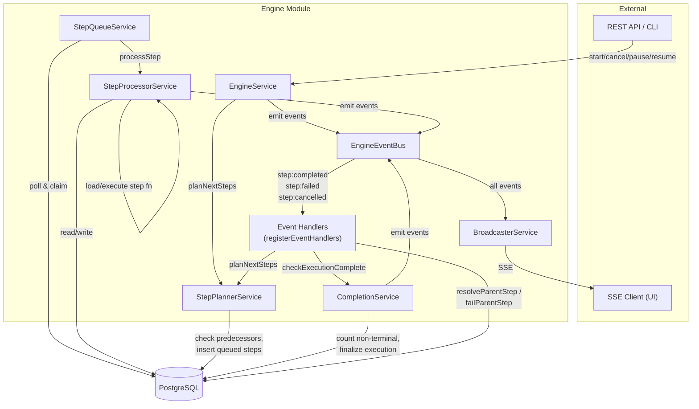

### Dependency Graph

| Service | Depends On |
|---------|------------|
| `EngineService` | `DataSource`, `EngineEventBus`, `StepPlannerService` |
| `StepQueueService` | `DataSource`, `StepProcessorService` |
| `StepProcessorService` | `DataSource`, `EngineEventBus` |
| `StepPlannerService` | `DataSource` |
| `CompletionService` | `DataSource`, `EngineEventBus` |
| `BroadcasterService` | `EngineEventBus` |
| `registerEventHandlers` | `EngineEventBus`, `DataSource`, `StepPlannerService`, `CompletionService` |

## Services

### EngineService

**File:** `engine.service.ts`

The top-level orchestrator. Exposes four execution lifecycle methods, each
called by the REST API or CLI.

#### Responsibilities

1. **Start executions** -- fetches the workflow (optionally at a pinned
   version), creates the `workflow_execution` record, materializes the
   trigger as a completed step, plans the first successor steps, and
   emits `execution:started`.

2. **Cancel executions** -- sets `cancel_requested = true`, bulk-updates
   all non-terminal steps to `cancelled`, checks if the execution is now
   complete, and emits `execution:cancelled` / `execution:cancel_requested`.

3. **Pause executions** -- sets `pause_requested = true` (optionally with
   `resume_after`). The queue poller stops picking up steps for paused
   executions. Emits `execution:pause_requested`.

4. **Resume executions** -- clears `pause_requested`, sets status back to
   `running`, re-plans successors from ALL completed steps (handles
   parallel branches that completed before the pause took effect), and
   emits `execution:resumed`.

#### Key Methods

| Method | Lines | Description |
|--------|-------|-------------|
| `startExecution(workflowId, triggerData?, mode?, version?)` | 19-105 | Creates execution, materializes trigger, plans first steps |
| `cancelExecution(executionId)` | 107-174 | Sets cancel flag, cancels non-terminal steps, finalizes if complete |
| `pauseExecution(executionId, resumeAfter?)` | 176-196 | Sets pause flag with optional timed auto-resume |
| `resumeExecution(executionId)` | 198-255 | Resumes from all completed steps, idempotent via ON CONFLICT |

#### Flow: startExecution

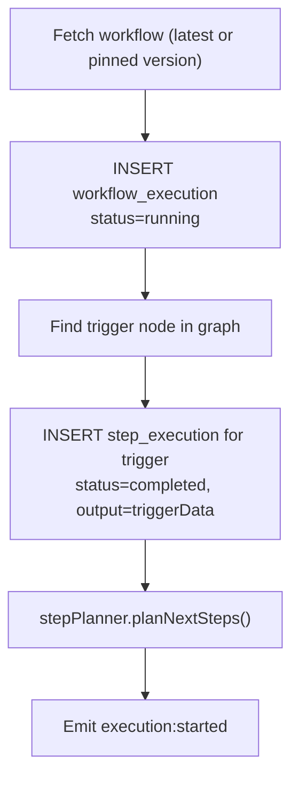

#### Flow: cancelExecution

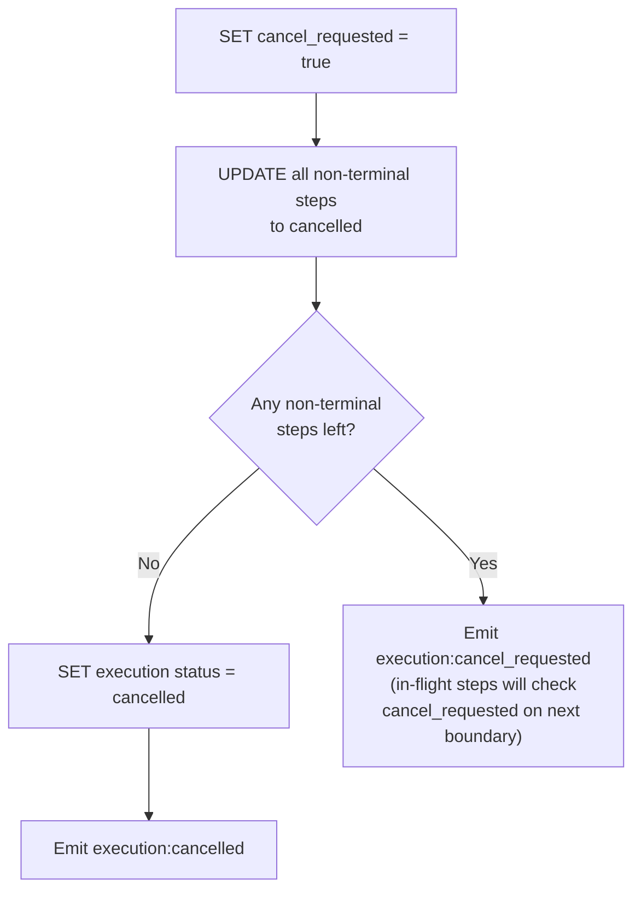

### StepProcessorService

**File:** `step-processor.service.ts`

Executes individual step functions. This is the most complex service in
the engine, handling compiled code loading, context building, timeout
enforcement, sleep/wait control flow, error classification, retry
scheduling, and source map error tracing.

#### Responsibilities

1. **Load and cache compiled workflow modules** -- uses Node.js `Module`
   API to compile JavaScript at runtime, cached per
   `workflowId:version` key.

2. **Build execution contexts** -- constructs the `ExecutionContext`
   passed to every step function, wiring up `input`, `triggerData`,
   `sendChunk`, `respondToWebhook`, `sleep`, `waitUntil`, and
   `getSecret`.

3. **Execute step functions with timeout** -- `Promise.race` between the
   step function and a timeout timer.

4. **Handle sleep/wait** -- catches `SleepRequestedError` /
   `WaitUntilRequestedError`, marks the parent step as `waiting`,
   creates a child step execution with `wait_until` timestamp and
   continuation function reference.

5. **Classify errors and schedule retries** -- uses `classifyError()` to
   determine retriability, `calculateBackoff()` for delay, and persists
   the retry state.

6. **Map runtime errors to source lines** -- attempts to trace compiled
   code line numbers back to the original TypeScript source using token
   matching heuristics.

#### Key Methods

| Method | Lines | Description |
|--------|-------|-------------|
| `processStep(stepJob)` | 49-347 | Main entry point: load, execute, handle result/error |
| `loadStepFunction(...)` | 349-389 | Compile and cache module, resolve function ref |
| `buildStepContext(stepJob, execution)` | 391-457 | Build ExecutionContext with all SDK methods |
| `updateStepAndEmit(stepJob, execution, update)` | 459-478 | Persist status change + emit typed event |
| `clearModuleCache()` | 549-551 | Test utility |

#### Input Resolution

Predecessor outputs are gathered at queue time by `StepPlannerService.gatherStepInput()`.
The step receives them as `ctx.input`, a record keyed by predecessor step ID:

```
{ "predecessor-step-id": <predecessor output>, ... }
```

The `triggerData` convenience getter returns the first predecessor's output.

#### Error Handling Flow

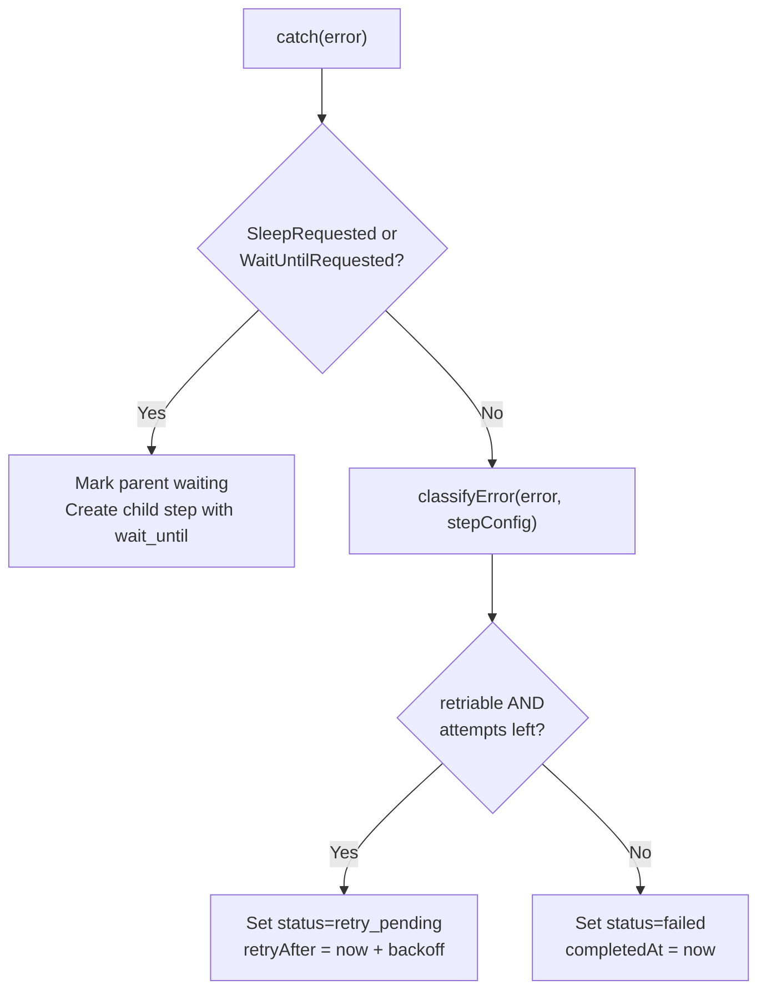

#### Infrastructure Error Safety

The outer try/catch (lines 315-346) handles infrastructure failures (DB
unreachable, workflow not found, graph parse error). It attempts to
persist the failure and emit `step:failed`. If even that fails (double
failure), the step stays in `running` status and is recovered by stale
step recovery.

### StepPlannerService

**File:** `step-planner.service.ts`

Determines which steps to queue next after a step completes, implementing
the predecessor-satisfaction algorithm that enables parallel step
scheduling.

#### Responsibilities

1. **Find successor nodes** -- queries the workflow graph for successors
   of the completed step.

2. **Check predecessor satisfaction** -- for each successor, counts how
   many predecessors have completed. Only queues the step when ALL
   predecessors are complete (fan-in logic).

3. **Gather input** -- collects outputs from all predecessor step
   executions into a single input record.

4. **Idempotent insertion** -- uses `ON CONFLICT DO NOTHING` (`.orIgnore()`)
   to prevent duplicate step execution records when two predecessors
   complete simultaneously and both try to queue the same successor.

#### Key Methods

| Method | Lines | Description |
|--------|-------|-------------|
| `planNextSteps(executionId, completedStepId, stepOutput, graph)` | 15-69 | Core planning loop |
| `gatherStepInput(executionId, stepId, graph)` | 71-98 | Collect predecessor outputs into input record |

#### Predecessor Satisfaction Check

For a step with N predecessors:
1. Query: count step executions where `executionId = X AND stepId IN (predecessors) AND status = completed`
2. If count < N: skip (another predecessor will trigger planning when it completes)
3. If count = N: gather inputs, insert queued step execution

This is safe under concurrent completion because the INSERT uses
`ON CONFLICT DO NOTHING`. Two predecessors completing simultaneously
both run `planNextSteps`, but only one INSERT succeeds.

### StepQueueService

**File:** `step-queue.service.ts`

PostgreSQL-based job queue using `SELECT FOR UPDATE SKIP LOCKED` for safe
concurrent step claiming. Polls the database on a configurable interval
(default 50ms) and dispatches claimed steps to `StepProcessorService`.

#### Responsibilities

1. **Poll for claimable steps** -- queries for steps in `queued`,
   `retry_pending` (with `retryAfter <= NOW()`), or `waiting` (with
   `waitUntil <= NOW()`) status.

2. **Respect execution state** -- joins with `workflow_execution` to skip
   steps from paused, cancelled, failed, or completed executions.

3. **Concurrency control** -- tracks `inFlight` count against
   `maxConcurrency` (default 10). Only claims
   `maxConcurrency - inFlight` steps per poll cycle.

4. **Atomic claiming** -- within a single short-lived transaction: SELECT
   with row lock, UPDATE to `running`, COMMIT (releases lock).

5. **Dispatch** -- after the transaction commits, dispatches claimed steps
   concurrently via `Promise.allSettled`.

6. **Stale step recovery** -- `recoverStaleSteps()` re-queues steps stuck
   in `running` beyond 330 seconds (default timeout 300s + 30s buffer).

#### The `SELECT FOR UPDATE SKIP LOCKED` Pattern

```sql
SELECT ... FROM workflow_step_execution wse
INNER JOIN workflow_execution we ON we.id = wse.executionId
WHERE (
    wse.status = 'queued'
    OR (wse.status = 'retry_pending' AND wse.retryAfter <= NOW())
    OR (wse.status = 'waiting' AND wse.waitUntil IS NOT NULL AND wse.waitUntil <= NOW())
)
AND we.pauseRequested = false
AND we.cancelRequested = false
AND we.status NOT IN ('failed', 'cancelled', 'paused', 'completed')
ORDER BY wse.createdAt ASC
LIMIT :available
FOR UPDATE OF wse SKIP LOCKED
```

- `FOR UPDATE` locks the selected rows, preventing other pollers from
  claiming the same steps.
- `SKIP LOCKED` makes the query non-blocking: if another transaction
  holds a lock on a row, it is skipped rather than waited on.
- The lock is held only for the duration of the short claiming
  transaction, not during step execution.

#### Key Methods

| Method | Lines | Description |
|--------|-------|-------------|
| `start()` | 25-32 | Begin polling on interval |
| `stop()` | 34-38 | Stop the poll timer |
| `poll()` | 40-112 | Claim and dispatch one batch of steps |
| `recoverStaleSteps()` | 119-131 | Re-queue steps stuck in running |
| `getInFlightCount()` | 133-135 | Current in-flight step count |
| `isRunning()` | 137-139 | Whether the poller is active |

### CompletionService

**File:** `completion.service.ts`

Determines when a workflow execution is complete and calculates final
metrics. Called after every step completion, failure, or cancellation.

#### Responsibilities

1. **Non-terminal step count** -- queries for step executions NOT in
   terminal statuses (`completed`, `failed`, `cancelled`, `skipped`,
   `cached`). If any remain, the execution is not yet complete.

2. **Final status determination**:
   - If `cancel_requested`: status = `cancelled`
   - Else if at least one non-trigger step completed: status = `completed`
   - Else: status = `failed`

3. **Result extraction** -- finds the last-completed leaf node step to
   use as the execution result.

4. **Metrics calculation** -- computes `computeMs` (sum of step
   durations, excluding approval steps), `wallMs` (elapsed wall time),
   and `waitMs` (wall minus compute).

5. **CAS guard** -- the finalization UPDATE includes
   `WHERE status NOT IN (completed, failed, cancelled)` to prevent
   double-finalization when two steps complete simultaneously.

#### Key Methods

| Method | Lines | Description |
|--------|-------|-------------|
| `checkExecutionComplete(executionId, graph)` | 20-144 | Full completion check, metrics, finalization |

#### Double-Finalization Prevention

Lines 99-118: The CAS (Compare-And-Swap) guard ensures that if two
concurrent step completions both trigger `checkExecutionComplete`, only
the first one that reaches the UPDATE will succeed. The second sees
`affected = 0` and returns without emitting a duplicate event.

### BroadcasterService

**File:** `broadcaster.service.ts`

Delivers engine events to HTTP clients via Server-Sent Events (SSE).
Maps `executionId` to a set of connected response objects.

#### Responsibilities

1. **Subscribe clients** -- sets SSE headers, registers response object
   in the per-execution client set, wires up cleanup on disconnect.

2. **Forward events** -- subscribes to all engine events via
   `eventBus.onAny()` and forwards any event with an `executionId`
   to the corresponding SSE clients.

3. **Cleanup** -- removes disconnected clients from the map,
   deletes empty execution entries.

#### Event Types Delivered

All `StepEvent`, `ExecutionEvent`, and `WebhookRespondEvent` types are
forwarded. The SSE data format is:

```
data: {"type":"step:completed","executionId":"...","stepId":"...","output":...}\n\n
```

#### Scaling Considerations

The current implementation is **in-process only**. In a multi-process
deployment, events emitted by worker processes do not reach SSE clients
connected to different API processes. The plan document specifies a
Phase 2 solution using Redis pub/sub channels keyed by execution ID.

#### Key Methods

| Method | Lines | Description |
|--------|-------|-------------|
| `subscribe(executionId, res)` | 28-54 | Register SSE client |
| `send(executionId, event)` | 59-66 | Send event to subscribed clients |
| `getSubscriberCount(executionId)` | 71-73 | Count per-execution subscribers |
| `getTotalSubscriberCount()` | 78-84 | Count all active SSE connections |

## Event System

### EngineEventBus

**File:** `event-bus.service.ts`

A typed wrapper around Node.js `EventEmitter` providing:

- **Typed emission and subscription** -- `emit(event: EngineEvent)` and
  `on<T>(eventType, handler)` ensure type safety.
- **Wildcard listeners** -- `onStepEvent()` subscribes to `step:*`,
  `onExecutionEvent()` to `execution:*`.
- **`onAny()`** -- receives step events, execution events, AND webhook
  events (subscribes to `step:*`, `execution:*`, and `webhook:respond`).
- **Max listeners** -- set to 100 to accommodate multiple subscribers.

Implementation detail: wildcard events are implemented by emitting
a second event with the `prefix:*` pattern on every `emit()` call
(line 24-25).

### Event Types (`event-bus.types.ts`)

**Step events:**

| Event | Key Fields |
|-------|------------|
| `step:started` | `executionId`, `stepId`, `attempt` |
| `step:completed` | `executionId`, `stepId`, `output`, `durationMs`, `parentStepExecutionId?` |
| `step:failed` | `executionId`, `stepId`, `error: ErrorData`, `parentStepExecutionId?` |
| `step:retrying` | `executionId`, `stepId`, `attempt`, `retryAfter`, `error` |
| `step:waiting` | `executionId`, `stepId` |
| `step:waiting_approval` | `executionId`, `stepId` |
| `step:cancelled` | `executionId`, `stepId` |
| `step:chunk` | `executionId`, `stepId`, `data`, `timestamp` |

**Execution events:**

| Event | Key Fields |
|-------|------------|
| `execution:started` | `executionId` |
| `execution:completed` | `executionId`, `result` |
| `execution:failed` | `executionId`, `error: ErrorData` |
| `execution:cancelled` | `executionId` |
| `execution:paused` | `executionId`, `lastCompletedStepId` |
| `execution:resumed` | `executionId` |
| `execution:cancel_requested` | `executionId` |
| `execution:pause_requested` | `executionId`, `resumeAfter?` |

**Webhook events:**

| Event | Key Fields |
|-------|------------|
| `webhook:respond` | `executionId`, `statusCode`, `body`, `headers?` |

### Event Handlers (`event-handlers.ts`)

The `registerEventHandlers()` function wires up three handlers that
drive the engine forward:

#### `step:completed` Handler (lines 149-184)

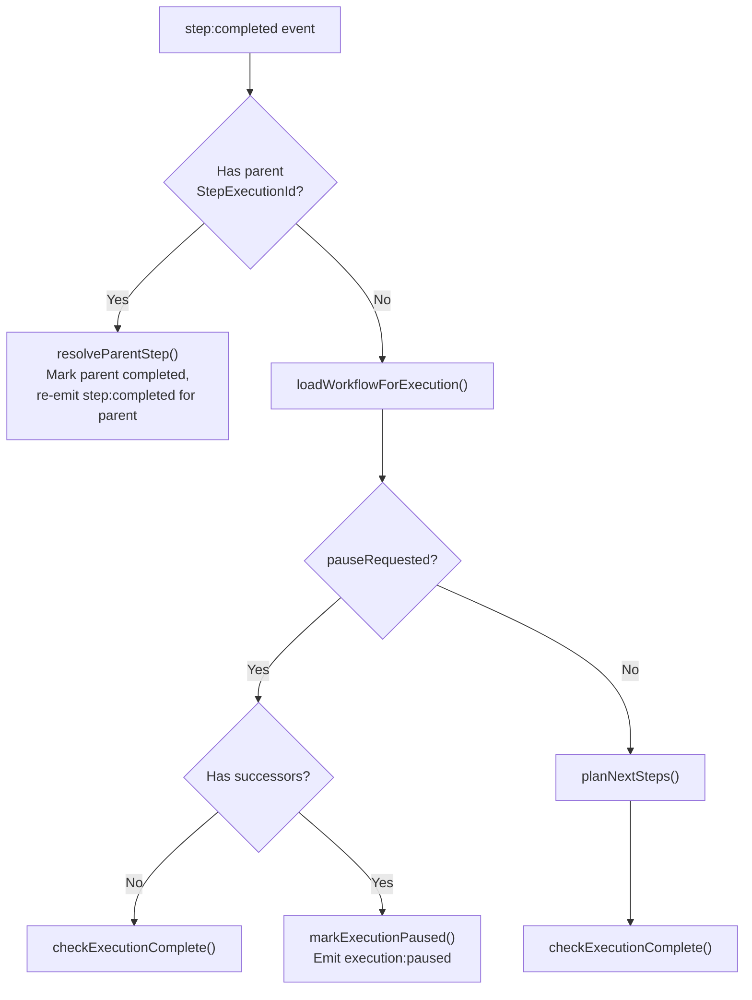

#### `step:failed` Handler (lines 187-237)

- If child step: calls `failParentStep()` which marks parent as failed
  and re-emits `step:failed` for the parent.
- If root step: **fail fast** -- immediately marks execution as `failed`,
  sets `cancel_requested = true` (prevents other branches from being
  picked up), calculates metrics, and emits `execution:failed`.

#### `step:cancelled` Handler (lines 240-244)

Loads the workflow graph and calls `checkExecutionComplete()`.

#### Helper Functions

| Function | Lines | Description |
|----------|-------|-------------|
| `loadWorkflowForExecution(dataSource, executionId)` | 18-36 | Loads execution + workflow at pinned version |
| `resolveParentStep(dataSource, eventBus, parentId, output)` | 43-75 | Marks parent completed, re-emits step:completed |
| `failParentStep(dataSource, eventBus, parentId)` | 81-116 | Marks parent failed, re-emits step:failed |
| `markExecutionPaused(dataSource, executionId)` | 121-132 | Sets execution status to paused (CAS on running) |

## Error Handling

### Error Class Hierarchy

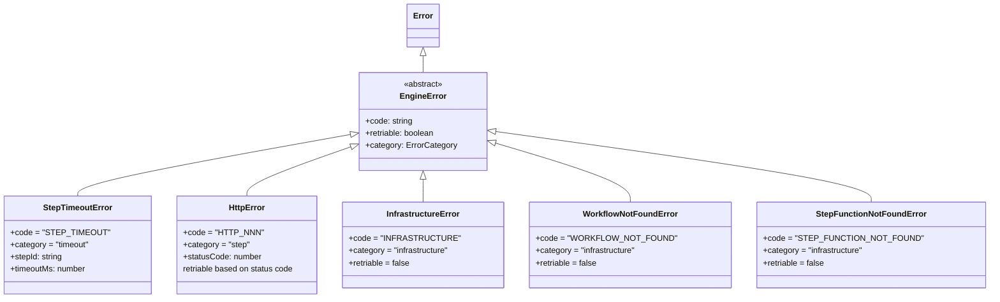

**Files:**
- `errors/engine-error.ts` -- abstract base class
- `errors/step-timeout.error.ts` -- timeout during step execution
- `errors/http.error.ts` -- HTTP errors (retriable: 408, 429, 500, 502, 503, 504)
- `errors/infrastructure.error.ts` -- infrastructure, workflow not found, step function not found

### Error Classification (`errors/error-classifier.ts`)

Three exported functions:

**`buildErrorData(error, sourceMap?)`** -- normalizes any thrown value
into structured `ErrorData`. Classification order:
1. `EngineError` subclasses: use their `code`, `category`, `retriable`
2. Native JS errors (`TypeError`, `ReferenceError`, `SyntaxError`): never retriable
3. Node.js system errors with `errno` code: retriable for `ETIMEDOUT`, `ECONNRESET`, `ECONNREFUSED`, `EPIPE`, `ENOTFOUND`
4. Unknown: default to `retriable = true`

**`classifyError(error, stepConfig)`** -- determines if a retry should
happen, applying step-level overrides:
- `StepTimeoutError`: only retriable if `stepConfig.retryOnTimeout = true`
- Custom codes listed in `stepConfig.retriableErrors` are always retriable
- Otherwise, falls back to `buildErrorData` classification

**`calculateBackoff(attempt, config)`** -- exponential backoff:
`min(baseDelay * 2^(attempt-1), maxDelay)` with optional jitter
(multiply by `0.5 + random * 0.5`).

### Retry Logic

In `StepProcessorService.processStep()` (lines 285-313):

1. Compute `maxAttempts` from step config (default 1 = no retries)
2. Call `classifyError()` for retriability decision
3. Check `stepJob.attempt < maxAttempts` for remaining retries
4. If retriable with retries left: set `status = retry_pending`,
   increment `attempt`, set `retryAfter` with backoff delay
5. Otherwise: set `status = failed` with error data

The queue poller picks up `retry_pending` steps when
`retryAfter <= NOW()`.

## Data Flows

### 1. Execution Start: trigger to first step

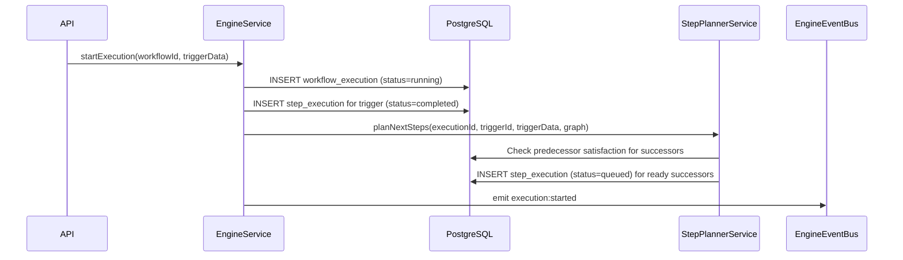

### 2. Step Execution Cycle

```mermaid
sequenceDiagram
    participant Queue as StepQueueService
    participant DB as PostgreSQL
    participant Proc as StepProcessorService
    participant EventBus as EngineEventBus
    participant Handlers as Event Handlers
    participant Planner as StepPlannerService
    participant Completion as CompletionService

    Queue->>DB: BEGIN; SELECT FOR UPDATE SKIP LOCKED;<br/>UPDATE status=running; COMMIT
    Queue->>Proc: processStep(stepJob)
    Proc->>DB: Load execution + workflow
    Proc->>Proc: loadStepFunction() + buildStepContext()
    Proc->>EventBus: emit step:started
    Proc->>Proc: Execute step fn with timeout
    Proc->>DB: UPDATE status=completed, output=result
    Proc->>EventBus: emit step:completed
    EventBus->>Handlers: step:completed handler
    Handlers->>Planner: planNextSteps()
    Handlers->>Completion: checkExecutionComplete()
```

### 3. Retry Flow

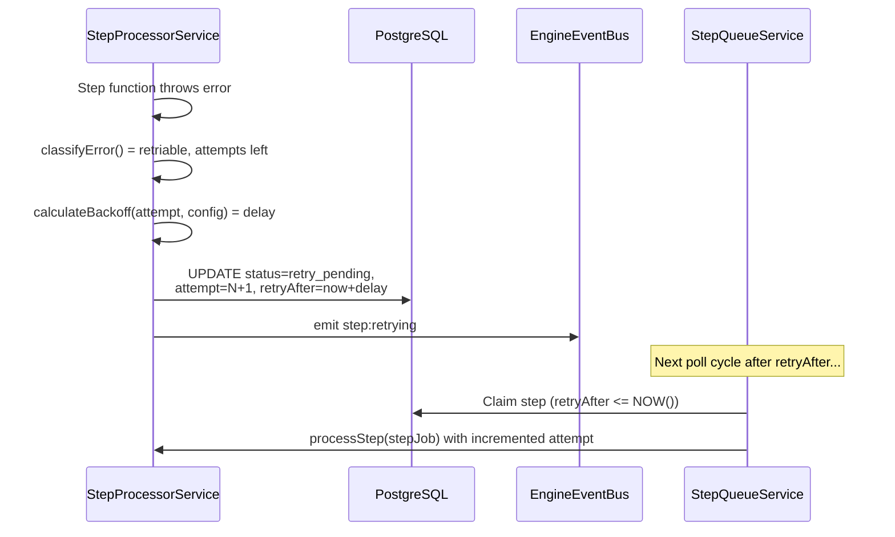

### 4. Sleep/Wait Flow

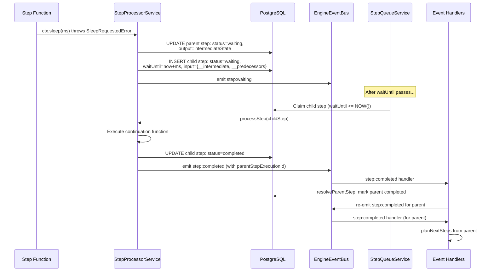

### 5. Approval Flow

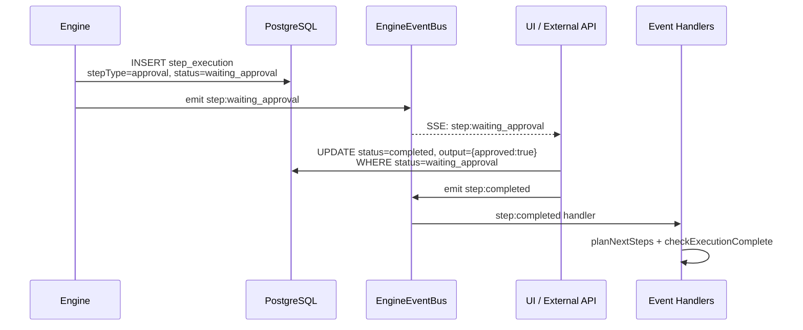

### 6. Cancellation Flow

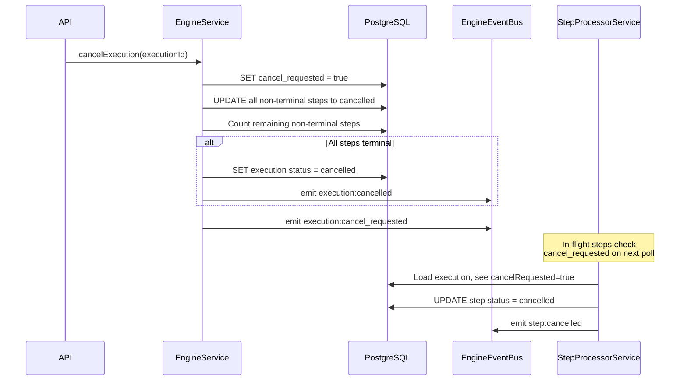

### 7. Streaming Flow

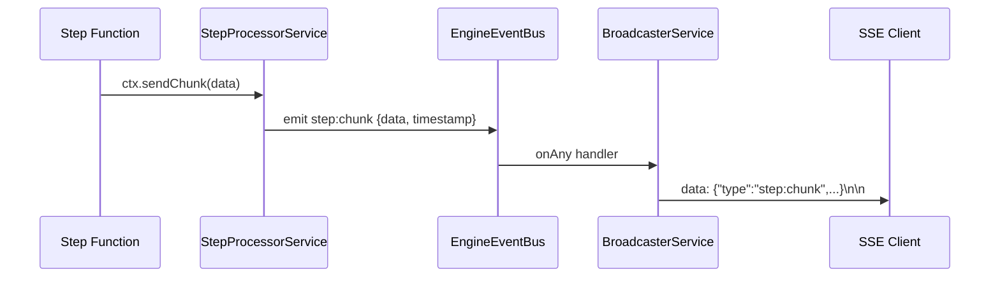

Note: chunks are NOT persisted to DB. Only the step's final output is
stored.

### 8. Fan-Out / Fan-In

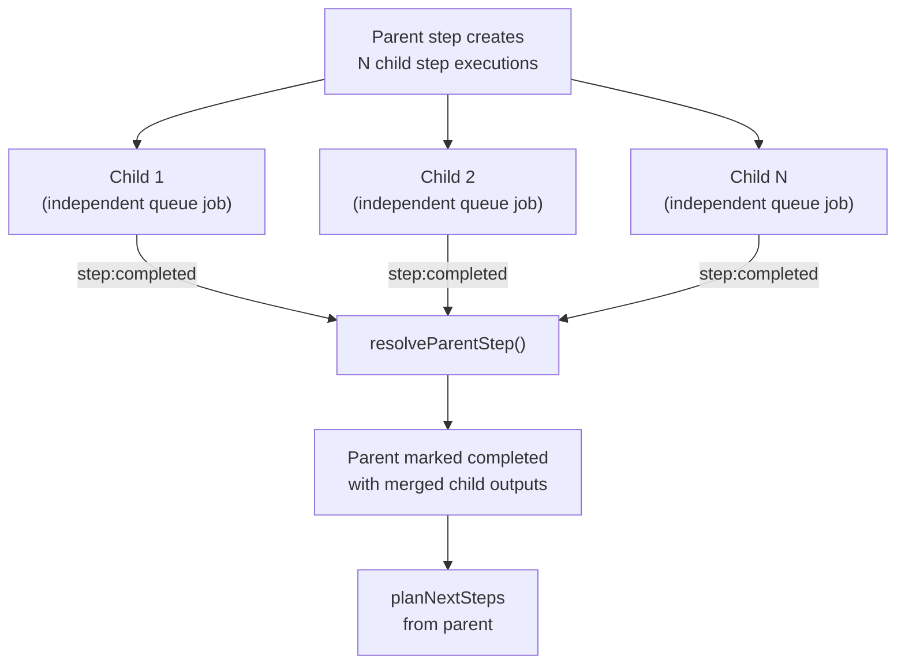

Fan-out uses the same `parent_step_execution_id` mechanism as
sleep/wait continuations. Each child is an independent queue job with
its own retry and timeout handling.

> **Note:** Fan-out/fan-in is described as a Phase 1 stretch goal in the
> plan. The child step infrastructure exists (used by sleep/wait), but
> the fan-out creation logic (splitting items into children and merging
> results) is not yet fully implemented in the engine module.

## Comparison with Plan

The following compares the implementation in `engine/` against
`docs/engine-v2-plan.md` for each specified feature.

### Per-Step Execution Model

**Match: Yes.** The implementation follows the plan precisely. Each step
is an independent queue job. The trigger is materialized as a completed
step execution. Successors are planned after completion. The graph stays
static at runtime.

### Queue Polling Mechanism

**Match: Yes.** The poll query, `SELECT FOR UPDATE SKIP LOCKED` pattern,
concurrency tracking, and `SKIP LOCKED` semantics match the plan. The
50ms poll interval, `maxConcurrency` limit, and `inFlight` tracking are
implemented exactly as specified.

**Minor deviation:** The plan mentions a partial index
`idx_wse_queue` on `status IN ('queued', 'retry_pending')` for poll
performance. The index creation is presumably in migration files, not in
the engine module itself. The poll query also includes `waiting` status
(for sleep/wait child steps), which the plan also describes.

### Step Processing

**Match: Yes.** The `processStep` function matches the plan's pseudocode
nearly line-for-line: outer try/catch for infrastructure errors,
cancel check, workflow loading, graph building, step function loading,
context building, timeout via `Promise.race`, and the same
sleep/wait/retry/fail branches.

**Deviation: Source map error tracing.** The plan specifies using
`source-map-support` for automatic stack trace remapping. The
implementation instead uses a heuristic token-matching approach
(lines 176-283 of `step-processor.service.ts`) to map compiled code
lines back to original source lines. The `remapStack` function in
`error-classifier.ts` is a no-op placeholder (line 124-126). This
is a PoC shortcut noted in the plan.

**Deviation: No logging.** The plan includes `logger.error()` calls in
the error handling paths. The implementation uses no logger -- errors
are only persisted to DB and emitted as events.

### Error Handling and Retriability

**Match: Yes.** The error hierarchy (`EngineError`, `StepTimeoutError`,
`HttpError`, `InfrastructureError`, `WorkflowNotFoundError`,
`StepFunctionNotFoundError`) matches the plan.

**Minor deviation:** The plan lists `NonRetriableError` as a class
in the error hierarchy. The implementation does not include it -- this
is either deferred or deemed unnecessary given the classification
system handles non-retriable cases via `buildErrorData`.

**Minor deviation:** The plan lists `ENOTFOUND` as NOT in the
retriable errno codes, but the implementation includes it in the
`retriableCodes` array (`error-classifier.ts` line 53). This is a
reasonable addition.

### Cancellation

**Match: Yes.** Between-step cancellation is implemented exactly as
planned. The `cancelExecution()` method sets `cancel_requested`, cancels
non-terminal steps, and checks for completion. The `processStep`
function checks `cancel_requested` before execution.

**Not yet implemented:** The plan mentions Phase 2 within-step
cancellation via `AbortSignal` propagation. This is not in the current
implementation, as expected for Phase 1.

### Pause and Resume

**Match: Yes.** The pause/resume implementation follows the plan:
- `pauseExecution()` sets `pause_requested` with optional `resume_after`
- The queue poller filters out steps from paused executions
- `resumeExecution()` finds ALL completed steps, clears pause, re-plans
  from each (idempotent via ON CONFLICT DO NOTHING)
- The step:completed handler checks `pauseRequested` before planning

**Not yet implemented:** The plan describes a periodic
`checkPausedExecutions()` for timed auto-resume. This is not present
in the engine module. The `resume_after` field is stored but no
automatic polling for expired pause timers exists in this code.

### Sleep and Wait

**Match: Yes.** The child step mechanism matches the plan exactly:
`SleepRequestedError` / `WaitUntilRequestedError` are caught, parent
is marked `waiting`, child step is created with `wait_until`,
continuation function ref stored in metadata, and the queue poller
picks up children when `waitUntil <= NOW()`.

### Approval Steps

**Match: Partial.** The event type `step:waiting_approval` is defined
and the `mapStatusToEvent` function handles the `WaitingApproval`
status. However, the approval flow (creating the step execution with
`stepType = approval` and the `/approve` endpoint calling
`updateStepAndEmit`) lives in the API controller, not in the engine
module. The engine provides the primitives but not the
orchestration logic for approvals.

### Streaming

**Match: Yes.** `ctx.sendChunk()` emits `step:chunk` events via the
event bus. The `BroadcasterService` forwards them to SSE clients.
Chunks are not persisted, matching the plan.

### Multi-Item Processing (Fan-Out/Fan-In)

**Match: Partial.** The child step infrastructure
(`parent_step_execution_id`, `resolveParentStep`, `failParentStep`)
exists and is used by sleep/wait. However, explicit fan-out logic
(splitting items into N children, fan-in merging of results) is
not implemented in the engine module. The plan marks this as a
"Phase 1 stretch goal."

### Event Delivery

**Match: Yes** for Phase 1. The in-process `BroadcasterService`
subscribes to all events via `eventBus.onAny()` and forwards to SSE
clients grouped by `executionId`.

**Not yet implemented:** Phase 2 Redis pub/sub for multi-instance
event delivery, as expected.

### Plan Features Missing from Event Handlers

The plan specifies handlers for:
- `execution:completed` and `execution:failed` calling
  `calculateExecutionMetrics()` -- the implementation computes metrics
  inline in the `step:failed` handler and `CompletionService`, not via
  separate handlers.
- `execution:paused` and `execution:resumed` for logging/notification --
  not registered as event handlers; the implementation handles these
  inline in `EngineService`.

## Issues and Improvements

### Race Conditions

**1. Non-atomic predecessor check + insert in `StepPlannerService`
(lines 36-67)**

The predecessor count query (line 36-43) and the step insertion
(line 55-67) are not in a transaction. Between the count and the insert,
another predecessor could complete and also pass the count check. The
`orIgnore()` prevents duplicate inserts, but there is a window where
both callers read `completedPredCount = N` (satisfying the check) and
both attempt the insert -- one succeeds, one is silently ignored. This
is currently safe because of ON CONFLICT DO NOTHING, but if the logic
ever needs to do something on conflict (like merge inputs), this would
need a transaction.

**2. `inFlight` counter is not atomic
(`step-queue.service.ts` lines 15, 101, 108)**

The `inFlight` variable is incremented/decremented without
synchronization. In Node.js single-threaded event loop this is safe,
but if the engine ever moves to worker threads, this would be a
data race. Worth documenting the single-threaded assumption.

**3. Resume finds completed steps without a successor check
(`engine.service.ts` lines 202-209)**

The `resumeExecution` query finds ALL completed steps with
`parentStepExecutionId IS NULL`. This includes steps whose successors
were already planned before the pause (e.g., step A completed, successor
B was queued, then pause was requested). Re-planning from step A is safe
(ON CONFLICT DO NOTHING on B), but it adds unnecessary DB queries. A
more precise approach would track which steps had their planning skipped
due to the pause.

### Memory Leaks

**4. Module cache grows unbounded
(`step-processor.service.ts` line 42)**

The `moduleCache` is a `Map<string, Record<string, unknown>>` that is
never evicted (except via `clearModuleCache()` in tests). Every unique
`workflowId:version` pair adds an entry. In a long-running process with
many workflow versions, this leaks memory. Needs an LRU eviction
strategy or size limit.

**5. BroadcasterService client map is never cleaned for completed
executions (`broadcaster.service.ts` line 13)**

The `clients` map entry is only deleted when ALL subscribers disconnect
(line 50-52). If clients connect but never disconnect (e.g., abandoned
browser tabs with keep-alive), entries accumulate. A periodic cleanup
or TTL on execution entries would help.

**6. EventEmitter listeners from `registerEventHandlers` are never
removed (`event-handlers.ts` lines 149-244)**

The handlers registered by `registerEventHandlers()` use `eventBus.on()`
which adds persistent listeners. If `registerEventHandlers` is called
multiple times (e.g., in tests or hot-reload), duplicate handlers
accumulate. The function should either guard against double-registration
or return a cleanup function.

### Error Handling Gaps

**7. Async event handlers can throw unhandled rejections
(`event-bus.service.ts` line 21)**

The `emit()` method calls `this.emitter.emit(event.type, event)`, which
invokes handlers synchronously. If an async handler throws, the
rejection is unhandled. Node.js EventEmitter does not await promises
from handlers. The event handlers in `event-handlers.ts` are all async
but are invoked via synchronous `emit()`. Unhandled rejections from
`planNextSteps`, `checkExecutionComplete`, or `resolveParentStep`
failures would crash the process in newer Node.js versions.

**Recommendation:** Wrap each handler in a try/catch or use a helper
that catches and logs async handler errors.

**8. Infrastructure error in outer catch does not wrap in
InfrastructureError (`step-processor.service.ts` lines 315-346)**

The plan specifies wrapping infrastructure errors in `InfrastructureError`
before calling `buildErrorData`. The implementation passes the raw
error directly (`buildErrorData(infrastructureError)` on line 318).
This means infrastructure errors from DB failures get classified as
generic errors (potentially `retriable = true`) rather than
`category = 'infrastructure', retriable = false`.

**9. `mapStatusToEvent` has a catch-all that silently maps unknown
statuses (`step-processor.service.ts` lines 537-544)**

The default case in `emitStepEvent` emits `step:waiting` for any
unmapped status. This could mask bugs where unexpected statuses reach
this code path. Should log a warning or throw.

### Missing Atomicity Guarantees

**10. `cancelExecution` has a TOCTOU issue
(`engine.service.ts` lines 107-174)**

Between the bulk UPDATE of non-terminal steps to cancelled (line 118-136)
and the non-terminal count query (line 139-146), new step executions
could be inserted by a concurrent `planNextSteps` call (if a step
completed just before cancellation). This could leave the execution
in a state where `cancel_requested = true` but not all steps are
cancelled and the execution is not finalized. The queue poller's
`cancel_requested` check prevents these steps from running, but the
execution status might not transition to `cancelled`.

**Mitigation:** The `step:failed` handler's fail-fast logic and the
`step:cancelled` handler's completion check provide eventual
consistency, but a transaction encompassing the cancel + count would
be more robust.

**11. `resumeExecution` reads completed steps before clearing
pause flag (`engine.service.ts` lines 202-227)**

The completed steps are queried while `pauseRequested` is still true.
A concurrent `step:completed` handler could see `pauseRequested = true`
and call `markExecutionPaused`, overwriting the `status = running` set
by resume. This is a narrow window but possible under load.

### Stale Job Recovery Robustness

**12. Hardcoded stale threshold ignores per-step timeout
(`step-queue.service.ts` line 121)**

The `recoverStaleSteps()` method uses a fixed 330-second threshold
(300s default timeout + 30s buffer). Steps with custom timeouts longer
than 300 seconds would be incorrectly recovered while still running.
The plan specifies "per-step timeout + 30s buffer" but the
implementation uses a single global constant.

**13. Stale recovery does not increment attempt counter
(`step-queue.service.ts` lines 123-130)**

When recovering a stale step, the status is reset to `queued` but the
`attempt` counter is not modified. This means the recovered step counts
as the same attempt, which is correct for crash recovery but means the
step could run indefinitely if it consistently crashes at the same
point (always hitting stale recovery without incrementing attempts).

**14. Stale recovery has no upper bound on re-queues**

A step that consistently crashes (e.g., due to OOM) will be recovered
and re-queued indefinitely. There should be a max stale recovery count
or a check against `maxAttempts`.

### Scaling Bottlenecks

**15. Polling interval is fixed at 50ms
(`step-queue.service.ts` line 22)**

High-throughput deployments may want adaptive polling (back off when
idle, speed up when busy). The fixed interval means 20 queries/second
even when idle.

**16. All event handlers are synchronous bottlenecks
(`event-handlers.ts`)**

The `step:completed` handler loads the workflow and graph from DB on
every completion. For workflows with many steps, this creates a
per-step DB read overhead. Caching the graph per execution (keyed by
`executionId`) would reduce this.

**17. Single-process event bus limits horizontal scaling
(`event-bus.service.ts`, `broadcaster.service.ts`)**

Documented as a known Phase 1 limitation. No inter-process event
delivery exists.

### Missing Observability/Metrics

**18. No structured logging anywhere in the engine module**

The plan includes `logger.error()` calls. The implementation has zero
logging. Errors in `poll()` are caught and sent to `console.error`
(`step-queue.service.ts` line 29), but all other error paths are
silent.

**19. No metrics emission (latency, throughput, error rates)**

The plan mentions `calculateStepMetrics` and
`calculateExecutionMetrics` as separate concerns. The implementation
computes metrics only for finalization (wall time, compute time) but
does not emit them as observable metrics (e.g., Prometheus counters,
histograms).

**20. No health check or queue depth monitoring**

`StepQueueService` exposes `getInFlightCount()` and `isRunning()` but
there is no queue depth query (how many steps are waiting to be
claimed).

### Test Coverage Gaps

**21. No unit tests for `StepProcessorService`**

This is the most complex service (572 lines) with no dedicated test
file. `processStep`, `loadStepFunction`, `buildStepContext`,
`updateStepAndEmit`, and source map tracing are all untested at the
unit level. Integration tests may exist elsewhere, but unit-level
coverage for the error classification branching, sleep/wait child
step creation, and timeout logic is missing.

**22. No unit tests for `StepPlannerService`**

The predecessor satisfaction algorithm, input gathering, and ON CONFLICT
behavior have no unit tests.

**23. No unit tests for `CompletionService`**

The CAS guard, leaf node result extraction, metrics calculation, and
final status determination have no unit tests.

**24. No unit tests for `EngineService`**

Start, cancel, pause, and resume flows have no unit tests.

**25. No unit tests for `StepQueueService`**

The poll query, claiming logic, concurrency tracking, and stale recovery
have no unit tests. These would require DB mocking or a test database.

**26. Event handler tests use mocks that may not catch real issues
(`__tests__/event-handlers.test.ts`)**

The mock DataSource returns the same mock repo for all entities,
and the mock query builder chains return `this` regardless of the
method called. This means tests verify that methods are called but
not that the correct queries are built.

### Code Complexity Hotspots

**27. Source map error tracing in `StepProcessorService`
(lines 176-283)**

This 107-line block uses two heuristic strategies (normalized line
matching and token scoring) to map compiled code lines to original
source lines. It is fragile (depends on esbuild output format),
hard to test, and tightly coupled to the transpiler's output. Should
be extracted into a dedicated `SourceMapper` service.

**28. `processStep` method is 298 lines
(`step-processor.service.ts` lines 49-347)**

This single method handles: execution loading, cancel check, workflow
loading, graph building, step function loading, context building,
event emission, step execution with timeout, sleep/wait handling,
error classification, retry scheduling, infrastructure error handling,
and source map tracing. It should be broken into smaller methods.

**29. `emitStepEvent` uses a switch statement that duplicates event
construction (`step-processor.service.ts` lines 480-546)**

Each case constructs a similar event object with slightly different
fields. A data-driven approach (map status to event factory) would
reduce duplication.

**30. The `step:failed` handler in `event-handlers.ts` (lines 187-237)
duplicates metrics calculation logic from `CompletionService`**

Both compute `computeMs` and `wallMs` independently. The fail-fast
handler calculates its own metrics rather than delegating to
`CompletionService`, leading to potential inconsistency.
