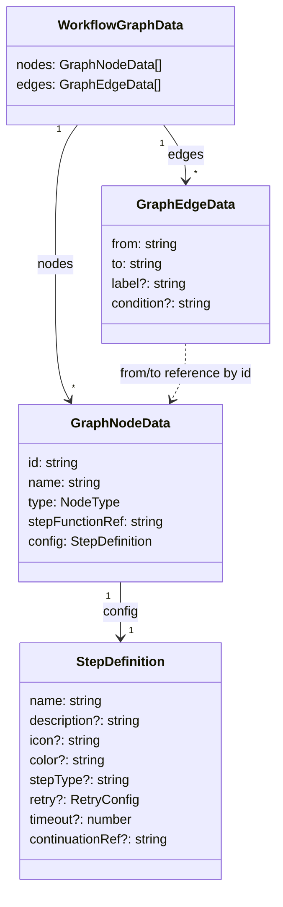
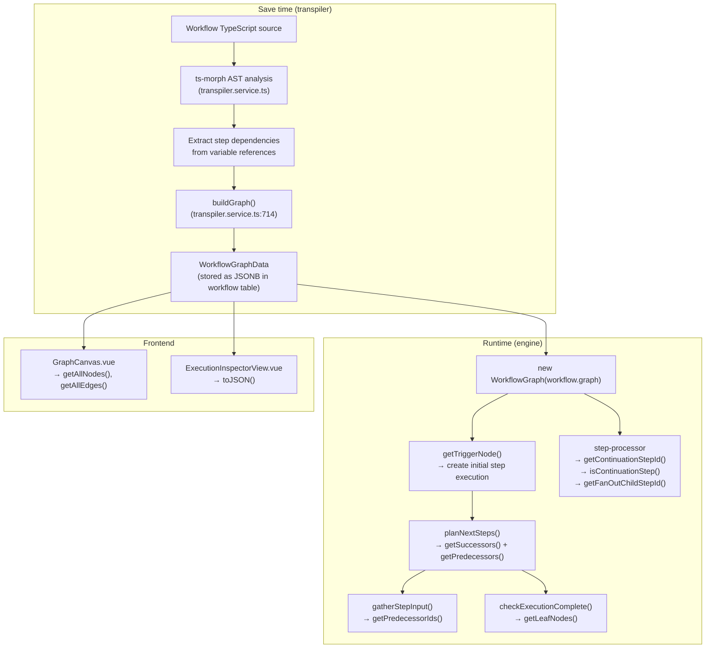
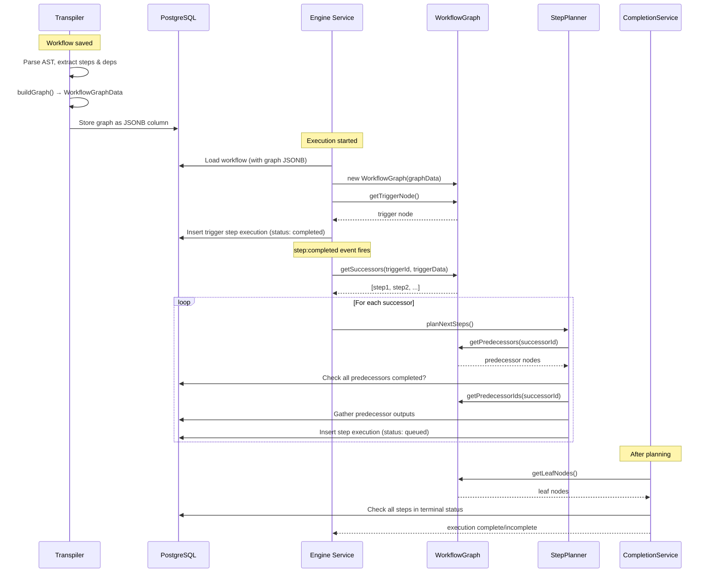

# Graph Module Documentation

## Overview

The `graph/` module provides the in-memory representation of a workflow as a
directed acyclic graph (DAG). Its single class, `WorkflowGraph`, wraps a
plain-JSON `WorkflowGraphData` structure (persisted in the database as a JSONB
column on the `workflow` entity) and exposes query methods that the engine
uses at runtime to:

1. **Locate the entry point** of a workflow (the trigger node).
2. **Resolve predecessors and successors** of any step, including conditional
   edge evaluation and error edge exclusion.
3. **Determine leaf nodes** so the completion service knows which steps'
   outputs to use as the execution result.
4. **Resolve data-producing predecessors** through transparent sleep nodes.
5. **Resolve error handlers** for try/catch support via `__error__` edges.
6. **Generate deterministic IDs** for batch child steps.
7. **Validate the graph is a DAG** (cycle detection via Kahn's algorithm).

The module is intentionally small and stateless. It does not build the graph
itself -- that responsibility belongs to the transpiler. The graph module only
_reads_ a pre-built `WorkflowGraphData` object.

---

## Architecture

### Workflows as DAGs

A workflow is modeled as a directed acyclic graph where:

- **Nodes** represent discrete units of work (triggers, steps, conditions,
  approvals, end markers).
- **Edges** represent data/control flow between nodes. An edge may carry an
  optional `condition` -- a JavaScript expression evaluated at runtime against
  the source node's output.

The graph is always rooted at a single **trigger node** (type `'trigger'`).
Steps with no explicit dependencies are connected directly to the trigger.
Steps with dependencies are connected to the step(s) whose output they
consume. The transpiler infers these dependencies from variable references in
the workflow script (see `docs/engine-v2-plan.md`, "Step Isolation and
Variable Resolution").

### The `WorkflowGraph` class and its responsibilities

`WorkflowGraph` (`workflow-graph.ts`) is a thin query layer over
`WorkflowGraphData`. It is constructed once per engine operation (execution
start, step completion, resume, cancellation) by hydrating the JSONB column:

```typescript
const graph = new WorkflowGraph(workflow.graph as WorkflowGraphData);
```

Its responsibilities, grouped by consumer:

| Consumer | Methods Used | Purpose |
|----------|-------------|---------|
| `engine.service.ts` | `getTriggerNode()` | Find the trigger to create the initial step execution |
| `step-planner.service.ts` | `getSuccessors()`, `getPredecessors()`, `getDataPredecessors()`, `getPredecessorIds()` | Plan which steps to queue after a step completes; gather predecessor outputs as input (resolving through sleep nodes) |
| `completion.service.ts` | `getLeafNodes()` | Determine the execution result from the last leaf step's output |
| `event-handlers.ts` | `getSuccessors()`, `getErrorHandlers()` | Check for successors before pausing; route failures to catch handlers |
| `batch-executor.service.ts` | `getBatchChildStepId()` | Generate deterministic IDs for batch child step executions |
| Frontend (`GraphCanvas.vue`, `ExecutionGraph.vue`) | `getAllNodes()`, `getAllEdges()`, `toJSON()` | Render the workflow graph in the UI |

---

## Types

All types are defined in `graph.types.ts` (22 lines).

### `WorkflowGraphData` (lines 3-6)

The top-level serializable structure stored in the database.

```typescript
interface WorkflowGraphData {
    nodes: GraphNodeData[];
    edges: GraphEdgeData[];
}
```

- `nodes` -- ordered list of all graph nodes. The transpiler always places
  the trigger node first (`transpiler.service.ts`, line 719-725).
- `edges` -- ordered list of directed edges. Order reflects the declaration
  order of steps in the source script.

### `GraphNodeData`

Represents a single node in the graph.

| Field | Type | Description |
|-------|------|-------------|
| `id` | `string` | Stable, deterministic identifier derived from the step name via `sha256(stepName)`. |
| `name` | `string` | Human-readable display name shown on the canvas. |
| `type` | `'trigger' \| 'step' \| 'batch' \| 'condition' \| 'approval' \| 'sleep' \| 'trigger-workflow' \| 'end'` | Discriminator for node behavior. The transpiler emits `'trigger'`, `'step'`, `'batch'`, `'sleep'`, and `'trigger-workflow'` nodes. `'condition'` and `'approval'` are set via the step definition's `stepType`. |
| `stepFunctionRef` | `string` | Reference to the compiled step function in the transpiled module (e.g., `step_fetchData`). Used by `step-processor.service.ts` to load and invoke the function. |
| `config` | `GraphStepConfig` | Step metadata including retry configuration, timeout, display hints (icon, color, description), sleep duration, batch failure strategy, and target workflow name. |

### `GraphEdgeData`

Represents a directed edge from one node to another.

| Field | Type | Description |
|-------|------|-------------|
| `from` | `string` | Source node ID. |
| `to` | `string` | Target node ID. |
| `label` | `string \| undefined` | Optional display label (e.g., `'true'`/`'false'` for conditional branches). Not used by the engine at runtime. |
| `condition` | `string \| undefined` | Optional JavaScript expression evaluated with the source step's output bound as `output`. If absent, the edge is unconditional. The special value `'__error__'` marks error edges for try/catch support -- these are excluded from normal successor resolution and only followed when a step fails. |

### `GraphStepConfig`

Runtime configuration stored in graph nodes. This is a subset of SDK
`StepDefinition` properties relevant at runtime, plus fields for specialized
node types.

| Field | Type | Description |
|-------|------|-------------|
| `name` | `string` | Step display name. |
| `description` | `string` | Step description (subtitle). |
| `icon` | `string` | Lucide icon name. |
| `color` | `string` | Hex color for canvas stripe. |
| `stepType` | `'step' \| 'approval' \| 'condition' \| 'sleep' \| 'batch'` | Step type for special behavior. |
| `retryConfig` | `RetryConfig` | Retry policy. |
| `timeout` | `number` | Step timeout in milliseconds. |
| `retriableErrors` | `string[]` | Error codes that trigger retry. |
| `retryOnTimeout` | `boolean` | Whether to retry on timeout. |
| `sleepMs` | `number` | Sleep duration for sleep nodes. |
| `waitUntilExpr` | `string` | Raw expression for waitUntil nodes. |
| `workflow` | `string` | Target workflow name for trigger-workflow nodes. |
| `onItemFailure` | `'fail-fast' \| 'continue' \| 'abort-remaining'` | Batch failure strategy. |

### Type relationships



---

## WorkflowGraph Implementation

File: `workflow-graph.ts`

### Construction and Validation

The class takes a `WorkflowGraphData` object and stores it as a private field.
On construction, it calls `validate()` which performs **cycle detection** using
Kahn's algorithm (topological sort via in-degree reduction). If a cycle is
detected, it throws an error describing the cycle path with node names and IDs.
This is O(V + E) and prevents infinite loops in step planning.

### Node lookup

- **`getTriggerNode()`** (lines 12-16): Linear scan of `nodes` for `type ===
  'trigger'`. Throws if none found. Assumes exactly one trigger per workflow
  (returns the first match).
- **`getNode(stepId)`** (lines 18-20): Linear scan by `id`. Returns
  `undefined` if not found.
- **`getNodeOrFail(stepId)`** (lines 22-26): Same as `getNode` but throws on
  miss.
- **`getAllNodes()`** (lines 53-55): Returns a shallow copy of the nodes
  array.

### Predecessor resolution

- **`getPredecessors(stepId)`** (lines 28-31): Filters edges where `to ===
  stepId`, collects source IDs, then filters nodes matching those IDs.
  Returns full `GraphNodeData` objects.
- **`getPredecessorIds(stepId)`** (lines 33-35): Same edge filter, but
  returns only the string IDs. Used by `gatherStepInput()` to query the
  database.

Both methods return only **direct** (immediate) predecessors, not transitive
ancestors.

### Successor resolution

- **`getSuccessors(stepId, stepOutput?)`**: Filters edges where
  `from === stepId`, **excludes error edges** (condition `'__error__'`), then
  applies `evaluateCondition()` to each edge's `condition` string using the
  provided `stepOutput`. Only edges whose conditions evaluate to `true` (or
  have no condition) are included. Returns full `GraphNodeData` objects.
- **`getSuccessorEdges(stepId)`**: Returns raw edge data without condition
  evaluation or error edge filtering. Used when the caller needs edge metadata
  (labels, conditions) without filtering.

### Leaf node detection

- **`getLeafNodes()`** (lines 48-51): Computes the set of all node IDs that
  appear as `from` in any edge, then returns nodes NOT in that set. These
  are nodes with no outgoing edges -- the terminal points of the workflow.

### Data-producing predecessor resolution

- **`getDataPredecessors(stepId)`**: Resolves predecessors through transparent
  sleep nodes. Sleep nodes do not produce data, so this method traces back
  recursively through sleep predecessors until it reaches data-producing nodes
  (steps, triggers, etc.). Used by `StepPlannerService.gatherStepInput()` to
  collect the correct predecessor outputs as step input.

### Error handler resolution (try/catch)

- **`getErrorHandlers(stepId)`**: Returns successor nodes connected via
  `'__error__'` condition edges. These are catch handler steps that should run
  when the given step fails. The event handler (`event-handlers.ts`) checks for
  error handlers before failing the execution, routing the error to catch steps
  instead.

### Batch child step support

- **`getBatchChildStepId(parentStepId, itemIndex)`**: Generates a deterministic
  12-character hex ID by hashing `{parentStepId}__batch__{itemIndex}` with
  SHA-256. Used by `BatchExecutorService` to create child step executions for
  each item in a batch.

### Condition evaluation

- **`evaluateCondition(condition, stepOutput)`** (lines 82-91): Private
  method. If `condition` is `undefined`, returns `true` (unconditional edge).
  Otherwise, constructs a `new Function('output', 'return Boolean(...)')` and
  invokes it with `stepOutput` as the `output` argument. Catches all errors
  and returns `false` -- meaning a malformed or throwing condition silently
  drops the edge.

### Serialization

- **`toJSON()`** (lines 78-80): Returns the underlying `WorkflowGraphData`
  reference (not a deep copy). This means mutations to the returned object
  will affect the graph's internal state.

### Helper: `sha256()` (lines 5-7)

Module-level utility. Computes SHA-256 of an input string and returns the
first 12 hex characters (6 bytes). Used by `getContinuationStepId` and
`getFanOutChildStepId` for deterministic ID generation.

---

## Data Flow



### Detailed execution sequence



---

## Comparison with Plan

The design document (`docs/engine-v2-plan.md`, lines 830-947) specifies the
graph module's interfaces and behavior. Below is a comparison of what the
implementation matches, where it deviates, and what is missing.

### What matches

| Plan specification | Implementation | Status |
|---|---|---|
| `WorkflowGraphData` with `nodes` and `edges` arrays | `graph.types.ts` lines 3-6 | Exact match |
| `GraphNodeData` fields: `id`, `name`, `type`, `stepFunctionRef`, `config` | `graph.types.ts` lines 8-14 | Match |
| `GraphEdgeData` fields: `from`, `to`, `label`, `condition` | `graph.types.ts` lines 16-21 | Match |
| Node type union: `'trigger' \| 'step' \| 'condition' \| 'approval' \| 'end'` | `graph.types.ts` line 11 | Match |
| `getTriggerNode()` finds first node with `type === 'trigger'` | `workflow-graph.ts` lines 12-16 | Match |
| `getPredecessors()` filters edges by `to` field | `workflow-graph.ts` lines 28-31 | Match |
| `getSuccessors()` filters by `from` + evaluates conditions | `workflow-graph.ts` lines 37-42 | Match |
| `getLeafNodes()` finds nodes with no outgoing edges | `workflow-graph.ts` lines 48-51 | Match |
| `evaluateCondition()` uses `new Function('output', ...)` | `workflow-graph.ts` lines 82-91 | Match |
| `getContinuationStepId()` uses `sha256(parentId__continuation__attempt)` | `workflow-graph.ts` lines 61-63 | Match |
| `getContinuationFunctionRef()` reads `config.continuationRef` | `workflow-graph.ts` lines 65-68 | Match |
| `isContinuationStep()` checks node absence from graph | `workflow-graph.ts` lines 70-72 | Match |
| `getFanOutChildStepId()` uses `sha256(parentId__fanout__itemIndex)` | `workflow-graph.ts` lines 74-76 | Match |

### Deviations

| Plan specification | Implementation | Nature of deviation |
|---|---|---|
| `getNode()` returns non-nullable `GraphNodeData` (plan uses `!` assertion) | Returns `GraphNodeData \| undefined` (line 18) | **Improvement.** The implementation is safer; a separate `getNodeOrFail()` method provides the throwing variant. |
| `evaluateCondition()` does not catch errors (plan code has no try/catch) | Wraps in try/catch, returns `false` on error (lines 84-90) | **Improvement.** Prevents a malformed condition from crashing the engine. |
| Plan's `StepConfig` interface has explicit fields (`retryConfig`, `timeout`, `display`, etc.) | Implementation reuses `StepDefinition` from `sdk/types.ts` as the config type | **Minor drift.** The SDK `StepDefinition` has the same fields under slightly different names (e.g., `retry` vs `retryConfig`). The transpiler maps between them (`transpiler.service.ts` lines 730-753). |
| Plan specifies step IDs as `sha256(stepFunctionBody + stepOptions)` (content-hash) | Transpiler currently uses name-based IDs (`step.id` derived from step name) | **Significant deviation.** The content-hash scheme enables cross-version comparison ("did this step change?"). The current name-based scheme does not support this. |

### Missing features from the plan

| Feature | Plan reference | Status |
|---|---|---|
| Topological sort / ordering method | Not explicitly in plan, but implied by DAG semantics | Not implemented. The engine relies on event-driven scheduling rather than pre-computed execution order, so this is not currently needed. |
| Cycle detection | Not mentioned in plan | Not implemented (see Issues below). |
| Dedicated `StepConfig` interface | Plan lines 849-856 | Not implemented; `StepDefinition` from SDK is used directly. |

---

## Issues and Improvements

### 1. ~~No cycle detection~~ (RESOLVED)

Cycle detection is now implemented. The `validate()` method is called at
construction time and uses Kahn's algorithm (topological sort via in-degree
reduction). If a cycle is detected, it traces the cycle path and throws an
error with descriptive node names and IDs.

### 2. O(n) linear scans for all lookups

**Severity: Low (currently), Medium (at scale)**

Every method (`getNode`, `getTriggerNode`, `getPredecessors`,
`getSuccessors`, `getLeafNodes`) performs linear scans over the `nodes` and
`edges` arrays. For typical workflows (5-50 nodes), this is fine. For large
generated workflows (hundreds of nodes, as in the `data-pipeline.ts`
benchmark), repeated calls during execution planning could become noticeable.

**Recommendation:** Build index maps at construction time:

```typescript
private nodeById: Map<string, GraphNodeData>;
private edgesByFrom: Map<string, GraphEdgeData[]>;
private edgesByTo: Map<string, GraphEdgeData[]>;
```

This would make all lookups O(1) amortized. The one-time construction cost
is O(V + E).

### 3. `evaluateCondition` uses `new Function()` with no sandboxing

**Severity: Medium**

The `evaluateCondition` method (line 86) uses `new Function('output', ...)`
to evaluate condition strings. While the plan acknowledges this has "same
security posture as `Module._compile()`" and defers sandboxing to Phase 2,
it is worth noting:

- The condition string has access to the full global scope (`process`,
  `require` in CJS, `globalThis`, etc.).
- A malicious or buggy condition could cause side effects (e.g.,
  `output; process.exit(1)`).
- The `try/catch` on lines 84-90 catches synchronous errors but not
  asynchronous side effects.

**Recommendation:** When Phase 2 sandboxing is implemented, replace
`new Function` with a restricted evaluator (e.g., `vm.runInNewContext` with
a frozen global, or a purpose-built expression parser).

### 4. `toJSON()` returns a mutable reference

**Severity: Low**

`toJSON()` (line 79) returns `this.data` directly, not a deep copy. Callers
that mutate the returned object will corrupt the graph's internal state. The
`getAllNodes()` and `getAllEdges()` methods return shallow copies of the
arrays (lines 54, 59), but the individual node/edge objects within those
arrays are still shared references.

**Recommendation:** Either document that the returned data is read-only, or
return a deep clone (e.g., `structuredClone(this.data)`). For performance,
the documentation approach is preferable.

### 5. `isContinuationStep` relies on absence heuristic

**Severity: Low**

`isContinuationStep(stepId)` (line 71) returns `true` for _any_ step ID not
found in the graph -- not just continuation steps. A typo in a step ID would
be misidentified as a continuation step. This is a design choice (the method
is only called with IDs known to exist in `workflow_step_execution`), but it
is fragile.

**Recommendation:** Consider a more explicit check, such as verifying the
ID matches the `__continuation__` or `__fanout__` hash pattern, or storing
a `parentStepId` on continuation step execution records and checking that
instead.

### 6. No support for dynamic graph modification

**Severity: Low (by design)**

The graph is immutable after construction. There is no API to add or remove
nodes/edges at runtime. This is intentional -- the plan specifies that the
graph is "static" and "persisted at save time." However, this means:

- Workflows cannot add steps dynamically based on runtime data (e.g., a
  "for each" that creates N parallel branches is handled via fan-out child
  step IDs, not graph modification).
- Error recovery branches cannot be added at runtime.

This is acceptable for the current architecture. Fan-out and continuations
are modeled as synthetic child steps with generated IDs, which avoids graph
mutation.

### 7. No transitive predecessor/successor queries

**Severity: Low**

`getPredecessors()` and `getSuccessors()` return only _direct_ (immediate)
neighbors. There is no method to get all transitive ancestors or descendants
of a node. The engine does not currently need this (the step planner only
checks immediate predecessors), but it could be useful for:

- Debugging: "what are all the steps that must complete before step X?"
- Cancellation: "what steps are downstream of the failed step?"

**Recommendation:** Add `getAncestors(stepId)` and `getDescendants(stepId)`
methods using BFS/DFS if needed. The existing `n8n-workflow` package has
`getParentNodes` and `getChildNodes` utilities that could serve as reference.

### 8. Multiple triggers not supported

**Severity: Low**

`getTriggerNode()` (line 13) returns the _first_ node with `type ===
'trigger'`. If a workflow has multiple triggers (e.g., webhook + schedule),
only the first would be returned. The plan does not explicitly address
multi-trigger workflows for v2, so this is acceptable for now.

### 9. Test coverage gaps

**Severity: Low**

The test file (`__tests__/workflow-graph.test.ts`, 445 lines) covers:

| Feature | Covered | Lines |
|---------|---------|-------|
| `getTriggerNode()` (happy + error) | Yes | 87-109 |
| `getNode()` (found + missing) | Yes | 112-126 |
| `getNodeOrFail()` (found + missing) | Yes | 128-139 |
| `getPredecessors()` (linear, parallel, root) | Yes | 141-162 |
| `getPredecessorIds()` (parallel, root) | Yes | 164-176 |
| `getSuccessors()` (linear, parallel, conditional, leaf, error) | Yes | 178-220 |
| `getSuccessorEdges()` (conditional, leaf) | Yes | 222-236 |
| `getLeafNodes()` (linear, parallel, conditional) | Yes | 238-260 |
| `getAllNodes()` (copy semantics) | Yes | 262-271 |
| `getAllEdges()` (copy semantics) | Yes | 273-281 |
| `getContinuationStepId()` (determinism, uniqueness, format) | Yes | 283-310 |
| `getContinuationFunctionRef()` (present, absent, missing node) | Yes | 312-329 |
| `isContinuationStep()` (graph node vs non-node) | Yes | 331-343 |
| `getFanOutChildStepId()` (determinism, uniqueness, format, vs continuation) | Yes | 345-372 |
| `evaluateCondition()` (unconditional, truthy, falsy, invalid, boundary) | Yes | 374-428 |
| `toJSON()` (identity, structure) | Yes | 430-444 |

**Gaps:**

- **Empty graph**: No test for a graph with zero nodes and zero edges.
  `getLeafNodes()` and `getAllNodes()` would return empty arrays, but
  `getTriggerNode()` would throw. This edge case is worth documenting.
- **Duplicate edges**: No test for graphs with duplicate edges (same
  `from`/`to` pair). The current implementation would return duplicate
  successors/predecessors.
- **Self-loops**: No test for an edge where `from === to`. This would
  cause `getPredecessors` and `getSuccessors` to both return the same node.
- **Disconnected nodes**: No test for nodes with no incoming or outgoing
  edges (other than the trigger). `getLeafNodes()` would correctly identify
  them, but they would never be reached during execution.
- **Large graph performance**: No benchmark or stress test for graphs with
  hundreds of nodes. The `data-pipeline.ts` example has 10 steps, but
  real-world fan-out scenarios could be much larger.
- **`toJSON()` mutation**: No test verifying that mutating the `toJSON()`
  result affects the internal state (or documenting that it should not).
