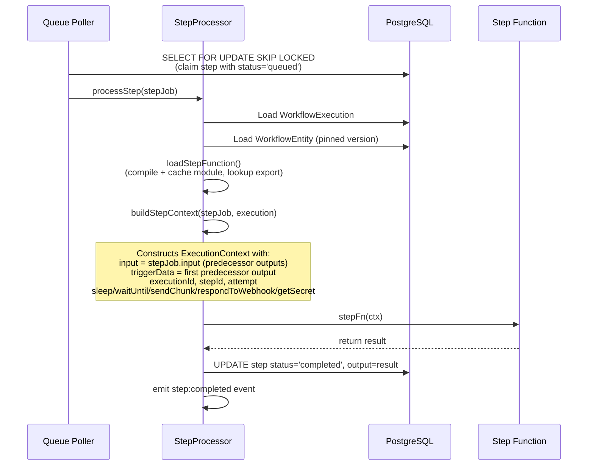
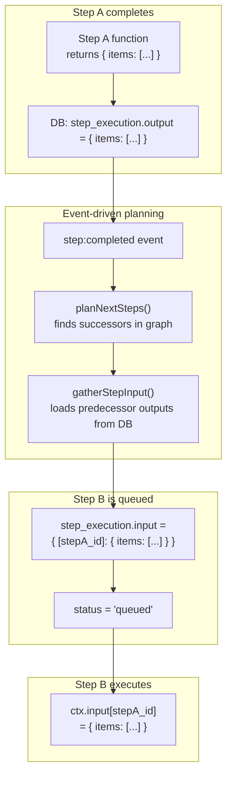
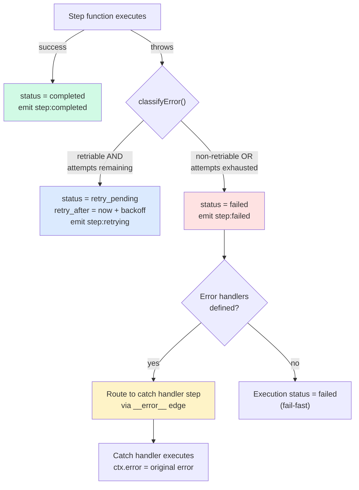

# SDK Reference

## Overview

The SDK (`@n8n/engine/sdk`) is the public API surface for workflow script authors.
It provides everything needed to define a workflow as TypeScript code: a
`defineWorkflow` factory function, an `ExecutionContext` interface injected at
runtime, trigger helpers (currently `webhook`), Zod-based webhook schema
validation with type inference, batch processing via `ctx.batch()`,
cross-workflow triggering via `ctx.triggerWorkflow()`, and a `NonRetriableError`
class for explicit failure signalling.

Workflow scripts are plain TypeScript files that `export default` a
`WorkflowDefinition` produced by `defineWorkflow`. The engine transpiles these
scripts at save time into isolated, per-step functions that execute as
independent queue jobs. The SDK types define the contract between script authors
and the transpiler/engine -- they describe what authors can write, and what the
engine will inject at runtime.

**Source files:**

| File | Purpose |
|------|---------|
| `types.ts` | All TypeScript interfaces: StepDefinition, BatchStepDefinition, BatchResult, TriggerWorkflowConfig, ExecutionContext, WebhookSchemaConfig, InferTriggerData, WorkflowDefinition, WorkflowSettings |
| `errors.ts` | NonRetriableError class for explicit non-retriable failures |
| `index.ts` | Re-exports + `defineWorkflow` and `webhook` factory functions (with generic Zod schema support) |
| `__tests__/sdk.test.ts` | Unit tests for all exported symbols |

---

## API Surface

### Exported Functions

#### `defineWorkflow(def: WorkflowDefinition): WorkflowDefinition`

**File:** `index.ts`, lines 5-7

Identity function that accepts and returns a `WorkflowDefinition`. It serves as
a type-safe factory -- it provides autocompletion and type checking without
transforming the input. This is a deliberate design choice: the function exists
for IDE ergonomics, not runtime behavior.

```typescript
import { defineWorkflow } from '@n8n/engine/sdk';

export default defineWorkflow({
  name: 'My Workflow',
  triggers: [],
  async run(ctx) {
    // ...
  },
});
```

#### `webhook(path, config?): WebhookTriggerConfig`

**File:** `index.ts`, lines 9-24

Factory function that creates a `WebhookTriggerConfig` with sensible defaults:
- `method` defaults to `'POST'`
- `responseMode` defaults to `'lastNode'`

```typescript
import { defineWorkflow, webhook } from '@n8n/engine/sdk';

export default defineWorkflow({
  name: 'Echo',
  triggers: [webhook('/echo', { method: 'POST', responseMode: 'respondWithNode' })],
  async run(ctx) { /* ... */ },
});
```

### ExecutionContext

**File:** `types.ts`

The `ExecutionContext` is injected as the `ctx` argument to the workflow's
`run(ctx)` method. It provides data, metadata, and SDK methods for interacting
with the engine. The context is generic over `TTriggerData`, which defaults to
`Record<string, unknown>` but is inferred from Zod schemas when using
`webhook()` with a `schema` option.

| Property / Method | Type | Description |
|-------------------|------|-------------|
| `input` | `Record<string, unknown>` | Predecessor step outputs keyed by step ID. The transpiler rewrites cross-step variable references to `ctx.input[stepId]` lookups. |
| `triggerData` | `TTriggerData` | HTTP request data (body, headers, query, method, path) when triggered by a webhook. Type-safe when Zod schemas are provided. |
| `error` | `unknown` | The error from a failed try-block step. Set by the engine for catch handler steps (try/catch support). |
| `batchItem` | `unknown` | The current batch item. Set by the engine when executing a batch child step. |
| `executionId` | `string` | UUID of the current workflow execution. |
| `stepId` | `string` | Content-hash ID of the currently executing step. |
| `attempt` | `number` | Current attempt number (1-based). Increments on retry. |
| `step(def, fn)` | `<T>(StepDefinition, () => Promise<T>) => Promise<T>` | Declares and executes a named step. The transpiler extracts these calls to build the workflow graph. |
| `batch(def, items, fn)` | `<T, I>(BatchStepDefinition, I[], (item: I, index: number) => Promise<T>) => Promise<BatchResult<T>[]>` | Declares a batch step that fans out items as individual child step executions. Supports three failure strategies. |
| `sendChunk(data)` | `(data: unknown) => Promise<void>` | Streams incremental data to connected clients via SSE. Not persisted -- only the step's final return value is stored. |
| `respondToWebhook(response)` | `(WebhookResponse) => Promise<void>` | Sends an HTTP response to the webhook caller. Used with `responseMode: 'respondWithNode'`. |
| `sleep(ms)` | `(ms: number) => Promise<void>` | Durably pauses execution for `ms` milliseconds. Handled at compile time -- the transpiler creates a sleep graph node. |
| `waitUntil(date)` | `(date: Date) => Promise<void>` | Durably pauses execution until the given date. Same compile-time mechanism as `sleep`. |
| `triggerWorkflow(config)` | `(TriggerWorkflowConfig) => Promise<unknown>` | Triggers another workflow by name and waits for its result. Creates a trigger-workflow graph node at compile time. |
| `getSecret(name)` | `(name: string) => string \| undefined` | Reads a secret by name. PoC implementation reads from `process.env`. |

### Error Types (SDK-level)

One error class exported from `errors.ts`:

| Class | Purpose |
|-------|---------|
| `NonRetriableError` | Explicit opt-out of retry for user code errors |

Note: `ctx.sleep()` and `ctx.waitUntil()` are now handled at compile time by
the transpiler (creating sleep graph nodes) rather than through error-based
control flow signals. The `SleepRequestedError` and `WaitUntilRequestedError`
classes have been removed.

### Trigger Types

**File:** `types.ts`

The `TriggerConfig.type` discriminant supports three values:

| Type | Description | Factory Function |
|------|-------------|-----------------|
| `'webhook'` | HTTP endpoint trigger. Extended by `WebhookTriggerConfig` with path, method, responseMode, and optional Zod schema. | `webhook()` |
| `'manual'` | Explicit manual trigger. Every workflow can be triggered manually even without declaring this. | None (use `{ type: 'manual', config: {} }`) |
| `'poll'` | Polling trigger (declared in the type union but no factory function exists yet). | **Not implemented** |

---

## Type Definitions

### `StepDefinition`

**File:** `types.ts`

Configures a single step's display, behavior, and retry policy. Passed as the
first argument to `ctx.step()`.

| Property | Type | Required | Description |
|----------|------|----------|-------------|
| `name` | `string` | Yes | Display name shown on the canvas. Used by the transpiler to identify the step. |
| `description` | `string` | No | Subtitle shown below the name on the canvas. |
| `icon` | `string` | No | Lucide icon name (e.g., `'globe'`, `'database'`, `'zap'`). |
| `color` | `string` | No | Hex color for the canvas stripe (e.g., `'#3b82f6'`). |
| `stepType` | `'step' \| 'approval' \| 'condition'` | No | Controls special behavior. `'approval'` pauses execution until human approve/decline via API. |
| `retry` | `RetryConfig` | No | Retry policy. If omitted, no retries (maxAttempts defaults to 1 in the engine). |
| `timeout` | `number` | No | Step timeout in milliseconds. Engine default is 300,000ms (5 minutes). |
| `retriableErrors` | `string[]` | No | Error codes that should trigger retry regardless of the error classifier's default. |
| `retryOnTimeout` | `boolean` | No | Whether to retry when the step times out. Default: `false`. |

**Example** (from `05-retry-backoff.ts`):
```typescript
await ctx.step(
  {
    name: 'Call Flaky API',
    icon: 'refresh-cw',
    color: '#f97316',
    description: 'Retries on failure with backoff',
    retry: { maxAttempts: 3, baseDelay: 500, maxDelay: 5000, jitter: false },
    timeout: 10000,
  },
  async () => { /* ... */ },
);
```

### `BatchStepDefinition`

**File:** `types.ts`

Configures a batch step that processes an array of items. Passed as the first
argument to `ctx.batch()`. Each item is executed as an independent child step
execution.

| Property | Type | Required | Description |
|----------|------|----------|-------------|
| `name` | `string` | Yes | Display name shown on the canvas. |
| `description` | `string` | No | Subtitle shown below the name. |
| `icon` | `string` | No | Lucide icon name. |
| `color` | `string` | No | Hex color for the canvas stripe. |
| `onItemFailure` | `'fail-fast' \| 'continue' \| 'abort-remaining'` | No | Strategy when an individual item fails. Default: `'continue'`. |
| `retry` | `RetryConfig` | No | Retry policy for individual item processing. |
| `timeout` | `number` | No | Timeout per item in milliseconds. |

**Example** (from `18-batch-processing.ts`):
```typescript
const results = await ctx.batch(
  { name: 'Process Items', onItemFailure: 'continue' },
  items,
  async (item) => {
    return { processed: item };
  },
);
```

### `BatchResult<T>`

**File:** `types.ts`

Result for a single batch item, following the `Promise.allSettled` pattern.

| Property | Type | Description |
|----------|------|-------------|
| `status` | `'fulfilled' \| 'rejected'` | Whether the item succeeded or failed. |
| `value` | `T` | The item's return value (only present when `status === 'fulfilled'`). |
| `reason` | `Error` | The error (only present when `status === 'rejected'`). |

### `TriggerWorkflowConfig`

**File:** `types.ts`

Configuration for `ctx.triggerWorkflow()` which starts a child workflow
execution and awaits its result.

| Property | Type | Required | Description |
|----------|------|----------|-------------|
| `workflow` | `string` | Yes | Target workflow name (resolved to ID at runtime). |
| `input` | `Record<string, unknown>` | No | Input data passed to the child workflow. |
| `timeout` | `number` | No | Timeout in milliseconds for the child execution. |

**Example** (from `19-trigger-workflow.ts`):
```typescript
const result = await ctx.triggerWorkflow({
  workflow: 'Data Processing Pipeline',
  input: { data: rawData },
  timeout: 30000,
});
```

### `RetryConfig`

**File:** `types.ts`, lines 24-29

| Property | Type | Required | Description |
|----------|------|----------|-------------|
| `maxAttempts` | `number` | Yes | Total attempts including the first try. |
| `baseDelay` | `number` | Yes | Base delay in ms for exponential backoff. |
| `maxDelay` | `number` | No | Ceiling for the backoff delay. Engine default: 60,000ms. |
| `jitter` | `boolean` | No | Whether to add randomized jitter (0.5x-1.0x multiplier). |

### `WebhookResponse`

**File:** `types.ts`, lines 31-35

Response object passed to `ctx.respondToWebhook()`.

| Property | Type | Required | Description |
|----------|------|----------|-------------|
| `statusCode` | `number` | No | HTTP status code. Defaults to 200. |
| `body` | `unknown` | No | Response body (serialized as JSON). |
| `headers` | `Record<string, string>` | No | Custom response headers. |

**Example** (from `08-webhook-echo.ts`, lines 56-60):
```typescript
await ctx.respondToWebhook({
  statusCode: 200,
  headers: { 'X-Processed-By': 'n8n-engine' },
  body: result,
});
```

### `WebhookResponseMode`

**File:** `types.ts`, line 37

```typescript
type WebhookResponseMode = 'lastNode' | 'respondImmediately' | 'respondWithNode' | 'allData';
```

| Mode | Behavior |
|------|----------|
| `lastNode` | Wait for the workflow to complete, return the last step's output. Default. |
| `respondImmediately` | Return 202 Accepted immediately, continue execution in background. |
| `respondWithNode` | Wait for a step to call `ctx.respondToWebhook()`. |
| `allData` | Wait for completion, return all step outputs. |

### `TriggerConfig`

**File:** `types.ts`, lines 39-43

| Property | Type | Required | Description |
|----------|------|----------|-------------|
| `type` | `'webhook' \| 'manual' \| 'poll'` | Yes | Trigger discriminant. |
| `config` | `Record<string, unknown>` | Yes | Type-specific configuration. |
| `code` | `string` | No | Custom trigger code (reserved for future use). |

### `WebhookSchemaConfig`

**File:** `types.ts`

Defines Zod schemas for webhook request validation. When provided to the
`webhook()` factory, the transpiler converts the Zod schemas to JSON Schema
(via `zod-to-json-schema.ts`), which is stored in the trigger config and
validated at request time using Ajv.

| Property | Type | Required | Description |
|----------|------|----------|-------------|
| `body` | `ZodType` | No | Zod schema for the request body. |
| `query` | `ZodType` | No | Zod schema for query parameters. |
| `headers` | `ZodType` | No | Zod schema for request headers. |

**Type inference:** `InferTriggerData<S>` extracts TypeScript types from Zod
schemas, so `ctx.triggerData.body` is properly typed when schemas are provided.

**Example:**
```typescript
import { z } from 'zod';

webhook('/orders', {
  method: 'POST',
  schema: {
    body: z.object({
      orderId: z.string(),
      amount: z.number().min(0),
      priority: z.enum(['low', 'medium', 'high']).optional(),
    }),
  },
});
// ctx.triggerData.body is typed as { orderId: string; amount: number; priority?: 'low' | 'medium' | 'high' }
```

### `WebhookTriggerConfig`

**File:** `types.ts`

Extends `TriggerConfig` with `type: 'webhook'` and a typed `config` object.
Generic over `WebhookSchemaConfig` for type-safe trigger data inference.

| `config` Property | Type | Description |
|-------------------|------|-------------|
| `path` | `string` | URL path for the webhook endpoint. |
| `method` | `string` | HTTP method (GET, POST, PUT, etc.). |
| `responseMode` | `WebhookResponseMode` | How the engine responds to the webhook caller. Optional. |
| `schema` | `{ body?, query?, headers? }` | JSON Schema objects (transpiled from Zod at save time). Optional. |

The `_triggerData` phantom type field carries the inferred trigger data type
for TypeScript inference without being present at runtime.

### `WorkflowDefinition`

**File:** `types.ts`

The top-level definition object passed to `defineWorkflow`. Generic over the
triggers array type `T` to enable type-safe trigger data inference.

| Property | Type | Required | Description |
|----------|------|----------|-------------|
| `name` | `string` | Yes | Workflow display name. |
| `triggers` | `T extends TriggerConfig[]` | No | Trigger configurations. Manual trigger is always implicit. |
| `settings` | `WorkflowSettings` | No | Execution-level settings. |
| `run` | `(ctx: ExecutionContext<InferTriggerDataFromArray<T>>) => Promise<unknown>` | Yes | The workflow body. `ctx.triggerData` type is inferred from the triggers' Zod schemas. |

### `WorkflowSettings`

**File:** `types.ts`

| Property | Type | Required | Description |
|----------|------|----------|-------------|
| `executionMode` | `'queued' \| 'in-process'` | No | Execution strategy. `'queued'` uses the PostgreSQL queue (default). `'in-process'` would bypass the queue (not fully implemented). |

---

## Error Types

### `NonRetriableError`

**File:** `errors.ts`

Allows workflow script authors to explicitly mark an error as non-retriable,
bypassing the engine's error classifier. The error classifier
(`error-classifier.ts`) has explicit `instanceof NonRetriableError` handling
(classification rule 4) that returns `retriable: false`.

| Property | Type | Description |
|----------|------|-------------|
| `message` | `string` | Error message. |

### Sleep/WaitUntil

Sleep and waitUntil are no longer implemented via error-based control flow.
Instead, `ctx.sleep(ms)` and `ctx.waitUntil(date)` are handled at compile time
by the transpiler, which creates first-class `sleep` graph nodes. The engine's
step queue poller picks up sleep steps when their `waitUntil` timestamp has
passed. This approach eliminates the need for `SleepRequestedError` and
`WaitUntilRequestedError` classes.

**Example** (from `11-sleep-and-resume.ts`):
```typescript
await ctx.sleep(5000);  // Creates a sleep graph node -- process is freed
```

```typescript
await ctx.waitUntil(new Date(Date.now() + 5000));  // Same mechanism with absolute date
```

---

## Data Flow

### How a step function receives its ExecutionContext



### How step outputs flow to successor steps



### How errors are caught and handled by the engine



Note: Sleep and waitUntil are no longer handled through error-based control
flow. They are first-class graph nodes created by the transpiler. The step
queue poller picks up sleep nodes when their `waitUntil` timestamp has passed.

---

## Comparison with Plan

Comparing the SDK implementation against `docs/engine-v2-plan.md` (sections
"Workflow Script Format" at line 2222, "Step Isolation and Variable Resolution"
at line 518, and "Step Function Execution" at line 3412).

### `ctx.step()` signature: plan vs implementation

The plan shows a 2-3 argument signature:
```typescript
// Plan (line 2235)
ctx.step('fetch-data', async () => { ... });
ctx.step('process', async () => { ... }, { retry: { ... }, timeout: 60000 });
```

The implementation uses a 2-argument signature with a `StepDefinition` object:
```typescript
// Implementation (types.ts line 60)
ctx.step(definition: StepDefinition, fn: () => Promise<T>): Promise<T>
```

**Assessment:** The implementation is a deliberate evolution. Merging the step
name, display metadata (icon, color, description), and engine config (retry,
timeout) into a single `StepDefinition` object is cleaner than splitting them
across positional arguments. The plan's 3-argument form
`(name, fn, options?)` would require a separate type for display metadata or
lose it entirely. The current design is an improvement.

### Helper functions

**Plan (line 3506-3596):** Helper functions defined outside `run()` should be
included at module level in the compiled output. Steps can reference them,
and transitive dependencies are resolved.

**Implementation:** Fully supported. Example `03-helper-functions.ts`
demonstrates `slugify`, `buildUrl`, and `categorize` (which calls `slugify`)
being used from within steps. The transpiler handles this correctly.

### Trigger types

**Plan (line 2231):** Shows `webhook('/endpoint', { method: 'POST' })` usage.

**Implementation:** Matches. The `webhook()` factory function (index.ts,
lines 9-24) produces a `WebhookTriggerConfig` exactly as planned.

**Missing:** The `'poll'` trigger type is declared in the `TriggerConfig`
type union (types.ts line 40) but has no factory function, no extended
config interface (analogous to `WebhookTriggerConfig`), and no example
workflows demonstrate it.

### `ctx.sleep()` and `ctx.waitUntil()`

**Plan (line 3828-3835):** Both accept an optional `intermediateState` parameter.

**Implementation (types.ts lines 63-64):** The SDK type signatures do NOT
expose the `intermediateState` parameter:
```typescript
sleep: (ms: number) => Promise<void>;
waitUntil: (date: Date) => Promise<void>;
```

However, the actual runtime implementation in `step-processor.service.ts`
(lines 445-452) accepts `intermediateState` as a second argument:
```typescript
sleep: async (ms: number, intermediateState?: unknown) => { ... }
waitUntil: async (date: Date, intermediateState?: unknown) => { ... }
```

**Assessment:** This is correct. The `intermediateState` parameter is an
internal concern injected by the transpiler when it rewrites `ctx.sleep()`
calls. Workflow script authors call `await ctx.sleep(5000)` and the transpiler
handles intermediate state capture. The SDK type intentionally hides the
internal parameter.

### `ctx.getSecret()`

**Plan (line 3838):** `getSecret: (name: string) => process.env[name]`.

**Implementation:** Matches. PoC reads from `process.env`.

### `ctx.sendChunk()` and `ctx.respondToWebhook()`

**Plan (lines 3806-3823):** Both are documented.

**Implementation:** Matches. Both are implemented in `buildStepContext()`
(step-processor.service.ts lines 421-439) and emitting events via the event bus.

### Error hierarchy

**Plan (lines 1607-1651):** Defines a full `EngineError` hierarchy with
`StepTimeoutError`, `HttpError`, `WorkflowNotFoundError`,
`StepFunctionNotFoundError`, and `NonRetriableError`, all extending
`EngineError`.

**Implementation:** The engine-level errors (`EngineError`, `StepTimeoutError`,
`HttpError`, `StepFunctionNotFoundError`) are implemented in
`src/engine/errors/`. The SDK's `NonRetriableError` extends plain `Error`
(not `EngineError`), but the error classifier has explicit handling for it.

### Missing features from the plan

| Feature | Plan location | Status |
|---------|---------------|--------|
| Poll trigger | types.ts | Type declared, no factory or implementation |
| Fan-out / fan-in | Plan line 2140 | **Implemented** as `ctx.batch()` with `BatchExecutorService` |
| Per-workflow dependency management | Plan line 3728 | Phase 2, not started |
| `executionMode: 'in-process'` | types.ts | Type declared, no implementation |
| Source map remapping | Plan line 3843 | `remapStack()` is a no-op placeholder |

### Features implemented beyond the plan

| Feature | Description |
|---------|-------------|
| `ctx.batch()` | Batch processing with three failure strategies (fail-fast, continue, abort-remaining) |
| `ctx.triggerWorkflow()` | Cross-workflow triggering with timeout support |
| Zod webhook schemas | `WebhookSchemaConfig` with type inference via `InferTriggerData` |
| `ctx.error` | Error context for try/catch handler steps |
| `ctx.batchItem` | Current batch item context for batch child steps |
| `BatchStepDefinition` | Dedicated definition type for batch steps |
| `BatchResult<T>` | Typed result type following `Promise.allSettled` pattern |
| `TriggerWorkflowConfig` | Configuration type for cross-workflow triggers |

---

## Issues and Improvements

### 1. ~~`NonRetriableError` does not extend `EngineError`~~ (RESOLVED)

The error classifier now has explicit `instanceof NonRetriableError` handling
(classification rule 4) that correctly returns `retriable: false` with code
`'NON_RETRIABLE'` and category `'step'`. The `NonRetriableError` class still
extends `Error` (not `EngineError`), but the classifier handles it correctly.

### 2. `ctx.step()` type signature accepts `StepDefinition` but engine receives `string`

**File:** `types.ts`, line 60 vs `step-processor.service.ts`, line 416

The SDK declares:
```typescript
step: <T>(definition: StepDefinition, fn: () => Promise<T>) => Promise<T>;
```

But the runtime implementation in `buildStepContext` is:
```typescript
step: async <T>(_name: string, fn: () => Promise<T>): Promise<T> => {
    return await fn();
};
```

The parameter name `_name` and type `string` do not match the SDK's
`StepDefinition` type. Since this is the PoC runtime (the transpiler rewrites
`ctx.step()` calls into standalone exports), the mismatch has no runtime
consequence -- but it violates the `ExecutionContext` contract. If any code
path ever calls `ctx.step()` directly at runtime (e.g., in tests or in-process
mode), the type mismatch would surface.

**Fix:** Align the runtime signature to match the interface, even if the
implementation ignores the definition object.

### 3. `triggerData` getter returns incorrect data for multi-predecessor steps

**File:** `step-processor.service.ts`, lines 403-407

```typescript
get triggerData() {
    const keys = Object.keys(inputRecord);
    if (keys.length === 0) return {} as Record<string, unknown>;
    return (inputRecord[keys[0]] ?? {}) as Record<string, unknown>;
}
```

This returns the first predecessor's output, not necessarily the trigger data.
For a step with multiple predecessors (e.g., after a `Promise.all` merge), the
"first" key is non-deterministic and unlikely to be the trigger step's output.

The plan (line 3787-3798) explicitly addresses this:
```typescript
const triggerStepId = Object.keys(stepJob.input ?? {})
    .find(id => /* check if this step is the trigger */);
```

**Fix:** The runtime should identify the trigger step's ID (e.g., from the
graph or from a known sentinel key) and return that specific predecessor's
output. The current heuristic is fragile.

### 4. `TriggerConfig.config` is weakly typed

**File:** `types.ts`, lines 39-43

The base `TriggerConfig.config` is `Record<string, unknown>`. While
`WebhookTriggerConfig` narrows this, there is no `ManualTriggerConfig` or
`PollTriggerConfig` with specific fields. Code consuming `TriggerConfig[]`
(e.g., the workflow controller) must use type guards or casts.

**Fix:** Add typed configs for all trigger types. At minimum:
```typescript
interface ManualTriggerConfig extends TriggerConfig {
    type: 'manual';
    config: Record<string, never>;
}
interface PollTriggerConfig extends TriggerConfig {
    type: 'poll';
    config: { interval: number; /* ... */ };
}
```

### 5. `ExecutionContext.input` loses type information

**File:** `types.ts`, line 55

`input` is typed as `Record<string, unknown>`. Step function return types
are erased -- a downstream step accessing `ctx.input['stepId'].items` gets
no type checking. This is inherent to the per-step execution model (steps run
in separate processes with serialized data), but the SDK could provide a
typed accessor pattern.

**Improvement:** Consider a generic overload or a utility type:
```typescript
getInput<T>(stepId: string): T;
```
This would still be a cast at runtime, but would give authors a type-safe
escape hatch and make the intent explicit.

### 6. No validation in `defineWorkflow` or `webhook`

**File:** `index.ts`, lines 5-24

Neither function validates its input. `defineWorkflow` is an identity function;
`webhook` blindly constructs the config. Invalid inputs (empty name, invalid
path, negative retry counts) are not caught until transpile or execution time.

**Improvement:** Add runtime validation:
- `name` must be non-empty
- `webhook path` must start with `/`
- `RetryConfig.maxAttempts` must be >= 1
- `RetryConfig.baseDelay` must be > 0
- `timeout` must be > 0

This would give authors immediate, clear error messages instead of opaque
failures deep in the engine.

### 7. `StepDefinition.stepType` enum is incomplete

**File:** `types.ts`, line 11

The type is `'step' | 'approval' | 'condition'`, but the database's `StepType`
enum (referenced in the plan) also includes `'trigger'`. The `'condition'` type
is declared in the SDK but has no observable engine behavior -- steps with
`stepType: 'condition'` are treated identically to `'step'`.

**Fix:** Either implement `'condition'` behavior or remove it from the SDK type.
Undocumented, inert type members create confusion.

### 8. `WebhookResponseMode` is a type alias, not an enum

**File:** `types.ts`, line 37

Using a string literal union is fine for TypeScript, but makes it harder to
discover valid values at runtime (e.g., for validation, logging, or UI
dropdowns). The engine could benefit from a `WebhookResponseMode` object with
named constants, consistent with how trigger types are handled.

### 9. `WorkflowSettings` is nearly empty

**File:** `types.ts`, lines 75-78

Only `executionMode` is defined, and even that has no implementation for
`'in-process'`. The type exists as a placeholder. This is acceptable for a PoC
but should either be expanded with real settings (e.g., error behavior, global
timeout, retention policy) or removed to avoid confusion.

### 10. ~~Sleep/waitUntil intermediate state is not type-safe~~ (RESOLVED)

Sleep and waitUntil are now first-class graph nodes handled at compile time
by the transpiler. The `SleepRequestedError` and `WaitUntilRequestedError`
classes have been removed. There is no longer an intermediate state concern.

### 11. No `poll` trigger factory function

**File:** `index.ts`

A `webhook()` factory exists but there is no corresponding `poll()` factory
for the `'poll'` trigger type declared in `TriggerConfig.type`. Authors
constructing poll triggers must use raw objects:

```typescript
triggers: [{ type: 'poll', config: { interval: 60000 } }]
```

**Fix:** Add a `poll()` factory analogous to `webhook()`.

### 12. Breaking change risk: `ctx.step()` first argument

The plan used a string name as the first argument to `ctx.step()`. The
implementation uses a `StepDefinition` object. Any migration tooling or
documentation referencing the plan's format will break. Since this is a PoC,
the risk is low, but it should be noted for any future API stabilization effort.

### 13. ~~Test coverage gap: `NonRetriableError` classification~~ (RESOLVED)

The error classifier now has explicit `instanceof NonRetriableError` handling,
and the error classifier test file (`engine/errors/__tests__/error-classifier.test.ts`)
covers this classification path.
