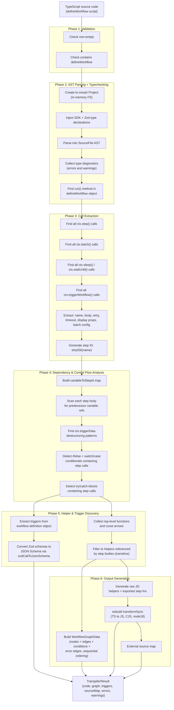

# Transpiler Module Documentation

Staff engineering review of `packages/@n8n/engine/src/transpiler/`.

## Overview

The transpiler converts user-authored TypeScript workflow scripts into
executable JavaScript step functions and a dependency graph. This is necessary
because the engine executes each step as an **independent, isolated unit of
work** -- steps do not share an in-process scope. A workflow script written as
a single `run()` function with shared variables must be decomposed into
per-step exports that receive predecessor outputs explicitly through
`ctx.input[stepId]`.

The transpiler runs **at workflow save time**, not at execution time. Its
outputs -- compiled JS code, a DAG graph, and a source map -- are persisted in
the database and reused on every execution of that workflow version.

### Files

| File | Purpose |
|------|---------|
| `transpiler.service.ts` | Core transpilation logic: parsing, step/batch/sleep/triggerWorkflow extraction, typechecking, code generation |
| `zod-to-json-schema.ts` | Converts Zod AST expressions to JSON Schema for webhook schema validation |
| `source-map.service.ts` | Stack trace remapping placeholder |
| `index.ts` | Public barrel exports |
| `__tests__/transpiler.test.ts` | Vitest test suite |

## Architecture

### Pipeline: TS source to JS + source maps

The transpiler implements a multi-step pipeline in `TranspilerService.compile()`:

1. **Validate**: Reject empty source or source missing `defineWorkflow`.
2. **Parse + Typecheck**: Create an in-memory TypeScript project via
   `ts-morph`, inject SDK type declarations (including Zod types) for
   in-process typechecking, parse the source, and collect diagnostics.
   Type errors are returned as compilation errors before any further
   processing.
3. **Find step calls**: Walk the AST to locate all `ctx.step()` invocations,
   extract step metadata (name, function body, retry config, timeout,
   display properties, assigned variable, conditional/catch context).
4. **Find batch calls**: Walk the AST to locate all `ctx.batch()` invocations,
   extract batch metadata (name, items expression, per-item callback parameter,
   onItemFailure strategy, display properties).
5. **Find sleep calls**: Walk the AST to locate all `ctx.sleep()` and
   `ctx.waitUntil()` invocations, extract sleep duration or waitUntil expression.
6. **Find triggerWorkflow calls**: Walk the AST to locate all
   `ctx.triggerWorkflow()` invocations, extract target workflow name and config.
7. **Resolve dependencies**: Build a variable-to-step-ID mapping, then scan
   each step's function body for references to variables assigned from other
   steps. Also detect `ctx.triggerData` destructuring.
8. **Detect conditionals**: Find `if/else` and `switch/case` statements in
   `run()` that contain step calls, attach conditional metadata
   (`branch: 'then' | 'else'`, condition expression) to those steps.
9. **Detect try/catch**: Find `try/catch` blocks in `run()`, tag steps in
   the try block with their `tryStepIds`, and tag steps in the catch block
   with `catchParent` metadata. This generates `__error__` edges in the graph.
10. **Find helpers**: Discover top-level functions and `const`-assigned arrow
    functions, filter to only those referenced (directly or transitively) by
    step bodies.
11. **Extract triggers**: Parse `webhook()` calls from the workflow definition
    object literal, including Zod schema extraction via `zodCallToJsonSchema()`.
12. **Build graph**: Construct the `WorkflowGraphData` DAG with nodes for
    steps, batch steps, sleep nodes, trigger-workflow nodes, and edges
    including conditional and error edges. Steps are connected
    **sequentially by default** (source order), with explicit data
    dependencies overriding the default ordering.
13. **Generate code**: Emit helper functions at module level, then each step
    as an `exports.step_<id>` assignment. Compile through esbuild
    (TS-to-JS with source maps).

### Step function extraction and isolation

Each `ctx.step()` call in the user's script is extracted into a standalone
exported async function:

```
User writes:                           Transpiler emits:
─────────────                          ─────────────────
const data = await ctx.step(           exports.step_<sha256> = async function
  { name: 'fetch' },                     step_fetch(ctx) {
  async () => {                            return { value: 42 };
    return { value: 42 };              };
  }
);
```

The export name uses the pattern `step_<sha256(stepName)>` (line 829), and
the function name uses `step_<camelCase(stepName)>` (line 828) for
debuggability. Dependencies on predecessor outputs are injected at the top
of each function body as `const <varName> = ctx.input['<sourceStepId>']`
(lines 832-835).

### Graph derivation from source code

The graph is derived entirely from static analysis:

- **Nodes**: One node per `ctx.step()` call (type `'step'`), one per
  `ctx.batch()` call (type `'batch'`), one per `ctx.sleep()`/`ctx.waitUntil()`
  call (type `'sleep'`), one per `ctx.triggerWorkflow()` call (type
  `'trigger-workflow'`), plus an implicit `trigger` node.
- **Edges (sequential-by-default)**: Steps are connected in source order --
  each orchestrator call (step, batch, sleep, triggerWorkflow) connects to
  the previous one. Explicit data dependencies override the default ordering.
  Steps with no predecessors connect from the trigger node.
- **Conditions**: Steps inside `if/else` or `switch/case` blocks get
  `condition` annotations on their edges. The condition expression is
  rewritten to replace the source variable name with `output`.
- **Error edges**: Steps inside `try` blocks generate `__error__` edges
  connecting to their catch handler steps. These edges are excluded from
  normal successor resolution and only followed when a step fails.

## TranspilerService

### Input format

The transpiler expects a TypeScript module that calls `defineWorkflow()` with
an object containing a `run(ctx)` method. Inside `run()`, steps are defined
via `ctx.step(definition, fn)` where:

- `definition`: An object literal with a required `name` string property and
  optional `retry`, `timeout`, `stepType`, `icon`, `color`, `description`
  properties.
- `fn`: An arrow function or function expression (the step body).

The step definition object is the **first** argument and the function is the
**second** argument. This differs from the plan document which shows the
signature as `ctx.step(name, fn, options)` with three arguments (plan line
3443-3445). The implementation merged name and options into a single
definition object.

### Transformation steps in detail

**Step 1 -- Find `run()` method** (`findRunMethod`, lines 225-253):
Searches all `CallExpression` nodes for a `defineWorkflow()` call, then
looks for a `run` method or property assignment in the first argument's
object literal.

**Step 2 -- Find `ctx.step()` calls** (`findStepCalls`, lines 255-333):
For each `CallExpression` where the callee is `ctx.step` (checked via
`isCtxStepCall`, lines 347-358):
- Extracts the step `name` from the first argument's `name` property
  (only string literals and no-substitution template literals accepted;
  dynamic names are skipped -- line 279).
- Extracts the function body text (lines 360-377).
- Parses optional properties: `retry`, `timeout`, `stepType`, `icon`,
  `color`, `description`.
- Determines the assigned variable by walking up the AST from the call
  expression through optional `AwaitExpression` and `VariableDeclaration`
  nodes (lines 379-428). Handles both simple assignment and `Promise.all`
  array destructuring.
- Generates a deterministic step ID via `sha256(stepName)` (line 310).

**Step 3 -- Resolve dependencies** (`resolveStepDependencies`, lines
430-445):
For each step, scans the function body text with a regex word-boundary
match (`\b<varName>\b`) to detect references to variables assigned from
other steps. This is a **text-based** analysis, not an AST-based one --
see Issues section for implications.

**Step 4 -- Resolve trigger data** (`findTriggerDataVariables`, lines
452-478 and `resolveTriggerDataDependencies`, lines 484-494):
Finds `const { body, headers } = ctx.triggerData` destructuring patterns in
the `run()` method. If a step body references any of these variable names,
the transpiler injects `const { body, headers } = ctx.triggerData;` at the
top of that step function (line 839).

**Step 5 -- Detect conditionals** (`detectConditionals`, lines 496-576):
Finds `IfStatement` nodes in `run()`. For each:
- Extracts the condition expression text.
- Searches the condition for variable names that map to step outputs to
  determine the `conditionSourceStepId`.
- Tags step calls in the `then` block with `branch: 'then'` and step calls
  in the `else` block with `branch: 'else'`.
- Adds the condition source step as a dependency edge if not already present.

**Step 6 -- Find helper functions** (`findHelperFunctions`, lines
600-660):
Collects top-level function declarations and `const`-assigned arrow
functions from the source file. Filters to only include helpers that are
referenced by step bodies (directly or transitively through other helpers).
Uses regex word-boundary matching for reference detection.

**Step 7 -- Code generation** (`generateCode`, lines 812-852):
Emits helper functions at module level, then each step as an
`exports.step_<id>` assignment. Dependency injections are prepended to
each step body. The raw output still contains TypeScript annotations
from helpers.

**Step 8 -- esbuild compilation** (`compileWithEsbuild`, lines 854-872):
Runs `esbuild.transformSync()` with:
- `loader: 'ts'` (strips TypeScript annotations)
- `format: 'cjs'` (CommonJS output)
- `target: 'node18'`
- `sourcemap: 'external'`
- `sourcefile: 'workflow.ts'`

If esbuild fails, the raw code is returned without a source map (line
870) -- this is a **silent fallback** that should be an error instead.

### Output format

`TranspilerResult`:

| Field | Type | Description |
|-------|------|-------------|
| `code` | `string` | Executable CJS JavaScript with `exports.step_<id>` functions |
| `graph` | `WorkflowGraphData` | DAG with nodes and edges (stored in `workflow.graph` JSONB) |
| `triggers` | `TriggerConfig[]` | Extracted trigger configurations including webhook schemas (Zod -> JSON Schema) |
| `sourceMap` | `string \| null` | External source map JSON string |
| `errors` | `CompilationError[]` | Errors that prevent compilation (including type errors) |
| `warnings` | `CompilationError[]` | Non-blocking warnings |

### How step boundaries are identified

Step boundaries are identified by `ctx.step()` call expressions in the AST.
The transpiler recognizes calls where:
- The expression is a `PropertyAccessExpression` with name `step`
- The object is the identifier `ctx` (line 354)

Only `ctx.step` is recognized. Aliases like `const s = ctx.step; s(...)` or
indirect calls are not detected.

### How data dependencies are resolved

Dependencies are resolved by matching variable names in step function bodies
against a `variableToStepId` map (lines 186-189). The map is populated by
finding the variable name assigned from each `ctx.step()` call via
`findAssignedVariable()`. The matching is done with regex word-boundary
checks on the **raw text** of the function body, not through AST scope
analysis.

## Source Maps

### Generation

Source maps are generated by esbuild as an external source map (line 860).
The `sourcefile` is set to `'workflow.ts'` so the map references the
original TypeScript file name. The map is returned as a JSON string in
`TranspilerResult.sourceMap`.

### Usage for error tracing

The `source-map.service.ts` file (lines 1-13) contains a placeholder
`remapStackTrace()` function that currently **does nothing** -- it returns
the stack trace unmodified. The comment indicates that `source-map-support`
handles remapping at runtime when installed, but the actual integration is
not implemented in this module.

Per the plan (line 1811), the engine should use `source-map-support` to
translate stack traces automatically at runtime. The current implementation
stores the source map but does not wire it into the error reporting path.

### Accuracy concerns

The source maps map from the **esbuild output** back to the **intermediate
generated code** (the raw JS emitted by `generateCode()`), not to the
**original user TypeScript source**. The intermediate code has:
- Injected dependency lines (`const x = ctx.input[...]`)
- Reorganized step functions as exports
- Helper functions hoisted to module level

This means the source map does not accurately point back to the user's
original `.ts` file. The `sourcefile: 'workflow.ts'` setting tells esbuild
to label the source as `workflow.ts`, but the actual content esbuild
receives is the intermediate generated code, not the original TypeScript.

## Data Flow



### Step metadata extraction

For each `ctx.step()` or `ctx.batch()` call, the transpiler produces an
internal `StepDefinition` containing:

- `name`, `id` (sha256 of name)
- `functionBodyText` (raw text of the function body)
- `retryConfig`, `timeout`, `stepType`, `icon`, `color`, `description`
- `dependencies` (Map: variable name to source step ID)
- `triggerDataVars` (Set of referenced trigger data variable names)
- `assignedVariable` (the variable this step's output is assigned to)
- `conditionalParent` (if inside an if/else/switch: condition text, branch, source)
- `catchParent` (if inside a catch block: tryStepIds, catchVarName)
- `isBatch` (whether this is a `ctx.batch()` call)
- `batchConfig` (onItemFailure strategy)
- `batchItemParam` (the per-item callback parameter name)
- `batchItemsExpr` (the items expression text)
- `promiseAllGroupId` (if inside a `Promise.all`, the parallel group index)
- `line`, `column`, `bodyStartLine` (source positions for error reporting)
- `callNode` (the AST node reference)

Additionally, `SleepDefinition` and `TriggerWorkflowDefinition` internal types
capture `ctx.sleep()`/`ctx.waitUntil()` and `ctx.triggerWorkflow()` calls
respectively, with their own metadata (sleepMs, waitUntilExpr, workflow name,
dependencies, assigned variables).

All call types are unified into an `OrchestratorCall` union for sequential
ordering during graph construction.

### Graph structure derivation

The graph (`WorkflowGraphData`) is built in `buildGraph()`:

- **Trigger node**: Always added with `id: 'trigger'`, `type: 'trigger'`
- **Step nodes**: One per `ctx.step()` call, with `id: sha256(name)`,
  `type: 'step'`, `stepFunctionRef: 'step_<id>'`, config from step definition
- **Batch nodes**: One per `ctx.batch()` call, with `type: 'batch'` and
  `onItemFailure` config
- **Sleep nodes**: One per `ctx.sleep()`/`ctx.waitUntil()` call, with
  `type: 'sleep'` and `sleepMs`/`waitUntilExpr` config
- **Trigger-workflow nodes**: One per `ctx.triggerWorkflow()` call, with
  `type: 'trigger-workflow'` and `workflow` config
- **Sequential edges**: Steps are connected in source order by default
  (each orchestrator call connects to the previous one)
- **Data dependency edges**: Explicit variable references create edges that
  override sequential ordering
- **Conditional edges**: Steps inside `if/else` or `switch/case` blocks
  have `condition` properties on their edges
- **Error edges**: Steps inside `try` blocks generate edges with
  `condition: '__error__'` to their catch handler steps

## Comparison with Plan

Reference: `docs/engine-v2-plan.md`

### Step call signature

**Plan** (line 3443-3445): Three arguments --
`ctx.step(name, fn, options)` where name is a string literal, fn is the
step function, and options is an optional config object.

**Implementation**: Two arguments -- `ctx.step(definition, fn)` where
definition is an object literal containing `name` plus all options.

This is a deliberate simplification noted in the plan's PoC shortcuts
section.

### Step ID generation

**Plan** (line 3608): `id = sha256(functionBody + options)` --
content-addressable IDs.

**Implementation** (line 310): `id = sha256(stepName)` -- name-based IDs.

The plan's "implementation notes" section (line 3899) documents this
deviation: "Step IDs use `sha256(stepName)` -- Not `sha256(body + options)`
as originally planned. Simpler and more predictable for debugging."

### Source map implementation

**Plan** (line 1809): `sourcemap: 'inline'` with `keepNames: true`.

**Implementation** (line 860): `sourcemap: 'external'`. `keepNames` is not
set. The source map is stored separately (returned in `TranspilerResult`)
rather than inlined in the code.

### Source map error remapping

**Plan** (line 1811): Use `source-map-support` to translate stack traces
automatically at runtime.

**Implementation**: `remapStackTrace()` is a no-op placeholder (line 12 of
`source-map.service.ts`). Runtime error remapping is not implemented.

### Compilation error categories

**Plan** (lines 1771-1775): Five categories -- syntax errors, type errors,
structural errors, missing dependencies, variable resolution errors.

**Implementation**: Structural errors are checked (empty source, missing
`defineWorkflow`, missing `run()`, no steps, duplicate names). Type checking
is now implemented via ts-morph with injected SDK type declarations --
type errors from the TypeScript compiler are collected and returned as
compilation errors before code generation proceeds. Import resolution and
variable resolution validation are not yet implemented.

### Helper function purity enforcement

**Plan** (line 3593): "Helpers are pure functions -- they should not
reference `ctx`, step outputs, or mutable state (the transpiler can warn
about this)."

**Implementation**: No purity checks on helper functions. Helpers that
reference `ctx` or step output variables will be included without warning.

### Sleep/wait transpiler splitting

**Plan** (lines 1981-1994): "The transpiler splits the step function at the
`sleep()` call into two functions."

**Implementation**: Not implemented. The plan's own PoC shortcuts section
(line 3927) acknowledges this: "Sleep/Wait uses runtime error, not
transpiler splitting."

### Import handling

**Plan** (line 3603): "Imports -> hoisted to module level as `require()`."

**Implementation**: Imports are not handled by the transpiler. The
`defineWorkflow` import and any other imports from the original script are
not preserved in the generated code. esbuild processes whatever is in the
intermediate code, but since the code generation phase (lines 812-852) only
emits helpers and step functions, imports are dropped.

### Constant inlining

**Plan** (line 3503): "Non-step constants are inlined into each step
function at transpile time."

**Implementation**: Not implemented. Top-level constants that are not
function declarations or arrow functions are not detected or included.
A `const API_URL = 'https://...'` at file scope would be silently dropped.

### Missing planned features summary

| Feature | Plan reference | Status |
|---------|---------------|--------|
| Import resolution and error reporting | Line 1774 | Not implemented |
| Type checking | Line 1772 | **Implemented** via ts-morph with injected SDK type declarations |
| Syntax error reporting | Line 1771 | Delegated to esbuild silently |
| Variable resolution errors | Line 1775 | Not implemented |
| Constant inlining | Line 3503 | Not implemented |
| Sleep/wait continuation splitting | Line 1981 | **Implemented differently**: sleep/waitUntil are now first-class graph nodes, not continuation splitting |
| Dynamic import warnings | Line 4096 | Not implemented |
| Top-level await rejection | Line 4097 | Not implemented |
| Helper purity warnings | Line 3593 | Not implemented |
| Class support | Line 4094 | Not tested |
| Fan-out loop detection | Line 3502 | **Implemented** as `ctx.batch()` with fan-out child steps |
| Derived variable tracking | Line 3498 | Not implemented |
| Variable reassignment tracking | Line 3499 | Not implemented |
| Format versioning | Line 4056 | Not implemented |

### Features implemented beyond the plan

| Feature | Description |
|---------|-------------|
| `ctx.batch()` support | Batch step detection, graph node generation, child step fan-out |
| `ctx.triggerWorkflow()` support | Cross-workflow trigger detection, graph node generation |
| Switch/case support | Switch statement detection with case-based conditional edges |
| Try/catch support | Try/catch block detection, `__error__` edge generation for catch handlers |
| Zod schema extraction | `zodCallToJsonSchema()` converts Zod expressions to JSON Schema for webhook validation |
| Trigger extraction from AST | Parses `webhook()` calls from the workflow definition's `triggers` array |
| In-process typechecking | Injects SDK + Zod type declarations and reports diagnostics |
| Sequential-by-default ordering | Steps are connected in source order, not just by data dependencies |

## Issues and Improvements

### Critical: Security -- code injection via user scripts

**Severity: CRITICAL**

The transpiler takes user-provided TypeScript, extracts function bodies as
raw text (line 365-366: `body.getText()` then `slice(1, -1).trim()`), and
emits them directly into the generated code string (line 846). There is
**no sanitization, validation, or sandboxing** of the step function content.

A malicious step body can:
- Execute `require('child_process').execSync('rm -rf /')`.
- Access `process.env` to exfiltrate secrets.
- Read/write the filesystem.
- Override `exports` or `module` to hijack other step functions.
- Use `eval()` or `Function()` to execute arbitrary code.

The plan acknowledges sandboxing as a Phase 2 item (line 3979: "Sandboxing
(NsJail or worker threads)"). Until sandboxing is implemented, the
transpiler is a **direct code injection vector** if untrusted users can
author workflow scripts.

**Recommendation**: At minimum, implement an allowlist of banned patterns
(`child_process`, `eval`, `Function`, `process.exit`, `process.env`,
`require('fs')`, etc.) as a compilation warning or error. For production,
NsJail, vm2, or isolated-vm is required.

### High: Regex-based dependency resolution is fragile

**Severity: HIGH**

`resolveStepDependencies()` (line 441) uses regex word-boundary matching
on raw function body text to detect variable references:

```typescript
const regex = new RegExp(`\\b${escapeRegExp(varName)}\\b`);
if (regex.test(step.functionBodyText)) {
    step.dependencies.set(varName, stepId);
}
```

This fails in several scenarios:

1. **False positives in strings/comments**: If a step body contains
   `// data was fetched` or `const msg = "data"`, the regex matches `data`
   even though it is not a variable reference. This creates a phantom
   dependency edge.

2. **False positives from shadowed variables**: If a step declares a local
   `const data = 'something'`, the regex still matches `data` and creates
   a dependency on the wrong source.

3. **False negatives from aliasing**: `const d = data; d.value` -- the
   regex won't detect `data` if only `d` is used after aliasing outside the
   step body.

4. **Object binding pattern variables**: When `findAssignedVariable`
   returns an object binding pattern text like `{ a, b }` (line 394-395),
   the `variableToStepId` map entry has `{ a, b }` as the key (line 189).
   The regex check for `\b{ a, b }\b` will never match in a step body.
   Destructured variables from step outputs are **silently not tracked as
   dependencies**, producing a missing edge in the graph.

**Recommendation**: Use AST-based scope analysis (ts-morph provides
`findReferencesAsNodes()`) instead of regex. This would correctly handle
shadowing, string literals, comments, and destructuring.

### High: Silent fallback on esbuild failure

**Severity: HIGH**

`compileWithEsbuild()` (lines 868-871) catches esbuild errors and silently
returns the raw (potentially TypeScript-containing) code without a source
map:

```typescript
catch (err) {
    return { code: rawCode, sourceMap: null };
}
```

If esbuild fails (e.g., due to a syntax error in a helper function), the
returned "code" still contains TypeScript annotations and will fail at
runtime with an unhelpful error. The compilation result reports zero errors,
misleading the caller into thinking transpilation succeeded.

**Recommendation**: Catch the esbuild error, parse it, and add it to the
`errors` array with line/column information. Never return raw TypeScript as
"compiled code."

### High: `findVariableReferences` is wildly over-broad

**Severity: HIGH**

`findVariableReferences()` (lines 674-684) collects **all identifiers in
the entire source file** (excluding the variable's own name) as
"references" for a helper function:

```typescript
const identifiers = sourceFile.getDescendantsOfKind(SyntaxKind.Identifier);
for (const id of identifiers) {
    const text = id.getText();
    if (text !== name) {
        refs.add(text);
    }
}
```

This means every const-assigned arrow function will appear to reference
every other identifier in the file, defeating the transitive dependency
filtering. All helpers will be included if any one is referenced. This is
semantically wrong but has a "works by accident" outcome: it includes too
many helpers rather than too few.

**Recommendation**: Scope the search to the initializer (the arrow function
body) rather than the entire source file.

### Medium: Retry config parsed via regex, not AST

**Severity: MEDIUM**

`parseRetryConfig()` (lines 686-708) uses regex to extract retry
configuration from the **text representation** of the property:

```typescript
const retryMatch = optionsText.match(/retry\s*:\s*\{([^}]+)\}/);
```

This breaks if:
- The retry object has nested braces (e.g., a computed value).
- Properties are in unexpected order or use trailing commas.
- Values use expressions like `1000 * 60`.

The AST is already available. Use ts-morph to extract property values from
the retry object literal directly.

### Medium: No validation of step body content

**Severity: MEDIUM**

The transpiler does not validate that step function bodies are well-formed.
Issues that could cause confusing runtime failures:
- Missing `return` statements (step produces `undefined` output).
- `await` outside async context (esbuild may catch this).
- References to `ctx` methods that don't exist.
- Accessing `ctx.step()` inside a step (nested steps).

### Medium: Condition expression rewriting is fragile

**Severity: MEDIUM**

`getConditionExpression()` (lines 788-806) rewrites condition expressions
by replacing the source variable name with `output` using regex:

```typescript
const regex = new RegExp(`\\b${escapeRegExp(conditionVariableName)}\\b`, 'g');
expr = expr.replace(regex, 'output');
```

This has the same false-positive issues as dependency resolution (matches
in strings, comments, property names). For example, if the condition is
`data.data > 0` and the variable is `data`, the result is `output.output > 0`.

### Medium: Only first condition source is detected

**Severity: MEDIUM**

`detectConditionals()` (lines 510-516) only finds the **first** variable
that matches in the condition expression, then `break`s. If a condition
references multiple step outputs (e.g., `a.value > b.threshold`), only the
first match is tracked. The second step is not added as a dependency edge.

### Low: Performance -- ts-morph overhead

**Severity: LOW**

ts-morph creates a full TypeScript `Program` with type-checker
infrastructure on every `compile()` call (line 134: `new Project()`). For
the PoC this is acceptable, but ts-morph is significantly slower than
lighter alternatives (e.g., using the TypeScript compiler API directly, or
SWC's parser).

The in-memory file system (`useInMemoryFileSystem: true`) avoids disk I/O,
which helps. But creating a new `Project` instance per compilation prevents
reusing parsed state across calls.

**Recommendation**: Consider reusing the `Project` instance or switching to
a lighter parser (SWC, TypeScript `createSourceFile` directly) if
transpilation latency becomes a concern.

### Low: Source map does not trace to original source

**Severity: LOW**

As described in the Source Maps section, the generated source map maps from
esbuild's output back to the intermediate generated JS -- not to the
original TypeScript the user wrote. Line numbers in error reports will not
match the user's editor.

To produce an accurate source map, the transpiler would need to either:
1. Generate a two-stage source map (esbuild output -> intermediate ->
   original) and merge them, or
2. Track original source positions during code generation and emit a custom
   source map.

### Low: No format version in output

**Severity: LOW**

The plan raises this concern (line 4056): "Should `compiled_code` include a
format version (e.g., `exports.__format = 2`) so the engine can handle
multiple formats?"

The current implementation does not emit any format version. If the
transpiler output format changes (export naming convention, `ctx` API,
dependency injection pattern), previously-compiled workflows in the database
will break silently at runtime.

### Low: `defineWorkflow` detection is substring-based

**Severity: LOW**

The initial validation (line 125) uses `source.includes('defineWorkflow')`
which would pass on a comment like `// don't use defineWorkflow here`. The
actual AST-based search for the `defineWorkflow` call (line 233) correctly
handles this, but the early exit produces a misleading error message if
`defineWorkflow` appears only in a comment.

### Low: Helper function type annotations not stripped before regex matching

**Severity: LOW**

Helper function text is included in the generated code with TypeScript
annotations intact (line 611: `text: fn.getText()`). While esbuild strips
these, the raw text is used for regex reference detection (line 653-654).
Type annotation identifiers could cause false-positive helper inclusion.
For example, a type reference like `formatCurrency: FormatCurrencyFn` in
an unrelated location could cause `formatCurrency` to appear as referenced.

### Informational: Test coverage

The test suite covers:
- Linear 2-step workflows (8 tests)
- Conditional if/else branching (4 tests)
- Parallel independent steps (4 tests)
- Helper functions with transitive dependencies (4 tests)
- Compilation error cases (7 tests)
- Retry configuration (3 tests)
- Multi-step dependency chains (3 tests)
- Determinism / stability (2 tests)
- Display config properties (2 tests)

**Not covered by tests**:
- Object destructuring from step outputs (`const { a, b } = await ctx.step(...)`)
- `Promise.all` with array binding patterns
- Trigger data injection (`ctx.triggerData`)
- Nested conditionals
- Steps with dynamic (non-string-literal) names
- Helper arrow functions (`const fn = () => ...`)
- esbuild failure handling
- Large/complex workflows
- Steps referencing `ctx` methods other than `step`
- Import statements in source
- Top-level constants
- Steps with expression bodies (arrow function without block)
