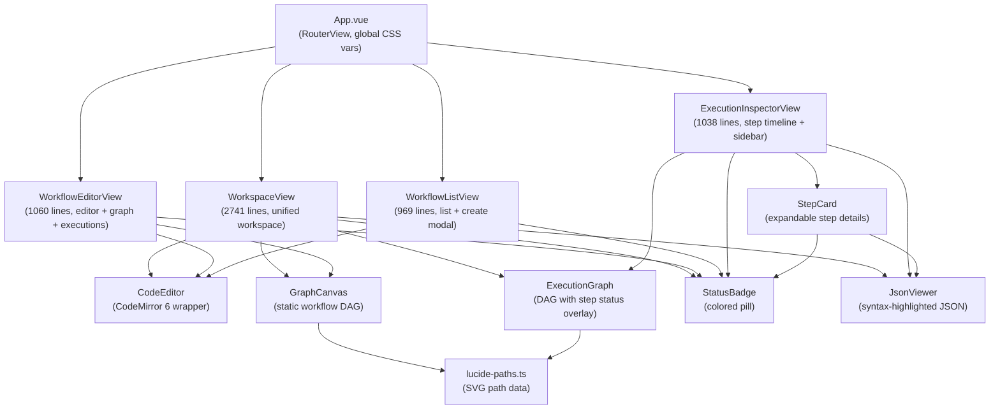
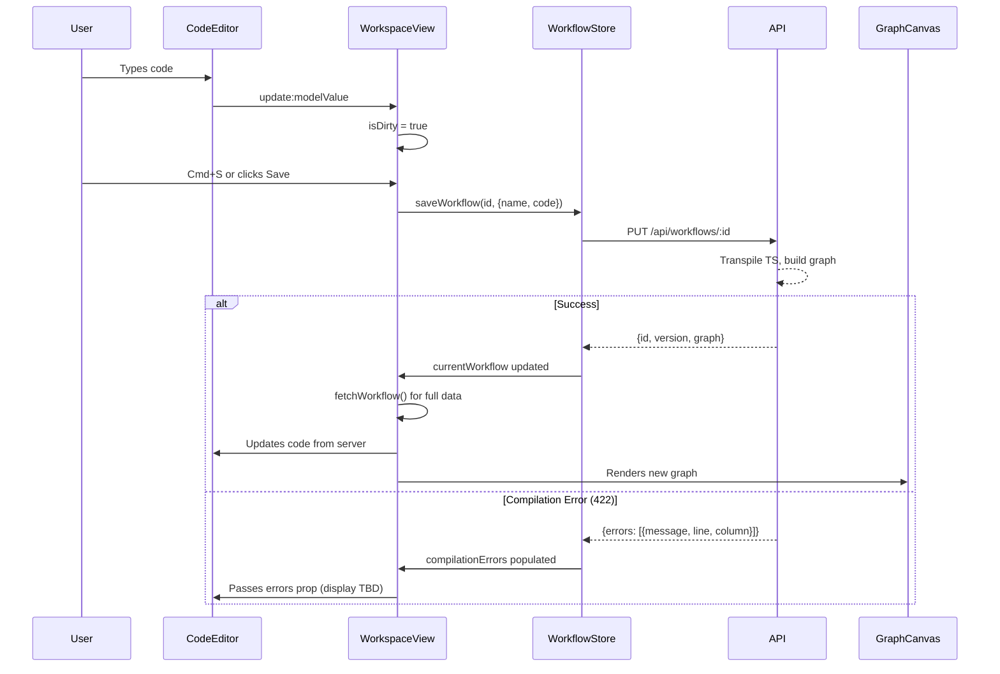
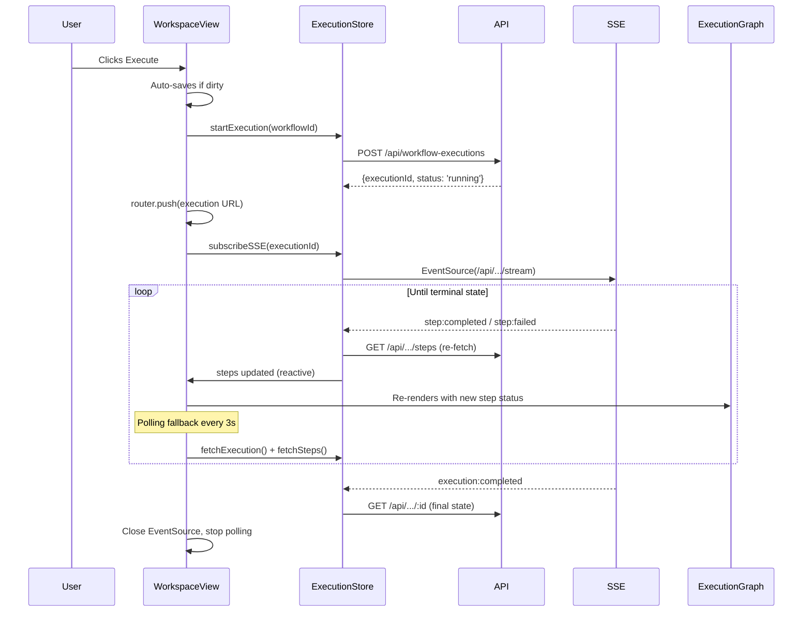
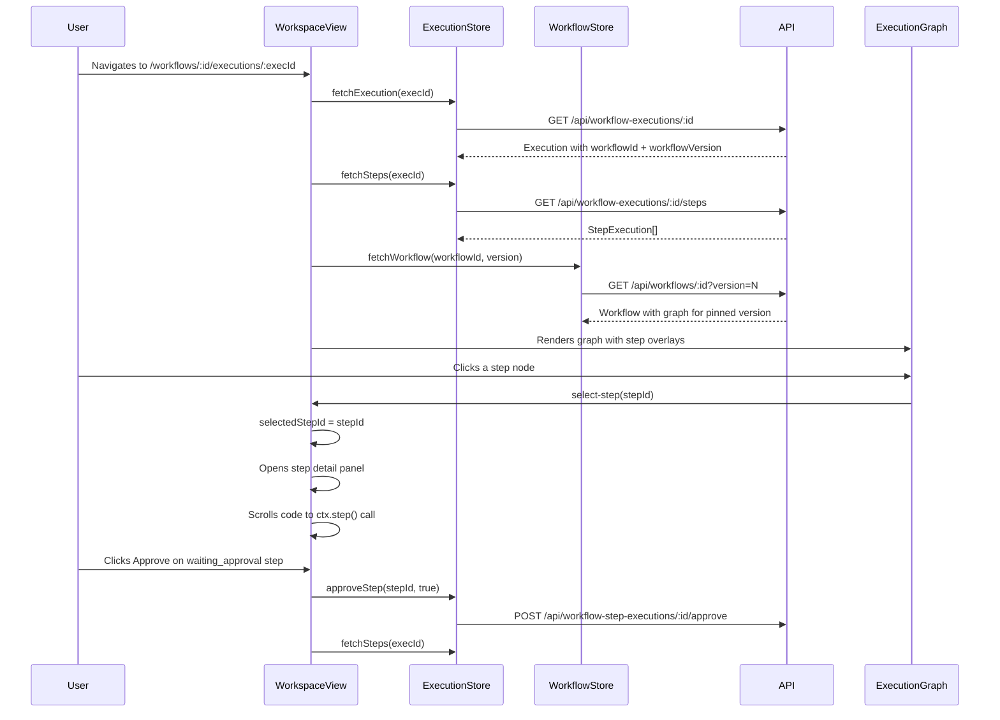

# Web UI Documentation

## Overview

Standalone Vue 3 single-page application (SPA) for the `@n8n/engine` package.
Provides a code-first workflow editor, real-time execution monitoring, and
execution inspection -- all driven by the engine's REST API and SSE event
stream.

The frontend runs on port **3200** during development (Vite HMR) and is served
by the backend at port **3100** in production (built assets in `dist/web/`).

---

## Architecture

### Stack

| Concern | Library | Notes |
|---------|---------|-------|
| Framework | Vue 3 + TypeScript | `<script lang="ts" setup>` Composition API |
| State | Pinia | Composition API stores (`defineStore`) |
| Router | Vue Router 4 | `createWebHistory`, 3 routes, **no** lazy loading |
| Build | Vite (rolldown-vite) | Vue plugin, proxy to API backend |
| Code editor | CodeMirror 6 | JS/TS + JSON languages, dual light/dark themes |
| Graph rendering | Custom SVG | Hand-written SVG layout -- **not** @vue-flow/core |
| Icons | Custom Lucide SVG paths | Subset embedded in `lucide-paths.ts` |
| CSS | CSS modules (plain CSS, not SCSS) | Design tokens defined in `App.vue :global(:root)` |
| Utilities | @vueuse/core | Minimal usage |

### Backend communication

All API calls use the native `fetch()` API. The Vite dev server proxies
`/api/*` and `/webhook/*` to `http://localhost:3100` (configurable via
`VITE_API_URL`). There is no API client abstraction -- every store method
builds `fetch()` calls inline.

Real-time updates use **Server-Sent Events (SSE)** via the browser's native
`EventSource` API, connecting to `/api/workflow-executions/:id/stream`.

### Design token system

The app defines its **own** CSS custom properties in `App.vue` (lines 18-98)
with a full light/dark theme via `@media (prefers-color-scheme: dark)` (lines
101-133). These are **independent** of n8n's `@n8n/design-system` variables --
the naming conventions differ (e.g. `--color-primary` vs
`--color--primary`).

---

## Component Hierarchy



**Note:** The router maps all 3 routes to `WorkspaceView`. The other three
views (`WorkflowListView`, `WorkflowEditorView`, `ExecutionInspectorView`)
exist as separate files but are **not used** by the router. They appear to be
earlier iterations or standalone alternatives.

---

## Router

Defined in `src/router.ts` (15 lines):

| Path | Name | Component | Purpose |
|------|------|-----------|---------|
| `/` | `workspace` | WorkspaceView | Home / no workflow selected |
| `/workflows/:id` | `workflow` | WorkspaceView | Workflow editor |
| `/workflows/:id/executions/:execId` | `execution` | WorkspaceView | Execution inspector |

All three routes render `WorkspaceView`, which uses `route.params.id` and
`route.params.execId` to decide what to display. There are **no navigation
guards** or **lazy-loaded routes**.

The unused views (`WorkflowEditorView`, `WorkflowListView`,
`ExecutionInspectorView`) reference route names like `workflow-editor` and
`execution-inspector` that do not exist in the router, meaning they cannot
function if wired up without changes.

---

## Views

### WorkspaceView

**File:** `src/views/WorkspaceView.vue` (2741 lines)

The primary (and only active) view. It is a monolithic single-file component
that combines workflow selection, code editing, graph visualization, execution
list, execution inspection, step detail, and webhook testing into one
resizable workspace.

**Layout:**
- **Left pane** (resizable): workflow selector dropdown, workflow name input,
  tabbed code editor / webhook tester
- **Right pane**: execution graph (SVG), execution list, step detail panel
  (resizable vertically)

**Key interactions:**
- Workflow CRUD (create, save, delete, activate/deactivate)
- Code editing with Cmd+S shortcut (line 166 of the original; the keydown
  handler calls `handleSave`)
- Execution start, cancel, pause, resume
- Step approval (approve/decline for `waiting_approval` steps)
- Webhook testing with custom headers, query params, and body
- Graph-to-code navigation: clicking a graph node highlights the
  corresponding `ctx.step()` call in the editor
- Error-to-code navigation: clicking error line numbers scrolls to the line

**Components used:** `CodeEditor`, `GraphCanvas`, `ExecutionGraph`,
`StatusBadge`, `JsonViewer`

**Store data consumed:**
- `workflowStore.currentWorkflow`, `workflowStore.workflows`,
  `workflowStore.compilationErrors`
- `executionStore.currentExecution`, `executionStore.executions`,
  `executionStore.steps`, `executionStore.events`

**Data flow:**
- SSE subscription via `executionStore.subscribeSSE()` for live execution
  updates
- Polling interval (3s) as fallback for non-SSE environments
- Watches on `route.params.id` and `route.params.execId` to reload data when
  the URL changes

### WorkflowEditorView

**File:** `src/views/WorkflowEditorView.vue` (1060 lines)

**Not routed.** A standalone editor view with a split pane (code left, graph +
executions right). Provides version history panel, activation toggle, and
execution list with navigation.

**Key interactions:** Save, execute, version history browsing, delete, toggle
active/inactive, Cmd+S keyboard shortcut.

**Components used:** `CodeEditor`, `GraphCanvas`, `StatusBadge`

**Store data consumed:** `workflowStore.currentWorkflow`,
`workflowStore.versions`, `workflowStore.compilationErrors`,
`executionStore.executions`

### WorkflowListView

**File:** `src/views/WorkflowListView.vue` (969 lines)

**Not routed.** A dashboard view showing all workflows and recent executions.
Includes a "Create Workflow" modal with an embedded code editor.

**Key interactions:** Create workflow (with inline code editor in modal),
navigate to workflow/execution, delete execution, auto-refresh every 5s.

**Components used:** `CodeEditor`, `StatusBadge`

**Store data consumed:** `workflowStore.workflows`, `executionStore.executions`

### ExecutionInspectorView

**File:** `src/views/ExecutionInspectorView.vue` (1038 lines)

**Not routed.** A detailed execution inspector with a step timeline (left)
and sidebar (right). Shows execution metadata, timing breakdown (total /
compute / wait), action buttons, workflow graph with step status overlay, and
an SSE event log.

**Key interactions:** Cancel, pause, resume, approve/decline steps, delete
execution, toggle graph visibility, expand/collapse step cards, click graph
node to scroll to step card.

**Components used:** `ExecutionGraph`, `StatusBadge`, `StepCard`, `JsonViewer`

**Store data consumed:** `executionStore.currentExecution`,
`executionStore.steps`, `executionStore.events`

---

## Components

### CodeEditor

**File:** `src/components/CodeEditor.vue` (432 lines)

**Purpose:** Full-featured CodeMirror 6 editor wrapper with dual theme
support, syntax highlighting, and TypeScript/JSON language modes.

**Props:**
| Prop | Type | Default | Description |
|------|------|---------|-------------|
| `modelValue` | `string` | required | v-model binding for editor content |
| `readonly` | `boolean` | `false` | Disables editing |
| `errors` | `Array<{line?, message}>` | `[]` | Compilation errors (currently accepted but not visually rendered as markers) |
| `language` | `'typescript' \| 'json'` | `'typescript'` | Language mode |

**Events:** `update:modelValue`

**Exposed methods:** `format()`, `scrollToPosition(pos)`,
`scrollToLine(lineNumber)`, `highlightRange(from, to)`

**Key behavior:**
- Detects system theme via `matchMedia('(prefers-color-scheme: dark)')` and
  switches between Catppuccin-inspired dark and light themes
- Recreates the entire EditorView when theme, readonly, or language changes
- Uses Catppuccin Mocha color scheme for dark mode (lines 68-106)
- Syncs external model changes into CodeMirror via `view.dispatch()` (line
  284-295)

### GraphCanvas

**File:** `src/components/GraphCanvas.vue` (614 lines)

**Purpose:** Renders a static workflow DAG as an SVG. Used in the editor view
to show the workflow structure after compilation.

**Props:**
| Prop | Type | Default | Description |
|------|------|---------|-------------|
| `graph` | `WorkflowGraph \| null` | required | Workflow graph data |
| `triggers` | `TriggerDef[]` | `[]` | Trigger definitions (webhooks shown as special nodes) |
| `selectedNodeId` | `string \| null` | `null` | Currently selected node |

**Events:** `node-click(nodeId)`

**Key behavior:**
- BFS-based level assignment for top-down layout
- Filters out trigger nodes from the graph, renders webhook triggers as
  special purple/orange nodes
- SVG cubic Bezier edges with arrowhead markers
- Condition labels on edges with human-readable formatting (e.g. `!(x > 100)`
  becomes `x <= 100`)
- Lucide icons rendered inline via `LUCIDE_PATHS`

### ExecutionGraph

**File:** `src/components/ExecutionGraph.vue` (715 lines)

**Purpose:** Renders the workflow DAG with real-time step execution status
overlay. Used in execution inspection to show which steps have
completed/failed/are running.

**Props:**
| Prop | Type | Default | Description |
|------|------|---------|-------------|
| `graph` | `WorkflowGraph` | required | Workflow graph data |
| `steps` | `StepExecution[]` | required | Current step execution states |
| `selectedStepId` | `string \| null` | required | Currently selected step |

**Events:** `select-step(stepId)`

**Key behavior:**
- Same BFS layout algorithm as `GraphCanvas` (significant code duplication)
- Status-colored node borders (green=completed, red=failed, amber=running,
  gray=pending)
- Status-colored edges (green when both ends completed, amber when target
  running)
- Running nodes pulse via CSS animation
- Selected nodes highlighted with thicker border and tinted background
- Skipped nodes detected when execution is finished and no step execution
  exists
- Duration displayed on each node

### JsonViewer

**File:** `src/components/JsonViewer.vue` (166 lines)

**Purpose:** Syntax-highlighted JSON display with custom tokenizer.

**Props:**
| Prop | Type | Default | Description |
|------|------|---------|-------------|
| `data` | `unknown` | required | Data to display as JSON |
| `maxHeight` | `string` | `'400px'` | Max height before scrolling |

**Key behavior:**
- Custom hand-written JSON tokenizer (not a library) that classifies tokens
  as key/string/number/boolean/null/bracket/plain
- Runs `JSON.stringify(data, null, 2)` then tokenizes the result
- Colors are hardcoded hex values (lines 139-165), not CSS variables -- does
  **not** respect dark mode

### StatusBadge

**File:** `src/components/StatusBadge.vue` (131 lines)

**Purpose:** Colored status pill with animated dot indicator.

**Props:**
| Prop | Type | Default | Description |
|------|------|---------|-------------|
| `status` | `string` | required | Status key (running, completed, failed, etc.) |
| `size` | `'sm' \| 'md'` | `'md'` | Size variant |

**Key behavior:**
- Maps 12 status values to color variants (success/danger/warning/info/muted)
- Running status dot pulses via CSS animation
- Falls back to showing the raw status string for unknown values

### StepCard

**File:** `src/components/StepCard.vue` (322 lines)

**Purpose:** Expandable card showing step execution details with
input/output/error sections.

**Props:**
| Prop | Type | Default | Description |
|------|------|---------|-------------|
| `step` | `StepExecution` | required | Step execution data |
| `isApprovalPending` | `boolean` | `false` | (declared but not used internally) |
| `expanded` | `boolean \| undefined` | `undefined` | Controlled expand state |

**Events:** `approve(stepId, approved)`, `update:expanded(value)`

**Key behavior:**
- Supports both controlled (`v-model:expanded`) and uncontrolled usage
- Shows Approve/Decline buttons when step status is `waiting_approval`
- Displays input, output, and error via `JsonViewer`
- Running steps have a shimmer border animation
- Timing details (started/completed) in monospace

### lucide-paths.ts

**File:** `src/components/lucide-paths.ts` (127 lines)

**Purpose:** Static map of Lucide icon names to SVG path `d` attributes.
Contains 30 icons used by `GraphCanvas` and `ExecutionGraph` for step
node icons.

---

## Stores

### workflow.store.ts

**File:** `src/stores/workflow.store.ts` (206 lines)

**State shape:**
```typescript
{
  currentWorkflow: Workflow | null;       // Full workflow with code, graph, triggers
  workflows: WorkflowListItem[];          // List of all workflows (id, name, version, active)
  loading: boolean;
  error: string | null;
  compilationErrors: CompilationError[];  // Array of {message, line?, column?}
  versions: WorkflowVersion[];            // Version history for current workflow
}
```

**Actions and their API calls:**

| Action | Method | Endpoint |
|--------|--------|----------|
| `fetchWorkflows()` | GET | `/api/workflows` |
| `fetchWorkflow(id, version?)` | GET | `/api/workflows/:id[?version=N]` |
| `createWorkflow(data)` | POST | `/api/workflows` |
| `saveWorkflow(id, data)` | PUT | `/api/workflows/:id` |
| `fetchVersions(id)` | GET | `/api/workflows/:id/versions` |
| `activateWorkflow(id)` | POST | `/api/workflows/:id/activate` |
| `deactivateWorkflow(id)` | POST | `/api/workflows/:id/deactivate` |
| `deleteWorkflow(id)` | DELETE | `/api/workflows/:id` |
| `clearErrors()` | -- | Resets `error` and `compilationErrors` |

**Error handling:** `createWorkflow` and `saveWorkflow` specifically handle
HTTP 422 responses by extracting `body.errors` into `compilationErrors`. Other
errors are stored in the generic `error` ref and displayed in the UI.

**No SSE consumption** -- this store is REST-only.

### execution.store.ts

**File:** `src/stores/execution.store.ts` (210 lines)

**State shape:**
```typescript
{
  executions: ExecutionListItem[];       // List of executions
  currentExecution: Execution | null;    // Full execution detail
  steps: StepExecution[];                // Step executions for current execution
  events: SSEEvent[];                    // Raw SSE events received
  loading: boolean;
  error: string | null;
}
```

**Actions and their API calls:**

| Action | Method | Endpoint |
|--------|--------|----------|
| `fetchExecutions(filters?)` | GET | `/api/workflow-executions[?workflowId=&status=]` |
| `startExecution(workflowId, triggerData?, mode?)` | POST | `/api/workflow-executions` |
| `fetchExecution(id)` | GET | `/api/workflow-executions/:id` |
| `fetchSteps(executionId)` | GET | `/api/workflow-executions/:id/steps` |
| `subscribeSSE(executionId)` | SSE | `/api/workflow-executions/:id/stream` |
| `cancelExecution(id)` | POST | `/api/workflow-executions/:id/cancel` |
| `pauseExecution(id, resumeAfter?)` | POST | `/api/workflow-executions/:id/pause` |
| `resumeExecution(id)` | POST | `/api/workflow-executions/:id/resume` |
| `approveStep(stepId, approved)` | POST | `/api/workflow-step-executions/:id/approve` |
| `deleteExecution(id)` | DELETE | `/api/workflow-executions/:id` |
| `clearEvents()` | -- | Empties the `events` array |

**SSE event consumption** (lines 126-145):
The `subscribeSSE()` method creates a native `EventSource` and attaches an
`onmessage` handler that:
1. Parses each SSE message as JSON and pushes it to `events`
2. On `execution:*` events: re-fetches the full execution and all steps
3. On `step:*` events: re-fetches all steps
4. Silently skips malformed events

The SSE connection is closed by the calling view when the execution reaches a
terminal state.

---

## Data Flow

### Workflow Editing



### Execution Monitoring



### Execution Inspection



---

## Comparison with Plan

The `docs/engine-v2-plan.md` "Frontend" section (lines 2258-2344) specifies a
particular stack and feature set. Below is a comparison of what was planned
versus what was implemented.

### Stack Deviations

| Planned | Actual | Status |
|---------|--------|--------|
| @vue-flow/core + @dagrejs/dagre for canvas | Custom SVG rendering with BFS layout | **Diverged** -- simpler but less interactive |
| `@n8n/design-system` components (N8nButton, N8nAlert, N8nIcon) | All custom HTML/CSS | **Not used** |
| SCSS with CSS variables (`lang="scss" module`) | Plain CSS modules (`lang` not specified) | **Diverged** |
| vue-i18n via `@n8n/i18n` for all UI text | Hardcoded English strings | **Not implemented** |
| Vitest + @testing-library/vue + @pinia/testing | No tests | **Not implemented** |
| vue-json-pretty for JSON display | Custom `JsonViewer` component | **Diverged** |
| lodash, luxon, nanoid utilities | None used | **N/A** (not needed) |
| Lazy-loaded views, navigation guards | No lazy loading, no guards | **Not implemented** |
| CSS variables from design system (`--color--primary`) | Own variable names (`--color-primary`) | **Diverged** |

### Feature Deviations

| Planned Feature | Status | Notes |
|-----------------|--------|-------|
| Workflow List view | Partially -- exists as unused `WorkflowListView.vue`; `WorkspaceView` has a dropdown instead of a table | |
| Workflow Editor (split pane code + graph) | Implemented in WorkspaceView | |
| Code changes -> re-parse -> graph updates in real-time | **Not implemented** -- graph only updates after save + server transpile | |
| Execution Inspector with step timeline | Implemented in WorkspaceView | |
| Approve/Decline buttons | Implemented | |
| "Re-run from here" button | **Not implemented** -- API endpoints exist (`rerun-from/:stepId`, `run-step/:stepId`) but UI does not use them | |
| "Execute only this step" button | **Not implemented** | |
| Streaming chunk display for AI chat steps | **Not implemented** | |
| Version badge with link to view version's code/graph | Partially -- version shown but no dedicated version comparison view | |
| Timing display (total/compute/waiting) | Implemented in WorkspaceView | |
| Error with source-mapped line | Implemented -- `extractErrorLine()` parses `originalLine` and stack traces | |

---

## Issues and Improvements

### Critical: node_modules inside src/web/

The `src/web/node_modules/` directory (65 MB) exists on disk. While the root
`.gitignore` prevents it from being tracked in git, there is **no
`.gitignore` file** inside `src/web/` or at the `@n8n/engine` package level.
This means:

1. If the root `.gitignore` is ever changed, node_modules could be
   accidentally committed
2. The `src/web/package.json` manages its own dependencies separately from the
   monorepo's pnpm workspace -- this is unconventional and creates dependency
   duplication risk
3. Tools that do not respect the root `.gitignore` (some IDEs, file indexers)
   will index 65 MB of vendor code

**Recommendation:** Add a `.gitignore` with `node_modules` inside `src/web/`.
Consider integrating the web package into the pnpm workspace or using the
monorepo's shared dependencies.

### View Size: WorkspaceView is a God Component

`WorkspaceView.vue` is **2,741 lines** in a single file. This includes:
- ~745 lines of script (state, computed, watchers, 20+ functions)
- ~470 lines of template
- ~1,500+ lines of CSS

This violates separation of concerns and makes the component extremely
difficult to maintain, test, or review. It handles workflow selection, code
editing, graph rendering, execution monitoring, step inspection, webhook
testing, pane resizing, and more.

**Recommendation:** Extract into composables and sub-components:
- `useWorkflowEditor()` composable for save/execute/dirty tracking
- `useExecutionMonitor()` composable for SSE/polling/step selection
- `useWebhookTester()` composable for webhook test state and logic
- `usePaneResize()` composable for drag-to-resize
- `<WorkflowSelector>`, `<WebhookTester>`, `<StepDetailPanel>`,
  `<ExecutionTimeline>` as sub-components

### Code Duplication

`GraphCanvas.vue` (614 lines) and `ExecutionGraph.vue` (715 lines) share
approximately **70%** of their code:
- Identical BFS layout algorithm
- Identical `LayoutNode`, `LayoutEdge`, `DisplayConfig` interfaces
- Identical `formatCondition()` function
- Identical `edgePath()` and `edgeLabelPos()` functions
- Identical `getDisplayConfig()` and `hasAnyDescription()` functions
- Same `NODE_WIDTH`, `NODE_HEIGHT`, layout constants

**Recommendation:** Extract shared graph layout logic into a
`useGraphLayout()` composable or utility module. `ExecutionGraph` should
extend `GraphCanvas` with status overlay rather than duplicating it entirely.

### Duplicated Utility Functions

`formatDuration()` / `formatMs()` / `formatTime()` / `timeAgo()` are
reimplemented across `WorkspaceView.vue`, `WorkflowEditorView.vue`,
`WorkflowListView.vue`, `ExecutionInspectorView.vue`, `ExecutionGraph.vue`,
and `StepCard.vue`. Each has slightly different formatting behavior.

**Recommendation:** Create a `src/utils/format.ts` module with shared
formatting functions.

### Error Handling in API Calls

Several API calls have inconsistent or absent error handling:

1. **`fetchSteps()` in execution.store.ts** (line 120-124): Throws on error
   but has no `try/catch` in the store -- the error propagates to the calling
   view, which may or may not handle it.

2. **`cancelExecution()`** (line 147-149): Does not check `res.ok` before
   calling `fetchExecution()`.

3. **`deleteExecution()`** removes the execution from local state **before**
   confirming the server acknowledged the delete (it does check `res.ok`,
   but the timing of state mutation is eager).

4. **WorkspaceView** uses bare `console.error()` for several critical
   operations (create, execute, toggle active) with no user-visible feedback.

5. **ExecutionInspectorView** line 71-78: fetches workflow graph with a bare
   `try/catch {}` that silently ignores all errors.

**Recommendation:** Add consistent error handling with user-visible feedback.
Consider an error boundary or toast notification system.

### Accessibility

The application has significant accessibility gaps:

1. **No ARIA labels** on interactive SVG elements (graph nodes, edges).
   `GraphCanvas` and `ExecutionGraph` are entirely mouse-driven.

2. **No keyboard navigation** for the graph -- nodes cannot be
   focused/selected via Tab/arrow keys.

3. **Custom dropdown** in WorkspaceView (workflow selector) does not implement
   `role="listbox"`, `aria-expanded`, or keyboard navigation (arrow
   keys/Enter/Escape).

4. **Color-only status indicators** -- the `StatusBadge` dots rely solely on
   color to convey status. No shape or text alternative for colorblind users
   (the text label mitigates this partially).

5. **No focus management** when modals open/close (WorkflowListView create
   modal does set `autofocus` on the name input but does not trap focus).

6. **No `<label>` associations** for some inputs (e.g., webhook header
   key/value inputs in WorkspaceView).

### Responsive Design

The application is **not responsive**:

1. `App.vue` sets `height: 100vh; overflow: hidden` -- the entire app is
   viewport-locked.

2. `WorkspaceView` uses pixel-based pane widths with `min-width: 320px` and
   `max-width: 70vw` -- there is no mobile layout.

3. The split-pane layout assumes a wide desktop viewport. On screens narrower
   than ~700px, the UI becomes unusable.

4. No media queries exist anywhere in the source (only the dark mode
   `prefers-color-scheme` media query).

**Recommendation:** Add responsive breakpoints that stack panes vertically on
narrow viewports. Consider a mobile-first approach for the workflow list.

### Performance Concerns

1. **SVG graph rendering** -- both `GraphCanvas` and `ExecutionGraph` render
   the entire graph as a single SVG with all nodes and edges. For large
   workflows (50+ steps), this could become slow. There is no virtualization
   or viewport culling.

2. **Polling every 3 seconds** -- `WorkspaceView` polls `fetchExecution()` +
   `fetchSteps()` every 3s during execution, and `WorkflowListView` polls
   `fetchWorkflows()` + `fetchExecutions()` every 5s. SSE should be
   sufficient, and the polling fallback could use exponential backoff.

3. **Full step list re-fetch on every SSE event** -- each `step:*` SSE event
   triggers a full `GET /api/.../steps` request rather than incrementally
   updating the affected step. For executions with many steps, this creates
   unnecessary network traffic.

4. **CodeMirror full recreation** -- the editor is destroyed and recreated
   when the theme changes, when `readonly` changes, or when the language
   changes. This loses cursor position and undo history.

5. **Event log accumulation** -- `events` array in execution store grows
   unboundedly during long-running executions. The UI limits display to 50
   events (line 466 of ExecutionInspectorView), but the array itself is never
   trimmed.

### JsonViewer Dark Mode

`JsonViewer.vue` uses hardcoded light-mode colors (lines 138-165):
- Keys: `#881391` (dark purple)
- Strings: `#0451a5` (blue)
- Numbers: `#098658` (green)

These are unreadable on a dark background. The component does not define dark
mode variants.

**Recommendation:** Use CSS variables that change based on the color scheme,
or define `@media (prefers-color-scheme: dark)` overrides.

### CSS Duplication Across Views

Button styles (`.btn`, `.btnPrimary`, `.btnGhost`, etc.) are defined
independently in `WorkflowEditorView`, `WorkflowListView`,
`ExecutionInspectorView`, and `WorkspaceView`. The CSS is nearly identical
but slightly inconsistent (e.g., different padding values, different font
sizes).

**Recommendation:** Extract shared button styles into a global stylesheet or
a `BaseButton` component.

### Missing Plan Features

Features specified in the plan but not implemented:
1. **@n8n/design-system integration** -- no design system components used
2. **i18n** -- all strings hardcoded in English
3. **Tests** -- zero test files
4. **Real-time graph updates during editing** -- graph only updates after
   save + server transpile
5. **"Re-run from here" / "Execute only this step"** buttons
6. **Streaming chunk display** for AI chat steps
7. **Vue-flow/dagre canvas** -- replaced with simpler custom SVG

### Unused Views

Three of the four views (`WorkflowEditorView`, `WorkflowListView`,
`ExecutionInspectorView`) are not referenced by the router. They reference
route names (`workflow-editor`, `execution-inspector`) that do not exist.
These files total **3,067 lines** of unused code.

**Recommendation:** Either wire these views into the router (replacing the
monolithic WorkspaceView), or remove them to reduce maintenance burden.

### Duplicate Dropdown CSS in WorkspaceView

The WorkspaceView contains ~200 lines of CSS for a custom dropdown widget
that could be extracted into a reusable `<Dropdown>` component, especially
since a similar pattern exists in WorkflowEditorView (version dropdown).

### Security

1. **`confirm()` for destructive actions** -- the browser's native `confirm()`
   dialog is used for delete operations. This is functional but inconsistent
   with modern UI patterns and cannot be styled.

2. **No CSRF protection** -- all `fetch()` calls lack CSRF tokens. This is
   acceptable for a development tool but should be addressed before
   production use.

3. **Webhook test body evaluated as JSON** -- `handleSendWebhookTest()` uses
   `JSON.parse()` on user input, which is safe, but the error message
   exposes the raw error.
