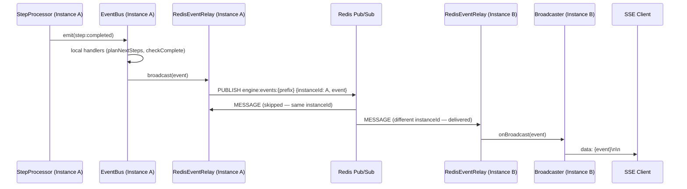

# Engine v2 — Scaling, Redis Pub/Sub & Monitoring

**Status**: Approved (revised)
**Date**: 2026-03-13
**Scope**: Redis event relay for multi-instance deployment, Prometheus metrics, Grafana dashboards, observability infrastructure

**Implementation plan**: `docs/engine-v2/plans/scaling/implementation.md`

---

## Context

The engine v2 PoC runs as a single process. The event bus is an in-process
Node.js EventEmitter — events from step processing only reach SSE clients on
the same instance. This blocks horizontal scaling.

The architecture docs (overview.md, engine.md) already outlined Redis pub/sub
as Phase 2. This design implements it alongside production monitoring.

**Three goals:**
1. Redis pub/sub for cross-instance event delivery
2. Multi-instance deployment mode with docker compose
3. Grafana-based monitoring for infrastructure and product metrics

---

## 1. Foundation Changes

### 1.1 Event Identity

All engine events carry two base fields, auto-assigned by `EngineEventBus.emit()`:

```typescript
interface BaseEvent {
  eventId: string;   // nanoid, unique per emission
  createdAt: number; // Date.now() at emission time
}
```

Every event interface extends `BaseEvent`. Callers can omit these fields
(auto-assigned) via the `EmittableEvent` type:

```typescript
type EmittableEvent = Omit<EngineEvent, 'eventId' | 'createdAt'> &
  Partial<Pick<BaseEvent, 'eventId' | 'createdAt'>>;
```

**Why:** `eventId` enables deduplication in `BroadcasterService` (events
arrive via both local bus and relay). `createdAt` enables `redis_relay_latency_ms`
measurement (time from emission to relay delivery).

### 1.2 Typed EngineConfig

`createEngine()` accepts a typed config object instead of reading `process.env`:

```typescript
interface EngineConfig {
  redisUrl?: string;         // Redis URL for event relay. Absent = local relay.
  maxConcurrency?: number;   // Max concurrent step executions. Default: 10
  instanceId?: string;       // Unique instance ID. Auto-generated if not provided.
  redisChannelPrefix?: string; // Redis channel prefix. Default: 'default'. Prevents cross-contamination when multiple deployments share one Redis.
}
```

`process.env` is read in exactly one place: `main.ts`. All services receive
typed config.

### 1.3 Queue Drain

`StepQueueService` gains a `drain(timeoutMs)` method that stops the poller
and waits for in-flight steps to finish (with a timeout). Used for graceful
shutdown.

### 1.4 EngineEventBus.close()

New `close()` method that removes all listeners and closes the relay connection.

---

## 2. Event Relay Abstraction

### Interface

```typescript
interface EventRelay {
  broadcast(event: EngineEvent): void;
  onBroadcast(handler: (event: EngineEvent) => void): void;
  close(): Promise<void>;
}
```

### Implementations

**`LocalEventRelay`** — No-op relay. `broadcast()` does nothing.
`onBroadcast()` never fires. The local `EngineEventBus` already delivers
events in-process — no relay needed. Default when no Redis is configured.

**`RedisEventRelay`** — Publishes events to Redis channel
`engine:events:{channelPrefix}`. Subscribes to the same channel. Uses
`ioredis` with two connections (one publisher, one subscriber — Redis
requires dedicated subscriber connections). The channel prefix defaults to
`'default'` and is configurable via `EngineConfig.redisChannelPrefix` to
prevent cross-contamination when multiple deployments share one Redis.

### Auto-detection

```typescript
// In createEngine(), based on config.redisUrl:
const relay = config.redisUrl
  ? new RedisEventRelay(config.redisUrl, instanceId)
  : new LocalEventRelay();
```

### Instance deduplication

Redis pub/sub delivers to ALL subscribers, including the sender's own
subscriber connection. `RedisEventRelay` wraps events in an envelope with
`instanceId`:

```typescript
interface Envelope {
  instanceId: string;
  event: EngineEvent;
}
```

On receive, events from the same `instanceId` are skipped (already handled
locally).

### How events flow

**Single instance (no Redis):**
1. Step processor completes step → emits event on local `EngineEventBus`
2. Local event handlers run (planNextSteps, completion checks) — orchestration
3. `BroadcasterService` picks up event → delivers to connected SSE clients

**Multi-instance (with Redis):**
1. Step processor completes step → emits event on local `EngineEventBus`
2. Local event handlers run (orchestration) — unchanged, always local
3. Event is also published to Redis via `EventRelay.broadcast()`
4. All instances receive the Redis event via `onBroadcast()`
5. Each instance's `BroadcasterService` checks if it has SSE clients for that
   execution and forwards if so

**Key principle:** Orchestration is always local. Redis is only for cross-instance
SSE event delivery. All instances receive all events — no per-execution
subscribe/unsubscribe. Each instance filters locally.

### Why no deduplication is needed

`BroadcasterService` subscribes to both the local event bus AND the relay.
These two paths never deliver the same event twice:
- **Local events** arrive via `eventBus.onAny()` (always, regardless of relay).
- **Remote events** arrive via `relay.onBroadcast()` — but only from OTHER
  instances, because `RedisEventRelay` skips events with matching `instanceId`.
- **`LocalEventRelay`** has a no-op `broadcast()`, so `relay.onBroadcast()`
  never fires in single-instance mode.

No dedup mechanism is needed. Each event arrives via exactly one path.

### SSE reconnection

When an SSE client disconnects and reconnects, it may land on a different
instance (Traefik round-robin). Since all instances subscribe to Redis events,
the new instance will deliver future events. Events missed during the
disconnect window are not replayed — the client fetches current state from
the database on reconnect. `Last-Event-ID` replay is out of scope.

### Multi-instance event flow



### Redis resilience

- `RedisEventRelay` catches connection errors and logs warnings
- If Redis goes down, local orchestration continues unaffected
- Cross-instance SSE delivery is lost until Redis recovers
- On reconnect, `ioredis` re-subscribes automatically

---

## 3. Prometheus Metrics

### Library and endpoint

`prom-client` (standard Prometheus client for Node.js). Metrics exposed on
`GET /metrics` on the existing Express server. `MetricsService` wraps a
`Registry` and defines all metrics. Passed as optional constructor param
to all services that need instrumentation.

### Metrics registry

**Execution metrics:**

| Metric | Type | Labels |
|--------|------|--------|
| `execution_total` | Counter | `status` (completed, failed, cancelled) |
| `execution_active` | Gauge | — |
| `execution_duration_ms` | Histogram | `workflow_id` |

**Step metrics:**

| Metric | Type | Labels |
|--------|------|--------|
| `step_execution_total` | Counter | `status`, `step_type` |
| `step_execution_duration_ms` | Histogram | — |
| `step_queue_depth` | Gauge | — |
| `step_queue_claim_latency_ms` | Histogram | — |
| `step_retries_total` | Counter | — |

**Webhook metrics:**

| Metric | Type | Labels |
|--------|------|--------|
| `webhook_requests_total` | Counter | `method`, `path`, `status_code` |
| `webhook_duration_ms` | Histogram | — |

**Error metrics:**

| Metric | Type | Labels |
|--------|------|--------|
| `errors_total` | Counter | `classification` (retriable, non_retriable) |

**Event delivery metrics:**

| Metric | Type | Labels |
|--------|------|--------|
| `sse_connected_clients` | Gauge | — |
| `events_published_total` | Counter | `type` |
| `redis_relay_latency_ms` | Histogram | — (measured via `event.createdAt`) |

### Collection pattern

Each service increments its own metrics. `MetricsService` is an optional
constructor parameter — existing tests that don't provide it continue to work.

**`step_queue_depth`** is the exception: it requires a periodic database
query (`SELECT COUNT(*) ... WHERE status = 'queued'`). `StepQueueService`
runs this query on each poll cycle (piggybacked on the existing poll loop —
no separate timer) and sets the gauge value.

---

## 4. Docker Compose & Deployment

### Topology

Homogeneous instances — every instance runs API + queue poller + SSE. A load
balancer (Traefik) distributes traffic. Simple to deploy, any instance can do
anything.

### Shared network strategy

All compose files use the same named network:

```yaml
networks:
  engine:
    name: engine-network
```

This allows services from different `-f` composed files to communicate
(e.g., Prometheus from o11y compose can reach engine services from dev or
scaling compose).

### Compose files

| File | Purpose |
|------|---------|
| `docker-compose.yml` | Dev: postgres + api + web |
| `docker-compose.test.yml` | Test: ephemeral DB + Redis on tmpfs |
| `docker-compose.o11y.yml` | Observability: prometheus + grafana (shared) |
| `docker-compose.perf.yml` | Perf: engine + postgres + k6 + InfluxDB |
| `docker-compose.scaling.yml` | Scaling: 3 engines + postgres + redis + traefik |

The o11y compose is a building block — combined via `-f` flags.

### Grafana consolidation

All Grafana config lives in `o11y/grafana/` — a single source of truth.
The existing `perf/grafana/` (InfluxDB datasource, k6 dashboard) is moved
into `o11y/grafana/`. The perf compose keeps InfluxDB as a service but no
longer defines its own Grafana.

### Traefik SSE support

Traefik buffers responses by default, which breaks SSE streaming. The engine
service label disables buffering:

```yaml
traefik.http.services.engine.loadbalancer.responseforwarding.flushinterval=1ms
```

### Package.json scripts

```json
{
  "dev": "docker compose -f docker-compose.yml -f docker-compose.o11y.yml up",
  "dev:scaling": "docker compose -f docker-compose.scaling.yml -f docker-compose.o11y.yml up",
  "dev:perf": "docker compose -f docker-compose.perf.yml -f docker-compose.o11y.yml up",
  "dev:o11y": "docker compose -f docker-compose.o11y.yml up"
}
```

`pnpm dev` includes the o11y stack (Prometheus + Grafana) by default.

### Grafana dashboards

Pre-provisioned via JSON files in `o11y/grafana/dashboards/`:

| Dashboard | Contents |
|-----------|----------|
| `engine-overview.json` | Execution throughput, active executions, error rates, duration percentiles |
| `engine-steps.json` | Step durations, queue depth, claim latency, retries |
| `engine-webhooks.json` | Webhook throughput and latency |
| `k6-results.json` | k6 perf results (moved from `perf/grafana/`) |

---

## 5. Health Check & Graceful Shutdown

### Health check — `GET /health`

```typescript
{
  status: 'ok' | 'degraded' | 'error',
  postgres: 'connected' | 'disconnected',
  redis: 'connected' | 'disconnected' | 'not_configured',
  uptime: 12345
}
```

- `200` with `status: 'ok'` — all systems healthy
- `200` with `status: 'degraded'` — Redis down, Postgres up (engine works,
  no cross-instance events)
- `503` with `status: 'error'` — Postgres down (engine can't function)
- Traefik uses this endpoint to route traffic to healthy instances only

### Graceful shutdown

On `SIGTERM` / `SIGINT`:
1. Stop the queue poller (no new steps claimed)
2. Drain in-flight steps (`queue.drain(30_000)`)
3. Close event relay (`eventBus.close()` → closes Redis connections)
4. Close database connection
5. Exit

---

## 6. Docs Updates

### Files to update

1. **`packages/@n8n/engine/CLAUDE.md`** — env vars, scaling commands,
   `/health` and `/metrics` endpoints, `o11y/` in project structure,
   event relay in architecture section
2. **`docs/engine-v2/architecture/overview.md`** — Phase 2 event delivery
   implemented, deployment mode table updated
3. **`docs/engine-v2/architecture/engine.md`** — EventRelay docs, eventId/createdAt,
   BroadcasterService dedup, instanceId envelope
4. **`docs/engine-v2/plans/backlog.md`** — Remove Redis pub/sub item

---

## 7. New Dependencies

| Package | Purpose |
|---------|---------|
| `ioredis` | Redis client (pub/sub + connection management) |
| `prom-client` | Prometheus metrics collection and `/metrics` endpoint |

---

## 8. Out of Scope

- Autoscaling (k8s HPA, container orchestration)
- TLS between services (dev setup)
- Redis Sentinel/Cluster (single Redis instance)
- Role separation (API-only vs worker-only instances) — future enhancement
- OpenTelemetry distributed tracing — future enhancement
- Alerting rules — future enhancement
