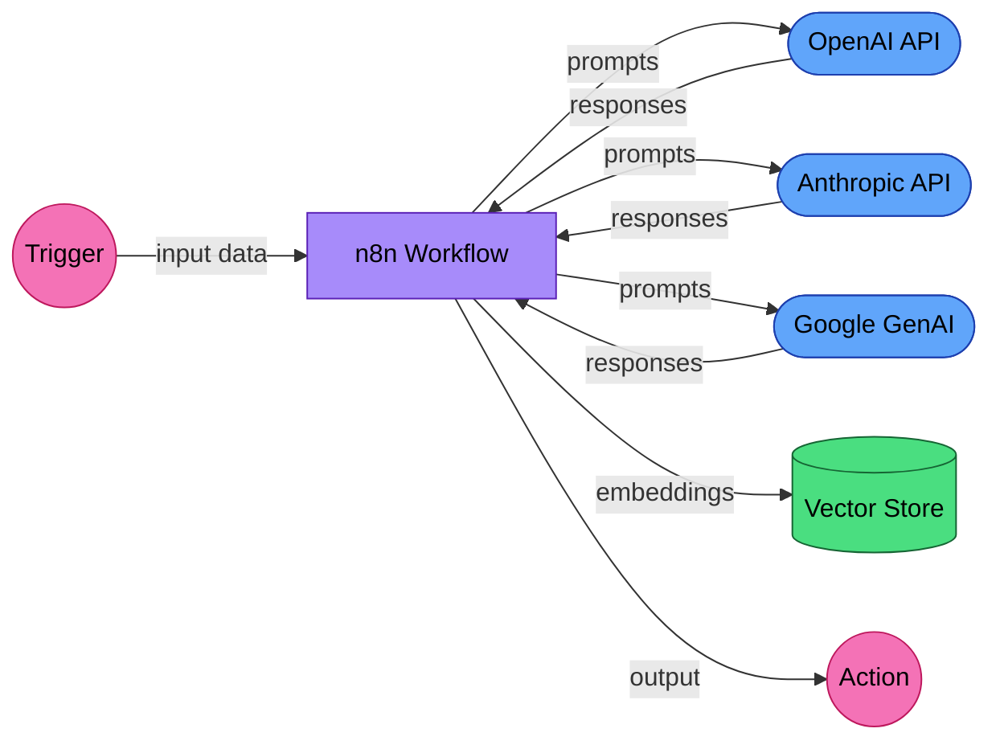

# EU AI Act Compliance Guide for n8n AI Workflows

n8n automates workflows. When those workflows include AI nodes (OpenAI, Anthropic, Google, LangChain), they become AI systems under the EU AI Act. This guide helps n8n users understand when their workflows cross the regulatory threshold and what to do about it.

## Is your system in scope?

The detailed obligations in Articles 12, 13, and 14 only apply to **high-risk AI systems** as defined in Annex III of the EU AI Act. An n8n workflow is high-risk if it uses AI to make or influence decisions in these domains:

- **Recruitment and HR** — screening CVs, ranking candidates, evaluating employee performance, allocating tasks
- **Credit scoring and insurance** — assessing creditworthiness or setting premiums
- **Law enforcement** — profiling, criminal risk assessment, border control
- **Critical infrastructure** — managing energy, water, transport, or telecommunications systems
- **Education assessment** — grading students, determining admissions
- **Essential public services** — evaluating eligibility for benefits, housing, or emergency services

Most n8n workflows with AI nodes (summarization, content generation, internal automation) are **not** high-risk. If your workflow does not fall into one of the categories above:

- **Article 50** (end-user transparency) still applies if users interact with your workflow's output directly. See the [Article 50 section](#article-50-end-user-transparency) below.
- **GDPR** still applies if you process personal data through AI nodes. See the [GDPR section](#gdpr-considerations) below.
- The high-risk obligations (Articles 9-15) are less likely to apply, but risk classification is context-dependent. **Do not self-classify without legal review.** Focus on Article 50 (transparency) and GDPR (data protection) as your baseline obligations.

> **Disclaimer:** The categories and decision tree in this guide are **informational guidance only** and do not constitute a legal determination of risk classification. High-risk classification under the EU AI Act requires a formal assessment against the criteria in Annex III, including consideration of the specific context, purpose, and deployment conditions of your AI system. Do not rely on this checklist alone to conclude that your workflow is exempt from high-risk obligations. Consult a qualified legal professional for a binding classification.

## When does an n8n workflow become regulated?

Not every workflow with an AI node is regulated. The EU AI Act classifies AI systems by risk:

### Decision tree

> This decision tree is a simplified starting point, not a substitute for formal risk assessment under Annex III. Edge cases exist, and some workflows may involve overlapping categories.

1. **Does your workflow use an AI model to make or influence decisions about people?**
   - Hiring, firing, task allocation → **High-risk** (Annex III, Section 4)
   - Credit scoring, insurance pricing → **High-risk** (Annex III, Section 5)
   - Law enforcement, border control → **High-risk** (Annex III, Section 6)
   - Education assessment → **High-risk** (Annex III, Section 3)
   - If no → continue to 2

2. **Does your workflow generate content that users interact with?**
   - Chatbot, content generation, customer support → **Limited risk** (transparency obligations only)
   - If no → continue to 3

3. **Does your workflow use AI for internal automation only?**
   - Data processing, summarization, translation → **Minimal risk** (no specific obligations)

**Example:** An n8n workflow that uses GPT-4 to summarize meeting notes is minimal risk. The same workflow used to evaluate employee performance is high-risk. The AI model is the same; the use case determines the classification.

## Supported AI providers and models

n8n integrates with a range of AI services. The following are the key ones relevant to compliance:

- **AI providers:** OpenAI, Anthropic, Google GenAI, HuggingFace, LangChain
- **Model identifiers include:** gpt-4o, gemini-2.5-flash, whisper-1, text-embedding-ada-002, and others

These are the AI services n8n *integrates with*. Your workflows use a subset. Document which nodes are active.

## Data flow diagram

When an n8n workflow calls an AI provider, data leaves your infrastructure:



**GDPR roles:**
- **Your organization** is the controller (you determine the purpose and means of processing).
- **AI providers (OpenAI, Google, Anthropic)** may act as processors, controllers, or joint controllers depending on the specific deployment architecture, data flows, and how the provider uses submitted data (e.g., for model training vs. inference only). The classification is not automatic; it depends on each provider's Data Processing Agreement (DPA), their terms of service, and the purpose and means of processing in your specific use case. Review each provider's DPA and document the applicable GDPR role accordingly.
- **Self-hosted vector stores:** Your organization remains the controller — no third-party transfer.
- **The organization operating n8n Cloud** acts as a processor if you use the hosted version; no processor relationship if self-hosted.

## Article 12: Record-keeping

n8n's execution log provides a foundation for Article 12 compliance:

| Requirement | n8n Feature | Status |
|------------|------------|--------|
| Event timestamps | Execution start/end timestamps | **Covered** |
| Input data | Stored in execution data (configurable retention) | **Covered** |
| Output data | Stored in execution data | **Covered** |
| Error recording | Failed execution logs with error details | **Covered** |
| Execution history | Workflow execution list with status | **Covered** |
| Data retention | Configurable via `EXECUTIONS_DATA_MAX_AGE` | **Your responsibility** |
| Model version | Not tracked by default in execution data | **Gap** |
| Token consumption | Not tracked by default | **Gap** |

### Recommendations

- **Retention periods:** The required retention period depends on your role under the Act. Article 18 requires **providers** of high-risk systems to retain logs and technical documentation for **10 years** after market placement. Article 26(6) requires **deployers** to retain logs for at least **6 months**. Set `EXECUTIONS_DATA_MAX_AGE` accordingly. If you have substantially modified the AI system, you may be classified as a provider rather than a deployer. Confirm the applicable retention period with legal counsel.
- Add a "Log" node after AI nodes to capture model name, token usage, and response metadata
- Use n8n's credential system to track which API keys (and therefore which provider accounts) are in use

## Article 13: Transparency to deployers

Article 13 requires providers of high-risk AI systems to supply deployers with the information needed to understand and operate the system correctly. This is a **documentation obligation**, not a logging obligation. For n8n workflows, this means the upstream AI providers (OpenAI, Google, Anthropic) must give you:

- Instructions for use, including intended purpose and known limitations
- Accuracy metrics and performance benchmarks
- Known or foreseeable risks and residual risks after mitigation
- Technical specifications: input/output formats, training data characteristics, model architecture details

As a deployer, collect model cards, system documentation, and accuracy reports from each AI provider your workflows use. Maintain these as part of your Annex IV technical documentation.

n8n's execution logs provide **supporting evidence** that can inform Article 13 documentation (e.g., which models are in use, how workflows behave under failure), but execution logs alone do not satisfy Article 13. You must independently produce system documentation covering how your specific workflows use AI, their intended purpose, performance characteristics, and residual risks.

## Article 50: End-user transparency

Article 50 requires deployers to inform end users that they are interacting with an AI system. This is a separate obligation from Article 13 and applies even to limited-risk systems.

For n8n workflows that serve end users:
- Add a disclosure in any user-facing output that AI was involved in generating the response
- A mechanism for users to identify when an AI-generated response has been delivered (e.g., clear labeling in the UI or output)
- If using AI for customer support, inform the customer they are interacting with an automated system

> **Note:** Article 50 applies to chatbots and systems interacting directly with natural persons. It has a separate scope from the high-risk designation under Annex III — it applies even to limited-risk systems.

## Article 14: Human oversight

Article 14 requires that high-risk AI systems be designed so that natural persons can effectively oversee them — including the ability to understand, monitor, interpret, and intervene in the system's operation.

n8n provides **automated technical safeguards** and **workflow controls** that support human oversight:

| n8n Feature | What It Does | Oversight Role |
|------------|-------------|----------------|
| Manual execution mode | Run workflows step by step | **Direct oversight** — human inspects each step before proceeding |
| Wait nodes | Pause execution for human review | **Oversight enabler** — creates approval gates in the workflow |
| Error handling | Route failures to human review queues | **Automated safeguard** — ensures failures are surfaced rather than silently dropped |
| Webhook triggers | Enable approval gates before AI-driven actions | **Oversight enabler** — allows external human-in-the-loop integration |

These controls are necessary building blocks, but Article 14 compliance requires **human oversight procedures** on top of them:
- **Escalation procedures** — define what happens when errors or edge cases arise (who is notified, what action is taken)
- **Human review pipeline** — for high-stakes decisions, route AI outputs to a qualified person before they take effect
- **Override mechanism** — a human must be able to halt AI responses or override the workflow's output
- **Competence requirements** — the human overseer must understand the system's capabilities, limitations, and the context of its outputs

The distinction matters: automated safeguards reduce risk, but Article 14 requires a natural person who can exercise judgment and intervene.

### Recommended pattern for high-risk workflows

```
[Trigger] → [AI Node] → [Wait for Approval] → [Action]
```

Insert a Wait node between the AI decision and any action with real-world consequences (sending emails, updating databases, making purchases). Route the AI output to a human reviewer via Slack, email, or a custom approval interface.

## Low-code specific considerations

n8n users often build workflows without software engineering backgrounds. This creates specific compliance risks:

1. **Unintentional high-risk systems:** A marketer building a "lead scoring" workflow with AI may not realize it constitutes automated decision-making under GDPR Article 22 and may be high-risk under the AI Act.

2. **Data flow opacity:** Visual workflow builders make it easy to connect AI nodes to databases and external services without understanding the data flow implications. Map your data flows explicitly.

3. **Credential sharing:** AI API keys used in n8n may be shared across workflows. Track which workflows use which providers for compliance documentation.

4. **Template risks:** Community workflow templates may include AI nodes with default configurations that don't meet compliance requirements. Review templates before deploying to production.

## GDPR considerations

If your n8n workflow processes personal data through AI nodes:

1. **Legal basis** (Article 6): Document why AI processing is necessary
2. **Data Processing Agreements** (Article 28): Required for each AI provider
3. **Automated decision-making** (Article 22): If AI output directly affects individuals without human review, GDPR gives data subjects the right to contest the decision
4. **Data minimization**: Only send the minimum necessary data to AI providers
5. **Cross-border transfers**: Providers based outside the EEA — including US-based providers (OpenAI, Anthropic), and any other non-EEA providers you route to — require Standard Contractual Clauses (SCCs) or equivalent safeguards under Chapter V of the GDPR. Review each provider's transfer mechanism individually.

## Resources

- [EU AI Act full text](https://artificialintelligenceact.eu/)
- [n8n execution data documentation](https://docs.n8n.io/hosting/scaling/execution-data/)
- [n8n credential management](https://docs.n8n.io/credentials/)

---

*This is not legal advice. Consult a qualified professional for compliance decisions.*
