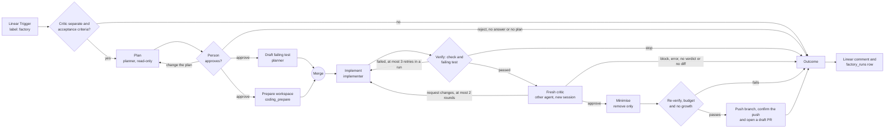

# Software factory template pack

This pack expresses a software factory as n8n workflows and agents. One run takes
one Linear ticket to a draft pull request:

ticket → plan → approval → (failing test ∥ workspace) → implement → verify →
fresh critic → minimise → draft PR → Linear comment

The factory uses n8n to build n8n. When you improve the factory, you use the
product.

This pack is a template. A test validates it, but nobody has run it end to end.
The coding steps need capabilities that n8n does not have yet. Read
[What is missing for a live run](#what-is-missing-for-a-live-run) before you
import it.

## Files

| File                                                             | What it is                                                                                                  |
| ---------------------------------------------------------------- | ----------------------------------------------------------------------------------------------------------- |
| [software-factory.workflow.json](software-factory.workflow.json) | The factory workflow. Import it into n8n.                                                                   |
| [agents/planner.agent.json](agents/planner.agent.json)           | The planner. It reads the repository, writes the plan and drafts a failing test. It cannot change anything. |
| [agents/implementer.agent.json](agents/implementer.agent.json)   | The implementer. It changes code in a coding session on the n8n repository.                                 |
| [agents/critic.agent.json](agents/critic.agent.json)             | The fresh critic. It reviews the change with read-only tools and a new session.                             |

## How a run works



## The steps

| #   | Step         | Nodes                                                                                    | What the step does                                                                                                                                                                                                                                                                                                        |
| --- | ------------ | ---------------------------------------------------------------------------------------- | ------------------------------------------------------------------------------------------------------------------------------------------------------------------------------------------------------------------------------------------------------------------------------------------------------------------------- |
| 1   | Intake       | Linear Trigger, Factory settings, Read factory ticket, Critic is separate?, Has acceptance criteria? | A run starts when an issue gets the `factory` label. The run stops when the critic is also an author. It also stops when the ticket has no acceptance criteria. The step reads the criteria and the diff budget.                                                                                                     |
| 2   | Plan         | Plan, Plan ready?                                                                        | The planner reads the code with read-only GitHub tools. It returns a structured plan: summary, steps, files, tests, risks and an estimate of changed lines. A plan without a summary or steps stops the run.                                                                                                              |
| 3   | Approval     | Ask for plan approval, Plan decision, Revise plan                                        | Slack sends the plan to a person and waits up to 3 days. The person approves the plan, asks for changes or rejects the ticket. "Change the plan" sends the feedback back to the planner in the same session.                                                                                                              |
| 4   | Prep         | Draft failing test, Prepare workspace, Repro and workspace done, Prep ready?             | The planner drafts one failing test and the command that runs it. The coding workspace clones the repository and runs the setup command. The run continues only when both are ready. n8n runs the two branches one after the other. With a background setup job, the setup runs while the planner writes the test. |
| 5   | Implement    | Implementation request, Implement                                                        | The implementer adds the failing test and confirms that it fails. Then it makes the smallest change that makes the test pass.                                                                                                                                                                                             |
| 6   | Verify       | Verify, Check result, Fix the failing check                                              | A deterministic step runs the check command of the coding config and the command of the failing test. Both must pass. When one fails, the implementer gets the end of the log. A run has 3 retries in total.                                                                                                              |
| 7   | Fresh critic | Get diff, Has a diff?, Critic input, Fresh critic, Critic verdict, Address critic findings | A different agent reviews the diff in a new session. Its input is only the ticket, the acceptance criteria, the plan, the diff and the verify result. It returns `{ verdict, findings[{ path, line, severity, body }], scopeCreep[] }`. "request_changes" goes back to the implementer, at most 2 times.      |
| 8   | Minimise     | Minimise, Re-verify, Ready for PR?                                                       | The implementer removes scope creep and changes that the criteria do not need. It adds and rewrites nothing. The check and the failing test run again. The change must pass, must not be empty, must stay inside the diff budget and must not grow.                                                                     |
| 9   | Pull request | Push branch, Branch pushed?, Open draft PR, PR opened?                                   | The branch of the run is pushed. A gate confirms the push. Then the GitHub node opens a **draft** pull request. A second gate confirms its link. A person reviews and merges it. CI runs on the pull request.                                                                                                                                              |
| 10  | Report       | Outcome nodes, Run record, Report on ticket, Ensure factory_runs table, Record run       | Every run ends in one outcome. The outcome goes to the ticket as a Linear comment and to one row in the `factory_runs` data table.                                                                                                                                                                                        |

The critic findings use the `path:line (new version)` format of the review
comments in the coding view. So the implementer reads them the same way.

## Hard gates

- **Missing acceptance criteria.** The run stops and the ticket gets a comment.
- **Plan approval.** A person approves each plan. No answer in 3 days stops
  the run.
- **Diff budget.** The default is 400 changed lines. A `budget:<lines>` label on
  the ticket replaces it. A change outside the budget gets no pull request.
- **The check and the failing test must pass.** The check command of the coding
  config is `pnpm agent:typecheck` by default. So the check alone runs no tests.
  For this reason, the same deterministic step also runs the command of the
  failing test. Only a `passed` result of both continues. An agent cannot
  report its own result.
- **Critic fails closed.** Only an explicit `approve` opens a pull request. The
  review must have no blocker or major findings, and the diff must not be
  empty. A critic error, a missing verdict, `block` or a third request for
  changes stops the run.
- **Author and critic are separate.** The critic is a different agent. At the
  start of the run, a gate compares the agents of the nodes. The run stops when
  the Fresh critic node uses the agent of Plan, Draft failing test, Implement or
  Minimise. The critic gets a new session for each review. It cannot read the
  data of other nodes. Its input holds no output of the implementer.
- **Minimise only removes.** After the critic approves, nobody reviews the
  change again. So Minimise can only remove changes. The change after Minimise
  must not have more changed lines than the change that the critic approved.
  The pull request lists the remaining critic findings for the person who
  reviews it.
- **Repair caps.** A run has 3 check retries in total, also across critic
  rounds. A run also has 2 critic repair rounds. When the check fails 3 times
  before the first review, a failed check after a critic round stops the run.
- **One branch for each run.** The branch name holds the ticket and the
  execution id, for example `factory/eng-42-1234`. Two runs for one ticket never
  share a branch.
- **A person merges.** The factory opens draft pull requests only.

Each gate checks for positive evidence. When a step fails or returns nothing,
the gate sends the run to an outcome, never to the next step.

This is necessary because of how n8n handles errors. A node can fail as a
whole, for example when it cannot connect. Then n8n sends the input item of the
node to its success output, also with "Continue (using error output)". So the
success output alone is no proof that a step worked. Each gate reads the result
of the step before it. Implement and Minimise have no gate of their own. The
deterministic check after them decides on the code, not on the answer of the
agent.

## Import the pack

### 1. Import the agents

Do these steps for each file in [agents/](agents/):

1. In n8n, create an agent in the project that will hold the workflow.
2. Open the agent menu (**⋯**) and choose **Import JSON**.
3. Choose the agent file, then choose **Import JSON** again.
4. Choose a credential for the model. The files hold no credentials.
5. For the planner and the critic, open the `github` MCP server and choose a
   Bearer Auth credential. Use a GitHub token that can only read the
   repository.
6. For the implementer, open the coding settings and choose the GitHub access
   token credential. The coding defaults for the n8n repository are already
   set.
7. Publish the agent. Production executions run the published version of an
   agent, not the draft.

An MCP client can also create the agents. Call `create_agent` with the project
id, the name and the rest of the file as `config`.

### 2. Import the workflow

1. Create a workflow. Open the workflow menu (**⋯**), choose **Import**, then
   **From file**, and choose
   [software-factory.workflow.json](software-factory.workflow.json). The file is
   also a valid request body for `POST /api/v1/workflows` of the public API.
2. Open **Factory settings** and set the values:

   | Field                               | Meaning                                                                    |
   | ----------------------------------- | -------------------------------------------------------------------------- |
   | `repositoryOwner`, `repositoryName` | The GitHub repository of the pull request.                                 |
   | `baseBranch`                        | The branch that the pull request targets.                                  |
   | `approvalChannel`                   | The Slack channel for plan approvals.                                      |
   | `n8nMcpUrl`                         | The MCP server URL of your n8n instance: `<your n8n URL>/mcp-server/http`. |
   | `defaultDiffBudget`                 | Changed lines when the ticket has no `budget:<lines>` label.               |

3. On each Message an Agent node, choose the agent:
   - **Plan** and **Draft failing test**: Factory planner.
   - **Implement** and **Minimise**: Factory implementer.
   - **Fresh critic**: Factory critic. Never choose the implementer here. The
     gate **Critic is separate?** stops each run when you do.

   The coding nodes (Prepare workspace, Verify, Get diff, Re-verify, Push
   branch) use the agent of the **Implement** node.

4. Choose the credentials. Each node names the credential that it needs:
   - `Linear account`: Linear Trigger and Report on ticket. The trigger needs
     the Admin scope to create the webhook.
   - `Slack account`: Ask for plan approval.
   - `GitHub account`: Open draft PR.
   - `n8n MCP access token`: a Bearer Auth credential with the access token from
     the MCP settings of your instance. The coding nodes use it.
5. In Linear, create the `factory` label. In the Linear Trigger, choose the
   team.
6. Publish the workflow.

The workflow creates the `factory_runs` data table on its first run. It has
these columns: `ticket`, `ticketUrl`, `status`, `summary`, `criticVerdict`,
`linesChanged` (number), `prUrl`, `executionId` and `finishedAt` (date).

The `status` column holds one of these values:

| Status                        | Meaning                                                                                |
| ----------------------------- | -------------------------------------------------------------------------------------- |
| `setup_error`                 | The Fresh critic node uses no agent or the agent of an author step.                    |
| `missing_acceptance_criteria` | The ticket has no acceptance criteria.                                                 |
| `plan_not_approved`           | The person rejected the ticket, or nobody answered in 3 days.                          |
| `step_failed`                 | A step failed, or a gate found no usable result of the step before it.                 |
| `check_failed`                | The check or the failing test did not pass, and no retry is left or allowed.           |
| `critic_blocked`              | The critic did not approve, returned no verdict or asked for a third round of changes. |
| `not_ready_for_pr`            | After Minimise, the change failed, was empty, grew or was over the budget.             |
| `draft_pr_opened`             | The factory opened a draft pull request.                                               |

## Write a factory ticket

Put the acceptance criteria below a heading or a bold line named "Acceptance
criteria". Each criterion is one item of the first list below it.

```markdown
Show the number of runs on the workflow card.

## Acceptance criteria

- The workflow card shows the number of runs in the last 7 days.
- The number is 0 for a workflow without runs.
- A unit test covers both cases.
```

The factory reads the list with these rules:

- Text before the list is not a criterion.
- An indented item or line adds to the criterion above it.
- An empty checkbox item is not a criterion.
- The next heading, bold line or other text ends the list.

Add the `factory` label to start a run. Add `budget:200` to set a diff budget
of 200 changed lines.

## What is missing for a live run

The template calls four MCP tools that n8n does not have yet:

| Tool             | Input                                        | Result                                                                                                                                                                                                                                                                    |
| ---------------- | -------------------------------------------- | ------------------------------------------------------------------------------------------------------------------------------------------------------------------------------------------------------------------------------------------------------------------------- |
| `coding_prepare` | `agentId`, `session`, `branch`, `baseBranch` | Clones the repository of the coding config into the sandbox of the session. Creates the branch and runs the setup command. Returns `phase` (`ready` on success).                                                                                                           |
| `coding_check`   | `agentId`, `session`, `testCommand`          | Runs the check command of the coding config, then `testCommand`. Returns `check`, `checkExitCode`, `test`, `testExitCode`, `changes[{ path, status, additions, deletions }]` and `logTail`. `test` and `testExitCode` describe `testCommand`. `logTail` is the end of the log of the first command that failed. |
| `coding_diff`    | `agentId`, `session`                         | Returns the unified `diff` of the branch against its base and `changes`.                                                                                                                                                                                                  |
| `coding_push`    | `agentId`, `session`, `branch`, `message`    | Commits all changes with the bot identity and pushes the branch. Returns `pushed` (`true` after a push), the `branch` and the `commit` hash.                                                                                                                               |

`check`, `checkExitCode`, `changes` and `phase` use the field names of
`AgentCodingStatus` in
[agent-coding.schema.ts](../../../packages/@n8n/api-types/src/agents/agent-coding.schema.ts).
`test` uses the same values as `check`.

Until these tools exist, the MCP Client nodes fail. The run then ends with the
outcome "prep failed" (status `step_failed`) before any pull request. These
items are missing:

1. **Coding operations that a workflow can call.** The coding service
   ([agent-coding.service.ts](../../../packages/cli/src/modules/agents/agent-coding.service.ts))
   binds every call to the `n8n-user` sandbox principal of the person in the
   coding view. Only internal REST routes with a browser session expose it:
   `/rest/projects/:projectId/agents/v2/:agentId/coding/*` (see
   [agent-coding.controller.ts](../../../packages/cli/src/modules/agents/agent-coding.controller.ts)).
   There is no public API route and no MCP tool. The operations already exist
   as REST actions: `prepare`, `check`, `commit`, `push`, the status route and
   the diff route for each file. Each operation must become an MCP capability.
   The capability takes the sandbox of a workflow session. It needs the project
   scopes `agent:read` and `agent:execute`. `coding_check` runs `testCommand` in
   the sandbox of the session, with the same rights as the commands of the
   agent.
2. **A sandbox identity for each workflow execution.** This exists in part. A
   Message an Agent node without a session key uses the sandbox of the
   `workflow-execution` principal. Each execution has its own sandbox. A custom
   session key switches to the `project-session` principal (see
   [agent-sandbox-principal.ts](../../../packages/cli/src/modules/agents/agent-sandbox-principal.ts)
   and [workflow-execute-additional-data.ts](../../../packages/cli/src/workflow-execute-additional-data.ts)).
   So the session key controls both the conversation and the sandbox. The
   template uses the session key `factory-<execution id>-implement` for
   **Implement**, **Minimise** and all coding tools. So they share one sandbox.
   In the workflow path, the implementer works in the default checkout of that
   sandbox. Nothing can create that checkout yet. Without it, the agent stops
   with "Prepare the repository in the coding view before sending a coding
   task" (see
   [agent-runtime-reconstruction.service.ts](../../../packages/cli/src/modules/agents/agent-runtime-reconstruction.service.ts)).
   A live factory needs a sandbox scope that the workflow sets itself. An
   example is one sandbox for each factory run, apart from the conversation.
3. **A bot git identity.** The commit action uses a fixed identity:
   `n8n coding demo` with the email `coding-demo@example.com`. A live factory
   needs a bot name and email for each agent or instance. It also needs a push
   credential that belongs to the bot, not to a person.
4. **Long-running checks with background and poll.** The coding service already
   runs setup and checks in the background, and the coding view polls the
   status. Setup and the check of the n8n monorepo can take up to 30 minutes. A
   workflow cannot hold one MCP call open for that time. The MCP request
   timeout, the execution timeout and process restarts end it. The template
   waits up to 30 minutes for each coding call, so that the shape stays simple.
   A live factory needs durable jobs. A start call returns a job id. A Wait node
   and a status call poll the job. The result survives a restart.
5. **Proof that the failing test fails before the change.** The implementer
   confirms this, but no deterministic step checks it. A live factory can run
   `coding_check` once after the implementer adds the test and before it
   changes the code. Only a `failed` test result may continue.

## MCP & up

Every factory step should become one MCP capability. Define each capability
once with `defineCapability`
([capability.ts](../../../packages/cli/src/services/capabilities/capability.ts)).
Offer it on both surfaces: external MCP clients and the n8n Assistant. Then
Claude Code, Codex, an agent or this workflow can run the same step with the
same permission checks.

| Step                                    | Today in this template                                       | Capability to build                                 |
| --------------------------------------- | ------------------------------------------------------------ | --------------------------------------------------- |
| Accept the ticket and read the criteria | Code node "Read factory ticket"                              | `factory_read_ticket`                               |
| Plan                                    | Message an Agent with the planner                            | `factory_plan` (returns the plan schema)            |
| Prepare the workspace                   | MCP Client: `coding_prepare`                                 | `coding_prepare`                                    |
| Verify                                  | MCP Client: `coding_check`                                   | `coding_check` as a durable job                     |
| Fresh critic                            | Set node "Critic input" and Message an Agent with the critic | `factory_review` (builds the isolated input itself) |
| Minimise                                | Message an Agent with the implementer                        | `factory_minimise`                                  |
| Diff and budget                         | MCP Client: `coding_diff` and an If node                     | `coding_diff`                                       |
| Open the pull request                   | MCP Client: `coding_push` and the GitHub node                | `coding_open_pull_request` (draft only)             |
| Record the run                          | Code node and Data table nodes                               | `factory_record_run`                                |

## Validation

These tests validate the pack. Run them from `packages/cli`:

```bash
pnpm test test/unit/software-factory
```

- [software-factory-template-pack.test.ts](../../../packages/cli/test/unit/software-factory/software-factory-template-pack.test.ts)
  checks the structure of the workflow and the agent files.
- [software-factory-template-gates.test.ts](../../../packages/cli/test/unit/software-factory/software-factory-template-gates.test.ts)
  decides each gate with sample results.
- [software-factory-template-steps.test.ts](../../../packages/cli/test/unit/software-factory/software-factory-template-steps.test.ts)
  runs the Code nodes and the expressions of the steps and the outcomes.

The tests run the expressions and the Code nodes with the expression engine and
the data proxy of n8n. So `$('Node')` reads the same output and run as in a
real execution.

The tests check that:

- the workflow is a valid body for the public API;
- each node type and version exists in this repository, with valid parameters;
- n8n keeps each parameter when it loads the workflow;
- each connection names nodes that exist, and the trigger reaches each node;
- each expression reads the success output of the nodes that it names;
- each loop has a person or a retry limit of 3 or less;
- a pull request needs each gate, and each gate stops a step that failed as a
  whole;
- the critic input holds only the ticket, the plan, the diff and the verify
  result;
- each credential is a placeholder with a name and no id;
- the Code nodes read tickets and build run records correctly;
- each MCP Client node sends the input that the tool table shows;
- the tool table names each result field that the workflow reads;
- each agent file passes the agent JSON config schema with no unknown keys;
- each agent file passes the checks that run when an agent is saved;
- the critic and the planner have no write tools, and the implementer uses the
  n8n coding defaults.
