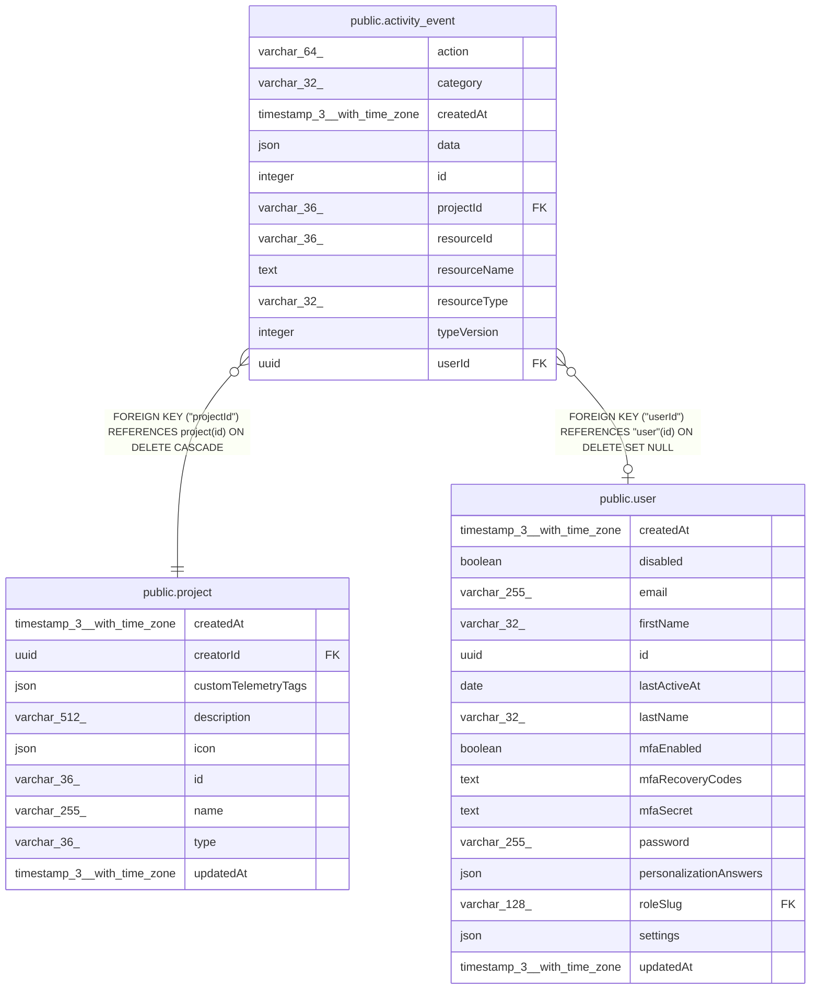

# public.activity_event

## Columns

| Name | Type | Default | Nullable | Children | Parents | Comment |
| ---- | ---- | ------- | -------- | -------- | ------- | ------- |
| action | varchar(64) |  | false |  |  | What happened, as a verb: created, saved, published, unpublished, deleted, archived, unarchived, version-updated |
| category | varchar(32) |  | false |  |  | Kind of happening, not kind of resource — see ActivityEventCategory in @n8n/db. The unit a reader caps and collapses by: workflow, credential. Executions are absent on purpose; execution_entity already records and indexes them |
| createdAt | timestamp(3) with time zone | CURRENT_TIMESTAMP(3) | false |  |  |  |
| data | json |  | true |  |  | Minimal detail that makes an entry meaningful unexpanded (a save node delta, and whether the assistant or the user changed it). Size-capped on write; no user ids |
| id | integer |  | false |  |  |  |
| projectId | varchar(36) |  | false |  | [public.project](public.project.md) | The access boundary; every read filters on it, so an entry without a project could never be shown and is not worth writing |
| resourceId | varchar(36) |  | true |  |  | Id of the resource, for fetching the full record. No FK: entries outlive it |
| resourceName | text |  | true |  |  | Name at the time of the entry, denormalised so a row reads without a join and survives the resource being deleted. Truncated on write |
| resourceType | varchar(32) |  | true |  |  | What `resourceId` points at; see ActivityResourceType in @n8n/db. NULL when an entry is about the instance rather than a resource |
| typeVersion | integer | 1 | false |  |  | Schema version of `data` for this category/action pair |
| userId | uuid |  | true |  | [public.user](public.user.md) | Who acted. Never NULL on insert — every event carries a user. Goes NULL when that user is deleted |

## Constraints

| Name | Type | Definition |
| ---- | ---- | ---------- |
| FK_29654477f37189453b353d3f46a | FOREIGN KEY | FOREIGN KEY ("userId") REFERENCES "user"(id) ON DELETE SET NULL |
| FK_6bf94d5542661d2e1b9e0c41436 | FOREIGN KEY | FOREIGN KEY ("projectId") REFERENCES project(id) ON DELETE CASCADE |
| PK_c2c1e9fdda754a6bf7f664d7e04 | PRIMARY KEY | PRIMARY KEY (id) |
| activity_event_action_not_null | n | NOT NULL action |
| activity_event_category_not_null | n | NOT NULL category |
| activity_event_createdAt_not_null | n | NOT NULL "createdAt" |
| activity_event_id_not_null | n | NOT NULL id |
| activity_event_projectId_not_null | n | NOT NULL "projectId" |
| activity_event_typeVersion_not_null | n | NOT NULL "typeVersion" |

## Indexes

| Name | Definition |
| ---- | ---------- |
| IDX_activity_event_project | CREATE INDEX "IDX_activity_event_project" ON public.activity_event USING btree ("projectId", id) |
| IDX_activity_event_resource | CREATE INDEX "IDX_activity_event_resource" ON public.activity_event USING btree ("resourceType", "resourceId", id) |
| IDX_activity_event_user | CREATE INDEX "IDX_activity_event_user" ON public.activity_event USING btree ("userId", id) |
| PK_c2c1e9fdda754a6bf7f664d7e04 | CREATE UNIQUE INDEX "PK_c2c1e9fdda754a6bf7f664d7e04" ON public.activity_event USING btree (id) |

## Relations

---

> Generated by [tbls](https://github.com/k1LoW/tbls)
