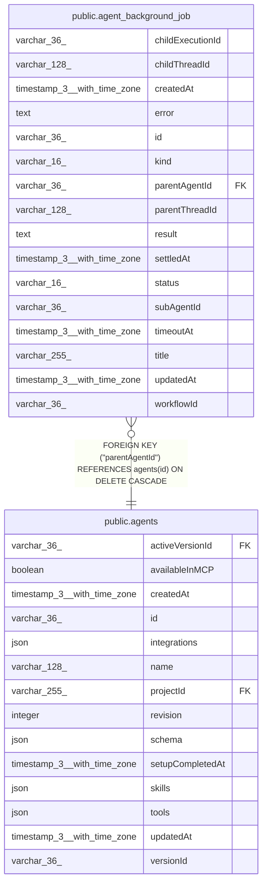

# public.agent_background_job

## Columns

| Name | Type | Default | Nullable | Children | Parents | Comment |
| ---- | ---- | ------- | -------- | -------- | ------- | ------- |
| childExecutionId | varchar(36) |  | true |  |  | Workflow jobs only |
| childThreadId | varchar(128) |  | true |  |  | Sub-agent jobs only; minted at dispatch, links to agent_execution_threads |
| createdAt | timestamp(3) with time zone | CURRENT_TIMESTAMP(3) | false |  |  |  |
| error | text |  | true |  |  |  |
| id | varchar(36) |  | false |  |  |  |
| kind | varchar(16) |  | false |  |  | What the job tracks: a detached sub-agent run or a workflow execution |
| parentAgentId | varchar(36) |  | false |  | [public.agents](public.agents.md) |  |
| parentThreadId | varchar(128) |  | false |  |  |  |
| result | text |  | true |  |  | Final answer of a settled sub-agent job |
| settledAt | timestamp(3) with time zone |  | true |  |  |  |
| status | varchar(16) |  | false |  |  |  |
| subAgentId | varchar(36) |  | true |  |  | Sub-agent jobs only |
| timeoutAt | timestamp(3) with time zone |  | true |  |  | When reconciliation fails the job as timed out; NULL means no timeout |
| title | varchar(255) |  | false |  |  | Task name or workflow name, echoed in status-check listings |
| updatedAt | timestamp(3) with time zone | CURRENT_TIMESTAMP(3) | false |  |  |  |
| workflowId | varchar(36) |  | true |  |  | Workflow jobs only; scopes cancellation |

## Constraints

| Name | Type | Definition |
| ---- | ---- | ---------- |
| CHK_agent_background_job_kind | CHECK | CHECK (((kind)::text = ANY ((ARRAY['subagent'::character varying, 'workflow'::character varying])::text[]))) |
| CHK_agent_background_job_status | CHECK | CHECK (((status)::text = ANY ((ARRAY['running'::character varying, 'completed'::character varying, 'failed'::character varying, 'cancelled'::character varying])::text[]))) |
| FK_d46c6f00730c2ef8bcb6ee24b67 | FOREIGN KEY | FOREIGN KEY ("parentAgentId") REFERENCES agents(id) ON DELETE CASCADE |
| PK_6e0db58281aa2b4c956dc0d58e9 | PRIMARY KEY | PRIMARY KEY (id) |
| agent_background_job_createdAt_not_null | n | NOT NULL "createdAt" |
| agent_background_job_id_not_null | n | NOT NULL id |
| agent_background_job_kind_not_null | n | NOT NULL kind |
| agent_background_job_parentAgentId_not_null | n | NOT NULL "parentAgentId" |
| agent_background_job_parentThreadId_not_null | n | NOT NULL "parentThreadId" |
| agent_background_job_status_not_null | n | NOT NULL status |
| agent_background_job_title_not_null | n | NOT NULL title |
| agent_background_job_updatedAt_not_null | n | NOT NULL "updatedAt" |

## Indexes

| Name | Definition |
| ---- | ---------- |
| IDX_93d62baabe9858816b5adafb44 | CREATE INDEX "IDX_93d62baabe9858816b5adafb44" ON public.agent_background_job USING btree ("parentThreadId", status) |
| IDX_agent_background_job_childExecutionId | CREATE UNIQUE INDEX "IDX_agent_background_job_childExecutionId" ON public.agent_background_job USING btree ("childExecutionId") WHERE ("childExecutionId" IS NOT NULL) |
| IDX_agent_background_job_timeoutAt | CREATE INDEX "IDX_agent_background_job_timeoutAt" ON public.agent_background_job USING btree ("timeoutAt") WHERE ((status)::text = 'running'::text) |
| IDX_d46c6f00730c2ef8bcb6ee24b6 | CREATE INDEX "IDX_d46c6f00730c2ef8bcb6ee24b6" ON public.agent_background_job USING btree ("parentAgentId") |
| IDX_e43e630272995a93dfeb94ab3e | CREATE INDEX "IDX_e43e630272995a93dfeb94ab3e" ON public.agent_background_job USING btree ("settledAt") |
| PK_6e0db58281aa2b4c956dc0d58e9 | CREATE UNIQUE INDEX "PK_6e0db58281aa2b4c956dc0d58e9" ON public.agent_background_job USING btree (id) |

## Relations

---

> Generated by [tbls](https://github.com/k1LoW/tbls)
