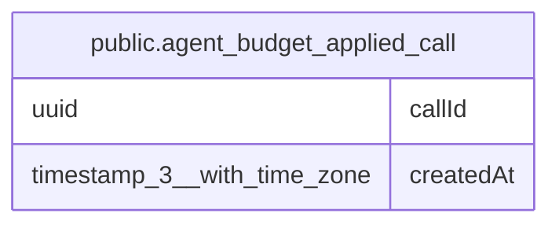

# public.agent_budget_applied_call

## Columns

| Name | Type | Default | Nullable | Children | Parents | Comment |
| ---- | ---- | ------- | -------- | -------- | ------- | ------- |
| callId | uuid |  | false |  |  | Model call id. A second insert of the same id does not add spend. |
| createdAt | timestamp(3) with time zone | CURRENT_TIMESTAMP(3) | false |  |  | Time this call id was stored. A later prune can delete old rows. |

## Constraints

| Name | Type | Definition |
| ---- | ---- | ---------- |
| PK_0d91039b74f93ae1bdfc485e2ba | PRIMARY KEY | PRIMARY KEY ("callId") |
| agent_budget_applied_call_callId_not_null | n | NOT NULL "callId" |
| agent_budget_applied_call_createdAt_not_null | n | NOT NULL "createdAt" |

## Indexes

| Name | Definition |
| ---- | ---------- |
| PK_0d91039b74f93ae1bdfc485e2ba | CREATE UNIQUE INDEX "PK_0d91039b74f93ae1bdfc485e2ba" ON public.agent_budget_applied_call USING btree ("callId") |

## Relations

---

> Generated by [tbls](https://github.com/k1LoW/tbls)
