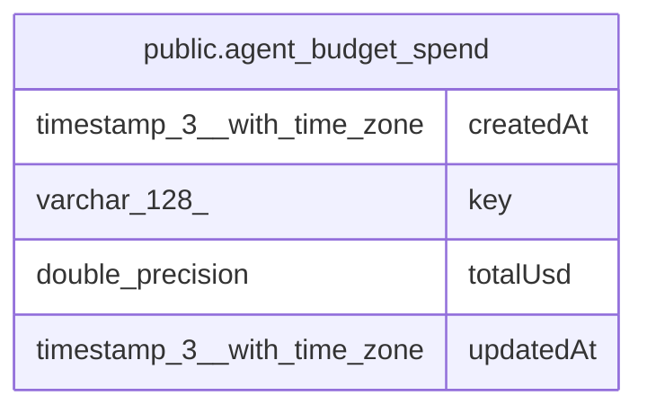

# public.agent_budget_spend

## Columns

| Name | Type | Default | Nullable | Children | Parents | Comment |
| ---- | ---- | ------- | -------- | -------- | ------- | ------- |
| createdAt | timestamp(3) with time zone | CURRENT_TIMESTAMP(3) | false |  |  |  |
| key | varchar(128) |  | false |  |  | Session key is the root thread id. Month key is {agentId}:{YYYY-MM}. |
| totalUsd | double precision | 0 | false |  |  | Running USD estimate for this ledger key. A check rejects a negative total. |
| updatedAt | timestamp(3) with time zone | CURRENT_TIMESTAMP(3) | false |  |  |  |

## Constraints

| Name | Type | Definition |
| ---- | ---- | ---------- |
| CHK_agent_budget_spend_total_usd_non_negative | CHECK | CHECK (("totalUsd" >= (0)::double precision)) |
| PK_ca88e3ef81cc367fc55807e582c | PRIMARY KEY | PRIMARY KEY (key) |
| agent_budget_spend_createdAt_not_null | n | NOT NULL "createdAt" |
| agent_budget_spend_key_not_null | n | NOT NULL key |
| agent_budget_spend_totalUsd_not_null | n | NOT NULL "totalUsd" |
| agent_budget_spend_updatedAt_not_null | n | NOT NULL "updatedAt" |

## Indexes

| Name | Definition |
| ---- | ---------- |
| PK_ca88e3ef81cc367fc55807e582c | CREATE UNIQUE INDEX "PK_ca88e3ef81cc367fc55807e582c" ON public.agent_budget_spend USING btree (key) |

## Relations

---

> Generated by [tbls](https://github.com/k1LoW/tbls)
