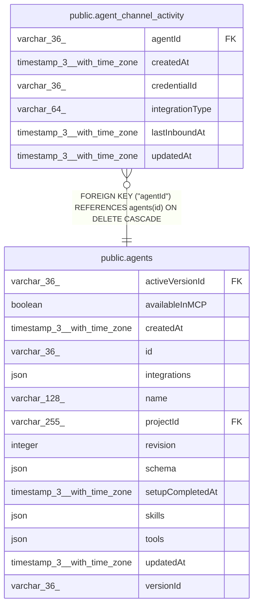

# public.agent_channel_activity

## Columns

| Name | Type | Default | Nullable | Children | Parents | Comment |
| ---- | ---- | ------- | -------- | -------- | ------- | ------- |
| agentId | varchar(36) |  | false |  | [public.agents](public.agents.md) | Agent that owns this channel |
| createdAt | timestamp(3) with time zone | CURRENT_TIMESTAMP(3) | false |  |  |  |
| credentialId | varchar(36) |  | false |  |  | Credential connection that backs this channel |
| integrationType | varchar(64) |  | false |  |  | Chat integration platform for this channel |
| lastInboundAt | timestamp(3) with time zone |  | false |  |  | When the channel last received a message from a user |
| updatedAt | timestamp(3) with time zone | CURRENT_TIMESTAMP(3) | false |  |  |  |

## Constraints

| Name | Type | Definition |
| ---- | ---- | ---------- |
| FK_7ce2281cac622a5d634663dfa69 | FOREIGN KEY | FOREIGN KEY ("agentId") REFERENCES agents(id) ON DELETE CASCADE |
| PK_6598796b65ea9696eb9bdcbae2a | PRIMARY KEY | PRIMARY KEY ("agentId", "integrationType", "credentialId") |
| agent_channel_activity_agentId_not_null | n | NOT NULL "agentId" |
| agent_channel_activity_createdAt_not_null | n | NOT NULL "createdAt" |
| agent_channel_activity_credentialId_not_null | n | NOT NULL "credentialId" |
| agent_channel_activity_integrationType_not_null | n | NOT NULL "integrationType" |
| agent_channel_activity_lastInboundAt_not_null | n | NOT NULL "lastInboundAt" |
| agent_channel_activity_updatedAt_not_null | n | NOT NULL "updatedAt" |

## Indexes

| Name | Definition |
| ---- | ---------- |
| PK_6598796b65ea9696eb9bdcbae2a | CREATE UNIQUE INDEX "PK_6598796b65ea9696eb9bdcbae2a" ON public.agent_channel_activity USING btree ("agentId", "integrationType", "credentialId") |

## Relations

---

> Generated by [tbls](https://github.com/k1LoW/tbls)
