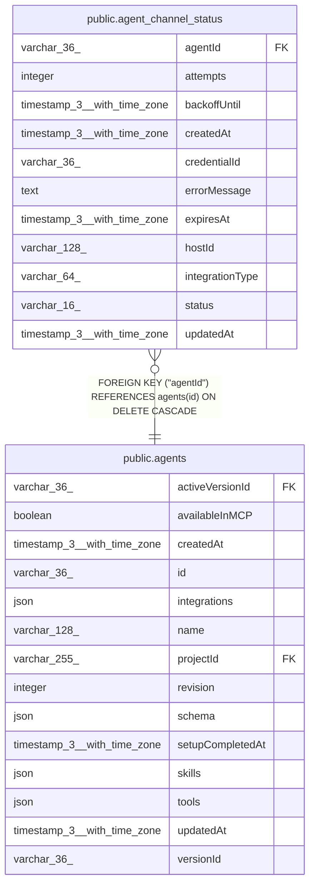

# public.agent_channel_status

## Columns

| Name | Type | Default | Nullable | Children | Parents | Comment |
| ---- | ---- | ------- | -------- | -------- | ------- | ------- |
| agentId | varchar(36) |  | false |  | [public.agents](public.agents.md) | Agent that owns this channel |
| attempts | integer | 0 | false |  |  | Consecutive failed startup attempts by this process, reset on success |
| backoffUntil | timestamp(3) with time zone |  | true |  |  | Earliest this process should retry; null when there is nothing to retry |
| createdAt | timestamp(3) with time zone | CURRENT_TIMESTAMP(3) | false |  |  |  |
| credentialId | varchar(36) |  | false |  |  | Credential connection that backs this channel; no FK so a failure is still recordable after the credential is deleted |
| errorMessage | text |  | true |  |  | Why this process could not start the channel; null once it succeeds |
| expiresAt | timestamp(3) with time zone |  | true |  |  | When this row stops counting unless its owner refreshes it; null never expires |
| hostId | varchar(128) |  | false |  |  | Process that observed this; the only writer of this row |
| integrationType | varchar(64) |  | false |  |  | Chat integration platform for this channel |
| status | varchar(16) |  | false |  |  | What this process last observed: connected or error |
| updatedAt | timestamp(3) with time zone | CURRENT_TIMESTAMP(3) | false |  |  |  |

## Constraints

| Name | Type | Definition |
| ---- | ---- | ---------- |
| CHK_agent_channel_status_status | CHECK | CHECK (((status)::text = ANY ((ARRAY['connected'::character varying, 'error'::character varying])::text[]))) |
| FK_7a723e6aad04d88057dea6a21f4 | FOREIGN KEY | FOREIGN KEY ("agentId") REFERENCES agents(id) ON DELETE CASCADE |
| PK_4e1ca943734d575679a56f4da90 | PRIMARY KEY | PRIMARY KEY ("agentId", "integrationType", "credentialId", "hostId") |
| agent_channel_status_agentId_not_null | n | NOT NULL "agentId" |
| agent_channel_status_attempts_not_null | n | NOT NULL attempts |
| agent_channel_status_createdAt_not_null | n | NOT NULL "createdAt" |
| agent_channel_status_credentialId_not_null | n | NOT NULL "credentialId" |
| agent_channel_status_hostId_not_null | n | NOT NULL "hostId" |
| agent_channel_status_integrationType_not_null | n | NOT NULL "integrationType" |
| agent_channel_status_status_not_null | n | NOT NULL status |
| agent_channel_status_updatedAt_not_null | n | NOT NULL "updatedAt" |

## Indexes

| Name | Definition |
| ---- | ---------- |
| IDX_a7c67724df9ef3d12f6da773c1 | CREATE INDEX "IDX_a7c67724df9ef3d12f6da773c1" ON public.agent_channel_status USING btree ("expiresAt") |
| IDX_c75ec632fe0b5b1905edb9cd7f | CREATE INDEX "IDX_c75ec632fe0b5b1905edb9cd7f" ON public.agent_channel_status USING btree ("hostId") |
| PK_4e1ca943734d575679a56f4da90 | CREATE UNIQUE INDEX "PK_4e1ca943734d575679a56f4da90" ON public.agent_channel_status USING btree ("agentId", "integrationType", "credentialId", "hostId") |

## Relations

---

> Generated by [tbls](https://github.com/k1LoW/tbls)
