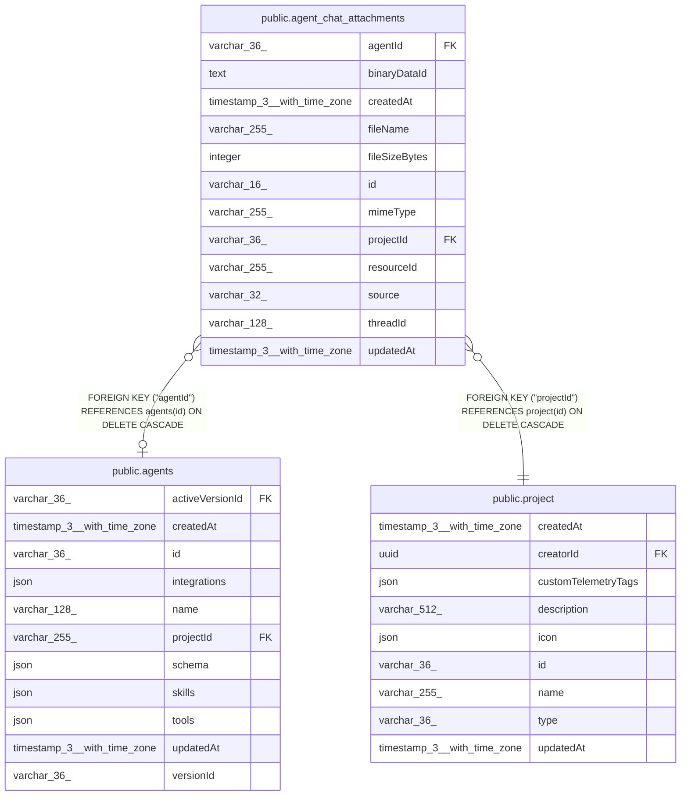

# public.agent_chat_attachments

## Columns

| Name | Type | Default | Nullable | Children | Parents | Comment |
| ---- | ---- | ------- | -------- | -------- | ------- | ------- |
| agentId | varchar(36) |  | true |  | [public.agents](public.agents.md) | Agent the attachment was sent to, when persisted |
| binaryDataId | text |  | false |  |  | Opaque BinaryDataService reference (mode-prefixed, e.g. "filesystem-v2:\<uuid\>"); not an FK to binary_data, which only has rows in DB storage mode |
| createdAt | timestamp(3) with time zone | CURRENT_TIMESTAMP(3) | false |  |  |  |
| fileName | varchar(255) |  | false |  |  |  |
| fileSizeBytes | integer |  | false |  |  | Uploaded file size in bytes |
| id | varchar(16) |  | false |  |  | Application-generated n8n nano ID |
| mimeType | varchar(255) |  | false |  |  |  |
| projectId | varchar(36) |  | false |  | [public.project](public.project.md) | Project owning the conversation; authorization scope for downloads |
| resourceId | varchar(255) |  | true |  |  | Per-user scope within the thread (platform user), when known |
| source | varchar(32) |  | false |  |  | Surface the file arrived from, e.g. "chat", "slack", "telegram" |
| threadId | varchar(128) |  | false |  |  | Conversation thread the file belongs to |
| updatedAt | timestamp(3) with time zone | CURRENT_TIMESTAMP(3) | false |  |  |  |

## Constraints

| Name | Type | Definition |
| ---- | ---- | ---------- |
| FK_41c246c30af3d2108d93e15dd5e | FOREIGN KEY | FOREIGN KEY ("agentId") REFERENCES agents(id) ON DELETE CASCADE |
| FK_5c048535b2132b40dfed2e640e5 | FOREIGN KEY | FOREIGN KEY ("projectId") REFERENCES project(id) ON DELETE CASCADE |
| PK_9c1250f77b41d1a0e71a3f1414a | PRIMARY KEY | PRIMARY KEY (id) |
| agent_chat_attachments_binaryDataId_not_null | n | NOT NULL "binaryDataId" |
| agent_chat_attachments_createdAt_not_null | n | NOT NULL "createdAt" |
| agent_chat_attachments_fileName_not_null | n | NOT NULL "fileName" |
| agent_chat_attachments_fileSizeBytes_not_null | n | NOT NULL "fileSizeBytes" |
| agent_chat_attachments_id_not_null | n | NOT NULL id |
| agent_chat_attachments_mimeType_not_null | n | NOT NULL "mimeType" |
| agent_chat_attachments_projectId_not_null | n | NOT NULL "projectId" |
| agent_chat_attachments_source_not_null | n | NOT NULL source |
| agent_chat_attachments_threadId_not_null | n | NOT NULL "threadId" |
| agent_chat_attachments_updatedAt_not_null | n | NOT NULL "updatedAt" |

## Indexes

| Name | Definition |
| ---- | ---------- |
| IDX_6806b43c8a0d11460f0c2552eb | CREATE INDEX "IDX_6806b43c8a0d11460f0c2552eb" ON public.agent_chat_attachments USING btree ("projectId", "threadId") |
| IDX_7e9556f25f995653997be3322b | CREATE INDEX "IDX_7e9556f25f995653997be3322b" ON public.agent_chat_attachments USING btree ("agentId", "threadId") |
| PK_9c1250f77b41d1a0e71a3f1414a | CREATE UNIQUE INDEX "PK_9c1250f77b41d1a0e71a3f1414a" ON public.agent_chat_attachments USING btree (id) |

## Relations

---

> Generated by [tbls](https://github.com/k1LoW/tbls)
