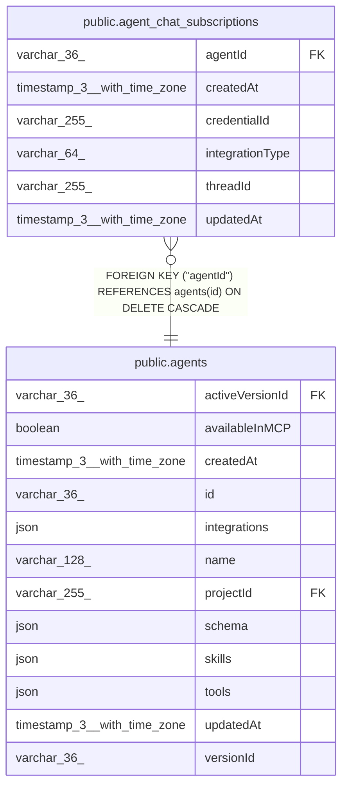

# public.agent_chat_subscriptions

## Columns

| Name | Type | Default | Nullable | Children | Parents | Comment |
| ---- | ---- | ------- | -------- | -------- | ------- | ------- |
| agentId | varchar(36) |  | false |  | [public.agents](public.agents.md) | Agent that owns this subscription |
| createdAt | timestamp(3) with time zone | CURRENT_TIMESTAMP(3) | false |  |  |  |
| credentialId | varchar(255) |  | false |  |  | Credential connection that owns this subscription |
| integrationType | varchar(64) |  | false |  |  | Chat integration platform for this subscription |
| threadId | varchar(255) |  | false |  |  | Platform thread ID the agent is subscribed to |
| updatedAt | timestamp(3) with time zone | CURRENT_TIMESTAMP(3) | false |  |  |  |

## Constraints

| Name | Type | Definition |
| ---- | ---- | ---------- |
| CHK_agent_chat_subscriptions_integrationType | CHECK | CHECK ((("integrationType")::text = ANY ((ARRAY['telegram'::character varying, 'slack'::character varying, 'linear'::character varying])::text[]))) |
| FK_e79153bd179c011e779d5016796 | FOREIGN KEY | FOREIGN KEY ("agentId") REFERENCES agents(id) ON DELETE CASCADE |
| PK_76598cf91038bee1f3ac94c94bc | PRIMARY KEY | PRIMARY KEY ("agentId", "integrationType", "credentialId", "threadId") |
| agent_chat_subscriptions_agentId_not_null | n | NOT NULL "agentId" |
| agent_chat_subscriptions_createdAt_not_null | n | NOT NULL "createdAt" |
| agent_chat_subscriptions_credentialId_not_null | n | NOT NULL "credentialId" |
| agent_chat_subscriptions_integrationType_not_null | n | NOT NULL "integrationType" |
| agent_chat_subscriptions_threadId_not_null | n | NOT NULL "threadId" |
| agent_chat_subscriptions_updatedAt_not_null | n | NOT NULL "updatedAt" |

## Indexes

| Name | Definition |
| ---- | ---------- |
| PK_76598cf91038bee1f3ac94c94bc | CREATE UNIQUE INDEX "PK_76598cf91038bee1f3ac94c94bc" ON public.agent_chat_subscriptions USING btree ("agentId", "integrationType", "credentialId", "threadId") |

## Relations

---

> Generated by [tbls](https://github.com/k1LoW/tbls)
