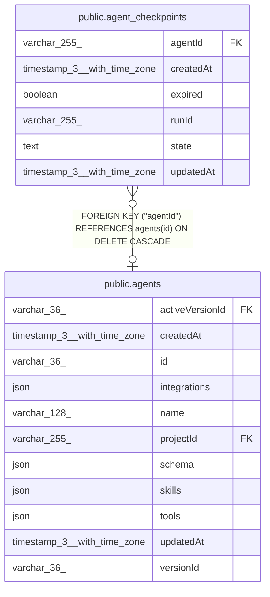

# public.agent_checkpoints

## Columns

| Name | Type | Default | Nullable | Children | Parents | Comment |
| ---- | ---- | ------- | -------- | -------- | ------- | ------- |
| agentId | varchar(255) |  | true |  | [public.agents](public.agents.md) |  |
| createdAt | timestamp(3) with time zone | CURRENT_TIMESTAMP(3) | false |  |  |  |
| expired | boolean | false | false |  |  |  |
| runId | varchar(255) |  | false |  |  |  |
| state | text |  | true |  |  |  |
| updatedAt | timestamp(3) with time zone | CURRENT_TIMESTAMP(3) | false |  |  |  |

## Constraints

| Name | Type | Definition |
| ---- | ---- | ---------- |
| FK_5e31c210f896d539964bf99fe32 | FOREIGN KEY | FOREIGN KEY ("agentId") REFERENCES agents(id) ON DELETE CASCADE |
| PK_50a27cbafa6806c9b162304b5fd | PRIMARY KEY | PRIMARY KEY ("runId") |
| agent_checkpoints_createdAt_not_null | n | NOT NULL "createdAt" |
| agent_checkpoints_expired_not_null | n | NOT NULL expired |
| agent_checkpoints_runId_not_null | n | NOT NULL "runId" |
| agent_checkpoints_updatedAt_not_null | n | NOT NULL "updatedAt" |

## Indexes

| Name | Definition |
| ---- | ---------- |
| IDX_5e31c210f896d539964bf99fe3 | CREATE INDEX "IDX_5e31c210f896d539964bf99fe3" ON public.agent_checkpoints USING btree ("agentId") |
| PK_50a27cbafa6806c9b162304b5fd | CREATE UNIQUE INDEX "PK_50a27cbafa6806c9b162304b5fd" ON public.agent_checkpoints USING btree ("runId") |

## Relations

---

> Generated by [tbls](https://github.com/k1LoW/tbls)
