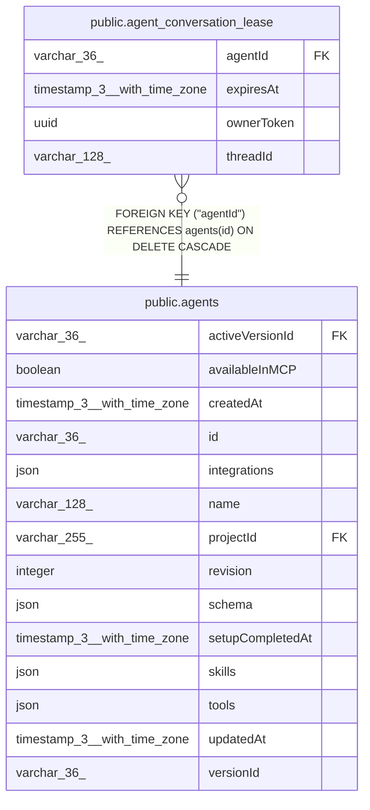

# public.agent_conversation_lease

## Columns

| Name | Type | Default | Nullable | Children | Parents | Comment |
| ---- | ---- | ------- | -------- | -------- | ------- | ------- |
| agentId | varchar(36) |  | false |  | [public.agents](public.agents.md) |  |
| expiresAt | timestamp(3) with time zone |  | false |  |  | Lease expiry on the database clock. |
| ownerToken | uuid |  | false |  |  | Fresh identity for one execution owner. |
| threadId | varchar(128) |  | false |  |  | Conversation routing ID. |

## Constraints

| Name | Type | Definition |
| ---- | ---- | ---------- |
| FK_828d2a046ac7a8565ac2d273d1c | FOREIGN KEY | FOREIGN KEY ("agentId") REFERENCES agents(id) ON DELETE CASCADE |
| PK_1f4fe0ff37a0ebe5023c2f294f7 | PRIMARY KEY | PRIMARY KEY ("threadId") |
| agent_conversation_lease_agentId_not_null | n | NOT NULL "agentId" |
| agent_conversation_lease_expiresAt_not_null | n | NOT NULL "expiresAt" |
| agent_conversation_lease_ownerToken_not_null | n | NOT NULL "ownerToken" |
| agent_conversation_lease_threadId_not_null | n | NOT NULL "threadId" |

## Indexes

| Name | Definition |
| ---- | ---------- |
| IDX_828d2a046ac7a8565ac2d273d1 | CREATE INDEX "IDX_828d2a046ac7a8565ac2d273d1" ON public.agent_conversation_lease USING btree ("agentId") |
| PK_1f4fe0ff37a0ebe5023c2f294f7 | CREATE UNIQUE INDEX "PK_1f4fe0ff37a0ebe5023c2f294f7" ON public.agent_conversation_lease USING btree ("threadId") |

## Relations

---

> Generated by [tbls](https://github.com/k1LoW/tbls)
