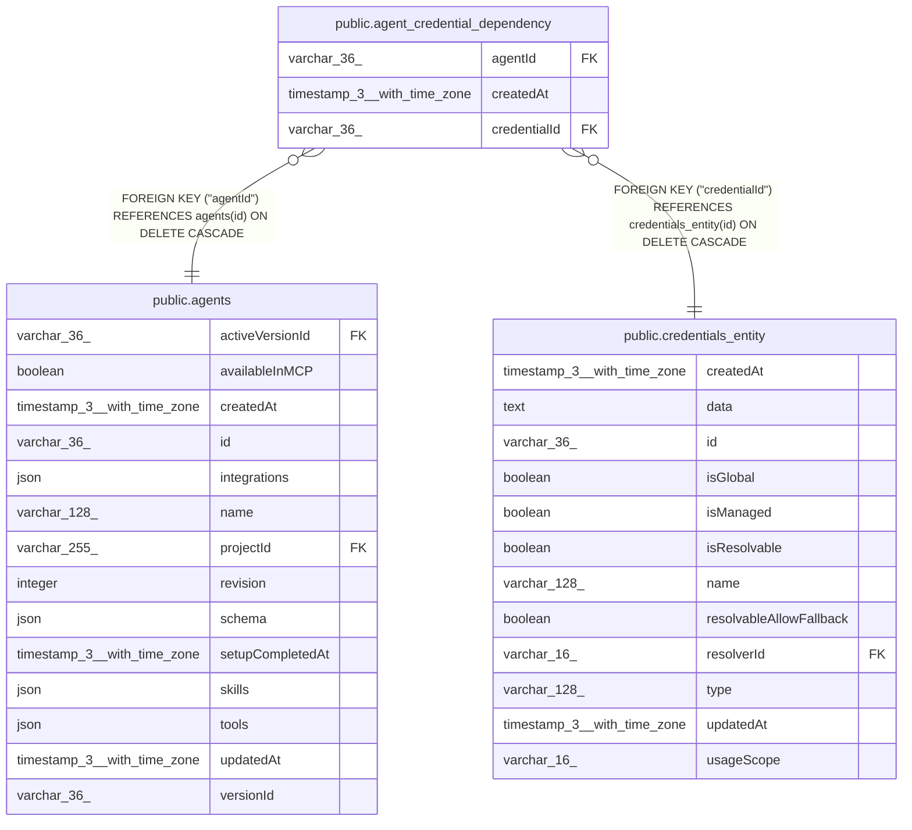

# public.agent_credential_dependency

## Columns

| Name | Type | Default | Nullable | Children | Parents | Comment |
| ---- | ---- | ------- | -------- | -------- | ------- | ------- |
| agentId | varchar(36) |  | false |  | [public.agents](public.agents.md) |  |
| createdAt | timestamp(3) with time zone | CURRENT_TIMESTAMP(3) | false |  |  |  |
| credentialId | varchar(36) |  | false |  | [public.credentials_entity](public.credentials_entity.md) |  |

## Constraints

| Name | Type | Definition |
| ---- | ---- | ---------- |
| FK_6a6948884969cb4204a1975578b | FOREIGN KEY | FOREIGN KEY ("agentId") REFERENCES agents(id) ON DELETE CASCADE |
| FK_fec7ee37062350d6a4a2979327d | FOREIGN KEY | FOREIGN KEY ("credentialId") REFERENCES credentials_entity(id) ON DELETE CASCADE |
| PK_546f5d9cfaf5ea78efcc6f5d0a2 | PRIMARY KEY | PRIMARY KEY ("agentId", "credentialId") |
| agent_credential_dependency_agentId_not_null | n | NOT NULL "agentId" |
| agent_credential_dependency_createdAt_not_null | n | NOT NULL "createdAt" |
| agent_credential_dependency_credentialId_not_null | n | NOT NULL "credentialId" |

## Indexes

| Name | Definition |
| ---- | ---------- |
| IDX_fec7ee37062350d6a4a2979327 | CREATE INDEX "IDX_fec7ee37062350d6a4a2979327" ON public.agent_credential_dependency USING btree ("credentialId") |
| PK_546f5d9cfaf5ea78efcc6f5d0a2 | CREATE UNIQUE INDEX "PK_546f5d9cfaf5ea78efcc6f5d0a2" ON public.agent_credential_dependency USING btree ("agentId", "credentialId") |

## Relations

---

> Generated by [tbls](https://github.com/k1LoW/tbls)
