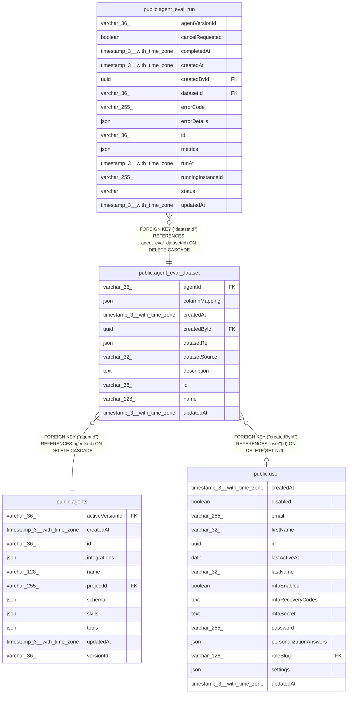

# public.agent_eval_dataset

## Columns

| Name | Type | Default | Nullable | Children | Parents | Comment |
| ---- | ---- | ------- | -------- | -------- | ------- | ------- |
| agentId | varchar(36) |  | false |  | [public.agents](public.agents.md) |  |
| columnMapping | json |  | true |  |  | Maps dataset columns onto input / expectedOutput / criteria roles |
| createdAt | timestamp(3) with time zone | CURRENT_TIMESTAMP(3) | false |  |  |  |
| createdById | uuid |  | true |  | [public.user](public.user.md) |  |
| datasetRef | json |  | false |  |  | Pointer into the dataset backend (e.g. { dataTableId }); shape varies by datasetSource |
| datasetSource | varchar(32) |  | false |  |  | Dataset backend the cases are read from |
| description | text |  | true |  |  |  |
| id | varchar(36) |  | false | [public.agent_eval_run](public.agent_eval_run.md) |  |  |
| name | varchar(128) |  | false |  |  |  |
| updatedAt | timestamp(3) with time zone | CURRENT_TIMESTAMP(3) | false |  |  |  |

## Constraints

| Name | Type | Definition |
| ---- | ---- | ---------- |
| CHK_agent_eval_dataset_datasetSource | CHECK | CHECK ((("datasetSource")::text = ANY ((ARRAY['data_table'::character varying, 'google_sheets'::character varying])::text[]))) |
| FK_9d3a6fd750f7746de453cf4d5ed | FOREIGN KEY | FOREIGN KEY ("agentId") REFERENCES agents(id) ON DELETE CASCADE |
| FK_eda9e5fa5558d3f16bc2f6c21b6 | FOREIGN KEY | FOREIGN KEY ("createdById") REFERENCES "user"(id) ON DELETE SET NULL |
| PK_ac887efbb3580a577f1442cfa89 | PRIMARY KEY | PRIMARY KEY (id) |
| agent_eval_dataset_agentId_not_null | n | NOT NULL "agentId" |
| agent_eval_dataset_createdAt_not_null | n | NOT NULL "createdAt" |
| agent_eval_dataset_datasetRef_not_null | n | NOT NULL "datasetRef" |
| agent_eval_dataset_datasetSource_not_null | n | NOT NULL "datasetSource" |
| agent_eval_dataset_id_not_null | n | NOT NULL id |
| agent_eval_dataset_name_not_null | n | NOT NULL name |
| agent_eval_dataset_updatedAt_not_null | n | NOT NULL "updatedAt" |

## Indexes

| Name | Definition |
| ---- | ---------- |
| IDX_9d3a6fd750f7746de453cf4d5e | CREATE INDEX "IDX_9d3a6fd750f7746de453cf4d5e" ON public.agent_eval_dataset USING btree ("agentId") |
| PK_ac887efbb3580a577f1442cfa89 | CREATE UNIQUE INDEX "PK_ac887efbb3580a577f1442cfa89" ON public.agent_eval_dataset USING btree (id) |

## Relations

---

> Generated by [tbls](https://github.com/k1LoW/tbls)
