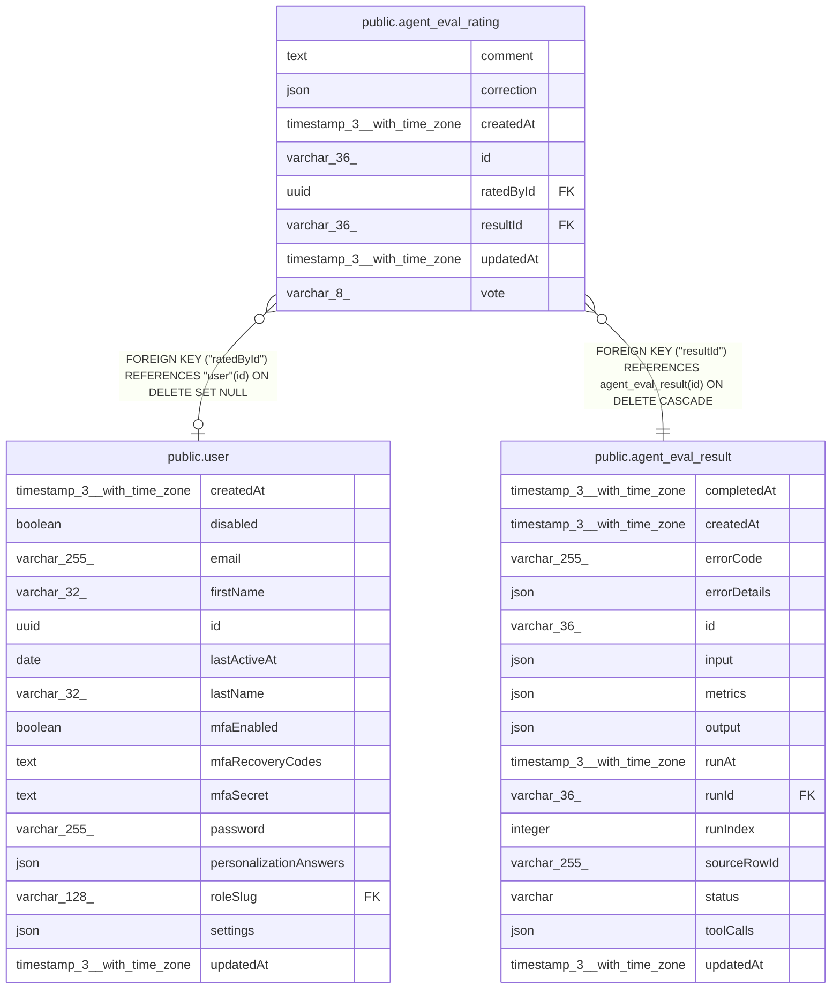

# public.agent_eval_rating

## Columns

| Name | Type | Default | Nullable | Children | Parents | Comment |
| ---- | ---- | ------- | -------- | -------- | ------- | ------- |
| comment | text |  | true |  |  |  |
| correction | json |  | true |  |  | Optional corrected/edited output supplied by the rater |
| createdAt | timestamp(3) with time zone | CURRENT_TIMESTAMP(3) | false |  |  |  |
| id | varchar(36) |  | false |  |  |  |
| ratedById | uuid |  | true |  | [public.user](public.user.md) |  |
| resultId | varchar(36) |  | false |  | [public.agent_eval_result](public.agent_eval_result.md) |  |
| updatedAt | timestamp(3) with time zone | CURRENT_TIMESTAMP(3) | false |  |  |  |
| vote | varchar(8) |  | false |  |  | Human feedback direction |

## Constraints

| Name | Type | Definition |
| ---- | ---- | ---------- |
| CHK_agent_eval_rating_vote | CHECK | CHECK (((vote)::text = ANY ((ARRAY['up'::character varying, 'down'::character varying])::text[]))) |
| FK_9cadae6591c64498f1b58a2cef3 | FOREIGN KEY | FOREIGN KEY ("resultId") REFERENCES agent_eval_result(id) ON DELETE CASCADE |
| FK_e06a7408573a3e152e673977d2c | FOREIGN KEY | FOREIGN KEY ("ratedById") REFERENCES "user"(id) ON DELETE SET NULL |
| PK_04b7709a435e0c07520ceb37393 | PRIMARY KEY | PRIMARY KEY (id) |
| agent_eval_rating_createdAt_not_null | n | NOT NULL "createdAt" |
| agent_eval_rating_id_not_null | n | NOT NULL id |
| agent_eval_rating_resultId_not_null | n | NOT NULL "resultId" |
| agent_eval_rating_updatedAt_not_null | n | NOT NULL "updatedAt" |
| agent_eval_rating_vote_not_null | n | NOT NULL vote |

## Indexes

| Name | Definition |
| ---- | ---------- |
| IDX_9cadae6591c64498f1b58a2cef | CREATE INDEX "IDX_9cadae6591c64498f1b58a2cef" ON public.agent_eval_rating USING btree ("resultId") |
| PK_04b7709a435e0c07520ceb37393 | CREATE UNIQUE INDEX "PK_04b7709a435e0c07520ceb37393" ON public.agent_eval_rating USING btree (id) |

## Relations

---

> Generated by [tbls](https://github.com/k1LoW/tbls)
