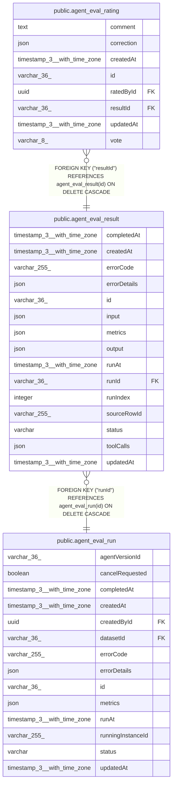

# public.agent_eval_result

## Columns

| Name | Type | Default | Nullable | Children | Parents | Comment |
| ---- | ---- | ------- | -------- | -------- | ------- | ------- |
| completedAt | timestamp(3) with time zone |  | true |  |  |  |
| createdAt | timestamp(3) with time zone | CURRENT_TIMESTAMP(3) | false |  |  |  |
| errorCode | varchar(255) |  | true |  |  |  |
| errorDetails | json |  | true |  |  |  |
| id | varchar(36) |  | false | [public.agent_eval_rating](public.agent_eval_rating.md) |  |  |
| input | json |  | true |  |  | Snapshot of the case input actually run (row may later change) |
| metrics | json |  | true |  |  | Per-case judge scores |
| output | json |  | true |  |  | Agent output for this case |
| runAt | timestamp(3) with time zone |  | true |  |  |  |
| runId | varchar(36) |  | false |  | [public.agent_eval_run](public.agent_eval_run.md) |  |
| runIndex | integer |  | true |  |  | Order of this case within the run |
| sourceRowId | varchar(255) |  | true |  |  | Origin dataset row id; loose pointer, rows are external and mutable |
| status | varchar |  | false |  |  | Per-case lifecycle |
| toolCalls | json |  | true |  |  | Tool-call timeline captured during the run |
| updatedAt | timestamp(3) with time zone | CURRENT_TIMESTAMP(3) | false |  |  |  |

## Constraints

| Name | Type | Definition |
| ---- | ---- | ---------- |
| CHK_agent_eval_result_status | CHECK | CHECK (((status)::text = ANY ((ARRAY['new'::character varying, 'running'::character varying, 'success'::character varying, 'error'::character varying, 'cancelled'::character varying])::text[]))) |
| FK_40a2d1248a6d984f442de2fac1b | FOREIGN KEY | FOREIGN KEY ("runId") REFERENCES agent_eval_run(id) ON DELETE CASCADE |
| PK_d40a22dc56dc200313c1f0e41ac | PRIMARY KEY | PRIMARY KEY (id) |
| agent_eval_result_createdAt_not_null | n | NOT NULL "createdAt" |
| agent_eval_result_id_not_null | n | NOT NULL id |
| agent_eval_result_runId_not_null | n | NOT NULL "runId" |
| agent_eval_result_status_not_null | n | NOT NULL status |
| agent_eval_result_updatedAt_not_null | n | NOT NULL "updatedAt" |

## Indexes

| Name | Definition |
| ---- | ---------- |
| IDX_40a2d1248a6d984f442de2fac1 | CREATE INDEX "IDX_40a2d1248a6d984f442de2fac1" ON public.agent_eval_result USING btree ("runId") |
| PK_d40a22dc56dc200313c1f0e41ac | CREATE UNIQUE INDEX "PK_d40a22dc56dc200313c1f0e41ac" ON public.agent_eval_result USING btree (id) |

## Relations

---

> Generated by [tbls](https://github.com/k1LoW/tbls)
