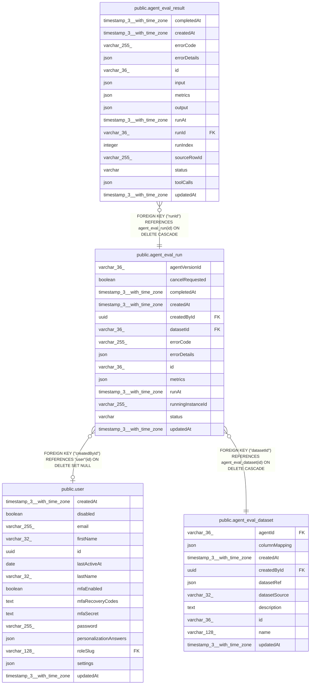

# public.agent_eval_run

## Columns

| Name | Type | Default | Nullable | Children | Parents | Comment |
| ---- | ---- | ------- | -------- | -------- | ------- | ------- |
| agentVersionId | varchar(36) |  | true |  |  | Published agent version under test (agent_history.versionId); loose pointer, no FK so runs survive history pruning. The agent itself comes from the dataset. |
| cancelRequested | boolean | false | false |  |  | Fallback cancellation flag polled by the running main |
| completedAt | timestamp(3) with time zone |  | true |  |  |  |
| createdAt | timestamp(3) with time zone | CURRENT_TIMESTAMP(3) | false |  |  |  |
| createdById | uuid |  | true |  | [public.user](public.user.md) |  |
| datasetId | varchar(36) |  | false |  | [public.agent_eval_dataset](public.agent_eval_dataset.md) |  |
| errorCode | varchar(255) |  | true |  |  |  |
| errorDetails | json |  | true |  |  |  |
| id | varchar(36) |  | false | [public.agent_eval_result](public.agent_eval_result.md) |  |  |
| metrics | json |  | true |  |  | Aggregated run-level scores |
| runAt | timestamp(3) with time zone |  | true |  |  |  |
| runningInstanceId | varchar(255) |  | true |  |  | Main instance executing this run; used to coordinate cancellation |
| status | varchar |  | false |  |  | Run lifecycle |
| updatedAt | timestamp(3) with time zone | CURRENT_TIMESTAMP(3) | false |  |  |  |

## Constraints

| Name | Type | Definition |
| ---- | ---- | ---------- |
| CHK_agent_eval_run_status | CHECK | CHECK (((status)::text = ANY ((ARRAY['new'::character varying, 'running'::character varying, 'completed'::character varying, 'error'::character varying, 'cancelled'::character varying])::text[]))) |
| FK_39ca447735d378e365f4227abff | FOREIGN KEY | FOREIGN KEY ("datasetId") REFERENCES agent_eval_dataset(id) ON DELETE CASCADE |
| FK_54ee897f442cc7393a6d6165334 | FOREIGN KEY | FOREIGN KEY ("createdById") REFERENCES "user"(id) ON DELETE SET NULL |
| PK_280832ca3f1b43663cc0e25e77f | PRIMARY KEY | PRIMARY KEY (id) |
| agent_eval_run_cancelRequested_not_null | n | NOT NULL "cancelRequested" |
| agent_eval_run_createdAt_not_null | n | NOT NULL "createdAt" |
| agent_eval_run_datasetId_not_null | n | NOT NULL "datasetId" |
| agent_eval_run_id_not_null | n | NOT NULL id |
| agent_eval_run_status_not_null | n | NOT NULL status |
| agent_eval_run_updatedAt_not_null | n | NOT NULL "updatedAt" |

## Indexes

| Name | Definition |
| ---- | ---------- |
| IDX_39ca447735d378e365f4227abf | CREATE INDEX "IDX_39ca447735d378e365f4227abf" ON public.agent_eval_run USING btree ("datasetId") |
| PK_280832ca3f1b43663cc0e25e77f | CREATE UNIQUE INDEX "PK_280832ca3f1b43663cc0e25e77f" ON public.agent_eval_run USING btree (id) |

## Relations

---

> Generated by [tbls](https://github.com/k1LoW/tbls)
