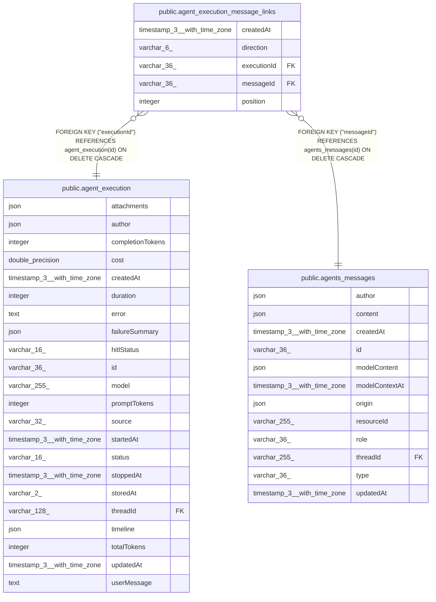

# public.agent_execution_message_links

## Columns

| Name | Type | Default | Nullable | Children | Parents | Comment |
| ---- | ---- | ------- | -------- | -------- | ------- | ------- |
| createdAt | timestamp(3) with time zone | CURRENT_TIMESTAMP(3) | false |  |  |  |
| direction | varchar(6) |  | false |  |  | Input consumed by the execution or output written by it |
| executionId | varchar(36) |  | false |  | [public.agent_execution](public.agent_execution.md) | Execution that consumed or wrote the message |
| messageId | varchar(36) |  | false |  | [public.agents_messages](public.agents_messages.md) | Canonical conversation message ID |
| position | integer |  | false |  |  | Input message IDs in consumption order. Steering can add messages to the same execution. |

## Constraints

| Name | Type | Definition |
| ---- | ---- | ---------- |
| CHK_agent_execution_message_links_direction | CHECK | CHECK (((direction)::text = ANY ((ARRAY['input'::character varying, 'output'::character varying])::text[]))) |
| FK_be7d0a2fd1360c9fa09baf84f60 | FOREIGN KEY | FOREIGN KEY ("messageId") REFERENCES agents_messages(id) ON DELETE CASCADE |
| FK_e78f470a036d01f9e395d53bb59 | FOREIGN KEY | FOREIGN KEY ("executionId") REFERENCES agent_execution(id) ON DELETE CASCADE |
| PK_cf07f3f98aad61dbb08fac1cdb9 | PRIMARY KEY | PRIMARY KEY ("executionId", "messageId") |
| agent_execution_message_links_createdAt_not_null | n | NOT NULL "createdAt" |
| agent_execution_message_links_direction_not_null | n | NOT NULL direction |
| agent_execution_message_links_executionId_not_null | n | NOT NULL "executionId" |
| agent_execution_message_links_messageId_not_null | n | NOT NULL "messageId" |
| agent_execution_message_links_position_not_null | n | NOT NULL "position" |

## Indexes

| Name | Definition |
| ---- | ---------- |
| IDX_10fe500ee8877351841799369b | CREATE UNIQUE INDEX "IDX_10fe500ee8877351841799369b" ON public.agent_execution_message_links USING btree ("executionId", direction, "position") |
| IDX_be7d0a2fd1360c9fa09baf84f6 | CREATE INDEX "IDX_be7d0a2fd1360c9fa09baf84f6" ON public.agent_execution_message_links USING btree ("messageId") |
| PK_cf07f3f98aad61dbb08fac1cdb9 | CREATE UNIQUE INDEX "PK_cf07f3f98aad61dbb08fac1cdb9" ON public.agent_execution_message_links USING btree ("executionId", "messageId") |

## Relations

---

> Generated by [tbls](https://github.com/k1LoW/tbls)
