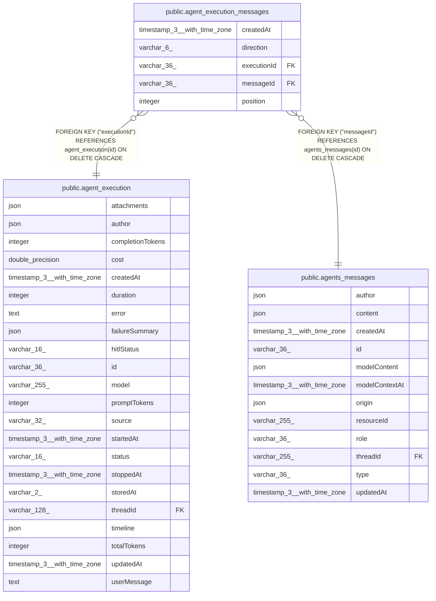

# public.agent_execution_messages

## Columns

| Name | Type | Default | Nullable | Children | Parents | Comment |
| ---- | ---- | ------- | -------- | -------- | ------- | ------- |
| createdAt | timestamp(3) with time zone | CURRENT_TIMESTAMP(3) | false |  |  |  |
| direction | varchar(6) |  | false |  |  | Input consumed by the execution or output written by it |
| executionId | varchar(36) |  | false |  | [public.agent_execution](public.agent_execution.md) | Execution that consumed or wrote the message |
| messageId | varchar(36) |  | false |  | [public.agents_messages](public.agents_messages.md) | Canonical conversation message ID |
| position | integer |  | false |  |  | Input message IDs in consumption order. Steering can add messages to the same execution. |

## Constraints

| Name | Type | Definition |
| ---- | ---- | ---------- |
| CHK_agent_execution_messages_direction | CHECK | CHECK (((direction)::text = ANY ((ARRAY['input'::character varying, 'output'::character varying])::text[]))) |
| FK_697a82b4353f58c123158c0e313 | FOREIGN KEY | FOREIGN KEY ("executionId") REFERENCES agent_execution(id) ON DELETE CASCADE |
| FK_bed773bffca0fccb28c0a69bc5f | FOREIGN KEY | FOREIGN KEY ("messageId") REFERENCES agents_messages(id) ON DELETE CASCADE |
| PK_45f96d268b4d681b06a53401ff9 | PRIMARY KEY | PRIMARY KEY ("executionId", "messageId") |
| agent_execution_messages_createdAt_not_null | n | NOT NULL "createdAt" |
| agent_execution_messages_direction_not_null | n | NOT NULL direction |
| agent_execution_messages_executionId_not_null | n | NOT NULL "executionId" |
| agent_execution_messages_messageId_not_null | n | NOT NULL "messageId" |
| agent_execution_messages_position_not_null | n | NOT NULL "position" |

## Indexes

| Name | Definition |
| ---- | ---------- |
| IDX_2d854a0343f0350c98f299d7b5 | CREATE UNIQUE INDEX "IDX_2d854a0343f0350c98f299d7b5" ON public.agent_execution_messages USING btree ("executionId", direction, "position") |
| IDX_bed773bffca0fccb28c0a69bc5 | CREATE INDEX "IDX_bed773bffca0fccb28c0a69bc5" ON public.agent_execution_messages USING btree ("messageId") |
| PK_45f96d268b4d681b06a53401ff9 | CREATE UNIQUE INDEX "PK_45f96d268b4d681b06a53401ff9" ON public.agent_execution_messages USING btree ("executionId", "messageId") |

## Relations

---

> Generated by [tbls](https://github.com/k1LoW/tbls)
