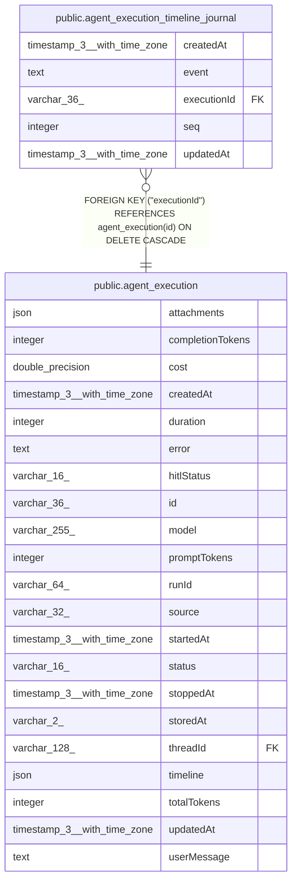

# public.agent_execution_timeline_journal

## Columns

| Name | Type | Default | Nullable | Children | Parents | Comment |
| ---- | ---- | ------- | -------- | -------- | ------- | ------- |
| createdAt | timestamp(3) with time zone | CURRENT_TIMESTAMP(3) | false |  |  |  |
| event | text |  | false |  |  | Serialized TimelineEvent snapshot |
| executionId | varchar(36) |  | false |  | [public.agent_execution](public.agent_execution.md) |  |
| seq | integer |  | false |  |  | Monotonic sequence within one agent execution |
| updatedAt | timestamp(3) with time zone | CURRENT_TIMESTAMP(3) | false |  |  |  |

## Constraints

| Name | Type | Definition |
| ---- | ---- | ---------- |
| FK_9b1da3b87ef9d36acb33fbf630c | FOREIGN KEY | FOREIGN KEY ("executionId") REFERENCES agent_execution(id) ON DELETE CASCADE |
| PK_e1e32f96f32efd21ad8148c2a9e | PRIMARY KEY | PRIMARY KEY ("executionId", seq) |
| agent_execution_timeline_journal_createdAt_not_null | n | NOT NULL "createdAt" |
| agent_execution_timeline_journal_event_not_null | n | NOT NULL event |
| agent_execution_timeline_journal_executionId_not_null | n | NOT NULL "executionId" |
| agent_execution_timeline_journal_seq_not_null | n | NOT NULL seq |
| agent_execution_timeline_journal_updatedAt_not_null | n | NOT NULL "updatedAt" |

## Indexes

| Name | Definition |
| ---- | ---------- |
| PK_e1e32f96f32efd21ad8148c2a9e | CREATE UNIQUE INDEX "PK_e1e32f96f32efd21ad8148c2a9e" ON public.agent_execution_timeline_journal USING btree ("executionId", seq) |

## Relations

---

> Generated by [tbls](https://github.com/k1LoW/tbls)
