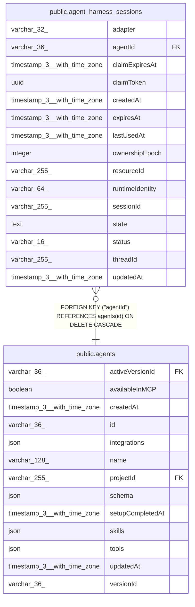

# public.agent_harness_sessions

## Columns

| Name | Type | Default | Nullable | Children | Parents | Comment |
| ---- | ---- | ------- | -------- | -------- | ------- | ------- |
| adapter | varchar(32) |  | false |  |  | Harness adapter that produced the opaque session state |
| agentId | varchar(36) |  | false |  | [public.agents](public.agents.md) | Agent that owns the native harness session |
| claimExpiresAt | timestamp(3) with time zone |  | true |  |  | Time after which another process may claim the session |
| claimToken | uuid |  | true |  |  | Ephemeral token held by the current session owner |
| createdAt | timestamp(3) with time zone | CURRENT_TIMESTAMP(3) | false |  |  |  |
| expiresAt | timestamp(3) with time zone |  | false |  |  | Time after which the session may be pruned |
| lastUsedAt | timestamp(3) with time zone |  | false |  |  | Time of the latest saved turn state |
| ownershipEpoch | integer | 0 | false |  |  | Monotonic fencing epoch incremented for every successful claim |
| resourceId | varchar(255) |  | false |  |  | Memory resource scope for the thread |
| runtimeIdentity | varchar(64) |  | false |  |  | Hash of execution-affecting agent and harness configuration |
| sessionId | varchar(255) |  | false |  |  | Native harness session identifier |
| state | text |  | true |  |  | Opaque serialized harness resume or continuation state |
| status | varchar(16) | 'idle'::character varying | false |  |  | Whether a process currently owns the session |
| threadId | varchar(255) |  | false |  |  | Conversation thread bound to the session |
| updatedAt | timestamp(3) with time zone | CURRENT_TIMESTAMP(3) | false |  |  |  |

## Constraints

| Name | Type | Definition |
| ---- | ---- | ---------- |
| CHK_agent_harness_sessions_adapter | CHECK | CHECK (((adapter)::text = ANY ((ARRAY['claude-code'::character varying, 'codex'::character varying, 'claude-code:daytona'::character varying, 'claude-code:n8n-sandbox'::character varying, 'codex:daytona'::character varying, 'codex:n8n-sandbox'::character varying])::text[]))) |
| CHK_agent_harness_sessions_status | CHECK | CHECK (((status)::text = ANY ((ARRAY['idle'::character varying, 'claimed'::character varying])::text[]))) |
| FK_ba8bc431add6f2dedad0886d686 | FOREIGN KEY | FOREIGN KEY ("agentId") REFERENCES agents(id) ON DELETE CASCADE |
| PK_fdcdfbb4deeeacd3e0077e07f7d | PRIMARY KEY | PRIMARY KEY ("agentId", "threadId", "runtimeIdentity") |
| agent_harness_sessions_adapter_not_null | n | NOT NULL adapter |
| agent_harness_sessions_agentId_not_null | n | NOT NULL "agentId" |
| agent_harness_sessions_createdAt_not_null | n | NOT NULL "createdAt" |
| agent_harness_sessions_expiresAt_not_null | n | NOT NULL "expiresAt" |
| agent_harness_sessions_lastUsedAt_not_null | n | NOT NULL "lastUsedAt" |
| agent_harness_sessions_ownershipEpoch_not_null | n | NOT NULL "ownershipEpoch" |
| agent_harness_sessions_resourceId_not_null | n | NOT NULL "resourceId" |
| agent_harness_sessions_runtimeIdentity_not_null | n | NOT NULL "runtimeIdentity" |
| agent_harness_sessions_sessionId_not_null | n | NOT NULL "sessionId" |
| agent_harness_sessions_status_not_null | n | NOT NULL status |
| agent_harness_sessions_threadId_not_null | n | NOT NULL "threadId" |
| agent_harness_sessions_updatedAt_not_null | n | NOT NULL "updatedAt" |

## Indexes

| Name | Definition |
| ---- | ---------- |
| IDX_db9ce6cb7fa876c8dd45a0c0fe | CREATE INDEX "IDX_db9ce6cb7fa876c8dd45a0c0fe" ON public.agent_harness_sessions USING btree ("expiresAt") |
| PK_fdcdfbb4deeeacd3e0077e07f7d | CREATE UNIQUE INDEX "PK_fdcdfbb4deeeacd3e0077e07f7d" ON public.agent_harness_sessions USING btree ("agentId", "threadId", "runtimeIdentity") |

## Relations

---

> Generated by [tbls](https://github.com/k1LoW/tbls)
