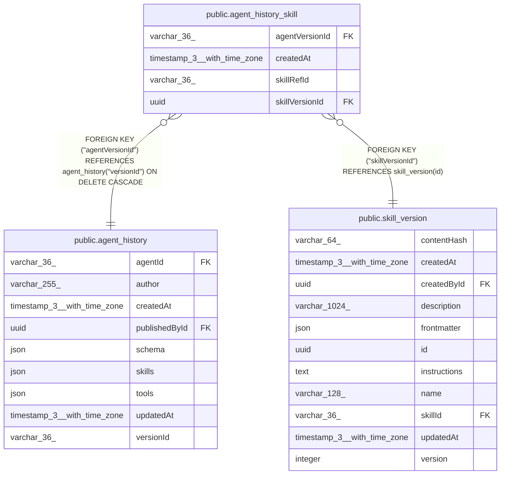

# public.agent_history_skill

## Columns

| Name | Type | Default | Nullable | Children | Parents | Comment |
| ---- | ---- | ------- | -------- | -------- | ------- | ------- |
| agentVersionId | varchar(36) |  | false |  | [public.agent_history](public.agent_history.md) |  |
| createdAt | timestamp(3) with time zone | CURRENT_TIMESTAMP(3) | false |  |  |  |
| skillRefId | varchar(36) |  | false |  |  | The ref id as written in that agent_history row schema |
| skillVersionId | uuid |  | false |  | [public.skill_version](public.skill_version.md) |  |

## Constraints

| Name | Type | Definition |
| ---- | ---- | ---------- |
| FK_a8179c556e4eda4c6b2a680eb30 | FOREIGN KEY | FOREIGN KEY ("skillVersionId") REFERENCES skill_version(id) |
| FK_b9bc0a61e01c457e1a9b272573d | FOREIGN KEY | FOREIGN KEY ("agentVersionId") REFERENCES agent_history("versionId") ON DELETE CASCADE |
| PK_e4b39ec3f62eb41c0712b474ac8 | PRIMARY KEY | PRIMARY KEY ("agentVersionId", "skillRefId") |
| agent_history_skill_agentVersionId_not_null | n | NOT NULL "agentVersionId" |
| agent_history_skill_createdAt_not_null | n | NOT NULL "createdAt" |
| agent_history_skill_skillRefId_not_null | n | NOT NULL "skillRefId" |
| agent_history_skill_skillVersionId_not_null | n | NOT NULL "skillVersionId" |

## Indexes

| Name | Definition |
| ---- | ---------- |
| IDX_a8179c556e4eda4c6b2a680eb3 | CREATE INDEX "IDX_a8179c556e4eda4c6b2a680eb3" ON public.agent_history_skill USING btree ("skillVersionId") |
| PK_e4b39ec3f62eb41c0712b474ac8 | CREATE UNIQUE INDEX "PK_e4b39ec3f62eb41c0712b474ac8" ON public.agent_history_skill USING btree ("agentVersionId", "skillRefId") |

## Relations

---

> Generated by [tbls](https://github.com/k1LoW/tbls)
