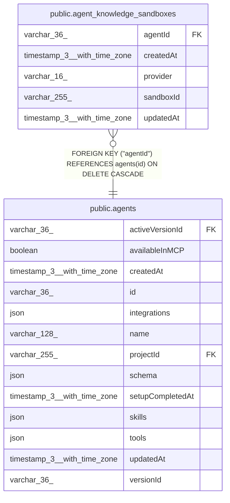

# public.agent_knowledge_sandboxes

## Columns

| Name | Type | Default | Nullable | Children | Parents | Comment |
| ---- | ---- | ------- | -------- | -------- | ------- | ------- |
| agentId | varchar(36) |  | false |  | [public.agents](public.agents.md) |  |
| createdAt | timestamp(3) with time zone | CURRENT_TIMESTAMP(3) | false |  |  |  |
| provider | varchar(16) |  | false |  |  | Sandbox provider: daytona or n8n-sandbox |
| sandboxId | varchar(255) |  | false |  |  | Opaque remote sandbox identifier assigned by the provider |
| updatedAt | timestamp(3) with time zone | CURRENT_TIMESTAMP(3) | false |  |  |  |

## Constraints

| Name | Type | Definition |
| ---- | ---- | ---------- |
| CHK_agent_knowledge_sandboxes_provider | CHECK | CHECK (((provider)::text = ANY ((ARRAY['daytona'::character varying, 'n8n-sandbox'::character varying])::text[]))) |
| FK_822924643e1fc7b4532fecefb86 | FOREIGN KEY | FOREIGN KEY ("agentId") REFERENCES agents(id) ON DELETE CASCADE |
| PK_43e1b0e65f6677559a43cf36357 | PRIMARY KEY | PRIMARY KEY ("agentId", provider) |
| agent_knowledge_sandboxes_agentId_not_null | n | NOT NULL "agentId" |
| agent_knowledge_sandboxes_createdAt_not_null | n | NOT NULL "createdAt" |
| agent_knowledge_sandboxes_provider_not_null | n | NOT NULL provider |
| agent_knowledge_sandboxes_sandboxId_not_null | n | NOT NULL "sandboxId" |
| agent_knowledge_sandboxes_updatedAt_not_null | n | NOT NULL "updatedAt" |

## Indexes

| Name | Definition |
| ---- | ---------- |
| PK_43e1b0e65f6677559a43cf36357 | CREATE UNIQUE INDEX "PK_43e1b0e65f6677559a43cf36357" ON public.agent_knowledge_sandboxes USING btree ("agentId", provider) |

## Relations

---

> Generated by [tbls](https://github.com/k1LoW/tbls)
