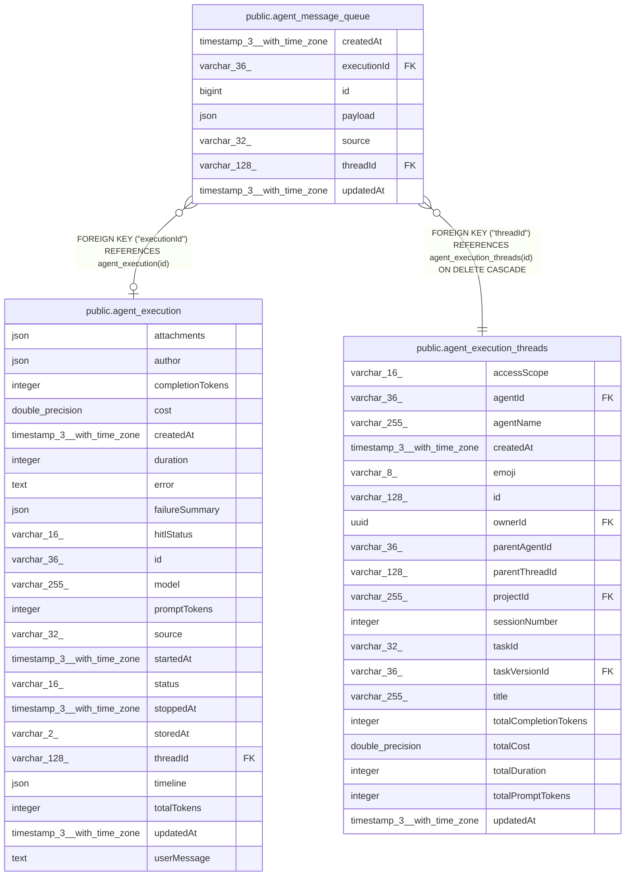

# public.agent_message_queue

## Columns

| Name | Type | Default | Nullable | Children | Parents | Comment |
| ---- | ---- | ------- | -------- | -------- | ------- | ------- |
| createdAt | timestamp(3) with time zone | CURRENT_TIMESTAMP(3) | false |  |  |  |
| executionId | varchar(36) |  | true |  | [public.agent_execution](public.agent_execution.md) | Current execution; NULL means pending |
| id | bigint |  | false |  |  | Acceptance order; IDs are not reused |
| payload | json |  | false |  |  | Input, attachment references, identity, and reply context |
| source | varchar(32) |  | false |  |  | Preview or integration source |
| threadId | varchar(128) |  | false |  | [public.agent_execution_threads](public.agent_execution_threads.md) |  |
| updatedAt | timestamp(3) with time zone | CURRENT_TIMESTAMP(3) | false |  |  |  |

## Constraints

| Name | Type | Definition |
| ---- | ---- | ---------- |
| FK_2349d84b4f2a660fc264f38fef3 | FOREIGN KEY | FOREIGN KEY ("executionId") REFERENCES agent_execution(id) |
| FK_a74f9154a59430986112d70cb16 | FOREIGN KEY | FOREIGN KEY ("threadId") REFERENCES agent_execution_threads(id) ON DELETE CASCADE |
| PK_733d8c959a6057f04f4da5ab721 | PRIMARY KEY | PRIMARY KEY (id) |
| agent_message_queue_createdAt_not_null | n | NOT NULL "createdAt" |
| agent_message_queue_id_not_null | n | NOT NULL id |
| agent_message_queue_payload_not_null | n | NOT NULL payload |
| agent_message_queue_source_not_null | n | NOT NULL source |
| agent_message_queue_threadId_not_null | n | NOT NULL "threadId" |
| agent_message_queue_updatedAt_not_null | n | NOT NULL "updatedAt" |

## Indexes

| Name | Definition |
| ---- | ---------- |
| IDX_2349d84b4f2a660fc264f38fef | CREATE INDEX "IDX_2349d84b4f2a660fc264f38fef" ON public.agent_message_queue USING btree ("executionId") |
| IDX_agent_message_queue_threadId | CREATE UNIQUE INDEX "IDX_agent_message_queue_threadId" ON public.agent_message_queue USING btree ("threadId") WHERE ("executionId" IS NOT NULL) |
| IDX_c1db6ea2d031cc49100535e6c6 | CREATE INDEX "IDX_c1db6ea2d031cc49100535e6c6" ON public.agent_message_queue USING btree ("threadId", id) |
| PK_733d8c959a6057f04f4da5ab721 | CREATE UNIQUE INDEX "PK_733d8c959a6057f04f4da5ab721" ON public.agent_message_queue USING btree (id) |

## Relations

---

> Generated by [tbls](https://github.com/k1LoW/tbls)
