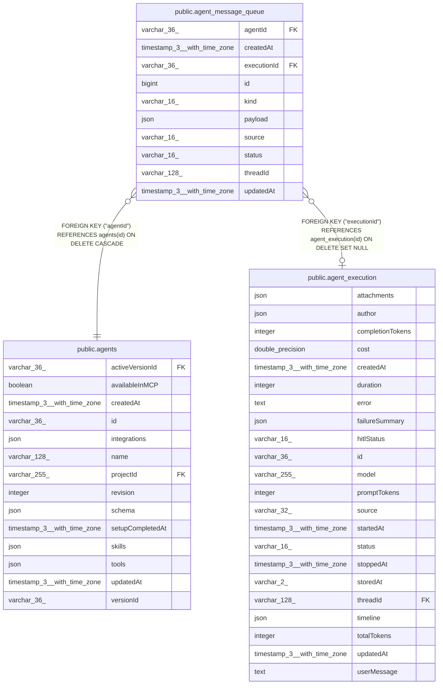

# public.agent_message_queue

## Columns

| Name | Type | Default | Nullable | Children | Parents | Comment |
| ---- | ---- | ------- | -------- | -------- | ------- | ------- |
| agentId | varchar(36) |  | false |  | [public.agents](public.agents.md) | Agent that processes this input. |
| createdAt | timestamp(3) with time zone | CURRENT_TIMESTAMP(3) | false |  |  |  |
| executionId | varchar(36) |  | true |  | [public.agent_execution](public.agent_execution.md) | Execution recording for the active input. |
| id | bigint |  | false |  |  |  |
| kind | varchar(16) |  | false |  |  | Ordinary message or human response to a suspended run. |
| payload | json |  | false |  |  | Typed input and actor, project, and reply routing data. |
| source | varchar(16) |  | false |  |  | Preview HTTP request or integration chat input. |
| status | varchar(16) |  | false |  |  | Waiting, active, or cancelling input. |
| threadId | varchar(128) |  | false |  |  | Existing conversation routing ID. |
| updatedAt | timestamp(3) with time zone | CURRENT_TIMESTAMP(3) | false |  |  |  |

## Constraints

| Name | Type | Definition |
| ---- | ---- | ---------- |
| CHK_agent_message_queue_kind | CHECK | CHECK (((kind)::text = ANY ((ARRAY['message'::character varying, 'hitl'::character varying])::text[]))) |
| CHK_agent_message_queue_source | CHECK | CHECK (((source)::text = ANY ((ARRAY['preview'::character varying, 'integration'::character varying])::text[]))) |
| CHK_agent_message_queue_status | CHECK | CHECK (((status)::text = ANY ((ARRAY['queued'::character varying, 'processing'::character varying, 'cancelling'::character varying])::text[]))) |
| FK_2349d84b4f2a660fc264f38fef3 | FOREIGN KEY | FOREIGN KEY ("executionId") REFERENCES agent_execution(id) ON DELETE SET NULL |
| FK_8a5699c954416a2172688ff39fa | FOREIGN KEY | FOREIGN KEY ("agentId") REFERENCES agents(id) ON DELETE CASCADE |
| PK_733d8c959a6057f04f4da5ab721 | PRIMARY KEY | PRIMARY KEY (id) |
| agent_message_queue_agentId_not_null | n | NOT NULL "agentId" |
| agent_message_queue_createdAt_not_null | n | NOT NULL "createdAt" |
| agent_message_queue_id_not_null | n | NOT NULL id |
| agent_message_queue_kind_not_null | n | NOT NULL kind |
| agent_message_queue_payload_not_null | n | NOT NULL payload |
| agent_message_queue_source_not_null | n | NOT NULL source |
| agent_message_queue_status_not_null | n | NOT NULL status |
| agent_message_queue_threadId_not_null | n | NOT NULL "threadId" |
| agent_message_queue_updatedAt_not_null | n | NOT NULL "updatedAt" |

## Indexes

| Name | Definition |
| ---- | ---------- |
| IDX_0d7ab2b181c282217497591502 | CREATE INDEX "IDX_0d7ab2b181c282217497591502" ON public.agent_message_queue USING btree ("threadId", status, kind, id) |
| IDX_832d536d7954194b88e0edb5bd | CREATE INDEX "IDX_832d536d7954194b88e0edb5bd" ON public.agent_message_queue USING btree (status, "updatedAt") |
| IDX_8a5699c954416a2172688ff39f | CREATE INDEX "IDX_8a5699c954416a2172688ff39f" ON public.agent_message_queue USING btree ("agentId") |
| IDX_agent_message_queue_executionId | CREATE UNIQUE INDEX "IDX_agent_message_queue_executionId" ON public.agent_message_queue USING btree ("executionId") WHERE ("executionId" IS NOT NULL) |
| PK_733d8c959a6057f04f4da5ab721 | CREATE UNIQUE INDEX "PK_733d8c959a6057f04f4da5ab721" ON public.agent_message_queue USING btree (id) |

## Relations

---

> Generated by [tbls](https://github.com/k1LoW/tbls)
