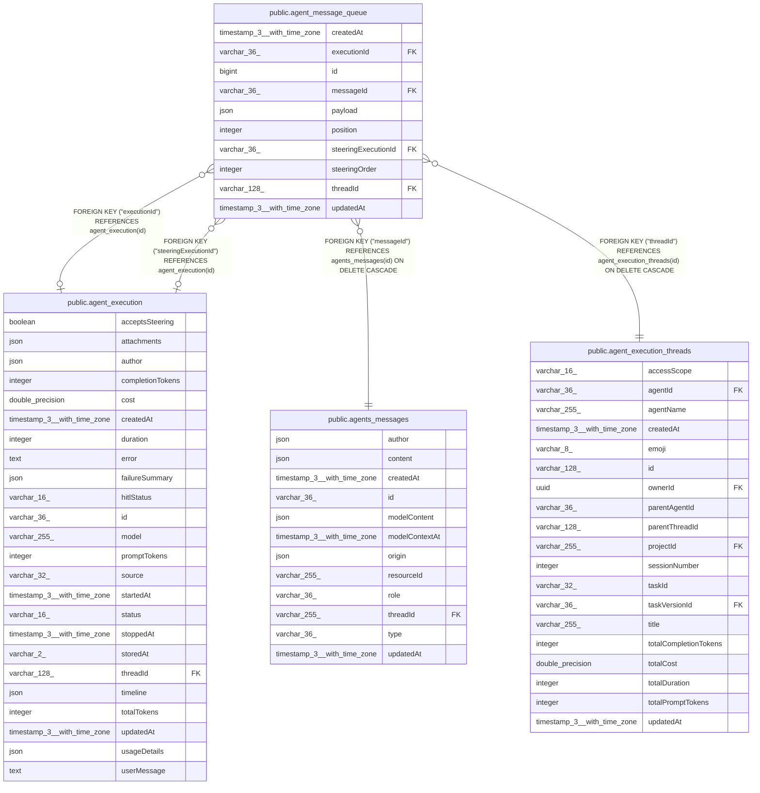

# public.agent_message_queue

## Columns

| Name | Type | Default | Nullable | Children | Parents | Comment |
| ---- | ---- | ------- | -------- | -------- | ------- | ------- |
| createdAt | timestamp(3) with time zone | CURRENT_TIMESTAMP(3) | false |  |  |  |
| executionId | varchar(36) |  | true |  | [public.agent_execution](public.agent_execution.md) | Current execution; NULL means pending |
| id | bigint |  | false |  |  | Acceptance order; IDs are not reused |
| messageId | varchar(36) |  | false |  | [public.agents_messages](public.agents_messages.md) | Canonical input created when the queue accepts it |
| payload | json |  | false |  |  | Dispatch, authorization, and reply context. Input is stored on the message |
| position | integer | 0 | false |  |  | Pending turn order within the session |
| steeringExecutionId | varchar(36) |  | true |  | [public.agent_execution](public.agent_execution.md) | Execution reserved to consume this input |
| steeringOrder | integer |  | true |  |  | Acceptance order among outstanding steers |
| threadId | varchar(128) |  | false |  | [public.agent_execution_threads](public.agent_execution_threads.md) |  |
| updatedAt | timestamp(3) with time zone | CURRENT_TIMESTAMP(3) | false |  |  |  |

## Constraints

| Name | Type | Definition |
| ---- | ---- | ---------- |
| CHK_agent_message_queue_steering_pair | CHECK | CHECK ((("steeringExecutionId" IS NULL) = ("steeringOrder" IS NULL))) |
| FK_2349d84b4f2a660fc264f38fef3 | FOREIGN KEY | FOREIGN KEY ("executionId") REFERENCES agent_execution(id) |
| FK_a74f9154a59430986112d70cb16 | FOREIGN KEY | FOREIGN KEY ("threadId") REFERENCES agent_execution_threads(id) ON DELETE CASCADE |
| FK_agent_message_queue_messageId | FOREIGN KEY | FOREIGN KEY ("messageId") REFERENCES agents_messages(id) ON DELETE CASCADE |
| FK_eff54787927c2968dc24495c911 | FOREIGN KEY | FOREIGN KEY ("steeringExecutionId") REFERENCES agent_execution(id) |
| PK_733d8c959a6057f04f4da5ab721 | PRIMARY KEY | PRIMARY KEY (id) |
| agent_message_queue_createdAt_not_null | n | NOT NULL "createdAt" |
| agent_message_queue_id_not_null | n | NOT NULL id |
| agent_message_queue_messageId_not_null | n | NOT NULL "messageId" |
| agent_message_queue_payload_not_null | n | NOT NULL payload |
| agent_message_queue_position_not_null | n | NOT NULL "position" |
| agent_message_queue_threadId_not_null | n | NOT NULL "threadId" |
| agent_message_queue_updatedAt_not_null | n | NOT NULL "updatedAt" |

## Indexes

| Name | Definition |
| ---- | ---------- |
| IDX_2349d84b4f2a660fc264f38fef | CREATE INDEX "IDX_2349d84b4f2a660fc264f38fef" ON public.agent_message_queue USING btree ("executionId") |
| IDX_agent_message_queue_messageId | CREATE UNIQUE INDEX "IDX_agent_message_queue_messageId" ON public.agent_message_queue USING btree ("messageId") |
| IDX_agent_message_queue_steeringExecutionId_steeringOrder | CREATE UNIQUE INDEX "IDX_agent_message_queue_steeringExecutionId_steeringOrder" ON public.agent_message_queue USING btree ("steeringExecutionId", "steeringOrder") WHERE ("steeringExecutionId" IS NOT NULL) |
| IDX_agent_message_queue_threadId | CREATE UNIQUE INDEX "IDX_agent_message_queue_threadId" ON public.agent_message_queue USING btree ("threadId") WHERE ("executionId" IS NOT NULL) |
| IDX_agent_message_queue_threadId_position | CREATE INDEX "IDX_agent_message_queue_threadId_position" ON public.agent_message_queue USING btree ("threadId", "position") |
| PK_733d8c959a6057f04f4da5ab721 | CREATE UNIQUE INDEX "PK_733d8c959a6057f04f4da5ab721" ON public.agent_message_queue USING btree (id) |

## Relations

```mermaid
erDiagram

"public.agent_message_queue" }o--o| "public.agent_execution" : "FOREIGN KEY (#quot;executionId#quot;) REFERENCES agent_execution(id)"
"public.agent_message_queue" }o--|| "public.agents_messages" : "FOREIGN KEY (#quot;messageId#quot;) REFERENCES agents_messages(id) ON DELETE CASCADE"
"public.agent_message_queue" }o--o| "public.agent_execution" : "FOREIGN KEY (#quot;steeringExecutionId#quot;) REFERENCES agent_execution(id)"
"public.agent_message_queue" }o--|| "public.agent_execution_threads" : "FOREIGN KEY (#quot;threadId#quot;) REFERENCES agent_execution_threads(id) ON DELETE CASCADE"

"public.agent_message_queue" {
  timestamp_3__with_time_zone createdAt
  varchar_36_ executionId FK
  bigint id
  varchar_36_ messageId FK
  json payload
  integer position
  varchar_36_ steeringExecutionId FK
  integer steeringOrder
  varchar_128_ threadId FK
  timestamp_3__with_time_zone updatedAt
}
"public.agent_execution" {
  boolean acceptsSteering
  json attachments
  json author
  integer completionTokens
  double_precision cost
  timestamp_3__with_time_zone createdAt
  integer duration
  text error
  json failureSummary
  varchar_16_ hitlStatus
  varchar_36_ id
  varchar_255_ model
  integer promptTokens
  varchar_32_ source
  timestamp_3__with_time_zone startedAt
  varchar_16_ status
  timestamp_3__with_time_zone stoppedAt
  varchar_2_ storedAt
  varchar_128_ threadId FK
  json timeline
  integer totalTokens
  timestamp_3__with_time_zone updatedAt
  json usageDetails
  text userMessage
}
"public.agents_messages" {
  json author
  json content
  timestamp_3__with_time_zone createdAt
  varchar_36_ id
  json modelContent
  timestamp_3__with_time_zone modelContextAt
  json origin
  varchar_255_ resourceId
  varchar_36_ role
  varchar_255_ threadId FK
  varchar_36_ type
  timestamp_3__with_time_zone updatedAt
}
"public.agent_execution_threads" {
  varchar_16_ accessScope
  varchar_36_ agentId FK
  varchar_255_ agentName
  timestamp_3__with_time_zone createdAt
  varchar_8_ emoji
  varchar_128_ id
  uuid ownerId FK
  varchar_36_ parentAgentId
  varchar_128_ parentThreadId
  varchar_255_ projectId FK
  integer sessionNumber
  varchar_32_ taskId
  varchar_36_ taskVersionId FK
  varchar_255_ title
  integer totalCompletionTokens
  double_precision totalCost
  integer totalDuration
  integer totalPromptTokens
  timestamp_3__with_time_zone updatedAt
}
```

---

> Generated by [tbls](https://github.com/k1LoW/tbls)
