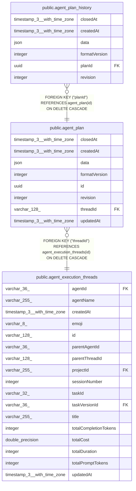

# public.agent_plan

## Columns

| Name | Type | Default | Nullable | Children | Parents | Comment |
| ---- | ---- | ------- | -------- | -------- | ------- | ------- |
| closedAt | timestamp(3) with time zone |  | true |  |  | NULL while the plan is active |
| createdAt | timestamp(3) with time zone | CURRENT_TIMESTAMP(3) | false |  |  |  |
| data | json |  | false |  |  | Opaque plan document |
| formatVersion | integer |  | false |  |  | Version of the plan JSON format |
| id | uuid |  | false | [public.agent_plan_history](public.agent_plan_history.md) |  | Plan ID generated by the caller |
| revision | integer | 1 | false |  |  | Current document revision |
| threadId | varchar(128) |  | false |  | [public.agent_execution_threads](public.agent_execution_threads.md) | Session that owns the plan |
| updatedAt | timestamp(3) with time zone | CURRENT_TIMESTAMP(3) | false |  |  |  |

## Constraints

| Name | Type | Definition |
| ---- | ---- | ---------- |
| CHK_agent_plan_format_version | CHECK | CHECK (("formatVersion" > 0)) |
| CHK_agent_plan_revision | CHECK | CHECK ((revision > 0)) |
| FK_a72ec0a4fc0c1d6aa1d7a177e32 | FOREIGN KEY | FOREIGN KEY ("threadId") REFERENCES agent_execution_threads(id) ON DELETE CASCADE |
| PK_c2b705709b763e796e29b1f6282 | PRIMARY KEY | PRIMARY KEY (id) |
| agent_plan_createdAt_not_null | n | NOT NULL "createdAt" |
| agent_plan_data_not_null | n | NOT NULL data |
| agent_plan_formatVersion_not_null | n | NOT NULL "formatVersion" |
| agent_plan_id_not_null | n | NOT NULL id |
| agent_plan_revision_not_null | n | NOT NULL revision |
| agent_plan_threadId_not_null | n | NOT NULL "threadId" |
| agent_plan_updatedAt_not_null | n | NOT NULL "updatedAt" |

## Indexes

| Name | Definition |
| ---- | ---------- |
| IDX_a72ec0a4fc0c1d6aa1d7a177e3 | CREATE INDEX "IDX_a72ec0a4fc0c1d6aa1d7a177e3" ON public.agent_plan USING btree ("threadId") |
| IDX_agent_plan_threadId | CREATE UNIQUE INDEX "IDX_agent_plan_threadId" ON public.agent_plan USING btree ("threadId") WHERE ("closedAt" IS NULL) |
| PK_c2b705709b763e796e29b1f6282 | CREATE UNIQUE INDEX "PK_c2b705709b763e796e29b1f6282" ON public.agent_plan USING btree (id) |

## Relations

---

> Generated by [tbls](https://github.com/k1LoW/tbls)
