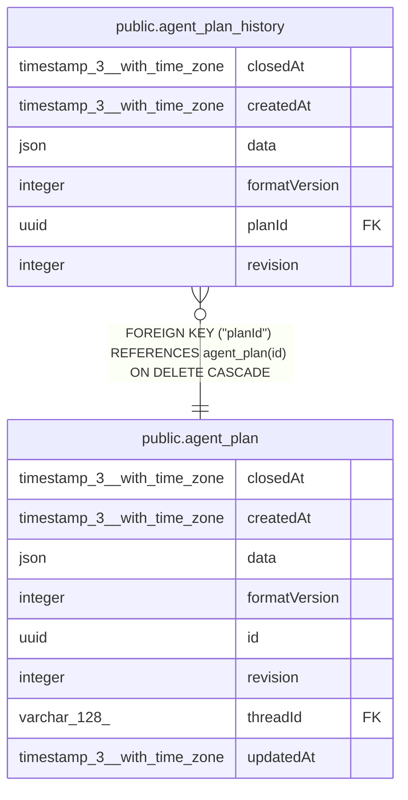

# public.agent_plan_history

## Columns

| Name | Type | Default | Nullable | Children | Parents | Comment |
| ---- | ---- | ------- | -------- | -------- | ------- | ------- |
| closedAt | timestamp(3) with time zone |  | true |  |  | Plan closure time at this revision |
| createdAt | timestamp(3) with time zone | CURRENT_TIMESTAMP(3) | false |  |  |  |
| data | json |  | false |  |  | Complete plan document after this change |
| formatVersion | integer |  | false |  |  | Version of the snapshot JSON format |
| planId | uuid |  | false |  | [public.agent_plan](public.agent_plan.md) | Plan that owns this snapshot |
| revision | integer |  | false |  |  | Document revision captured by this snapshot |

## Constraints

| Name | Type | Definition |
| ---- | ---- | ---------- |
| CHK_agent_plan_history_format_version | CHECK | CHECK (("formatVersion" > 0)) |
| CHK_agent_plan_history_revision | CHECK | CHECK ((revision > 0)) |
| FK_ff6ebe6c2b329aba472095b4a5d | FOREIGN KEY | FOREIGN KEY ("planId") REFERENCES agent_plan(id) ON DELETE CASCADE |
| PK_a643cfc7a42df9e579ab05a7950 | PRIMARY KEY | PRIMARY KEY ("planId", revision) |
| agent_plan_history_createdAt_not_null | n | NOT NULL "createdAt" |
| agent_plan_history_data_not_null | n | NOT NULL data |
| agent_plan_history_formatVersion_not_null | n | NOT NULL "formatVersion" |
| agent_plan_history_planId_not_null | n | NOT NULL "planId" |
| agent_plan_history_revision_not_null | n | NOT NULL revision |

## Indexes

| Name | Definition |
| ---- | ---------- |
| PK_a643cfc7a42df9e579ab05a7950 | CREATE UNIQUE INDEX "PK_a643cfc7a42df9e579ab05a7950" ON public.agent_plan_history USING btree ("planId", revision) |

## Relations

---

> Generated by [tbls](https://github.com/k1LoW/tbls)
