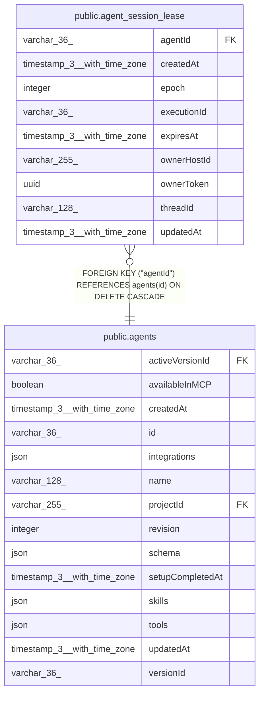

# public.agent_session_lease

## Columns

| Name | Type | Default | Nullable | Children | Parents | Comment |
| ---- | ---- | ------- | -------- | -------- | ------- | ------- |
| agentId | varchar(36) |  | false |  | [public.agents](public.agents.md) |  |
| createdAt | timestamp(3) with time zone | CURRENT_TIMESTAMP(3) | false |  |  |  |
| epoch | integer | 0 | false |  |  | Incremented on each acquisition and never reset |
| executionId | varchar(36) |  | true |  |  | Execution that holds the lease; no foreign key, the lease outlives it |
| expiresAt | timestamp(3) with time zone |  | true |  |  | Database-clock time after which another main can take over; NULL when free |
| ownerHostId | varchar(255) |  | true |  |  | Host ID of the main that holds the lease; NULL when free |
| ownerToken | uuid |  | true |  |  | Token of the current holder, new for each acquisition; NULL when free |
| threadId | varchar(128) |  | false |  |  |  |
| updatedAt | timestamp(3) with time zone | CURRENT_TIMESTAMP(3) | false |  |  |  |

## Constraints

| Name | Type | Definition |
| ---- | ---- | ---------- |
| FK_d638dff52c334190c7407c22d9b | FOREIGN KEY | FOREIGN KEY ("agentId") REFERENCES agents(id) ON DELETE CASCADE |
| PK_0bf734bd7afb9d81f91ddf6c667 | PRIMARY KEY | PRIMARY KEY ("threadId") |
| agent_session_lease_agentId_not_null | n | NOT NULL "agentId" |
| agent_session_lease_createdAt_not_null | n | NOT NULL "createdAt" |
| agent_session_lease_epoch_not_null | n | NOT NULL epoch |
| agent_session_lease_threadId_not_null | n | NOT NULL "threadId" |
| agent_session_lease_updatedAt_not_null | n | NOT NULL "updatedAt" |

## Indexes

| Name | Definition |
| ---- | ---------- |
| IDX_d638dff52c334190c7407c22d9 | CREATE INDEX "IDX_d638dff52c334190c7407c22d9" ON public.agent_session_lease USING btree ("agentId") |
| PK_0bf734bd7afb9d81f91ddf6c667 | CREATE UNIQUE INDEX "PK_0bf734bd7afb9d81f91ddf6c667" ON public.agent_session_lease USING btree ("threadId") |

## Relations

---

> Generated by [tbls](https://github.com/k1LoW/tbls)
