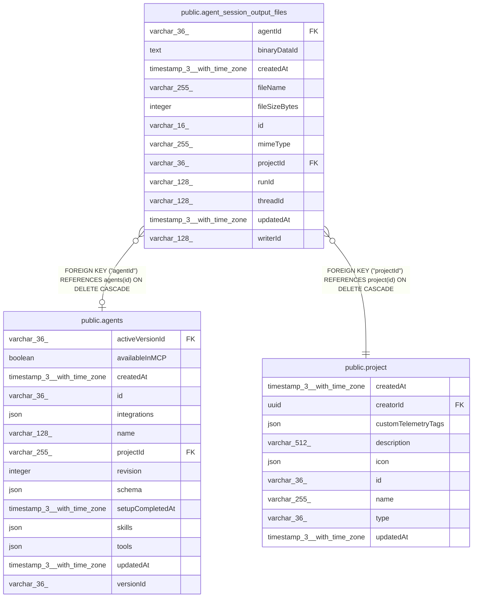

# public.agent_session_output_files

## Columns

| Name | Type | Default | Nullable | Children | Parents | Comment |
| ---- | ---- | ------- | -------- | -------- | ------- | ------- |
| agentId | varchar(36) |  | true |  | [public.agents](public.agents.md) | Agent that produced the file, when persisted (null for inline agents) |
| binaryDataId | text |  | false |  |  | Opaque BinaryDataService reference; not an FK to binary_data |
| createdAt | timestamp(3) with time zone | CURRENT_TIMESTAMP(3) | false |  |  |  |
| fileName | varchar(255) |  | false |  |  | Relative posix path from the output dir |
| fileSizeBytes | integer |  | false |  |  |  |
| id | varchar(16) |  | false |  |  | Application-generated n8n nano ID |
| mimeType | varchar(255) |  | false |  |  |  |
| projectId | varchar(36) |  | false |  | [public.project](public.project.md) | Project owning the conversation |
| runId | varchar(128) |  | false |  |  | Run that last wrote this file |
| threadId | varchar(128) |  | false |  |  | Session the output file belongs to |
| updatedAt | timestamp(3) with time zone | CURRENT_TIMESTAMP(3) | false |  |  |  |
| writerId | varchar(128) |  | false |  |  | parent, or the delegated sub-agent thread id |

## Constraints

| Name | Type | Definition |
| ---- | ---- | ---------- |
| FK_32dde02f728d3a4d4b1eb59d19c | FOREIGN KEY | FOREIGN KEY ("projectId") REFERENCES project(id) ON DELETE CASCADE |
| FK_5aa8007716d557eb04c4978a897 | FOREIGN KEY | FOREIGN KEY ("agentId") REFERENCES agents(id) ON DELETE CASCADE |
| PK_643182272fdaa8a6a417d4ff523 | PRIMARY KEY | PRIMARY KEY (id) |
| agent_session_output_files_binaryDataId_not_null | n | NOT NULL "binaryDataId" |
| agent_session_output_files_createdAt_not_null | n | NOT NULL "createdAt" |
| agent_session_output_files_fileName_not_null | n | NOT NULL "fileName" |
| agent_session_output_files_fileSizeBytes_not_null | n | NOT NULL "fileSizeBytes" |
| agent_session_output_files_id_not_null | n | NOT NULL id |
| agent_session_output_files_mimeType_not_null | n | NOT NULL "mimeType" |
| agent_session_output_files_projectId_not_null | n | NOT NULL "projectId" |
| agent_session_output_files_runId_not_null | n | NOT NULL "runId" |
| agent_session_output_files_threadId_not_null | n | NOT NULL "threadId" |
| agent_session_output_files_updatedAt_not_null | n | NOT NULL "updatedAt" |
| agent_session_output_files_writerId_not_null | n | NOT NULL "writerId" |

## Indexes

| Name | Definition |
| ---- | ---------- |
| IDX_2df079448049d462b7bde19f72 | CREATE UNIQUE INDEX "IDX_2df079448049d462b7bde19f72" ON public.agent_session_output_files USING btree ("threadId", "fileName") |
| IDX_c86ccc6f99066ffda653990ef4 | CREATE INDEX "IDX_c86ccc6f99066ffda653990ef4" ON public.agent_session_output_files USING btree ("projectId", "threadId") |
| PK_643182272fdaa8a6a417d4ff523 | CREATE UNIQUE INDEX "PK_643182272fdaa8a6a417d4ff523" ON public.agent_session_output_files USING btree (id) |

## Relations

---

> Generated by [tbls](https://github.com/k1LoW/tbls)
