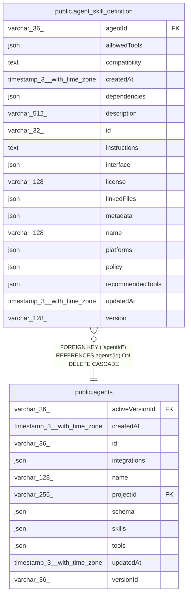

# public.agent_skill_definition

## Columns

| Name | Type | Default | Nullable | Children | Parents | Comment |
| ---- | ---- | ------- | -------- | -------- | ------- | ------- |
| agentId | varchar(36) |  | false |  | [public.agents](public.agents.md) | Owning agent; skill definitions are deleted with the agent |
| allowedTools | json |  | true |  |  | Tool allowlist declared by the skill |
| compatibility | text |  | true |  |  |  |
| createdAt | timestamp(3) with time zone | CURRENT_TIMESTAMP(3) | false |  |  |  |
| dependencies | json |  | true |  |  | Optional SDK dependency metadata |
| description | varchar(512) |  | false |  |  |  |
| id | varchar(32) |  | false |  |  | Application-generated skill ID referenced from agent JSON config |
| instructions | text |  | false |  |  | Markdown body from SKILL.md |
| interface | json |  | true |  |  | Optional SDK interface metadata |
| license | varchar(128) |  | true |  |  |  |
| linkedFiles | json |  | true |  |  | Linked skill files stored as part of the skill aggregate |
| metadata | json |  | true |  |  | Additional structured skill metadata |
| name | varchar(128) |  | false |  |  |  |
| platforms | json |  | true |  |  | Runtime platforms supported by the skill |
| policy | json |  | true |  |  | Optional SDK invocation policy metadata |
| recommendedTools | json |  | true |  |  | Tool recommendations declared by the skill |
| updatedAt | timestamp(3) with time zone | CURRENT_TIMESTAMP(3) | false |  |  |  |
| version | varchar(128) |  | true |  |  |  |

## Constraints

| Name | Type | Definition |
| ---- | ---- | ---------- |
| FK_fa93987d9dbc15d62a07813d595 | FOREIGN KEY | FOREIGN KEY ("agentId") REFERENCES agents(id) ON DELETE CASCADE |
| PK_6138b6f4266576779f65c49a1a8 | PRIMARY KEY | PRIMARY KEY (id, "agentId") |
| agent_skill_definition_agentId_not_null | n | NOT NULL "agentId" |
| agent_skill_definition_createdAt_not_null | n | NOT NULL "createdAt" |
| agent_skill_definition_description_not_null | n | NOT NULL description |
| agent_skill_definition_id_not_null | n | NOT NULL id |
| agent_skill_definition_instructions_not_null | n | NOT NULL instructions |
| agent_skill_definition_name_not_null | n | NOT NULL name |
| agent_skill_definition_updatedAt_not_null | n | NOT NULL "updatedAt" |

## Indexes

| Name | Definition |
| ---- | ---------- |
| IDX_fa93987d9dbc15d62a07813d59 | CREATE INDEX "IDX_fa93987d9dbc15d62a07813d59" ON public.agent_skill_definition USING btree ("agentId") |
| PK_6138b6f4266576779f65c49a1a8 | CREATE UNIQUE INDEX "PK_6138b6f4266576779f65c49a1a8" ON public.agent_skill_definition USING btree (id, "agentId") |

## Relations

---

> Generated by [tbls](https://github.com/k1LoW/tbls)
