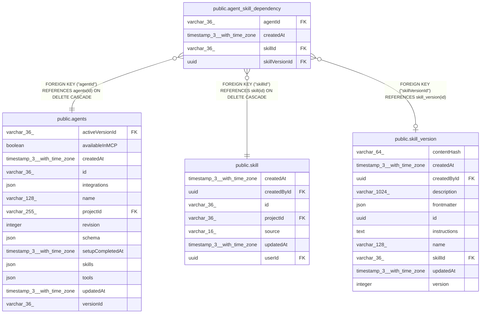

# public.agent_skill_dependency

## Columns

| Name | Type | Default | Nullable | Children | Parents | Comment |
| ---- | ---- | ------- | -------- | -------- | ------- | ------- |
| agentId | varchar(36) |  | false |  | [public.agents](public.agents.md) |  |
| createdAt | timestamp(3) with time zone | CURRENT_TIMESTAMP(3) | false |  |  |  |
| skillId | varchar(36) |  | false |  | [public.skill](public.skill.md) |  |
| skillVersionId | uuid |  | true |  | [public.skill_version](public.skill_version.md) | Set when the agent draft pins a saved version. NULL = follows the latest saved version |

## Constraints

| Name | Type | Definition |
| ---- | ---- | ---------- |
| FK_068f21aefba31ae621482f396dc | FOREIGN KEY | FOREIGN KEY ("skillId") REFERENCES skill(id) ON DELETE CASCADE |
| FK_72325bb13511a51847c53fcb377 | FOREIGN KEY | FOREIGN KEY ("agentId") REFERENCES agents(id) ON DELETE CASCADE |
| FK_7676571bd6f41d9e32f0d066fe9 | FOREIGN KEY | FOREIGN KEY ("skillVersionId") REFERENCES skill_version(id) |
| PK_18a54f60491d3e2aa2200b70f4a | PRIMARY KEY | PRIMARY KEY ("agentId", "skillId") |
| agent_skill_dependency_agentId_not_null | n | NOT NULL "agentId" |
| agent_skill_dependency_createdAt_not_null | n | NOT NULL "createdAt" |
| agent_skill_dependency_skillId_not_null | n | NOT NULL "skillId" |

## Indexes

| Name | Definition |
| ---- | ---------- |
| IDX_068f21aefba31ae621482f396d | CREATE INDEX "IDX_068f21aefba31ae621482f396d" ON public.agent_skill_dependency USING btree ("skillId") |
| IDX_7676571bd6f41d9e32f0d066fe | CREATE INDEX "IDX_7676571bd6f41d9e32f0d066fe" ON public.agent_skill_dependency USING btree ("skillVersionId") |
| PK_18a54f60491d3e2aa2200b70f4a | CREATE UNIQUE INDEX "PK_18a54f60491d3e2aa2200b70f4a" ON public.agent_skill_dependency USING btree ("agentId", "skillId") |

## Relations

---

> Generated by [tbls](https://github.com/k1LoW/tbls)
