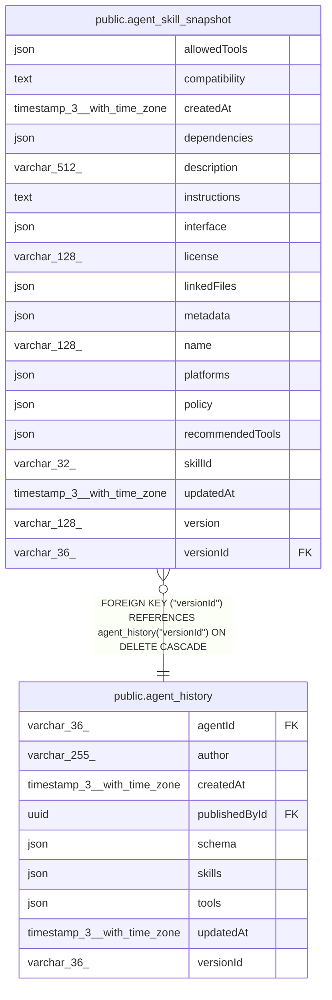

# public.agent_skill_snapshot

## Columns

| Name | Type | Default | Nullable | Children | Parents | Comment |
| ---- | ---- | ------- | -------- | -------- | ------- | ------- |
| allowedTools | json |  | true |  |  | Published tool allowlist declared by the skill |
| compatibility | text |  | true |  |  |  |
| createdAt | timestamp(3) with time zone | CURRENT_TIMESTAMP(3) | false |  |  |  |
| dependencies | json |  | true |  |  | Published SDK dependency metadata |
| description | varchar(512) |  | false |  |  |  |
| instructions | text |  | false |  |  | Published markdown body from SKILL.md |
| interface | json |  | true |  |  | Published SDK interface metadata |
| license | varchar(128) |  | true |  |  |  |
| linkedFiles | json |  | true |  |  | Published linked skill files stored as part of the skill aggregate |
| metadata | json |  | true |  |  | Published additional structured skill metadata |
| name | varchar(128) |  | false |  |  |  |
| platforms | json |  | true |  |  | Published runtime platforms supported by the skill |
| policy | json |  | true |  |  | Published SDK invocation policy metadata |
| recommendedTools | json |  | true |  |  | Published tool recommendations declared by the skill |
| skillId | varchar(32) |  | false |  |  | Stable skill ID referenced from the published agent JSON config |
| updatedAt | timestamp(3) with time zone | CURRENT_TIMESTAMP(3) | false |  |  |  |
| version | varchar(128) |  | true |  |  |  |
| versionId | varchar(36) |  | false |  | [public.agent_history](public.agent_history.md) | Published agent_history version this skill snapshot belongs to |

## Constraints

| Name | Type | Definition |
| ---- | ---- | ---------- |
| FK_0973d001efc4631742658509ed3 | FOREIGN KEY | FOREIGN KEY ("versionId") REFERENCES agent_history("versionId") ON DELETE CASCADE |
| PK_6b6771c4c343a5f4d55a4c159f1 | PRIMARY KEY | PRIMARY KEY ("versionId", "skillId") |
| agent_skill_snapshot_createdAt_not_null | n | NOT NULL "createdAt" |
| agent_skill_snapshot_description_not_null | n | NOT NULL description |
| agent_skill_snapshot_instructions_not_null | n | NOT NULL instructions |
| agent_skill_snapshot_name_not_null | n | NOT NULL name |
| agent_skill_snapshot_skillId_not_null | n | NOT NULL "skillId" |
| agent_skill_snapshot_updatedAt_not_null | n | NOT NULL "updatedAt" |
| agent_skill_snapshot_versionId_not_null | n | NOT NULL "versionId" |

## Indexes

| Name | Definition |
| ---- | ---------- |
| PK_6b6771c4c343a5f4d55a4c159f1 | CREATE UNIQUE INDEX "PK_6b6771c4c343a5f4d55a4c159f1" ON public.agent_skill_snapshot USING btree ("versionId", "skillId") |

## Relations

---

> Generated by [tbls](https://github.com/k1LoW/tbls)
