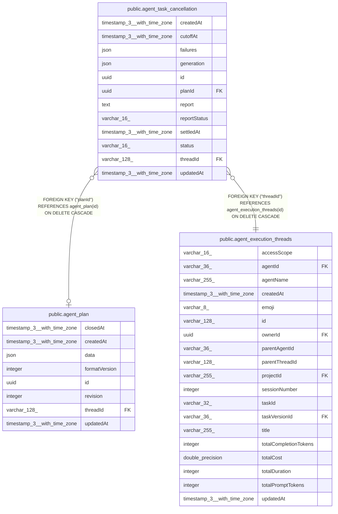

# public.agent_task_cancellation

## Columns

| Name | Type | Default | Nullable | Children | Parents | Comment |
| ---- | ---- | ------- | -------- | -------- | ------- | ------- |
| createdAt | timestamp(3) with time zone | CURRENT_TIMESTAMP(3) | false |  |  |  |
| cutoffAt | timestamp(3) with time zone |  | false |  |  | Work accepted at or before this time cannot restart |
| failures | json |  | false |  |  | Jobs that still require a confirmed stop |
| generation | json |  | false |  |  | Captured execution, job, and child session IDs for this cancellation |
| id | uuid |  | false |  |  |  |
| planId | uuid |  | true |  | [public.agent_plan](public.agent_plan.md) |  |
| report | text |  | false |  |  | Saved facts for the acknowledgement and fallback notice |
| reportStatus | varchar(16) |  | false |  |  | pending, claimed, reported, or failed |
| settledAt | timestamp(3) with time zone |  | true |  |  |  |
| status | varchar(16) |  | false |  |  | stopping, failed, or stopped |
| threadId | varchar(128) |  | false |  | [public.agent_execution_threads](public.agent_execution_threads.md) |  |
| updatedAt | timestamp(3) with time zone | CURRENT_TIMESTAMP(3) | false |  |  |  |

## Constraints

| Name | Type | Definition |
| ---- | ---- | ---------- |
| CHK_agent_task_cancellation_reportStatus | CHECK | CHECK ((("reportStatus")::text = ANY ((ARRAY['pending'::character varying, 'claimed'::character varying, 'reported'::character varying, 'failed'::character varying])::text[]))) |
| CHK_agent_task_cancellation_status | CHECK | CHECK (((status)::text = ANY ((ARRAY['stopping'::character varying, 'failed'::character varying, 'stopped'::character varying])::text[]))) |
| FK_409a1707f7131381c54316fa5c0 | FOREIGN KEY | FOREIGN KEY ("threadId") REFERENCES agent_execution_threads(id) ON DELETE CASCADE |
| FK_4ef6735ac2ee1994eb97505b366 | FOREIGN KEY | FOREIGN KEY ("planId") REFERENCES agent_plan(id) ON DELETE CASCADE |
| PK_ebc8c995601c1001ffa286f71a4 | PRIMARY KEY | PRIMARY KEY (id) |
| agent_task_cancellation_createdAt_not_null | n | NOT NULL "createdAt" |
| agent_task_cancellation_cutoffAt_not_null | n | NOT NULL "cutoffAt" |
| agent_task_cancellation_failures_not_null | n | NOT NULL failures |
| agent_task_cancellation_generation_not_null | n | NOT NULL generation |
| agent_task_cancellation_id_not_null | n | NOT NULL id |
| agent_task_cancellation_reportStatus_not_null | n | NOT NULL "reportStatus" |
| agent_task_cancellation_report_not_null | n | NOT NULL report |
| agent_task_cancellation_status_not_null | n | NOT NULL status |
| agent_task_cancellation_threadId_not_null | n | NOT NULL "threadId" |
| agent_task_cancellation_updatedAt_not_null | n | NOT NULL "updatedAt" |

## Indexes

| Name | Definition |
| ---- | ---------- |
| IDX_639da16bdb789d32fbf6a9fc8d | CREATE INDEX "IDX_639da16bdb789d32fbf6a9fc8d" ON public.agent_task_cancellation USING btree ("threadId", "createdAt") |
| PK_ebc8c995601c1001ffa286f71a4 | CREATE UNIQUE INDEX "PK_ebc8c995601c1001ffa286f71a4" ON public.agent_task_cancellation USING btree (id) |

## Relations

---

> Generated by [tbls](https://github.com/k1LoW/tbls)
