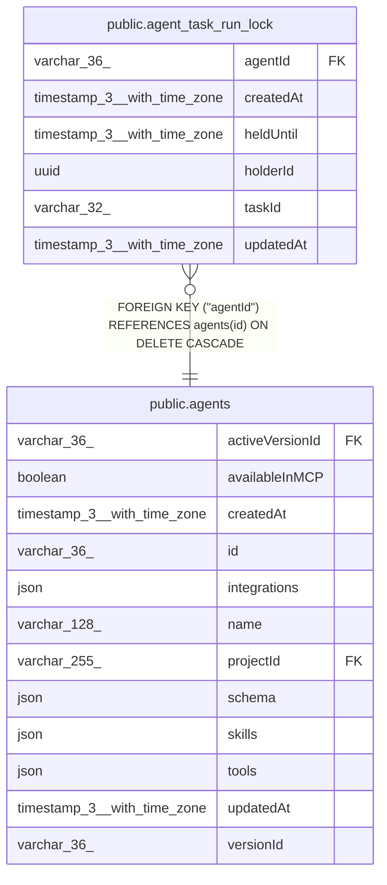

# public.agent_task_run_lock

## Columns

| Name | Type | Default | Nullable | Children | Parents | Comment |
| ---- | ---- | ------- | -------- | -------- | ------- | ------- |
| agentId | varchar(36) |  | false |  | [public.agents](public.agents.md) | Published agent whose scheduled task run is locked |
| createdAt | timestamp(3) with time zone | CURRENT_TIMESTAMP(3) | false |  |  |  |
| heldUntil | timestamp(3) with time zone |  | false |  |  | Time after which another main can claim this task run lock |
| holderId | uuid |  | false |  |  | Ephemeral lock owner token generated by the running main |
| taskId | varchar(32) |  | false |  |  | Published task ID whose scheduled run is locked |
| updatedAt | timestamp(3) with time zone | CURRENT_TIMESTAMP(3) | false |  |  |  |

## Constraints

| Name | Type | Definition |
| ---- | ---- | ---------- |
| FK_b57a2862ae869aab24e54cefd48 | FOREIGN KEY | FOREIGN KEY ("agentId") REFERENCES agents(id) ON DELETE CASCADE |
| PK_f593adaf7230e964d3c25deda64 | PRIMARY KEY | PRIMARY KEY ("agentId", "taskId") |
| agent_task_run_lock_agentId_not_null | n | NOT NULL "agentId" |
| agent_task_run_lock_createdAt_not_null | n | NOT NULL "createdAt" |
| agent_task_run_lock_heldUntil_not_null | n | NOT NULL "heldUntil" |
| agent_task_run_lock_holderId_not_null | n | NOT NULL "holderId" |
| agent_task_run_lock_taskId_not_null | n | NOT NULL "taskId" |
| agent_task_run_lock_updatedAt_not_null | n | NOT NULL "updatedAt" |

## Indexes

| Name | Definition |
| ---- | ---------- |
| PK_f593adaf7230e964d3c25deda64 | CREATE UNIQUE INDEX "PK_f593adaf7230e964d3c25deda64" ON public.agent_task_run_lock USING btree ("agentId", "taskId") |

## Relations

---

> Generated by [tbls](https://github.com/k1LoW/tbls)
