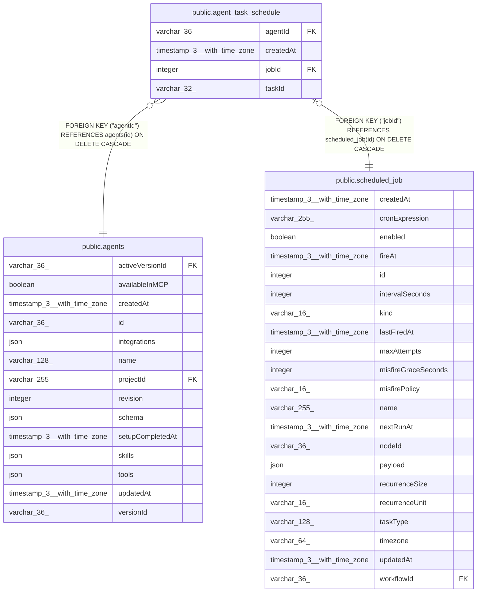

# public.agent_task_schedule

## Columns

| Name | Type | Default | Nullable | Children | Parents | Comment |
| ---- | ---- | ------- | -------- | -------- | ------- | ------- |
| agentId | varchar(36) |  | false |  | [public.agents](public.agents.md) | Owning agent |
| createdAt | timestamp(3) with time zone | CURRENT_TIMESTAMP(3) | false |  |  |  |
| jobId | integer |  | false |  | [public.scheduled_job](public.scheduled_job.md) | The scheduled_job this agent owns |
| taskId | varchar(32) |  | true |  |  | Agent task definition this job was provisioned from; null for agent-owned jobs with no task body |

## Constraints

| Name | Type | Definition |
| ---- | ---- | ---------- |
| FK_af48a457a14d137f1dff0ef688f | FOREIGN KEY | FOREIGN KEY ("agentId") REFERENCES agents(id) ON DELETE CASCADE |
| FK_b294425c6aa516a3527f13ac986 | FOREIGN KEY | FOREIGN KEY ("jobId") REFERENCES scheduled_job(id) ON DELETE CASCADE |
| PK_b294425c6aa516a3527f13ac986 | PRIMARY KEY | PRIMARY KEY ("jobId") |
| agent_task_schedule_agentId_not_null | n | NOT NULL "agentId" |
| agent_task_schedule_createdAt_not_null | n | NOT NULL "createdAt" |
| agent_task_schedule_jobId_not_null | n | NOT NULL "jobId" |

## Indexes

| Name | Definition |
| ---- | ---------- |
| IDX_af48a457a14d137f1dff0ef688 | CREATE INDEX "IDX_af48a457a14d137f1dff0ef688" ON public.agent_task_schedule USING btree ("agentId") |
| PK_b294425c6aa516a3527f13ac986 | CREATE UNIQUE INDEX "PK_b294425c6aa516a3527f13ac986" ON public.agent_task_schedule USING btree ("jobId") |

## Relations

---

> Generated by [tbls](https://github.com/k1LoW/tbls)
