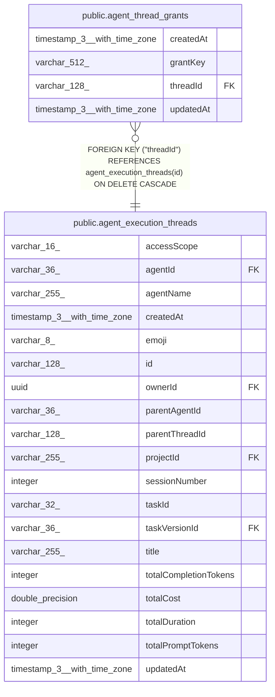

# public.agent_thread_grants

## Columns

| Name | Type | Default | Nullable | Children | Parents | Comment |
| ---- | ---- | ------- | -------- | -------- | ------- | ------- |
| createdAt | timestamp(3) with time zone | CURRENT_TIMESTAMP(3) | false |  |  |  |
| grantKey | varchar(512) |  | false |  |  | JSON tuple: [tool, toolName] or [integration_action, connectionId, action] |
| threadId | varchar(128) |  | false |  | [public.agent_execution_threads](public.agent_execution_threads.md) |  |
| updatedAt | timestamp(3) with time zone | CURRENT_TIMESTAMP(3) | false |  |  |  |

## Constraints

| Name | Type | Definition |
| ---- | ---- | ---------- |
| FK_10aad4b5b51d34aae8da90fd5cb | FOREIGN KEY | FOREIGN KEY ("threadId") REFERENCES agent_execution_threads(id) ON DELETE CASCADE |
| PK_18777b98ed446901dd7453424ce | PRIMARY KEY | PRIMARY KEY ("threadId", "grantKey") |
| agent_thread_grants_createdAt_not_null | n | NOT NULL "createdAt" |
| agent_thread_grants_grantKey_not_null | n | NOT NULL "grantKey" |
| agent_thread_grants_threadId_not_null | n | NOT NULL "threadId" |
| agent_thread_grants_updatedAt_not_null | n | NOT NULL "updatedAt" |

## Indexes

| Name | Definition |
| ---- | ---------- |
| PK_18777b98ed446901dd7453424ce | CREATE UNIQUE INDEX "PK_18777b98ed446901dd7453424ce" ON public.agent_thread_grants USING btree ("threadId", "grantKey") |

## Relations

---

> Generated by [tbls](https://github.com/k1LoW/tbls)
