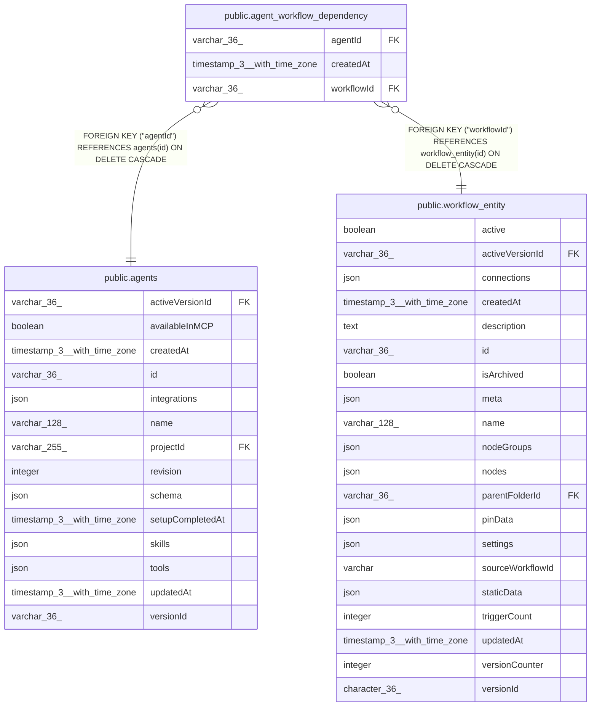

# public.agent_workflow_dependency

## Columns

| Name | Type | Default | Nullable | Children | Parents | Comment |
| ---- | ---- | ------- | -------- | -------- | ------- | ------- |
| agentId | varchar(36) |  | false |  | [public.agents](public.agents.md) |  |
| createdAt | timestamp(3) with time zone | CURRENT_TIMESTAMP(3) | false |  |  |  |
| workflowId | varchar(36) |  | false |  | [public.workflow_entity](public.workflow_entity.md) |  |

## Constraints

| Name | Type | Definition |
| ---- | ---- | ---------- |
| FK_a2694df196a66064edbdbe38b94 | FOREIGN KEY | FOREIGN KEY ("workflowId") REFERENCES workflow_entity(id) ON DELETE CASCADE |
| FK_e5511a5e9eab71b7e516bdc04e9 | FOREIGN KEY | FOREIGN KEY ("agentId") REFERENCES agents(id) ON DELETE CASCADE |
| PK_4b9cb5e8db0dd16bb843b76465a | PRIMARY KEY | PRIMARY KEY ("agentId", "workflowId") |
| agent_workflow_dependency_agentId_not_null | n | NOT NULL "agentId" |
| agent_workflow_dependency_createdAt_not_null | n | NOT NULL "createdAt" |
| agent_workflow_dependency_workflowId_not_null | n | NOT NULL "workflowId" |

## Indexes

| Name | Definition |
| ---- | ---------- |
| IDX_a2694df196a66064edbdbe38b9 | CREATE INDEX "IDX_a2694df196a66064edbdbe38b9" ON public.agent_workflow_dependency USING btree ("workflowId") |
| PK_4b9cb5e8db0dd16bb843b76465a | CREATE UNIQUE INDEX "PK_4b9cb5e8db0dd16bb843b76465a" ON public.agent_workflow_dependency USING btree ("agentId", "workflowId") |

## Relations

---

> Generated by [tbls](https://github.com/k1LoW/tbls)
