# public.agents

## Columns

| Name | Type | Default | Nullable | Children | Parents | Comment |
| ---- | ---- | ------- | -------- | -------- | ------- | ------- |
| activeVersionId | varchar(36) |  | true |  | [public.agent_history](public.agent_history.md) |  |
| createdAt | timestamp(3) with time zone | CURRENT_TIMESTAMP(3) | false |  |  |  |
| id | varchar(36) |  | false | [public.agent_chat_subscriptions](public.agent_chat_subscriptions.md) [public.agent_checkpoints](public.agent_checkpoints.md) [public.agent_eval_dataset](public.agent_eval_dataset.md) [public.agent_execution_threads](public.agent_execution_threads.md) [public.agent_files](public.agent_files.md) [public.agent_history](public.agent_history.md) [public.agent_task_definition](public.agent_task_definition.md) [public.agent_task_run_lock](public.agent_task_run_lock.md) [public.agents_memory_entries](public.agents_memory_entries.md) [public.agents_memory_entry_cursors](public.agents_memory_entry_cursors.md) [public.agents_memory_entry_locks](public.agents_memory_entry_locks.md) [public.agents_memory_entry_sources](public.agents_memory_entry_sources.md) [public.agents_observation_cursors](public.agents_observation_cursors.md) [public.agents_observation_locks](public.agents_observation_locks.md) [public.agents_observations](public.agents_observations.md) |  |  |
| integrations | json | '[]'::json | false |  |  |  |
| name | varchar(128) |  | false |  |  |  |
| projectId | varchar(255) |  | false |  | [public.project](public.project.md) |  |
| schema | json |  | true |  |  |  |
| skills | json | '{}'::json | false |  |  |  |
| tools | json | '{}'::json | false |  |  |  |
| updatedAt | timestamp(3) with time zone | CURRENT_TIMESTAMP(3) | false |  |  |  |
| versionId | varchar(36) |  | true |  |  |  |

## Constraints

| Name | Type | Definition |
| ---- | ---- | ---------- |
| FK_940597dfe9753375309ce6aeea0 | FOREIGN KEY | FOREIGN KEY ("activeVersionId") REFERENCES agent_history("versionId") ON DELETE SET NULL |
| FK_a30d560207c4071d98aa03c179c | FOREIGN KEY | FOREIGN KEY ("projectId") REFERENCES project(id) ON DELETE CASCADE |
| PK_9c653f28ae19c5884d5baf6a1d9 | PRIMARY KEY | PRIMARY KEY (id) |
| agents_createdAt_not_null | n | NOT NULL "createdAt" |
| agents_id_not_null | n | NOT NULL id |
| agents_integrations_not_null | n | NOT NULL integrations |
| agents_name_not_null | n | NOT NULL name |
| agents_projectId_not_null | n | NOT NULL "projectId" |
| agents_skills_not_null | n | NOT NULL skills |
| agents_tools_not_null | n | NOT NULL tools |
| agents_updatedAt_not_null | n | NOT NULL "updatedAt" |

## Indexes

| Name | Definition |
| ---- | ---------- |
| IDX_a30d560207c4071d98aa03c179 | CREATE INDEX "IDX_a30d560207c4071d98aa03c179" ON public.agents USING btree ("projectId") |
| IDX_agents_projectId | CREATE INDEX "IDX_agents_projectId" ON public.agents USING btree ("projectId") |
| PK_9c653f28ae19c5884d5baf6a1d9 | CREATE UNIQUE INDEX "PK_9c653f28ae19c5884d5baf6a1d9" ON public.agents USING btree (id) |

## Relations

```mermaid
erDiagram

"public.agents" }o--o| "public.agent_history" : "FOREIGN KEY (#quot;activeVersionId#quot;) REFERENCES agent_history(#quot;versionId#quot;) ON DELETE SET NULL"
"public.agent_chat_subscriptions" }o--|| "public.agents" : "FOREIGN KEY (#quot;agentId#quot;) REFERENCES agents(id) ON DELETE CASCADE"
"public.agent_checkpoints" }o--o| "public.agents" : "FOREIGN KEY (#quot;agentId#quot;) REFERENCES agents(id) ON DELETE CASCADE"
"public.agent_eval_dataset" }o--|| "public.agents" : "FOREIGN KEY (#quot;agentId#quot;) REFERENCES agents(id) ON DELETE CASCADE"
"public.agent_execution_threads" }o--|| "public.agents" : "FOREIGN KEY (#quot;agentId#quot;) REFERENCES agents(id) ON DELETE CASCADE"
"public.agent_files" }o--|| "public.agents" : "FOREIGN KEY (#quot;agentId#quot;) REFERENCES agents(id) ON DELETE CASCADE"
"public.agent_history" }o--|| "public.agents" : "FOREIGN KEY (#quot;agentId#quot;) REFERENCES agents(id) ON DELETE CASCADE"
"public.agent_task_definition" }o--|| "public.agents" : "FOREIGN KEY (#quot;agentId#quot;) REFERENCES agents(id) ON DELETE CASCADE"
"public.agent_task_run_lock" }o--|| "public.agents" : "FOREIGN KEY (#quot;agentId#quot;) REFERENCES agents(id) ON DELETE CASCADE"
"public.agents_memory_entries" }o--|| "public.agents" : "FOREIGN KEY (#quot;agentId#quot;) REFERENCES agents(id) ON DELETE CASCADE"
"public.agents_memory_entry_cursors" }o--|| "public.agents" : "FOREIGN KEY (#quot;agentId#quot;) REFERENCES agents(id) ON DELETE CASCADE"
"public.agents_memory_entry_locks" }o--|| "public.agents" : "FOREIGN KEY (#quot;agentId#quot;) REFERENCES agents(id) ON DELETE CASCADE"
"public.agents_memory_entry_sources" }o--|| "public.agents" : "FOREIGN KEY (#quot;agentId#quot;) REFERENCES agents(id) ON DELETE CASCADE"
"public.agents_observation_cursors" }o--|| "public.agents" : "FOREIGN KEY (#quot;agentId#quot;) REFERENCES agents(id) ON DELETE CASCADE"
"public.agents_observation_locks" }o--|| "public.agents" : "FOREIGN KEY (#quot;agentId#quot;) REFERENCES agents(id) ON DELETE CASCADE"
"public.agents_observations" }o--|| "public.agents" : "FOREIGN KEY (#quot;agentId#quot;) REFERENCES agents(id) ON DELETE CASCADE"
"public.agents" }o--|| "public.project" : "FOREIGN KEY (#quot;projectId#quot;) REFERENCES project(id) ON DELETE CASCADE"

"public.agents" {
  varchar_36_ activeVersionId FK
  timestamp_3__with_time_zone createdAt
  varchar_36_ id
  json integrations
  varchar_128_ name
  varchar_255_ projectId FK
  json schema
  json skills
  json tools
  timestamp_3__with_time_zone updatedAt
  varchar_36_ versionId
}
"public.agent_history" {
  varchar_36_ agentId FK
  varchar_255_ author
  timestamp_3__with_time_zone createdAt
  uuid publishedById FK
  json schema
  json skills
  json tools
  timestamp_3__with_time_zone updatedAt
  varchar_36_ versionId
}
"public.agent_chat_subscriptions" {
  varchar_36_ agentId FK
  timestamp_3__with_time_zone createdAt
  varchar_255_ credentialId
  varchar_64_ integrationType
  varchar_255_ threadId
  timestamp_3__with_time_zone updatedAt
}
"public.agent_checkpoints" {
  varchar_255_ agentId FK
  timestamp_3__with_time_zone createdAt
  boolean expired
  varchar_255_ runId
  text state
  timestamp_3__with_time_zone updatedAt
}
"public.agent_eval_dataset" {
  varchar_36_ agentId FK
  json columnMapping
  timestamp_3__with_time_zone createdAt
  uuid createdById FK
  json datasetRef
  varchar_32_ datasetSource
  text description
  varchar_36_ id
  varchar_128_ name
  timestamp_3__with_time_zone updatedAt
}
"public.agent_execution_threads" {
  varchar_36_ agentId FK
  varchar_255_ agentName
  timestamp_3__with_time_zone createdAt
  varchar_8_ emoji
  varchar_128_ id
  varchar_36_ parentAgentId
  varchar_128_ parentThreadId
  varchar_255_ projectId FK
  integer sessionNumber
  varchar_32_ taskId
  varchar_36_ taskVersionId FK
  varchar_255_ title
  integer totalCompletionTokens
  double_precision totalCost
  integer totalDuration
  integer totalPromptTokens
  timestamp_3__with_time_zone updatedAt
}
"public.agent_files" {
  varchar_36_ agentId FK
  text binaryDataId
  timestamp_3__with_time_zone createdAt
  varchar_255_ fileName
  integer fileSizeBytes
  varchar_16_ id
  varchar_255_ mimeType
  timestamp_3__with_time_zone updatedAt
}
"public.agent_task_definition" {
  varchar_36_ agentId FK
  timestamp_3__with_time_zone createdAt
  varchar_128_ cronExpression
  varchar_32_ id
  varchar_128_ name
  text objective
  timestamp_3__with_time_zone updatedAt
}
"public.agent_task_run_lock" {
  varchar_36_ agentId FK
  timestamp_3__with_time_zone createdAt
  timestamp_3__with_time_zone heldUntil
  uuid holderId
  varchar_32_ taskId
  timestamp_3__with_time_zone updatedAt
}
"public.agents_memory_entries" {
  varchar_36_ agentId FK
  text content
  varchar_64_ contentHash
  timestamp_3__with_time_zone createdAt
  json embedding
  varchar_128_ embeddingModel
  varchar_36_ id
  timestamp_3__with_time_zone lastSeenAt
  json metadata
  varchar_255_ resourceId FK
  varchar_16_ status
  varchar_36_ supersededBy FK
  timestamp_3__with_time_zone updatedAt
}
"public.agents_memory_entry_cursors" {
  varchar_36_ agentId FK
  timestamp_3__with_time_zone createdAt
  timestamp_3__with_time_zone lastIndexedObservationCreatedAt
  varchar_36_ lastIndexedObservationId
  varchar_255_ observationScopeId FK
  timestamp_3__with_time_zone updatedAt
}
"public.agents_memory_entry_locks" {
  varchar_36_ agentId FK
  timestamp_3__with_time_zone createdAt
  timestamp_3__with_time_zone heldUntil
  varchar_64_ holderId
  varchar_255_ resourceId FK
  timestamp_3__with_time_zone updatedAt
}
"public.agents_memory_entry_sources" {
  varchar_36_ agentId FK
  timestamp_3__with_time_zone createdAt
  varchar_64_ evidenceHash
  text evidenceText
  varchar_36_ id
  varchar_36_ memoryEntryId FK
  varchar_36_ observationId FK
  varchar_255_ threadId FK
  timestamp_3__with_time_zone updatedAt
}
"public.agents_observation_cursors" {
  varchar_36_ agentId FK
  timestamp_3__with_time_zone createdAt
  timestamp_3__with_time_zone lastObservedAt
  varchar_36_ lastObservedMessageId
  varchar_255_ observationScopeId FK
  timestamp_3__with_time_zone updatedAt
}
"public.agents_observation_locks" {
  varchar_36_ agentId FK
  timestamp_3__with_time_zone createdAt
  timestamp_3__with_time_zone heldUntil
  varchar_64_ holderId
  varchar_255_ observationScopeId FK
  varchar_20_ taskKind
  timestamp_3__with_time_zone updatedAt
}
"public.agents_observations" {
  varchar_36_ agentId FK
  timestamp_3__with_time_zone createdAt
  varchar_36_ id
  varchar_16_ marker
  varchar_255_ observationScopeId FK
  varchar_36_ parentId FK
  varchar_16_ status
  varchar_36_ supersededBy FK
  text text
  integer tokenCount
  timestamp_3__with_time_zone updatedAt
}
"public.project" {
  timestamp_3__with_time_zone createdAt
  uuid creatorId FK
  json customTelemetryTags
  varchar_512_ description
  json icon
  varchar_36_ id
  varchar_255_ name
  varchar_36_ type
  timestamp_3__with_time_zone updatedAt
}
```

---

> Generated by [tbls](https://github.com/k1LoW/tbls)
