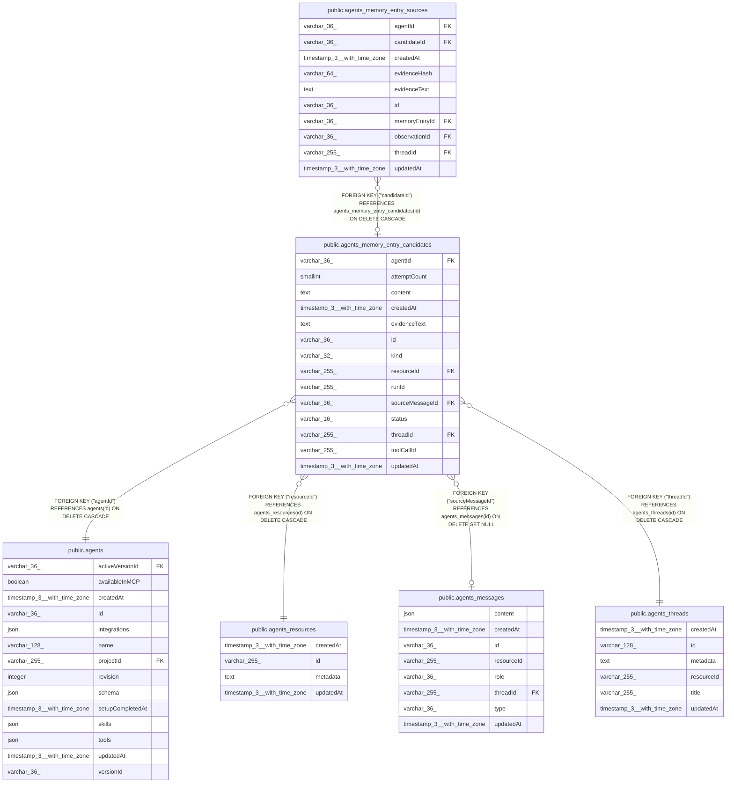

# public.agents_memory_entry_candidates

## Columns

| Name | Type | Default | Nullable | Children | Parents | Comment |
| ---- | ---- | ------- | -------- | -------- | ------- | ------- |
| agentId | varchar(36) |  | false |  | [public.agents](public.agents.md) | Agent that owns this episodic memory capture candidate |
| attemptCount | smallint | 0 | false |  |  | Number of failed processing attempts |
| content | text |  | false |  |  | Agent-proposed durable memory content |
| createdAt | timestamp(3) with time zone | CURRENT_TIMESTAMP(3) | false |  |  |  |
| evidenceText | text |  | false |  |  | Redacted exact evidence from the source message |
| id | varchar(36) |  | false | [public.agents_memory_entry_sources](public.agents_memory_entry_sources.md) |  |  |
| kind | varchar(32) |  | false |  |  | Reason the agent flagged this candidate; see EpisodicMemoryCaptureKind in @n8n/agents |
| resourceId | varchar(255) |  | false |  | [public.agents_resources](public.agents_resources.md) | Resource scope for the eventual episodic memory entry |
| runId | varchar(255) |  | false |  |  | Agent run that issued the memory capture tool call |
| sourceMessageId | varchar(36) |  | true |  | [public.agents_messages](public.agents_messages.md) | Persisted message that contains the exact source evidence |
| status | varchar(16) | 'pending'::character varying | false |  |  | Candidate processing state |
| threadId | varchar(255) |  | false |  | [public.agents_threads](public.agents_threads.md) | Conversation thread where the agent flagged this candidate |
| toolCallId | varchar(255) |  | false |  |  | Model tool-call ID used to make enqueue replay-safe |
| updatedAt | timestamp(3) with time zone | CURRENT_TIMESTAMP(3) | false |  |  |  |

## Constraints

| Name | Type | Definition |
| ---- | ---- | ---------- |
| CHK_agents_memory_entry_candidates_status | CHECK | CHECK (((status)::text = ANY ((ARRAY['pending'::character varying, 'completed'::character varying, 'failed'::character varying])::text[]))) |
| FK_5123f71435736664d2676084a85 | FOREIGN KEY | FOREIGN KEY ("resourceId") REFERENCES agents_resources(id) ON DELETE CASCADE |
| FK_ac7ada75df7cc8ced228921d5a9 | FOREIGN KEY | FOREIGN KEY ("threadId") REFERENCES agents_threads(id) ON DELETE CASCADE |
| FK_b3d0f5fe54565580bc1f5febb6e | FOREIGN KEY | FOREIGN KEY ("agentId") REFERENCES agents(id) ON DELETE CASCADE |
| FK_f1857f6716aa258393dd6f33243 | FOREIGN KEY | FOREIGN KEY ("sourceMessageId") REFERENCES agents_messages(id) ON DELETE SET NULL |
| PK_d5c36484cafd23222df4c564159 | PRIMARY KEY | PRIMARY KEY (id) |
| agents_memory_entry_candidates_agentId_not_null | n | NOT NULL "agentId" |
| agents_memory_entry_candidates_attemptCount_not_null | n | NOT NULL "attemptCount" |
| agents_memory_entry_candidates_content_not_null | n | NOT NULL content |
| agents_memory_entry_candidates_createdAt_not_null | n | NOT NULL "createdAt" |
| agents_memory_entry_candidates_evidenceText_not_null | n | NOT NULL "evidenceText" |
| agents_memory_entry_candidates_id_not_null | n | NOT NULL id |
| agents_memory_entry_candidates_kind_not_null | n | NOT NULL kind |
| agents_memory_entry_candidates_resourceId_not_null | n | NOT NULL "resourceId" |
| agents_memory_entry_candidates_runId_not_null | n | NOT NULL "runId" |
| agents_memory_entry_candidates_status_not_null | n | NOT NULL status |
| agents_memory_entry_candidates_threadId_not_null | n | NOT NULL "threadId" |
| agents_memory_entry_candidates_toolCallId_not_null | n | NOT NULL "toolCallId" |
| agents_memory_entry_candidates_updatedAt_not_null | n | NOT NULL "updatedAt" |

## Indexes

| Name | Definition |
| ---- | ---------- |
| IDX_5123f71435736664d2676084a8 | CREATE INDEX "IDX_5123f71435736664d2676084a8" ON public.agents_memory_entry_candidates USING btree ("resourceId") |
| IDX_6dc22e132cf1a34e5bca672b99 | CREATE INDEX "IDX_6dc22e132cf1a34e5bca672b99" ON public.agents_memory_entry_candidates USING btree ("agentId", "resourceId", status, "createdAt", id) |
| IDX_ac7ada75df7cc8ced228921d5a | CREATE INDEX "IDX_ac7ada75df7cc8ced228921d5a" ON public.agents_memory_entry_candidates USING btree ("threadId") |
| IDX_e3e49861a5452db63b036a2561 | CREATE UNIQUE INDEX "IDX_e3e49861a5452db63b036a2561" ON public.agents_memory_entry_candidates USING btree ("agentId", "runId", "toolCallId") |
| IDX_f1857f6716aa258393dd6f3324 | CREATE INDEX "IDX_f1857f6716aa258393dd6f3324" ON public.agents_memory_entry_candidates USING btree ("sourceMessageId") |
| PK_d5c36484cafd23222df4c564159 | CREATE UNIQUE INDEX "PK_d5c36484cafd23222df4c564159" ON public.agents_memory_entry_candidates USING btree (id) |

## Relations

---

> Generated by [tbls](https://github.com/k1LoW/tbls)
