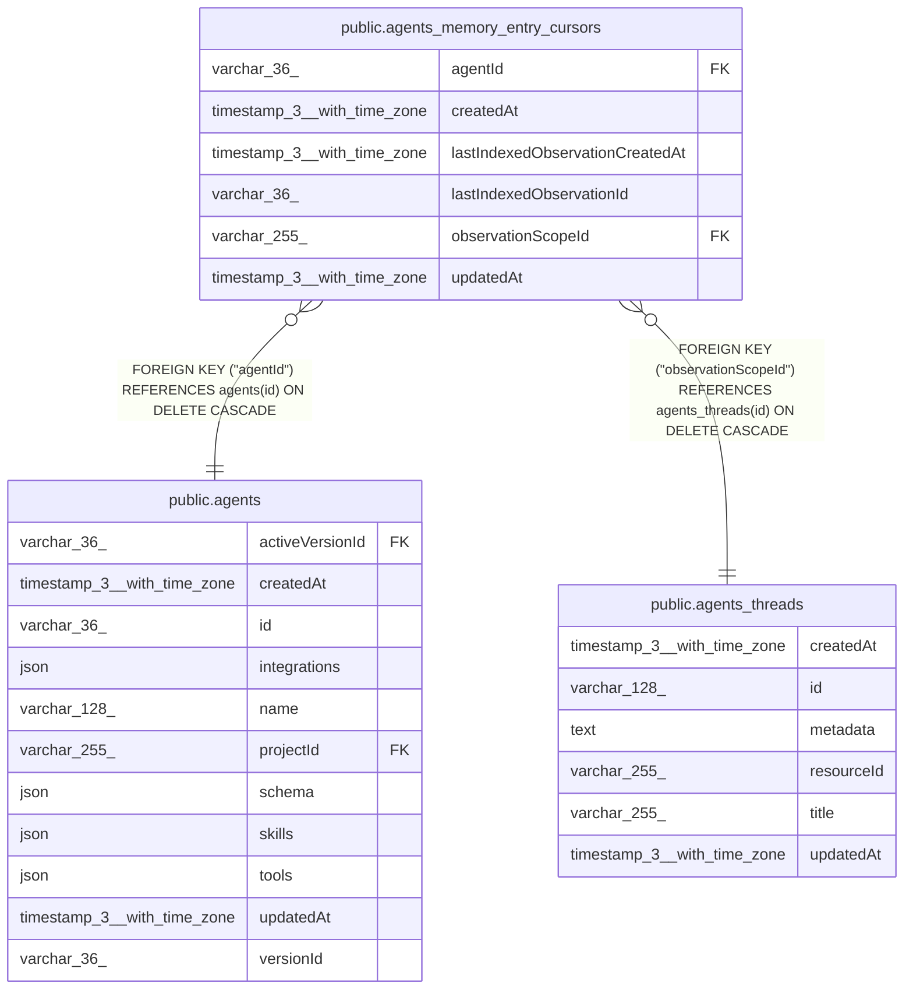

# public.agents_memory_entry_cursors

## Columns

| Name | Type | Default | Nullable | Children | Parents | Comment |
| ---- | ---- | ------- | -------- | -------- | ------- | ------- |
| agentId | varchar(36) |  | false |  | [public.agents](public.agents.md) | Agent that owns this cursor |
| createdAt | timestamp(3) with time zone | CURRENT_TIMESTAMP(3) | false |  |  |  |
| lastIndexedObservationCreatedAt | timestamp(3) with time zone |  | false |  |  | Creation timestamp for the last indexed observation-log row |
| lastIndexedObservationId | varchar(36) |  | false |  |  | Last observation-log row indexed into episodic memory |
| observationScopeId | varchar(255) |  | false |  | [public.agents_threads](public.agents_threads.md) | agents_threads.id source stream indexed into episodic memory |
| updatedAt | timestamp(3) with time zone | CURRENT_TIMESTAMP(3) | false |  |  |  |

## Constraints

| Name | Type | Definition |
| ---- | ---- | ---------- |
| FK_069e791e428391a5569e7a96b20 | FOREIGN KEY | FOREIGN KEY ("observationScopeId") REFERENCES agents_threads(id) ON DELETE CASCADE |
| FK_746780fd115e5e4352457a3c617 | FOREIGN KEY | FOREIGN KEY ("agentId") REFERENCES agents(id) ON DELETE CASCADE |
| PK_b31a1d5c009a27f4cc5ef8f102a | PRIMARY KEY | PRIMARY KEY ("agentId", "observationScopeId") |
| agents_memory_entry_cursors_agentId_not_null | n | NOT NULL "agentId" |
| agents_memory_entry_cursors_createdAt_not_null | n | NOT NULL "createdAt" |
| agents_memory_entry_cursors_lastIndexedObservationCrea_not_null | n | NOT NULL "lastIndexedObservationCreatedAt" |
| agents_memory_entry_cursors_lastIndexedObservationId_not_null | n | NOT NULL "lastIndexedObservationId" |
| agents_memory_entry_cursors_observationScopeId_not_null | n | NOT NULL "observationScopeId" |
| agents_memory_entry_cursors_updatedAt_not_null | n | NOT NULL "updatedAt" |

## Indexes

| Name | Definition |
| ---- | ---------- |
| IDX_069e791e428391a5569e7a96b2 | CREATE INDEX "IDX_069e791e428391a5569e7a96b2" ON public.agents_memory_entry_cursors USING btree ("observationScopeId") |
| PK_b31a1d5c009a27f4cc5ef8f102a | CREATE UNIQUE INDEX "PK_b31a1d5c009a27f4cc5ef8f102a" ON public.agents_memory_entry_cursors USING btree ("agentId", "observationScopeId") |

## Relations

---

> Generated by [tbls](https://github.com/k1LoW/tbls)
